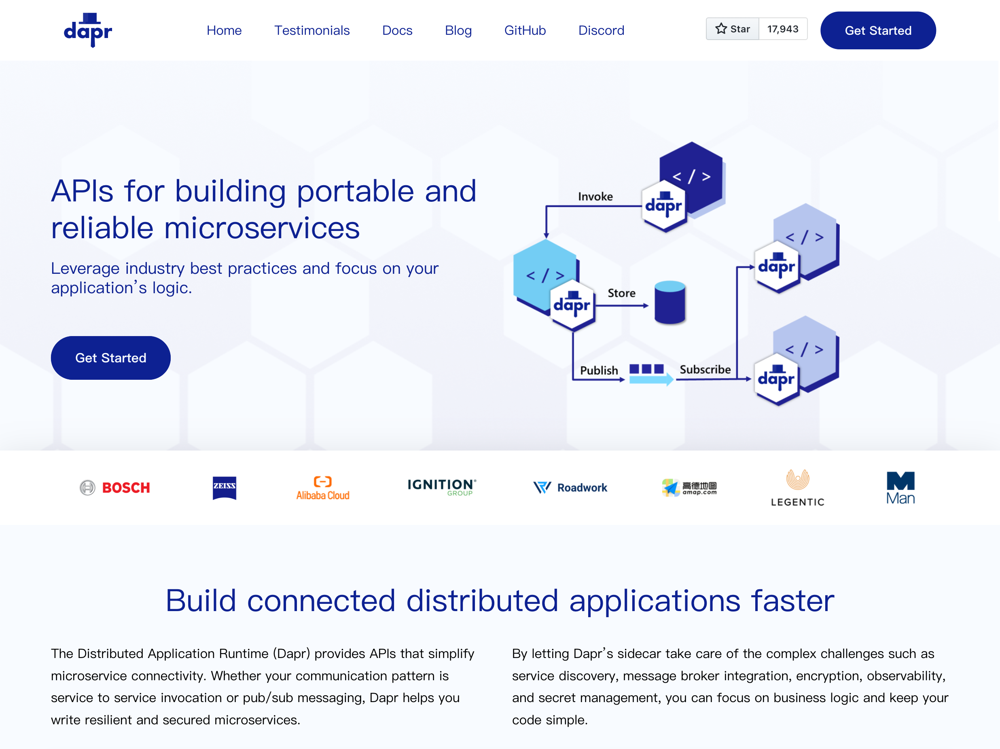
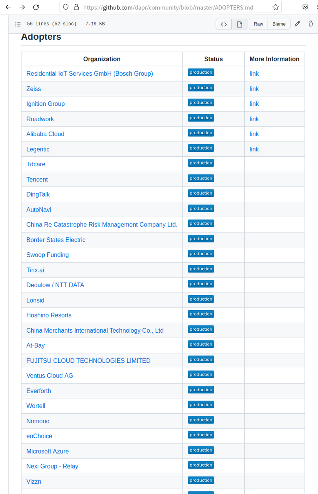
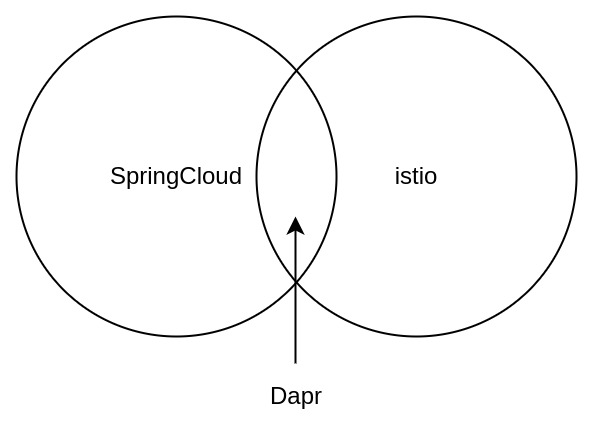
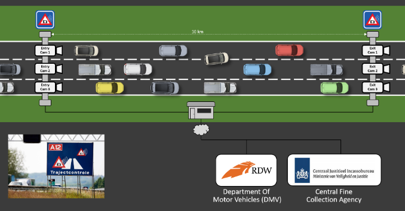
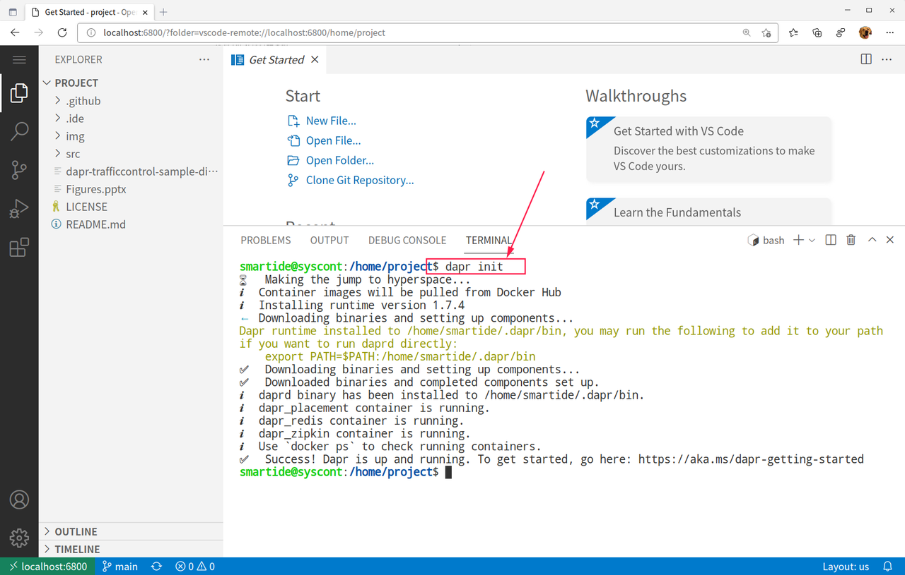
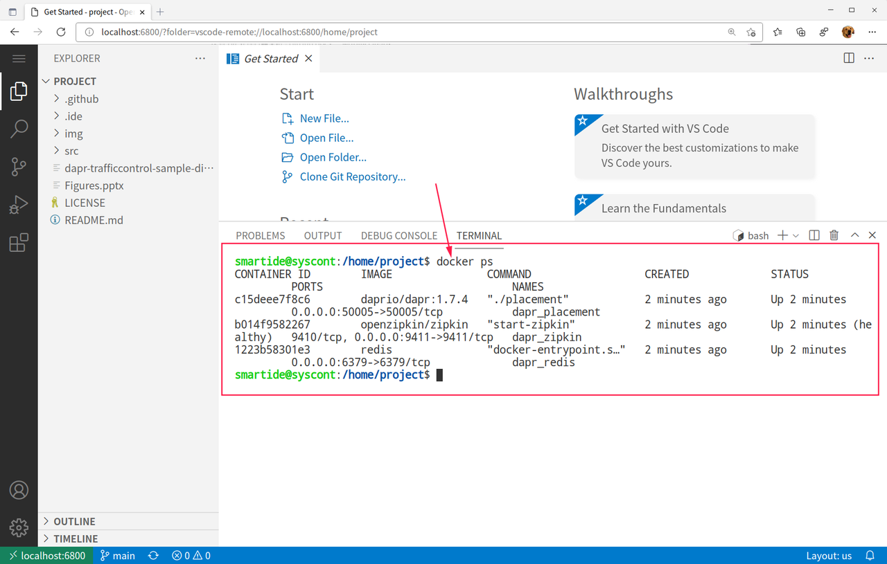
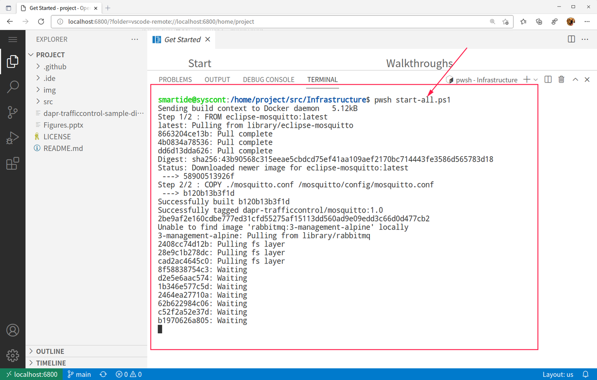
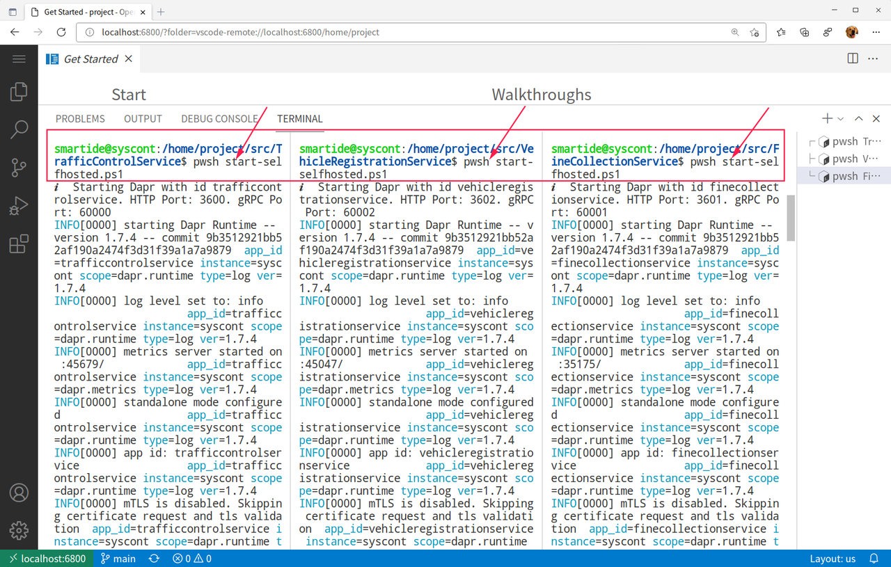
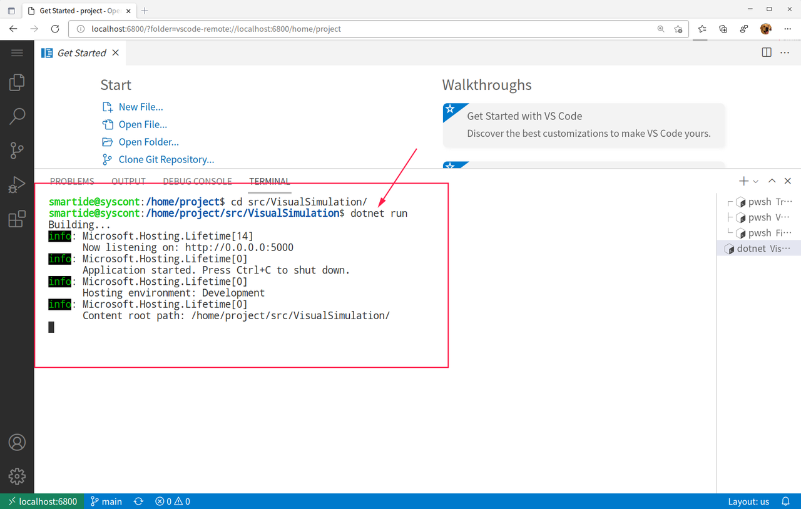
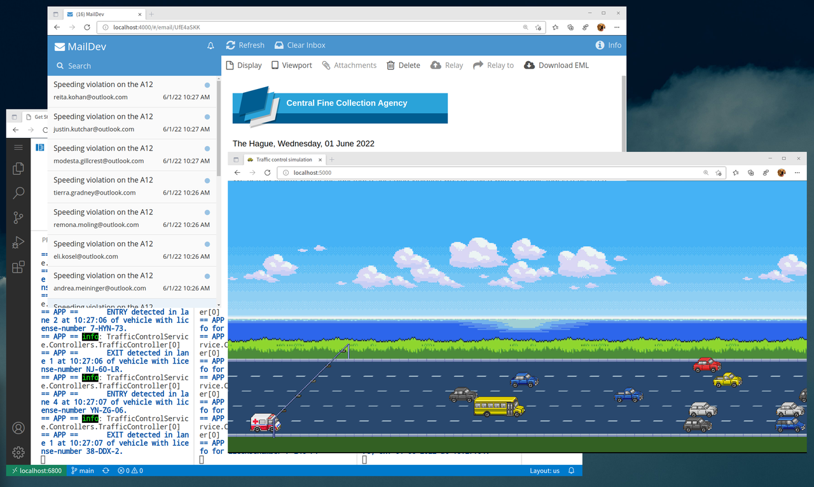

[Dapr](https://dapr.io/) 是微软主导的云原生开源项目，2019年10月首次发布，到正式发布 V1.0 版本的不到一年的时间内，github star 数达到了 1.2万（现在已经超过1.7万星），超过同期的 kubernetes、istio、knative 等，发展势头迅猛，业界关注度非常高。

Dapr 这个词是是 「Distributed Application runtime」的首字母缩写，非常精炼的解释了 dapr 是什么：**dapr 是一个为应用提供分布式能力的运行时**。

Dapr官网 https://dapr.io



## Dapr已经在多家大厂支撑生产环境

随着各家大厂的IT系统规模扩大，微服务架构已经成为了必需品和标准品，这也催生了 Dapr 这类非侵入式的（或者叫边车模式SideCar）的微服务开发框架的使用。根据Dapr官方仓库中的记录，已经有非常多的大厂在 **生产环境** 中使用Dapr来支撑自己的微服务开发。这里面不乏大家熟悉的腾讯，阿里，丁丁等国内大厂。

参考：
- https://github.com/dapr/dapr/issues/3169 
- https://github.com/dapr/community/blob/master/ADOPTERS.md 



## Dapr比较SpringCloud或者Istio的优势在哪里？

这个问题可能是大多数人的第一个问题，简单总结几点供大家参考

- **全栈多语言支持**：这一点上Dapr和Istio是等同的，因为都采用了边车模式，与应用进程之间都不具有侵入性，相比SpringCloud这种只能支持Java语言（当然现在有很多其他语言提供SpringCloud的SDK）的侵入性框架，具备先天的跨语言优势。微服务化给开发人员带来的一个重要价值就是可以随意的选择不同开发语言框架进行组装，对于企业来说也可以避免被某一种技术框架绑定，甚至在招聘程序员的时候也可以有多的选择。因此当微服务的理念开始在业界流行以后，采用者的团队中必然出现多语言并存的状况。当你面对一个Java/.Net/Python/Node/JavaScript/Golang多语言并存并且相互依赖的应用环境的时候，就会发现SpringCloud无法这种需求，变成了微服务支撑框架的瓶颈。

- **多云/非云环境支持**：这一点上Dapr和SpringCloud是等同的。SpringCloud作为云原生时代之前出现的框架，它本身的根基就在非云或者虚拟机环境上，因此SpringCloud本身就具备跨云/非云环境支撑，因为它本身和云环境并无绑定关系。你当然可以在容器/k8s中运行SpringCloud，但这仅仅是给SpringCloud应用换了一种打包部署方式而已。Istio 在这一点上有天然的弱势，因为Istio从一开始就诞生于云原生的基础设施k8s之上，也就顺其自然的利用了k8s所提供的很多基础能力，这些对于新生类应用来说非常合适，但是对于传统/现存应用来说就面临改造的问题。Dapr的设计则从根基上就兼容了多云/非容器和非云环境，同时也借鉴了云原生环境的特点来进行设计，因此你完全可以在传统的主机/虚拟机/非云环境中获得和云原生平台类似的微服务体验。这一点上对于已经有大量现存应用的传统企业来说，是非常重要的一个福音。*×备注：Isitio也已经开始支持与虚拟机环境的集成，这一点大家自己自行查阅资料。*

这个链接中介绍了阿里是如何引入 Dapr 以及背后的各种考量 

- https://blog.dapr.io/posts/2021/03/19/how-alibaba-is-using-dapr/ 

简单来说，Dapr 从设计上就借鉴并考虑了之前的2种类似框架各自的优势，并将所有的好处融合进来，将弊端剔除掉；是当前最先进最有前途的分布式微服务开发框架。



## 搭建Dapr开发环境的痛点

以下视频是展示了在容器中使用 VSCode WebIDE 开发一个 Dapr 应用的整个过程



既然是一个面向微服务的开发框架，Dapr 环境本身可以变得非常复杂。因为要引入各种类型的中间件，很多开发者会发现要学习或者自己搭建一个可以运行使用Dapr的应用，可能需要先安装一堆的各种服务。比如下面这个 Dapr 示例应用 `Dapr-Traffice-Control`

代码库

- https://github.com/SmartIDE/sample-dapr-traffic-control


虽然应用本身并不是特别复杂，只用到了3个服务组件，但是支撑这3个服务的中间件却有5个之多，包括：

- 作为 `MQTT Broker` 的 `Mosquitto`
- 常用的缓存中间件 `Redis`
- 消息队列 `RabbitMQ`
- 电子邮件发送中间件 `SMTP` 服务
- 密钥服务 `Secrets`

简单介绍一下这个示例的业务背景， `dapr-traffice-control` 模拟了一个常见的超速摄像头系统的实现，通过检测车辆通过道路上2个摄像头之间的耗时，计算车速，并发送罚单给司机。如下图：



这里用到的业务组件只有3个，分别是：

- `TrafficControlService` 是交通控制服务，也是主服务，其业务逻辑是根据公路上的2个固定位置摄像头反馈的数据，计算车辆通过摄像头的车速，以便判断是否存在超速行为。
- `FineCollectionService` 是罚单处理服务，根据 `TrafficControlService` 发送过来的车牌数据，查询车辆注册数据库（`VehicleRegistrationService`）获取联系人信息，并发送邮件
- `VehicleRegistrationService` 是车辆注册数据库，提供车辆信息查询，可以通过车牌号码获取车主信息，比如邮件地址。

这其实是微服务开发中一个非常普遍的问题：基础环境往往比应用本身还要复杂。这其实和微服务的理念是相符的，微服务就是希望通过对不同业务组件的抽象尽量减少开发人员花在通用组件上的投入，而专注于业务本身。从这个角度来说， `dapr-traffice-control` 非常完美的诠释了这个理念；同时也非常直接的展示了这个困境。

从开发人员的角度来说，这带来的一个非常麻烦的问题：单体时代只要拿到代码就可以开始调试，现在的应用开发环境的搭建变得越来越复杂，开发人员需要了解的知识范围也被放大了。

实际上，以上这个问题在运维领域早就被完美解决了，方案其实就是容器和云原生技术本身。但是开发者作为云原生技术的使用者，自己并没还有从中获益，反而有了更多的麻烦。

## 开发者不使用容器？

首先说明，这里所说的不是使用容器进行部署，而是使用容器进行开发。云原生的典型部署模式一定是容器化的，开发者在这个问题上并不纠结。开发者的现状是，虽然应用最终要在容器内运行，但是在开发的时候并不希望在容器内进行开发，主要原因当然还是不方便，操作太繁琐。这样带来的问题也非常显而易见，因为开发环境和生产环境不一致，就必须通过配置的方式，流水线自动化的方式来解决这些不一致的问题，造成整个发布系统变得更加复杂和难以维护。

要解决这个问题，我们必须降低容器的使用门槛，让开发者在 **不了解/不学习** 容器技术的前提下使用容器进行开发。SmartIDE就是为了解决这个问题而设计的，与繁琐的环境搭建脚本不同，SmartIDE 允许你使用一个简单的指令 `smartide start` 来启动 **任何应用** 的开发调试环境，而且这个环境从一开始就是容器化的。

对于上面这个 `dapr-traffic-control` 而言，启动命令如下

```shell
smartide start https://github.com/SmartIDE/sample-dapr-traffic-control
```

也就是说，开发者可以使用 `smartide start` 加上代码库地址来启动任何应用的开发调试；而且，如果开发者自己有一台可以运行Docker环境的云主机，那么就可以将这个 **环境一键漫游** 到这个主机上，整个过程只需要2个指令

```shell
## 添加主机到SmartIDE工具并获取 主机ID
smartide host add <Docker主机IP地址> --username <SSH登录用户名> --password < SSH登录用密码>
## 一键漫游环境到远程主机
smartide start --host <主机ID> https://github.com/SmartIDE/sample-dapr-traffic-control
```

完成以上操作后开发者就可以启动整个 `dapr-traffic-control` 的 环境进行开发调试了，效果如下


## Dapr-traffic-control 开发调试过程

使用以上指令启动环境以后，开发者首先会获得一个类似VSCode的WebIDE界面，SmartIDE会自动启动浏览器并加载VSCode和应用代码，这时开发者可以打开内置的终端工具，使用 `dapr init` 初始化 Dapr开发环境。



这时，dapr 会启动3个docker容器，分别是 `dapr: 1.7.4`, `zipkin` 和 `redis`。默认情况下，dapr 会利用 docker 为开发者提供必要的中间件组件。要完成 `dapr init` 动作，开发者必须首先在本地安装 docker 环境，而在刚才的操作中，我们使用的是一个已经预装了 docker 的容器环境，也就是在容器内提供了 docker 的支持，这样开发者的环境完全处于容器内部，不再需要在开发机或者远程服务器上安装这些服务， 这种环境我们称之为 VM Like Container （VMLC），也就是类虚拟机容器环境，后续我们会专门针对VMLC进行更加详细的介绍。这种方式也同时保证了无论开发者在什么地方启动这个环境，都可以获得一致的体验。

现在，键入 `docker ps` 就可以看到这3个容器已经启动完毕



现在，我们通过一个预先准备好的 `PowerShell` 脚本来启动 `Traffice-Control` 应用的其他中间件环境，同样，这个过程中你也不必考虑 `PowerShell` 工具是否存在的问题，因为这些都已经通过标准化的 **开发者镜像** 提供了。你只需要在终端中执行

```shell
cd src/Infrastructure/
pwsh start-all.ps1
```



你会注意到我们实际上在容器内执行了一系列的 `docker build` 和 `docker run` 的动作，完成了另外3个中间件容器的启动，分别是：

- `Maildev: 1.1.0` - 负责模拟电子邮件发送和接受的调试工具
- `Rabbitmq: 3-management-alpine` - 消息队列服务
- `Mosquitto: 1.0` - MQTT Broker 服务

如果再次运行 `docker ps`，你可以看到现在我们已经有了6个容器运行在环境中，构成了当前应用的完整中间件环境。现在我们就可以依次启动3个业务组件，完成整个 `traffic-control` 应用的开发调试了。分别启动3个终端窗口，进入 `src/TrafficControlService`, `src/VehicleRegistrationService`, `src/FineCollectionService`，并运行启动指令

```shell
## 使用PowerShell脚本启动服务
pwsh start-selfhosted.ps1
```


最后，我们来启动模拟器。进入 `src/VisualSimulation` 目录并运行以下指令

```shell
dotnet run 
```



现在，我们可以开启另外2个浏览器窗口，分别打开

- `http://localhost:5000` - 模拟器窗口，可以看到随机出现的汽车通过摄像头的场景，同时调用以上业务服务，模拟交通流量。
- `http://localhost:4000` - 邮件模拟应用，可以持续收到邮件/超速罚单的过程



至此，我们完成了整个 `dapr-traffic-control` 示例应用的调试。在这个过程中，开发者不必了解背后的 Docker，远程SSH隧道，容器镜像环境的各种配置；而且，无论开发者在自己的本地开发机，还是远程主机，或是k8s集群中启动这个环境，都可以使用统一的 `smartide start` 指令来完成。

SmartIDE 的设计初衷就是希望能够最大程度的降低开发者上手一个应用的复杂度，无论这个应用是一个简单的hello-world，还是一个复杂的微服务应用；也无论应用所需要的环境只是简单的SDK，还是各种复杂中间件以及繁琐的网络配置，都只需要一个指令：`smartide start`

SmartIDE支持跨平台，全技术栈和多种IDE工具（VSCode/JetBrains全家通/OpenSumi)；对于独立开发者以及中小型企业用户是完全免费并且开源的。如果你希望马上尝试一下这种全新的应用开发方式，请参考以下链接：

- 官网 https://SmartIDE.cn 
- B 站频道 https://space.bilibili.com/1001970523 
- GitHub 开源地址 https://github.com/smartide 
- Gitee 开源地址 https://gitee.com/smartide

## 社区早鸟计划

如果你对云原生开发环境感兴趣，请扫描以下二维码加入我们的 **SmartIDE社区早鸟计划**


谢谢您对SmartIDE的关注，让我们一起成为云原生时代的 *Smart开发者*, 享受 *开发从未如此简单* 的快乐。

让我们一起成为 Smart开发者，享受开发如此简单的乐趣。
