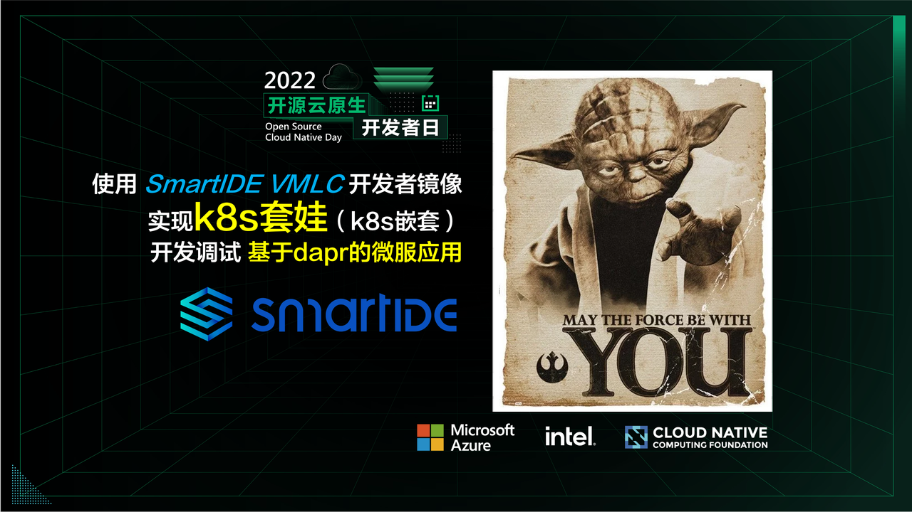

**k8s集群套娃（嵌套）是指在一个k8s的pod中运行另外一个k8s集群，这想法看上去很疯狂，其实这想法也非常实用。** 试想，当你开发一个k8s应用的时候候一定会希望在自己的环境中先测试一下，这时你有几个选择：1）自己找服务器搭建一个完整的集群；2）在自己的本地开发机中搭建一个精简的集群，比如使用minikube或者docker desktop；3）直接在生产环境部署。无论哪种做法，你都需要面临很多难以解决的问题，自己搭建完整集群操作复杂而且还需要额外准备服务器资源，本地搭建集群对开发机要求高，没有个8核16G的高配笔记本是不可能的，更不要说minikube和docker desktop 只支持单一节点的阉割版集群，做简单的测试可以，如果要完成一些复杂的集群调度实验就会显得力不从心。最后，如果你打算直接在生产环境部署，那么需要足够的胆量并且随时做好怕路的准备。

其实，这是当前云原生开发的一个普遍困境，开发环境变得越来越复杂，以往我们只需要拿到源代码就可以开发调试的日子不再有了。k8s环境使用起来方便，但是对于开发者而言，要获取一个用户开发调试和测试，或者随便可以折腾的环境太困难了。今天要给大家介绍的k8s套娃就是为了应对这个困境的，让开发者可以实现 **随用随启、用完即焚！**

## 云原生IDE的优势和困境

云原生开发的最佳环境其实就是云原生环境本身，既然我们的应用会运行在容器中，那么我们为什么不直接到容器中开发；既然我们的应用会运行在K8s中，为什么我们不直接在k8s中进行开发？先不用关心如何实现，我们先来看看这样做会带来怎样一些好处：

- **适用于任何人、任何时间、任何地点的标准化环境**：将开发环境放入容器意味着我们可以像管理容器一样管理开发环境，类似系统配置、开发语言SDK，IDE，测试工具，配置项等等都可以利用容器技术进行标准化；同时因为是容器，我们可以实现 Lift & Shift （拿起就走&插上就干活）的能力。你只需要对开发环境定义一次，就可以让任何人在任何地方复制出同样的环境。

- **彻底消除项目上手和切换成本**：基于以上能力，我们将开发环境配置文件也放入当前项目的代码库，开发者只要拿到了代码就拿到了环境（因为环境配置文件和代码版本是统一管理，版本保持对齐）。这样开发者再也不用为了调试某份代码重新搭建环境，可以随时随地的切换到应用的任何版本上，甚至可以同时开发调试一个应用的不同版本。这其实就 IDE as Code 的概念体现，具体请参考 这篇博客。

- **端到端的代码安全**：既然开发环境位于容器中，我们就可以将这个容器放置于一个完全受管控的云端环境中，项目的代码完全在这个容器中被处理，开发者不需要下载代码；所有的代码操作，包括：编写，编译，打包，测试和发布过程全部通过网页在云端完成。对于需要很高代码安全性保障的行业，比如：金融、军工、通讯和高科技企业来说；这个特性可以彻底解决代码安全问题。而且，使用云原生IDE还可以在保障代码安全同时允许企业放心的使用外包开发人员。在当全球疫情持续发展的情况下，远程开发基础设施变成了企业的必备能力，云原生IDE在这方面有天然的优势。

- **解锁云端超算力环境**：很多大规模系统动辄需要几百个服务组件才能运行，要在本地完成这种环境搭建是完全不可能实现的，即便有专业运维团队的支持，在云端复制类似的环境也困难重重，这造成在很多大规模开发团队中，开发/调试/测试环境的获取变成了一个普遍的瓶颈。而利用云原生IDE所提供的IDE as Code能力，复制一个环境和启动一个普通的开发环境没有本质上的区别，开发者在代码库中随意选取一个代码版本一键完成整个环境的搭建变得非常简单。测试环境的获取能力是评估一个团队DevOps能力的通用标准，采用基于 IDE as Code 的之后，获取这项能力的门槛将被完全抹平。开发人员也因此可以完全解锁云端的超强算力，存储和高速网络环境，对于AI，大数据，区块链，Web3.0这些需要复杂环境支撑的开发场景，云原DE更加是一个必须品。

当然，云原生IDE也并不是没有缺点，使用容器作为开发环境本身就会遇到很多的问题。

## 容器化开发环境的困境和解决方案VMLC

容器化技术出现以后，绝大多数的使用场景都是生产环境，因此对容器的优化目标都是围绕精简，单一进程，不可变状态的目标来实现的；对于开发人员来说，按这种目标设计的容器并不适合作为开发环境来使用。相对于生产环境中已经预先确定的配置，开发环境的配置则需要进行持续的调整，在Inner Cycle中，每个环节（包含了编码，编译打包，部署，测试，修复）都会产生环境变更的诉求。

**VMLC（类虚拟机容器） 是 VM Like Container 的缩写**，其设计目标是为开发者在容器中提供类似虚拟机的环境，包括：systemd服务管理能力，sshd远程登录能力，docker/k8s嵌套能力等。

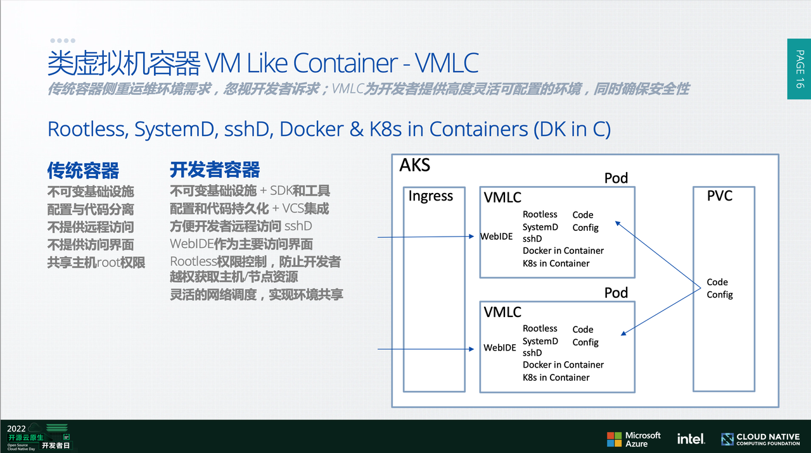

## 使用VMLC技术实现容器嵌套

SmartIDE 是完全基于 [IDE as Code](/zh/blog/2022-0510-readme-exe/) 理念设计和开发的一款 **云原生IDE** 产品，开发者既可以使用 [SmartIDE CLI](/zh/docs/install/cli/) 在个人开发环境中一键拉起 云原生IDE 开发环境，也可以由企业管理员部署 [SmartIDE Sever](/zh/docs/install/server/) 统一管理。SmartIDE 支持跨平台,Windows / MacOS / Linux 均可以使用，开发者也可以选择自己习惯的 IDE工具，比如：VSCode, JetBrains全家桶 以及 [国产开源的OpenSumi](/zh/blog/2022-0419-sprint16/)。 SmartIDE 通过 [开发者镜像和模版](/zh/docs/templates/) 同时支持7种主流开发语言技术栈，包括：[前端/Node/JavaScript](/zh/docs/quickstart/node/), [Java](/zh/docs/quickstart/java/), [DotNet/C#](zh/docs/quickstart/dotnet/), [Python/Anaconda](/zh/docs/quickstart/jupyter/), PHP, Golang, C/C++；如果这些内置的镜像和模版都无法满足开发者的需求，也可以通过定制的Dockerfile和模版定义来进行扩展，这些 [Dockefile和模版](/zh/blog/2022-0309-sprint14/#开发者镜像和模版库开源) 全部都采用GPL3.0开源协议免费提供给社区使用。

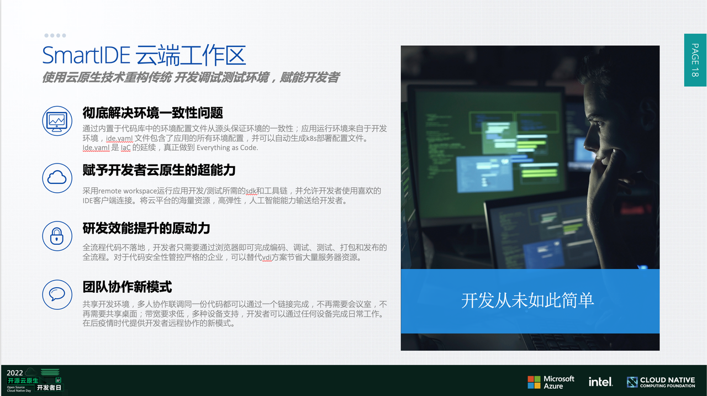

以下演示是在 2022年6月11日举办的 开源云原生开发者大会 上的展示的使用 **SmartIDE VMLC开发者容器** 完成一个 dapr 应用的开发调试场景：



以下是视频中演示的操作手册，感兴趣的小伙伴可以自己操作体验一下；示例采用 `dapr-traffic-control` 应用代码，代码库地址如下：

- https://github.com/SmartIDE/sample-dapr-traffic-control

> 所有操作脚本都可以在以上代码库中找到。

### 创建支持VMLC的AKS集群

使用以下脚本创建 Azure Kubernetes Service

> 如果没有安装 Azure CLI 命令行（az 指令）工具，可以通过这个地址安装 https://docs.microsoft.com/zh-cn/cli/azure/install-azure-cli

```shell
## 以下脚本可以在Windows/MacOS/Linux上运行

## 创建aks
## 登录并切换到你需要使用的订阅
az login 
az account set -s <订阅ID>

## 创建资源组，资源组可以方便你管理Azure种的资源，后续我们可以直接删除这个资源组就可以清理所有资源
az group create --name SmartIDE-DEMO-RG --location southeastasia
## 创建一个单节点的AKS集群，使用 Standard_B8ms 节点大小，可以根据需要修改脚本
az aks create -g SmartIDE-DEMO-RG -n SmartIDEAKS --location southeastasia --node-vm-size Standard_B8ms --node-count 1 --disable-rbac --generate-ssh-keys
## 获取链接密钥，密钥文件可以自动保存到当前用户的默认位置 ~/.kube/config 
## 获取后本地可以直接私用 kubectl 操作集群
az aks get-credentials -g SmartIDE-DEMO-RG -n SmartIDEAKS
```

完成以上操作后，我们就获取到了一个可用的AKS集群，整个操作不超过5分钟；下面使用k9s连接到集群进行状态监控，k9s是一个基于命令行的可视化k8s管理工具（Windows/MacOS/Linux都可以使用），非常方便而且轻量，安装地址如下：

- https://k9scli.io/

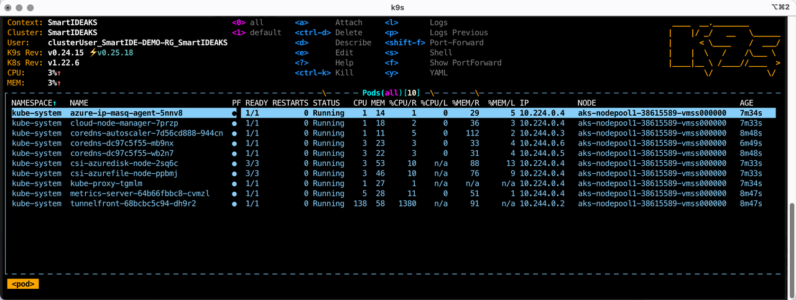

### 激活VMLC支持

VMLC容器需要底层容器运行时的支持，以下指令可以完成sysbox container runtime的安装

> 有关sysbox的详细信息可以参考 https://github.com/nestybox/sysbox

```shell
## 获取节点名称
kubectl get nodes
## 在节点上添加 sysbox-install=yes 的 label
kubectl label nodes <节点名称> sysbox-install=yes
## 安装 sysbox container runtime
### 国内安装地址
kubectl apply -f https://gitee.com/smartide/SmartIDE/raw/main/deployment/k8s/sysbox-install.yaml
### 国际安装地址
kubectl apply -f https://raw.githubusercontent.com/SmartIDE/SmartIDE/main/deployment/k8s/sysbox-install.yaml
```

执行后可以在k9s中实时查看安装进度，等待以下这个安装进程结束即可开始使用。

> 部署sysbox container runtime是集群级别的一次性操作，只需要管理员在创建集群的时候执行一次即可。

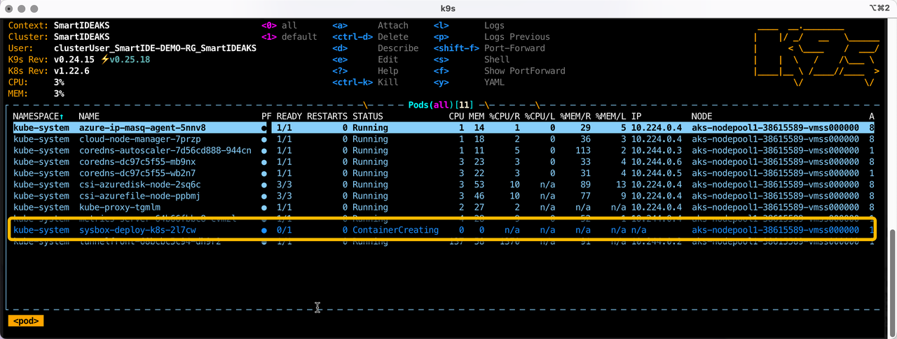

### 部署VMLC开发环境

所有VMLC开发环境均通过开发者镜像的方式提供，在 `smartide-dapr-traffic-control` 这个代码库已经放置了适配好的 VMLC开发环境部署 manifest 文件，文件内容如下：

```yaml
apiVersion: v1
kind: Pod
metadata:
  name: smartide-dev-container
  annotations:
    io.kubernetes.cri-o.userns-mode: "auto:size=65536"
spec:
  runtimeClassName: sysbox-runc
  containers:
  - name: smartide-dev-container
    image: registry.cn-hangzhou.aliyuncs.com/smartide/smartide-dotnet-v2-vmlc
    command: ["/sbin/init"]
  restartPolicy: Never
```

使用以下脚本即可获取源码并完成 VMLC开发环境部署

```shell
git clone https://github.com/SmartIDE/sample-dapr-traffic-control.git
cd sample-dapr-traffic-control
kubectl apply -f vmlc/smartide-vscode-v2-vmlc.yaml
```

执行以上操作以后，通过k9s查看名为 `smartide-dev-containter` 的 pod 的部署状态，部署状态为 running 即可开始使用了。


执行以下指令进入 `smartide-dev-container` 容器

```shell
kubectl exec -i -t -n default smartide-dev-container -c smartide-dev-container "--" sh -c "clear; (bash || ash || sh )"
```

现在我们就可以在这个运行在 k8s 集群 pod 的容器内进行操作了

```shell
## 切换到 smartide 用户
su smartide
## 切换到 smartide 的默认目录
cd
## 将 smartide-dapr-traffic-control 代码克隆到容器中
git clone https://github.com/SmartIDE/sample-dapr-traffic-control.git
```

在VMLC容器中内置一个叫做 `smartide` 的普通用户，这是一个非 `root` 用户，默认情况下VMLC容器全部通过这个用户进行操作，避免越权访问主机资源。
这个容器中已经内置了dotnet开发环境以及dapr cli工具，但是使用 terminal 操作确实不太方便。下面让我们切换到 VSCode WebIDE 进行后续的开发工作。

### 使用VSCode WebIDE访问VMLC开发环境

在SmartIDE所提供的VMLC开发者镜像中已经内置了 VSCode WebIDE，下面让我们将容器的3000端口映射到本地的6800端口，并通过浏览器访问我们的VMLC开发环境。

```shell
## 在你本地开发机的另外一个terminal中运行以下指令
## 注意不要使用以上已经进入 dev-container 容器的terminal
## 这个指令会将远程k8s pod中容器的3000端口映射到你本地的6800端口
kubectl port-forward smartide-dev-container 6800:3000
```

现在，你就可以打开 http://localhost:6800 端口并访问内置于 VMLC 容器中的 VSCode WebIDE 了，点击 Open Folder 按钮，并打开 `/home/smartide/sample-dapr-traffic-control` 作为我们的工作目录

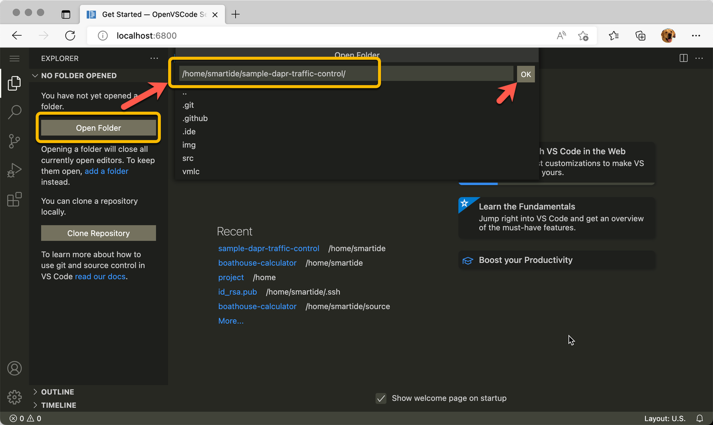

点击 OK 之后，你就可以开始愉快的编码了，注意你现在使用的是 smartide 用户访问 `smartide-dev-container` 的开发环境

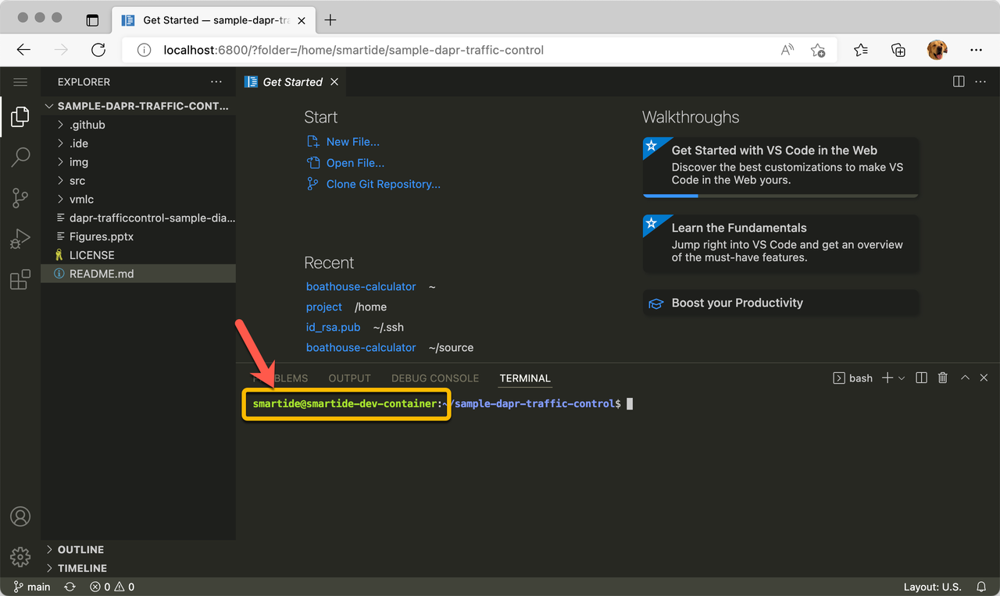

通过VMLC的开发者镜像，我们已经在这个环境中内置了 `dotnet sdk`， 以及 `dapr cli`, `kubectl`, `helm`，`docker` 等常用云原生开发工具。你可以按照 [这篇博客](/zh/blog/2022-0601-dapr/) 的操作完成这个dapr应用的 `self-hosted` 模式的开发调试。这个模式其实是将容器作为你的本地开发环境，并通过容器中的docker嵌套支持来提供 dapr所需要的中间件环境。

你会发现使用WebIDE进行类似的操作非常方便，这同时也意味着你已经脱离了你本地的开发机，可以在任何地点访问这个位于云端的开发环境。
当然，如果你不习惯在浏览器中操作IDE环境，也可以通过你本地的常用IDE来访问我们的远端 VMLC开发环境。

### 使用Hybird模式访问云端工作区

在 SmartIDE VMLC 开发环境中，除了内置 WebIDE 之外，也内置了 ssh 服务。也就是说，你现在可以像访问一台普通的云端虚拟机一样访问你的 VMLC 容器开发环境。
运行以下指令将 VMLC 的22端口映射到本地的 22002 端口上

```shell
kubectl port-forward smartide-dev-container 22002:22
```

现在你就可以打开本地的命令行通过标准的SSH协议访问这个 VMLC 开发环境了。

```shell
## 使用以下指令建立SSH连接，默认密码 smartide123.@IDE (这个密码可以通过后续的SmartIDE CLI或者Server进行重置）
ssh smartide@localhost -p 22002
```

当然，通过命令行的方式并不是每个开发者都习惯的方式，那么我们可以通过 VSCode 的 `Remote SSH` 插件或者 JetBrains `Gateway` 所提供的SSH通道连接方式，将你本地的VSCode或者JetBrains IDE连接到这个远程的 VMLC云端云端工作。这个就是 Hybird（混动）模式。

Hybird 模式兼顾了本地IDE和云端工作区双方的优势，让开发者在编码的过程中既可以享有本地工具的快速跟手的操作体验，又可以方便使用云端的超级算力。

#### VSCode Remote SSH 连接

在VSCode中连接云端工作区非常简单，你只需要在 `SSH Remote` 插件中点击添加连接，然后输入以上 SSH连接指令即可，这个过程与使用SSH连接一台远程主机完全一致。如果你看不到这个远程连接工具链，那么请从 [这里安装 SSH Remote 插件](https://marketplace.visualstudio.com/items?itemName=ms-vscode-remote.remote-ssh) 即可。

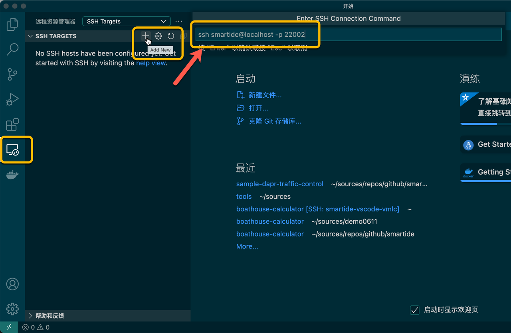

连接以后，设置工作区到 `/home/smartide/sample-dapr-traffic-control` 目录，即可看到如下界面。

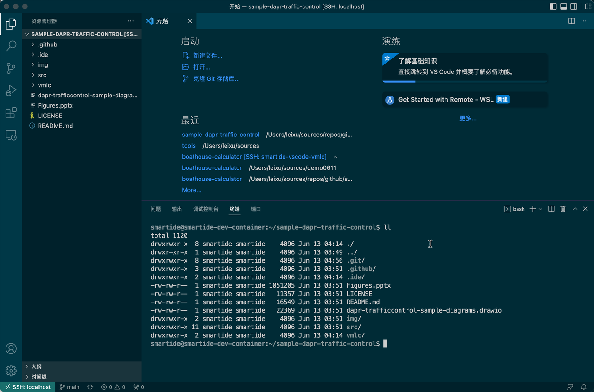

#### JetBrains Gateway 连接

启动Gateway之后，选择 `New Connection`，并按我们的SSH指令填写信息，并点击 `Check Connection and Continue` 按钮

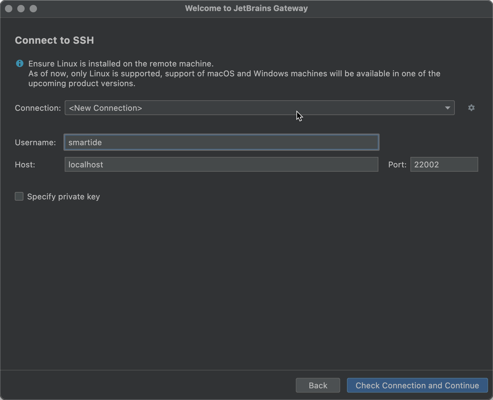

这时Gateway会要求你输入SSH登录密码，输入之后会进入以下IDE类型选择界面，根据需要选择你希望使用的IDE，因为dapr是一个基于dotnet 6.0的项目，我们在这里选择Rider作为我们的接入客户端IDE。

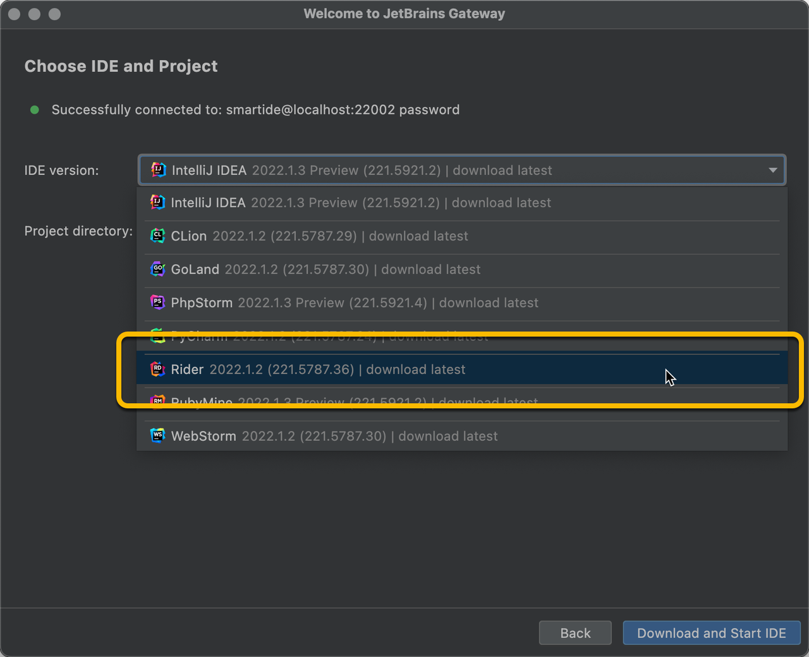

然后制定工作区目录为 `/home/smartide/sample-dapr-traffic-control` 目录，点击 `Download and Start IDE`。这时Gateway会自动在远程工作区启动 `Rider IDE Server`，并在本地启动 `JetBrains Client`，通过我们设定的SSH通道连接

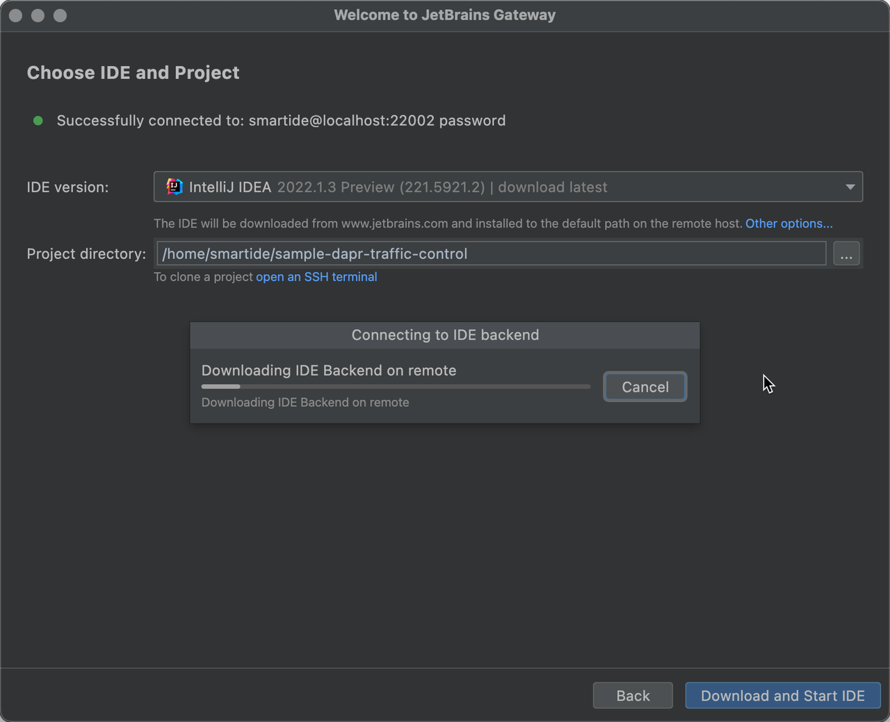

启动完成的运行 `JetBrains Client` 如下

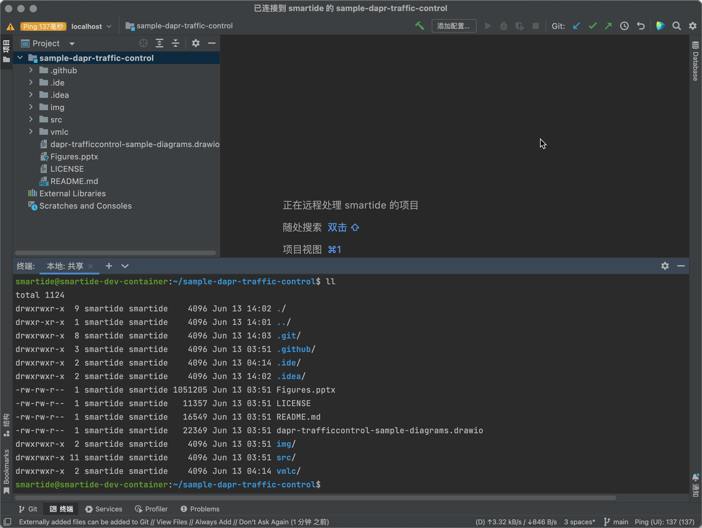

现在，我们已经完成本地IDE和远程工作区之间的Hybird模式连接。开发者可以根据自己的喜好和操作习惯选择使用WebIDE或者Hybird模式连接到基于VMLC的远程工作区。WebIDE的优点在于随时随地轻量编程，对本地开发机基本没有任何资源压力，即使使用一台ipad也可以完成开发工作；而Hybird模式的优势在于编码体验（特别在一些复杂的键盘操作和窗口布局控制上），特别是重度IDE用户会面对非常复杂的大规模项目，这种项目要完全运行在本地开发机是不可能的。

> 以下操作使用VSCode Remote SSH模式完成。

### 在容器中创建k8s集群

下面，让我们来将这个应用部署到 **容器中嵌套的k8s集群** 中。首先执行以下指令，使用kind创建一个多节点的k8s集群。

> 备注：Kind (Kuberentes in Docker) 是k8s开源项目下的一个sig，项目地址 https://kind.sigs.k8s.io/，希望了解KIND详细背景和使用方法的小伙伴可以自行参考

```shell
cd vmlc
kind create cluster \
    --config multi-node.yaml \
    --image registry.cn-hangzhou.aliyuncs.com/smartide/nestybox-kindestnode:v1.20.7
```

以上指令执行完毕后，我们可以在容器中运行k9s指令，实时查看容器内运行的集群状态，如下图可以看到2个节点已经处于Ready状态

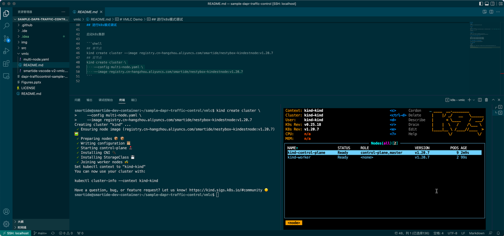

### 编译打包并部署dapr应用到k8s集群

现在我们可以进入 `src/k8s` 目录执行 `build-docker-images.ps1` 脚本，这个脚本会完成所有应用的docker images的构建。

```shell
cd src/k8s
pwsh build-docker-images.ps1
```

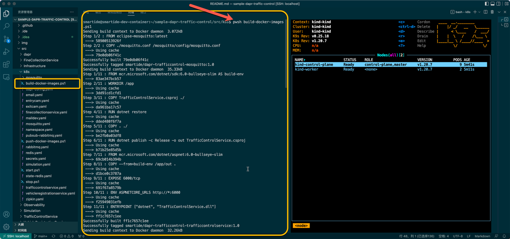

现在我们来登录到 docker hub 并将打包好的 images 推送上去（这个步骤你在执行时可以跳过，所有镜像已经推送并设置为公开模式，可以直接拉取使用）。

```shell
docker login
pwsh push-docker-images.ps1
```

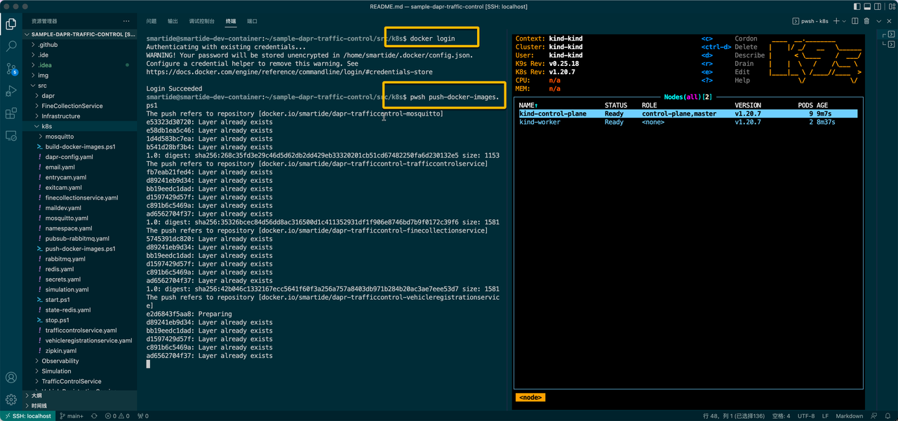

最后，我们使用以下脚本在k8s集群上部署dapr基础服务和示例应用的服务。

```shell
## 在默认的k8s集群中部署dapr基础服务
dapr init -k
## 部署 dapr-traffic-control 应用
pwsh start.ps1
```

下图：dapr基础服务启动中

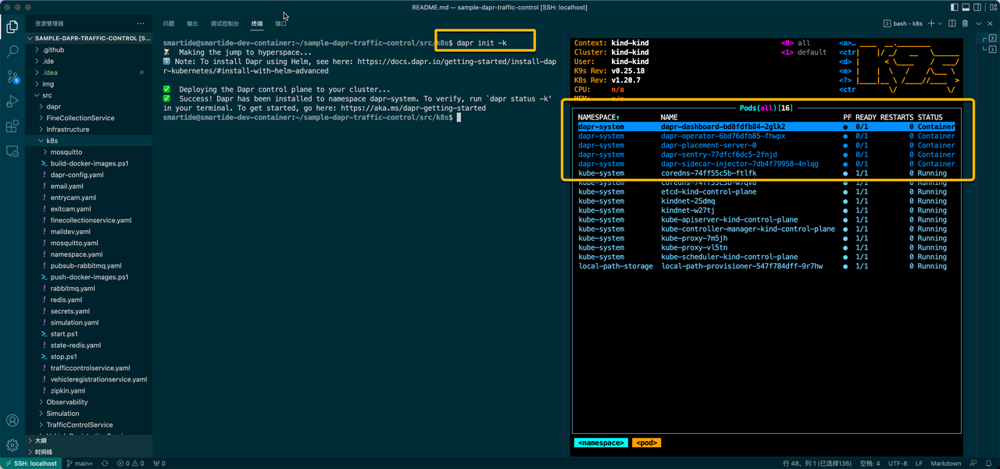

下图：`dapr-traffic-control` 相关服务启动中

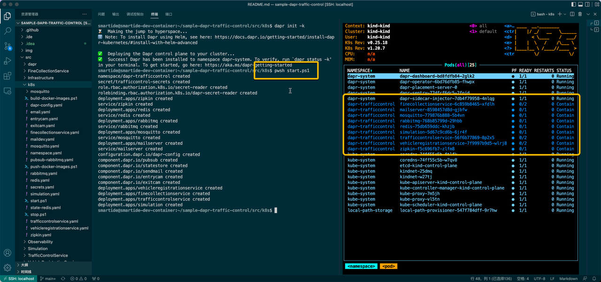

至此，我们就完成了k8s套娃旅程。如果我们不再需要这个环境，就可以通过以下指令一键清理掉这个 VMLC 环境，其中的所有内容也就从我们的集群上彻底清除了。

```shell
kubectl delete -f vmlc/smartide-vscode-v2-vmlc.yaml
```

这个过程中，大家应该可以明显体会到使用套娃方式运行K8s集群的好处，那就是简单轻量，节省资源。当然这个过程中容器的安全也是得到充分保障的，VMLC内部使用时非root账号，开发者在容器内无论进行怎样的操作都不会对所在集群的底层节点资源造成影响，是完全隔离的rootless环境。

### 使用SmartIDE一键启动VMLC环境

当然，以上操作过程中大家也会有另外一个直观感受，就是太复杂。完成类似的操作需要开发者对容器，k8s以及网络有充分的了解；这对普通开发者来说过于复杂。
SmartIDE的设计出发点就在这里，让开发者可以在 **不学习/不了解** 云原生技术的前提下享受云原生技术带来的好处。在刚刚结束的 SmartIDE Sprint19中，我们已经发布了 [Server版私有部署手册](/zh/docs/install/server/)，开发者可以使用一台linux主机就可以自行部署一套完整的SmartIDE Server环境，并用它来管理自己的云端工作区。

> 特别说明：SmartIDE Server的基础版功能是开源免费的，任何人和企业都可以免费获取并无限量使用。

使用SmartIDE Server云端工作区启动一个工作区就会变得非常简单，开发者复制Git仓库地址粘贴到如下界面，即可启动一个远程工作区；这个远程工作区可以运行在远程主机或者k8s环境中，对于很多开发者而言，K8s仍然是一个过于复杂的存在，但是几台云端的linux主机已经基本上是每个开发者的标配了。现在，你可以将这些Linux主机资源利用起来，使用 SmartIDE Server 将他们转换为高效的云端开发工作区。

下图：使用SmartIDE Server创建云端工作区

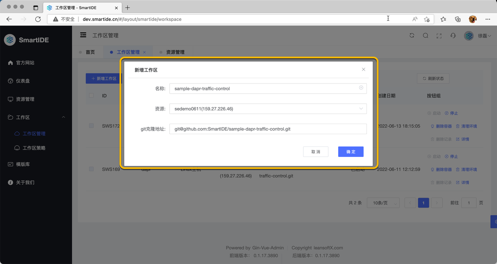

下图：运行在SmartIDE Server中的基于VMLC的远程工作区，正在部署dapr基础服务的状态

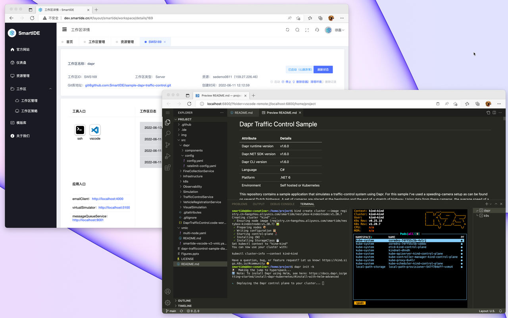

最后，希望每一名开发者都能寻找到云原生时代的原力；**May the force with YOU!**

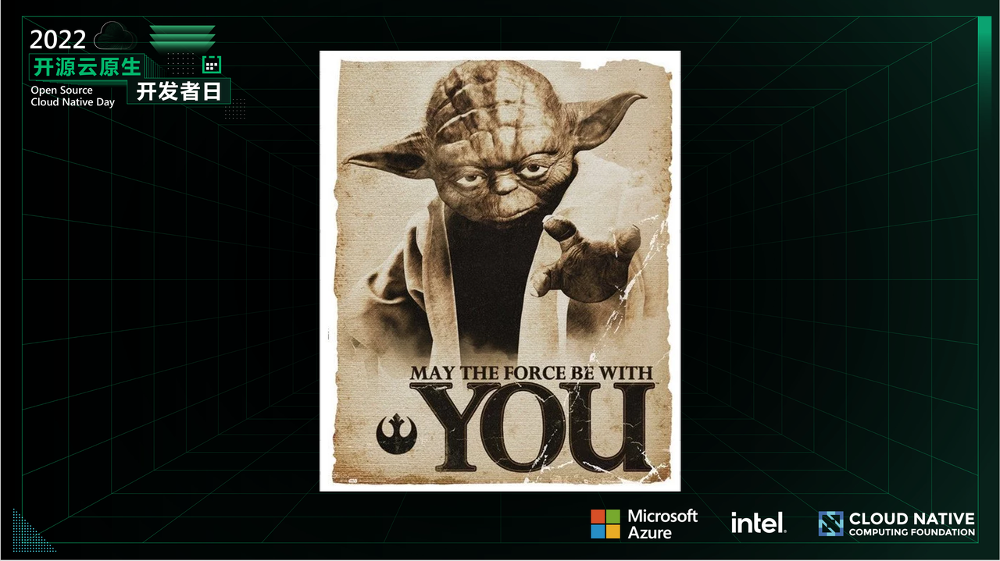

## 社区早鸟计划

如果你对云原生开发环境感兴趣，请扫描以下二维码加入我们的 **SmartIDE社区早鸟计划**


谢谢您对SmartIDE的关注，让我们一起成为云原生时代的 *Smart开发者*, 享受 *开发从未如此简单* 的快乐。

让我们一起成为 Smart开发者，享受开发如此简单的乐趣。