开放原子开源基金会是致力于推动全球开源事业发展的非营利机构，于 2020 年 6 月在北京成立，由 **阿里巴巴、百度、华为、浪潮、360、腾讯、招商银行** 等多家龙头科技企业联合发起。本次开源峰会是开放原子的年度品牌活动、全球开源领域的高端峰会。包括 **工信部副部长王江平、北京市副市长靳伟、中国科学院院士梅宏，Linux基金会执行董事Jim Zemlin，Eclipse基金会执行董事Mike Milinkovich** 以及来自阿里，腾讯，蚂蚁，华为，中软国际，英特尔等来自国内外的重磅嘉宾参与了本次会议。**SmartIDE在本次峰会的云原生论坛上展示了项目当前的进展以及下一代云原生CloudIDE的使用场景。**

产品开源地址：

- https://github.com/SmartIDE
- https://gitee.com/SmartIDE

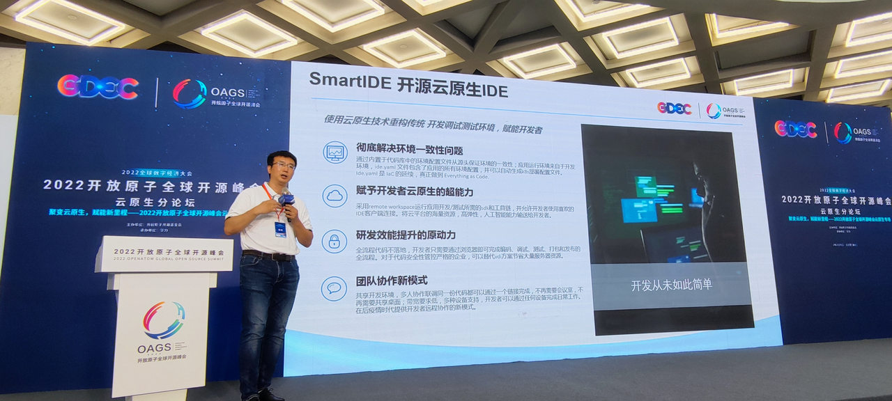

## 彻底解决软件开发环境标准化问题
如今，软件确实已经深入我们生活的方方面面，没有软件你甚至无法点餐，无法购物，无法交水电费；我们生活的每一个环节都已经被软件包裹。在这些软件的背后是云计算，大数据和人工智能等各种高新科技；这些现代IT基础设施在过去的几年得了非常显著的发展，我们每个人都是这些高科技成果的受益者 … … 但是，提供这些高科技成果的 **开发者们自己所使用的软件（开发工具）却仍然像 “刀耕火种” 一般落后。**

你可能会觉得这是危言耸听，那么让我来举一个简单的例子：大家一定都通过微信给自己的朋友发送过图片，这个过程非常简单，拿出手机，拍照，打开微信点击发送图片，完成。收到图片的朋友直接打开就可以看到你拍摄的照片了。但是对于开发者来说，**如果要将一份代码发给另外一位开发者，那么对方可能要用几个小时甚至几天的时间才能看到这份代码运行的样子。** 作为普通人，你无法理解这是为什么，如果你是一名开发者，你一定知道我在说什么！

上面漫画中的场景是不是很熟悉？开发环境的搭建对于开发者来说理所当然的是要占用大量时间和精力的，但是对于 “产品经理/领导/老板” 来说，开始写代码就应该像打开Word写个文档一样简单，只有开发者自己知道这其实很不简单。当然，这件事情确实应该更简单，只不过开发者整天 忙着让别人的生活变得简单，却忽视了自己就的生活正在变得越来越复杂。

解决以上问题的终极方案就是云端工作区，从IDE产品本身的发展历程来看，在经历了超过30年的三代产品的发展演进后，主流IDE厂商都在向着云端工作区的方向发展。SmartIDE正是在这个大背景下应运而生的下一代IDE云端工作区管理工具。

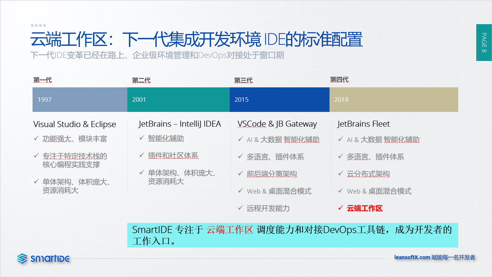

## 用云原生技术赋能开发者
我们的使命是 **用云原生技术赋能开发者**，我们定位于“开源云原生CloudIDE”，希望将云原生中各种先进技术针对开发者的工作场景进行优化，让开发者也能享受云原生带来的好处。同时，针对现有CloudIDE存在的种种弊端，SmartIDE也会从开发者的诉求出发予以优化，比如：当前的CloudIDE大多数采用WebIDE+容器的技术基础来搭建，但是WebIDE本身有很多局限会影响开发者的体验和工作效率，比如：快捷键、多窗口、操作延迟等；针对这个问题，SmartIDE提供了Hybrid模式，允许开发者使用本地IDE（VSCode或者JetBrains）连接到云端工作区进行操作，让开发者既可以享受云端开发的强大又不需要改变自己的操作习惯。

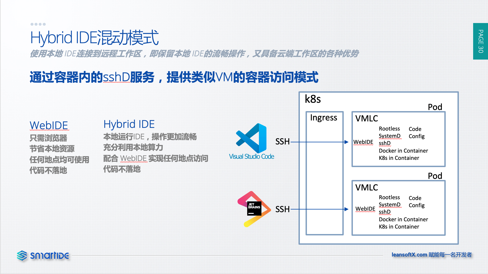

容器技术虽然对于应用运维来说提供了很多优化，但是因为容器技术从一开始就是为了生产环境而设计的，并不适合直接用于承载开发调试环境。为了能够为开发者提供适合作为开发调测环境的容器，SmartIDE特别研发了VMLC（类虚拟机容器）容器，给予开发者在容器内极大的自由度，同时又可以确保对主机环境的安全保障。

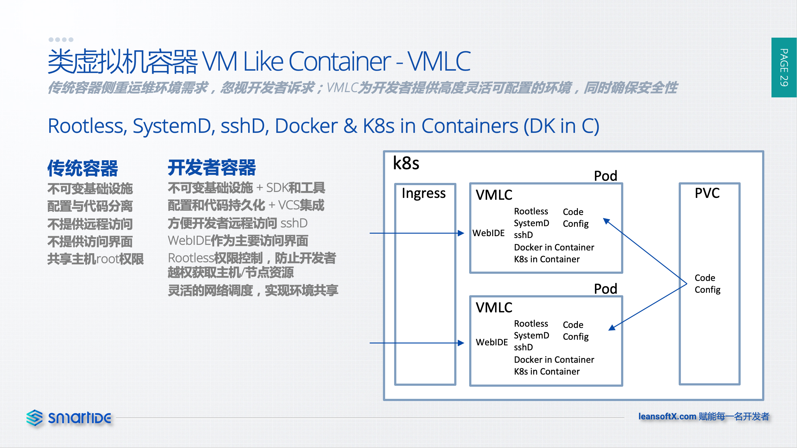

在本次峰会的云原生论坛上，SmartIDE现场演示了以上两个场景。我们也会继续践行我们的使命，设计和开发一款真正为开发者解决问题、消除痛点、提高效率的开发者乐于使用的CloudIDE产品。

## 从新定义IDE
如果把Vscode和JetBrain这些IDE称为传统IDE的话，他们最大的问题是：**虽然在 I (Integration) 和 D (Development) 上面传统IDE都做的非常不错，但是他们都没有解决 E (Environment) 的问题。** 

SmartIDE是 **第一个提供完整环境标准化能力** 的新一代IDE产品，拓展了传统IDE的的边界，对IDE的概念从新定义并且专注打造围绕这一全新IDE概念的开发者生态系统。加入开放原子基金会是SmartIDE继续拓展新一代开发者生态的重要里一步，我们将继续围绕开发者的体验重新定位现有的研发工具链体系，为个人开发者和企业提供一体化研发环境标准化解决方案，补齐传统IDE的短板。

SmartIDE可以完成开发环境的一键搭建，如果你熟悉命令行操作，那么安装我们的cli，只需要学会一个命令 `smartide start` 就可以一键完成任何项目的开发调测环境搭建，不再需要安装任何工具，SDK，调试器，编译器，环境变量等繁琐的操作。如果不喜欢命令行操作，也可以使用我们的 Server 通过网页完成全部操作。

SmartIDE提供了三种运行形态，针对个人开发者以及企业研发面临的不同场景，提供了简单方便一站式的开发调试环境解决方案。彻底解决环境（E）的问题。

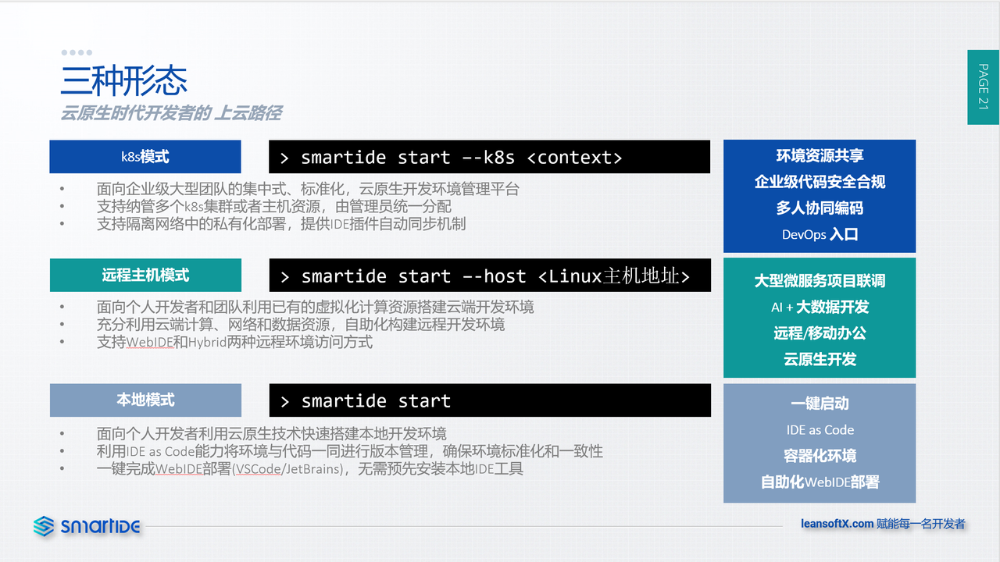

- **本地模式：** 面向 **个人开发者** 提供完整闭环的容器化开发调试环境调度，开发者可以在Windows/MacOS/Linux三种操作系统上使用 `smartide start` 指令一键启动任何开发语言的项目代码，直接进入调试状态，不必安装任何SDK以及开发工具。

- **远程主机模式：** 面向 **专业开发者和团队** 的远程容器化工作区（云端工作区）启动模式，开发者可以将任何linux主机转变为一台全功能的CloudIDE服务器，使用同样的 `smartide start` 指令就可以完成远程服务器的管理和维护。对于需要使用云端服务器的强大算力、高速网络以及超大规模存储的人工智能，大数据，微服务开发场景，可以极大简化开发者管理远程开发环境的复杂度。

- **k8s模式：** 对于 **企业团队开发** 场景而言，能够将开发环境集中管理并标准化可以大幅减少开发团队花费在环境管理上的精力，同时提升 **开发环境的安全性，稳定性以及开发效率**。大型企业中使用标准化开发框架是普遍的实践，但是如何简单高效的推广这些开发框架是是一件非常困难的的事情，使用SmartIDE的k8s模式可以很好的解决这些问题。当前企业中已经有大量的k8s集群在使用，但绝大多数仅被用于测试和生产环境的管理，开发调测的环境在很多企业处于无管理或者疏于管理的状态，这为企业级研发来了大量的安全和稳定性隐患。SmartIDE k8s模式是针对企业级开发调测环境管理而设计的完整解决方案，为以上痛点提供了体系化的解决方案。

## SmartIDE v1.0 已经发布
**SmartIDE v1.0版本（CLI Build v1.0.23.4650，Server Build v1.0.23.4646）已经发布**，在发布了超过4000 Builds 之后，我们终于发布了v1.0版本。当前的版本已经完成了 **企业级云原生CloudIDE的特性闭环**，允许 **个人/团队/企业用户** 在 **Windows/Mac/Linux** 上使用 **VSCode/JetBrains全家桶/OpenSumi**  三种IDE开发7种技术栈下的任何项目，并且支持**WebIDE，Hybrid混合模式以及WebTerminal** 的三种工作区访问方式。

SmartIDE产品体系包含 **CLI，Server，开发者容器与模版以及插件市场四大组件**，构成了企业级CloudIDE的完整生态环境。**四大组件全部开源，为企业构建自主可控的私有化CloudIDE提供了一站式的解决方案。**

个人开发者和企业用户可以从以下地址获取相关安装包、脚本和说明文档，立即开始体验：

- CLI 工具
  - 安装 https://smartide.cn/zh/docs/install/cli/
  - 快读启动教程 https://smartide.cn/zh/docs/quickstart/cli/
- Server
  - 安装 https://smartide.cn/zh/docs/install/server/
  - 快速启动教程 https://smartide.cn/zh/docs/quickstart/server/
- 开发者镜像和模版
  - 使用说明 https://smartide.cn/zh/docs/templates/
  - 开发者镜像和模版指令列表 [https://smartide.cn/zh/docs/templates/#镜像和模版指令列表](https://smartide.cn/zh/docs/templates/#%E9%95%9C%E5%83%8F%E5%92%8C%E6%A8%A1%E7%89%88%E6%8C%87%E4%BB%A4%E5%88%97%E8%A1%A8)
  - 模版使用说明 [https://smartide.cn/zh/docs/templates/#模版库](https://smartide.cn/zh/docs/templates/#%E6%A8%A1%E7%89%88%E5%BA%93)
- 插件市场
  - 安装 https://smartide.cn/zh/docs/install/marketplace/
  - 配置IDE使用SmartIDE插件市场 https://smartide.cn/zh/docs/manual/marketplace/config/
  - 配置自动插件同步机制 https://smartide.cn/zh/docs/manual/marketplace/extension-sync/
  - 将你的插件发布到SmartIDE插件市场 https://smartide.cn/zh/docs/manual/marketplace/publish-extension/
  - 插件安装手册 https://smartide.cn/zh/docs/manual/marketplace/usage/
  - 使用自签名证书进行插件市场私有化部署 https://smartide.cn/zh/docs/manual/marketplace/self-signed-certificate/

我们也提供了多种开发语言技术栈的快速启动文档，方便开发者使用

- Node/前端开发 https://smartide.cn/zh/docs/quickstart/node/
- Java https://smartide.cn/zh/docs/quickstart/java/
- DotNet https://smartide.cn/zh/docs/quickstart/dotnet/
- Python Jupyter Notebook https://smartide.cn/zh/docs/quickstart/jupyter/ 

- **CLI：** 是一个使用go语言开发的简单易用的命令行工具，可以在Windows/MacOS/Linux三种操作系统上运行，同时支持x86和arm两种cpu架构。覆盖了当前几乎所有主流的桌面，笔记本，服务器，边缘服务，IoT设备和移动操作系统环境。为SmartIDE提供了在任何平台上进行CloudIDE管理和调度的能力。其关键特性包括：

  - 一键创建容器化工作区
  - 本地、远程主机、k8s三种模式支持
  - 自动创建SSH安全隧道，避免开放远程主机端口
  - 使用环境模版一键创建预制的环境和代码框架
  - 工作区状态管理登录SmartIDE Server实现远程端口监听
  - Headless运行模式，支持流水线集成（比如：在GitLab CI中利用cli创建云端工作区环境）

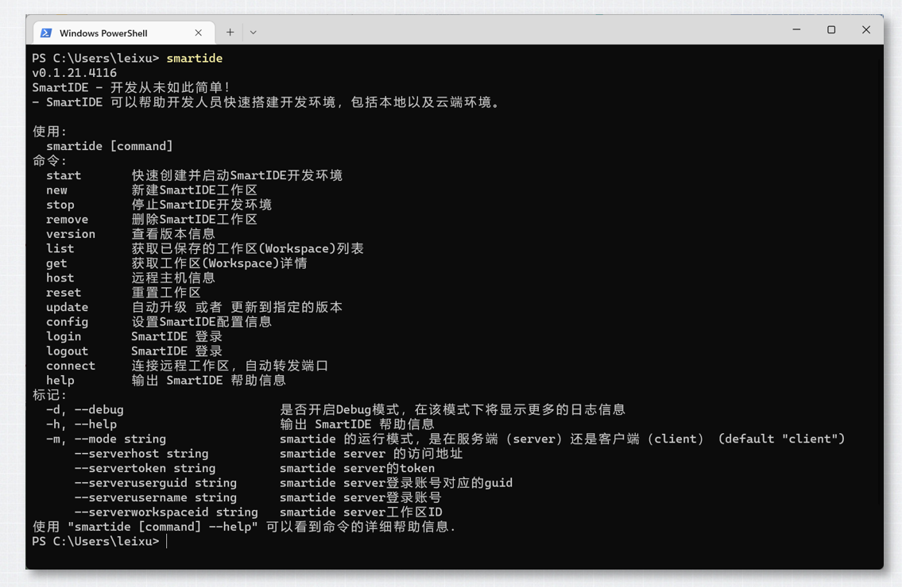

- **Server：**  采用vue.js + go语言开发的 **开源企业级CloudIDE管理平台**，支持单机和高可用两种部署模式，可以在隔离的企业环境内部署，支持多集群管理。主要特性包括：
  - 资源集中管控，支持纳管多台Linux主机或者k8s集群
  - 端到端的代码安全，实现研发过程全程代码不落地
  - 工作区入口，聚合所有研发资源
  - 环境模版，一键创建标准化开发环境
  - 团队管理，自由组合开发人员，按团队分配资源
  - 工作区策略、统一管理开发人员“本地”环境配置
  - 环境共享和协同开发

- **开发者镜像&模板：** 一整套完整的容器化环境镜像和可扩展的模板系统，支持7类主流开发语言并可以扩展到任何开发语言和框架的支持。主要特性包括：
  - 加速工作区加载
  - 三种主流IDE支持，VSCode, JetBrains全家桶和阿里OpenSumi
  - 多种工作区接入方式：包括WebIDE、Hybrid混动、WebTerminal和Web文件管理器以及SSH直连
  - Hybrid混动模式同时支持 VSCode Remote和 JetBrains Gateway 两种接入模式
  - Rootless安全保障，使用非root用户运行容器内进程，避免容器越权
  - 支持在容器内运行嵌套完整Docker和Kubernetes集群（VMLC，Rootless安全模式），完美支持云原生开发场景

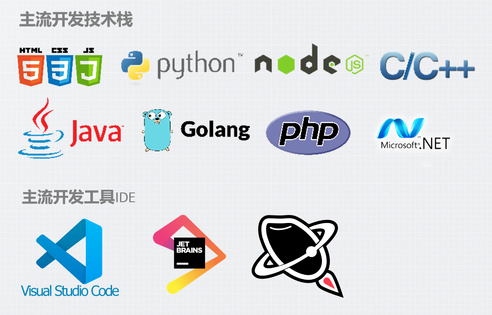

- **IDE插件市场：** 现代IDE需要使用大量插件扩展自身能力，在企业内部提供统一受控的插件市场有助于企业对开发调测环境、代码安全以及应用架构进行有效管控。我们基于Eclipse OpenVSX扩展开发了SmartIDE Marketplace，支持在隔离私有网络进行本地化部署并提供插件同步机制。主要特性包括：
  - 插件自动同步，使用预制脚本自动同步插件（包括历史版本）
  - 支持多种类VSCode IDE，比如：VSCodium, Code-Server, OpenVSCode Server，Eclipse Theia，OpenSumi

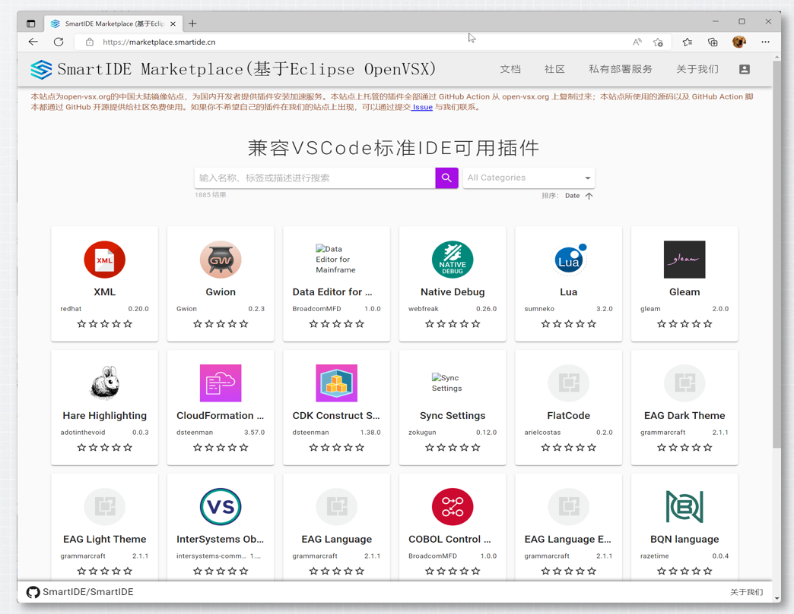

## 产品进展

SmartIDE的开发工作采用敏捷（Scrum&Kanban）方式进行，2周一个Sprint并且采用了高度自动化的流水线完成代码的构建，自动化测试和发布工作。到今天为止，我们已经完成了 **超过4000个版本的发布，CLI每周下载量超过1000次。**

过去的6个月中，我们完成了超过 **400个特性的开发和交付，CLI完成了698次构建，Server完成了701次构建。**

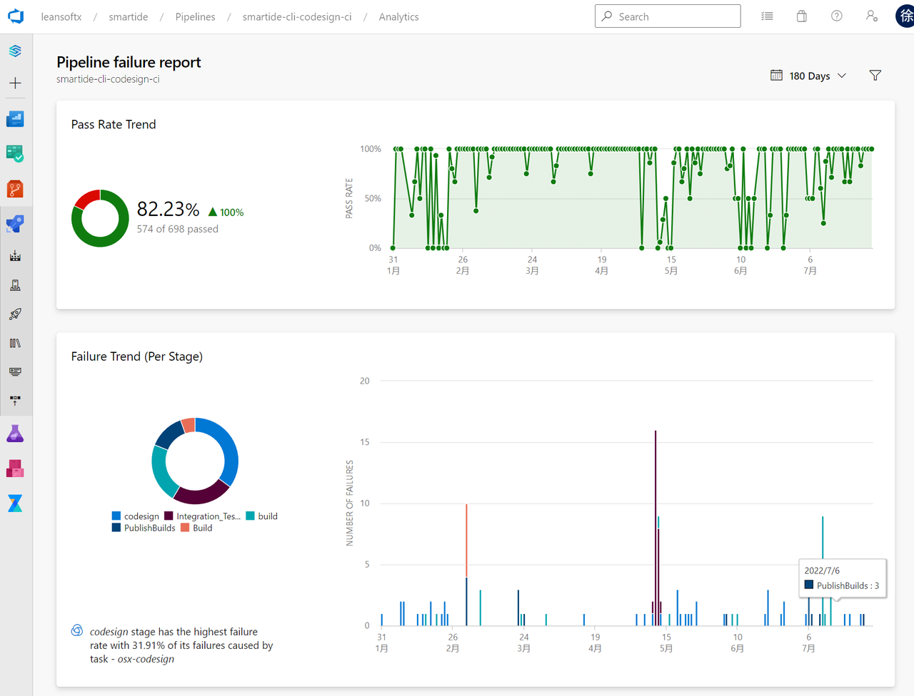

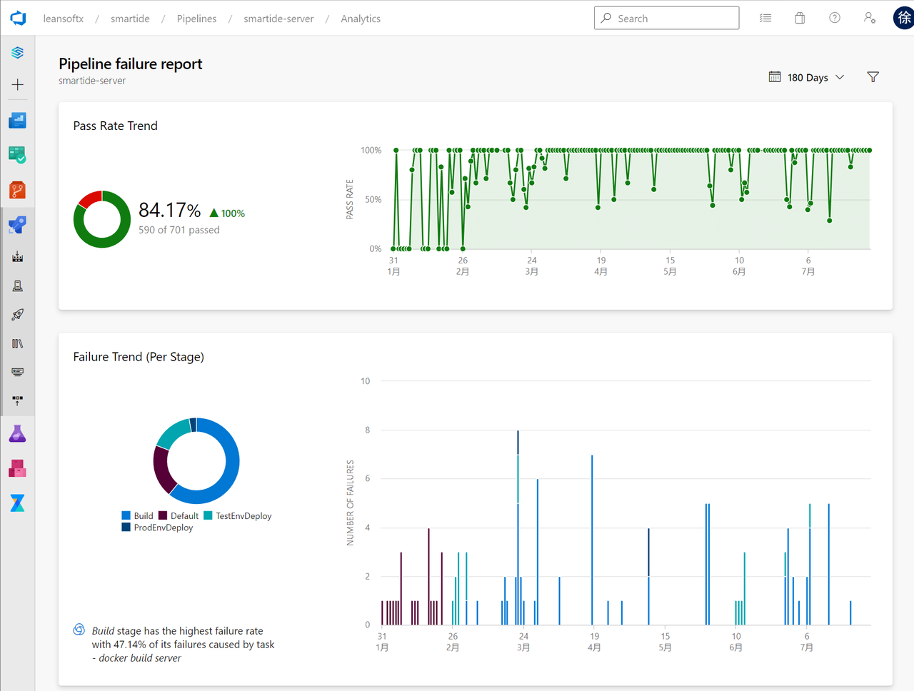

当前我们已经有来自几十家企业的超过200名早期使用者

## 开源进展

SmartIDE采用 **GitHub和Gitee双地址开源** 方式，并且支持社区开发者使用任何一个开源平台与我们的产品团队进行协作。为了满足开源社区协作和产品商业化开发同步推进的诉求，我们设计了 **SmartIDE开源工作体系**，帮助产品团队和社区开发者统一认知，高效协作。

具体可以参考：[开源工作体系](/zh/docs/opensource/)

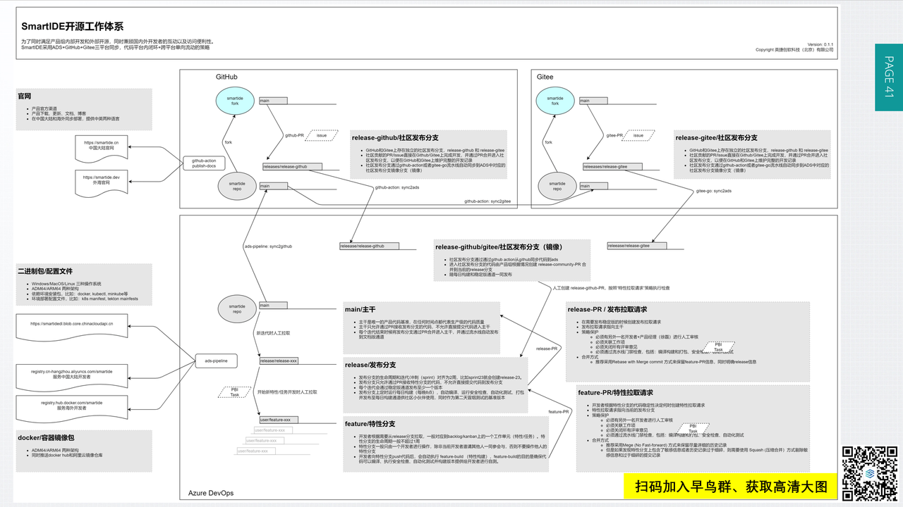

在GitHub和Gitee有非常多的小伙伴与我们互动，收获了超过 **500个star和80个Fork**。同时也被gitee评选为 **2022最有价值开源项目**。

当前，SmartIDE已经进入 **开放原子基金会项目捐赠的TOC审核阶段**，我们认同并相信 "软件定义世界，开源共筑未来” 的理念，希望借助开放原子基金会的力量，继续扩大我们的社区影响力，吸引更多的共建单位一起构建开发者生态。以IDE这一软件开发基础软件为切入点，为更多的开发者和企业赋能，在开源开发者工作模式、企业级研发效能和信创领域打造世界级的下一代IDE工具平台。

> 欢迎更多的开发者和企业加入SmartIDE的开发协作，让我们一起做一个自己喜欢的工具。

徐磊 
2022.7.29日于北京
