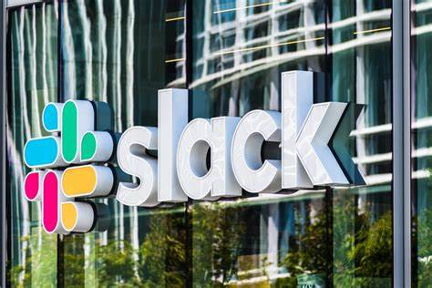
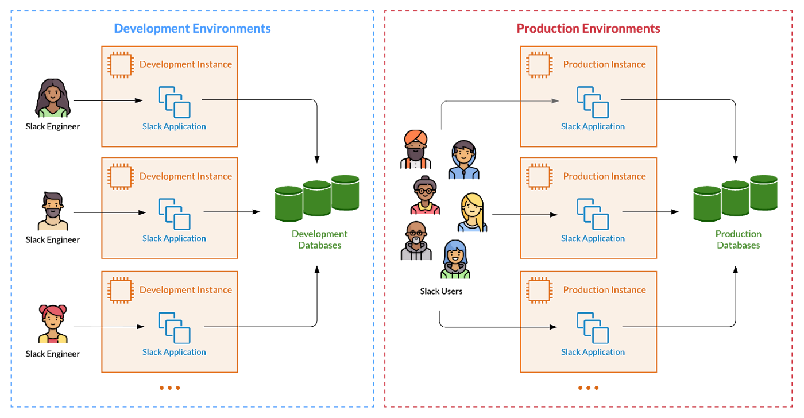
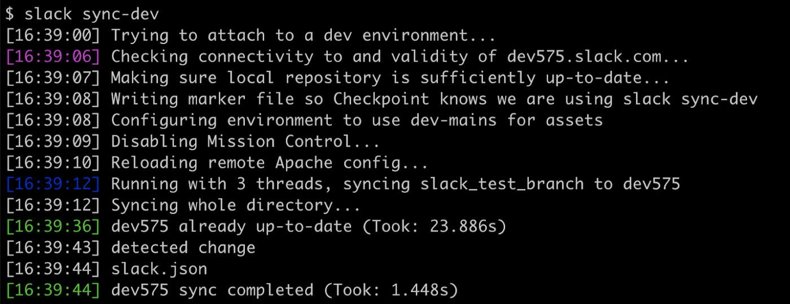
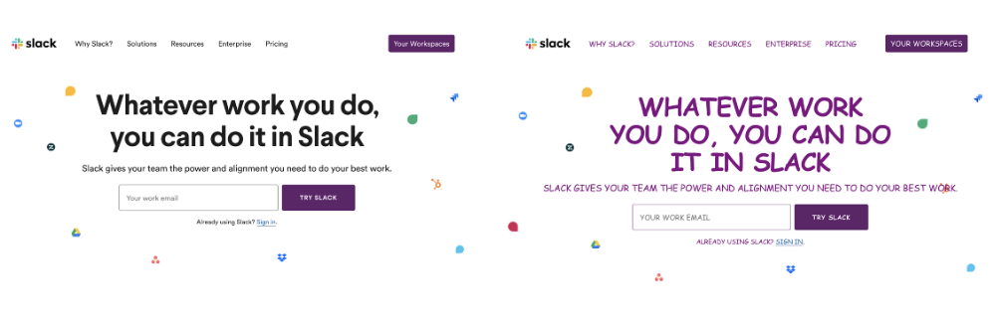
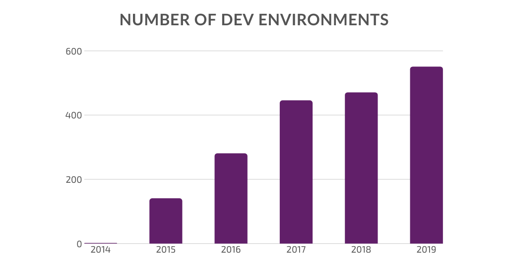
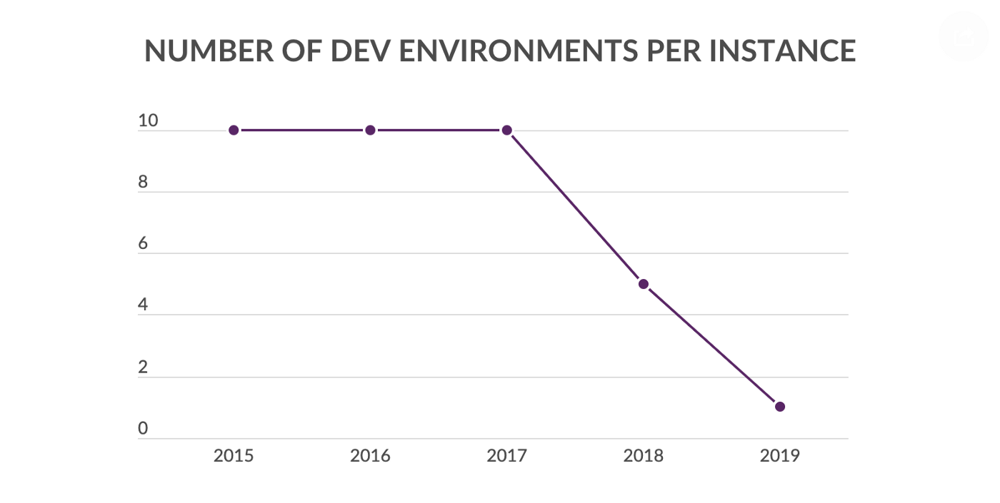

> Slack简介：Slack 是聊天群组 + 大规模工具集成 + 文件整合 + 统一搜索。截至2014年底，Slack 已经整合了电子邮件、短信、Google Drives、Twitter、Trello、Asana、GitHub 等 65 种工具和服务，可以把各种碎片化的企业沟通和协作集中到一起。2014年初拿到了4000多万美元融资之后又完成1.2亿美元的融资。其估值也达到了 11.2 亿美元，这家公司成立仅仅 8 个月，这也使得它成为了有史以来发展最快的SaaS公司。2019年6月20日晚，创业公司Slack正式登陆纽交所。2020年市值一度突破200亿美金。

> 作者：Michael Deng, 在Slack平台部们任软件工程师。他已经在Slack工作超过3年时间（截至本文发布的2020年），在这个过程中，他曾经参与了各种类型的项目，包括用户界面，API基础设施以及增长性实验项目。
原文地址：https://slack.engineering/development-environments-at-slack/

> 译者：徐磊，开源云原生SmartIDE创始人、LEANOSFT创始人/首席架构师/CEO，微软最有价值专家MVP/微软区域技术总监Regional Director，华为云最有价值专家。从事软件工程咨询服务超过15年时间，为超过200家不同类型的企业提供过软件研发效能相关的管理和技术咨询工作。

> 原文地址：[https://slack.engineering/development-environments-at-slack/](https://slack.engineering/development-environments-at-slack/)

在本文中，开发环境特指那些用于在发布软件之前进行测试的环境，这个环境与集成开发环境（IDE）比如大家常用的Eclipse或者微软的Visual Studio不同，不是同一个环境。

开发环境对我来说一直都是一个谜团。虽然在加入Slack的第一天就学习过这个环境，而且之后每天都在使用它，但我从来都没有把这个环境是如何工作的搞明白。

大概半年前，我决定把这个开发环境彻底搞明白。于是我访谈了几位Slack最资深的工程师，阅读了大量的文档以及好多年积累下来的slack聊天记录。最终我发现，Slack所使用的开发环境其实经历了一个令人惊叹的发展过程。

## 为什么我们需要开发环境？

开发环境实际上是一个完整的Slack系统的副本，而且是一个允许我们随意进行修改的副本。这个环境的核心作用就是允许开发者可以在不影响真实用户，不会造成数据损失的情况下测试我们的改动。
这个环境对于我们进行快速迭代非常重要，而且允许我们将改动发送给同事进行评审。
总而言之，开发环境的存在大幅提高了我们的开发速度和安全性。

##工作机制

Slack的开发环境实际上是运行在远程服务器上的完整Slack系统，我们使用AWS的EC2服务器来承载这些资源。这些开发环境实例运行着完整的Slack系统，包括非常多的服务以及这些服务所依赖的其他资源（比如中间件）。
每个开发环境都有自己独立的slack二级域名，我们可以直接访问这些域名就可以通过浏览器查看我们的改动。
在开发环境里面的改动不会对真实用户造成影响，因为我们使用了隔离的基础设置，比如：与生产环境独立的数据库。

图：开发环境和生产环境是完全独立的而且隔离的。

## 本地开发 vs. 远程开发

在Slack，我们使用远程开发模式，意味着我们的开发环境全部位于远程服务器上。当然，另外的选项是使用自己本地的个人电脑作为开发环境，本地电脑对于小型项目很适合，因为速度快而且不需要联网就可以工作。但是对于大型项目来说，远程开发模式提供了非常多的好处。

- 第一，我们不需要在本地部署整个Slack系统。Slack的系统架构非常复杂，有大量的服务以及依赖，无需在本地配置这样复杂的系统对于我们来意义重大。
- 第二，如果我们的改动在开发环境工作正常，那么基本上可以确保在生产环境也可以工作正常。因为我们的开发环境在配置上尽量与生产环境保持一致。当然，如果开发环境实例运行了很久，那么它和生产环境就会有比较多的差异，但即便如此，相比让开发者使用自己本地的个人电脑所带来的各种差异而言，仍然可靠的多。
- 第三，远程开发环境不依赖个人电脑，而个人电脑经常会崩溃或者卡顿。云端资源性价比更高，更加可靠而且容易扩展。特别是，云端资源允许我们使用多台服务器进行开发，而且还可以非常容易的将改动共享给其他人。

总之，随着网络越来越快和稳定，远程开发模式越来越有优势。

## Slack内部的日常开发流程

说明我们Slack内部工作流程的最佳方式是给大家展示一个示例。比如：因为某种原因，我们决定修改Slack主页的文字为全部大写的紫色Comic Sans字体。

为了完成这个任务，我们首先会创建一个特性分支（feature branch），然后使用 slack sync-dev 工具将分支和开发环境进行绑定。这个工具会随机选择一个可用的开发环境，并开始将本地的修改同步到这个环境，后续我们在本地所进行的任何改动都将自动同步到这个环境。

这个工具的底层其实使用了2个大家熟悉的工具，fswatch（检测修改）以及 rsync （同步修改）。

图：将改动同步到开发环境。

如果我们修改了前端页面，那么我们会在本地使用webpack进行构建和打包，然后运行 slack run build:watch ，这个指令会构建我们的前端资源并允许给我们通过 localhost 访问开发环境。
当我们完成开发，我们就可以直接访问上图中出现的 dev575 二级域名，我们改动就出现在远程开发环境中了。

图：右侧的首页就是我们的成果，是不是更加吸引人？

现在，我们就可以进行各种测试，调试甚至直接共享给其他人进行评审。

记住，到现在位置，我们仍然在使用我们构建的前端资源，如果我们希望在关闭个人电脑后仍然可以访问这些改动，那么就需要在开发环境中生成一个静态构建。

## 改进我们的命令行工具

让我们简单说一说这个命令行工具。在上面的实例中我已经展示了它的部分工具，就是 slack sync-dev 指令。这个工具对我们非常重要，因为它让我们的开发工具变得更快而且更加简单。

在没有这个工具之前，我们必须要手工同步改动到开发环境，这个过程非常繁琐而且容易出错。现在，我们不再需要手工操作60种不同的命令行工具，而只需要这一个工具就可以完成所有操作。

除此之外，我们还有 slack bot-me 指令，可以在开发环境自动创建一个机器人用户；以及 slack tail-dev 指令，可以将远程环境的日志同步到本地。如果你对Slack的内部工具该兴趣，可以参考我们2016发表的博客：构建内部工具是一件快乐的工作。

## 开发环境扩容历程

在2014年，我们只有一个开发环境，所有人都使用这一个开发环境。如果有人把环境搞坏了，其他人都只能停工。在当时，这并不是太严重的问题，但是随着slack变得越来越庞大，我们增加了越来越多的环境。到2019年底的时候，slack内部在同时维护550个开发环境，基本上每一个slack开发者都有自己独立的开发环境。

但是，这个于是并没有继续下去，实际上在2020年这个趋势被彻底扭转。在具体解释这个变化之前，让我先来展示以下这个图表：单个虚拟机所承载的开发环境数量。

这个数字在持续下降的原因是我们希望隔离每一个开发环境实例。因为当多个环境共享同一个虚拟机资源的时候，任何一个开发者所运行的复杂操作都会影响其他开发者的正常工作。

这带来一个副作用 - 当我们减少每个虚拟机所承载的环境数量的时候，我们就必须使用更多的虚拟机，这意味着更多的费用。同时，因为这些环境都需要被管理和维护，随着环境示例数量的增长，维护这些环境也带来了大量的开销。更糟糕的是，环境实例运行的时间越久，就越不稳定而且会积累大量和生产环境的差异，变得不适合使用。

为了解决这些问题，我们构建了一个可以动态按需初始化开发环境的系统。这个系统让上图中疯狂增长的环境数量得到了有效的控制。我们不再同时运行几百个开发环境示例，而是在需要的时候动态初始化一个给到开发者。而当开发者完成测试以后，这个实例就会被自动销毁掉。这个系统让我们可以更加高效的管理我们的开发环境。我们将在后续的博客中详细说明我们是如何做到的。

---

> 设计精良的开发环境对于任何一个科技企业的成功至关重要。在Slack，我们的开发环境，我们的工具和基础设施正在向着全面自动化和可扩展的方向发展。