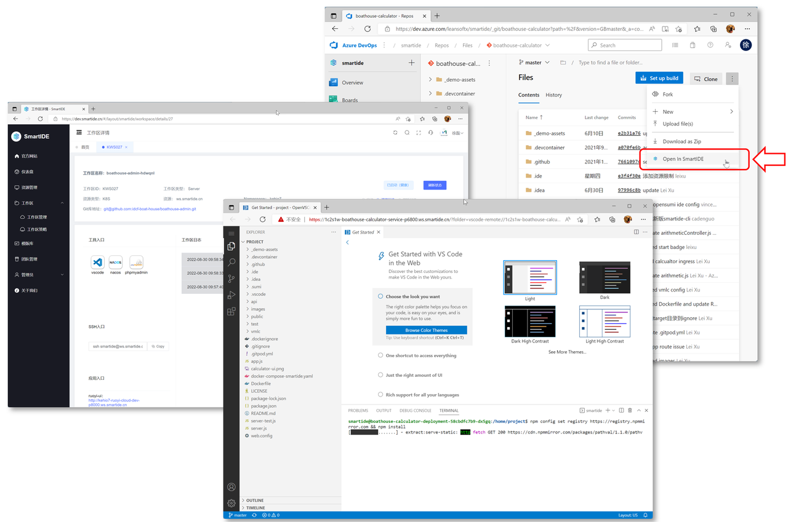

Smart Meetup已经在上周二（2022.9.13）重新启动，后续我们将在每周二晚8点30分和大家见面。Smart Meetup得目标是持续为大家输出云原生IDE相关得最佳实践，并不局限于介绍SmartIDE自己的特性和功能，而是希望能够从软件工程的角度为开发者提供帮助。以下是我们当前规划的一些方向，希望各位小伙伴多提意见和建议：

- SmartIDE 特性介绍 - 按照我们的发版周期，每隔2周都会发布新版本给社区，我们会通过这个Meetup为大家介绍这些新特性，帮助大家尽快的将新功能用起来。
- 开源项目推荐 - SmartIDE的一个重要特点就是帮助开源社区的小伙伴快速的体验新项目，我们会继续这个做法，为大家喜欢的开源项目适配 IDE配置文件，并在Meetup为大家展示这些项目的能力。之前我们已经适配过的项目包括：若依项目、Gin-Vue-Admin和飞致云的Metersphere。
- 云原生相关技术分享 - 作为一款云原生IDE，SmartIDE不仅会利用云原生技术让开发者的工作变得更加简单高效，也同样在践行着各种云原生开发实践，比如我们之前就介绍过如何使用SmartIDE来开发调试Dapr应用。后续我们会继续这个方向的摸索，并将最棒的云原生开发实践推介给大家。
- 敏捷/精益/DevOps/研发效能相关实践和案例分享 - SmartIDE的定位是成为DevOps和开发者的桥梁，那么我们的Meetup也同样会承载类似的职责。我们会不定期的邀请行业内的专家大咖来给大家分享各种最佳实践和案例。

另外，在每一期的活动上我会邀请一位观察员，从用户的角度给予一些反馈，提出一些问题，帮助我们打磨产品，拓展使用场景。

# S01E03 回顾

> - 时间：2022.9.13 晚20:30 
> - 主持人：徐磊
> - 观察员：施慧斌、FIT2CLOUD北区解决方案负责人

上周的Meetup距离之前的活动已经有了一段时间，因此我们首先对SmartIDE的一些进展给大家做了介绍，然后针对 Codespaces for Azure DevOps 插件进行了重点介绍。这次Meetup我们也邀请到了FIT2CLOUD北区解决方案负责人施慧斌作为观察员参与了整个演示。

## CodeSpace for Azure DevOps 插件

SmartIDE产品定位于开发人员的的DevOps入口，基于这个定位我们在微软的DevOps平台Azure DevOps上进行了首次尝试。通过在Azure DevOps的电子看板，代码库，流水线和拉取请求的不同位置提供一键创建云端工作区的入口，为开发和测试人员提供快速稳定获取可用环境的入口。这个插件充分利用了SmartIDE的标准化环境编排能力，将原本静态的开发环境转变为随用随起，用完即焚的临时性环境，让原本很重的环境管理编程一键非常轻量而且便捷的事情。

对于用户而言，可以利用以上能力解决一些日常开发协作中的问题：

- **特性分支规范化：** 特性分支是当前软件开发团队普遍使用的一种分支模型，要求开发人员根据不同的开发任务拉取独立的特性分支，并在这个分支上完成所对应任务的开发工作，起到聚合和隔离代码变更的作用。特性分支对于大型团队隔离不同特性之间的相互影响，做到灵活控制上线周期和发版方式来说效果非常明显。但是特性分支在企业落地中普遍存在几个问题：1）特性分支命令不规范，因为分支需要开发人员自己创建，经常会出现各种不规范的分支名称增高管理成本；2）代码夹带，很多开发人员认为特性分支操作太繁琐，经常会为了省事儿把多个特性在一个分支上一起开发，这样会造成后续发版过程中无法拆分清楚代码，造成未经审核的代码被夹带上线，严重的时候可能造成生产问题；3）操作流程复杂造成的误操作，特性分支要求开发团队具备非常严格的流程执行纪律，特性分支到发布分支再到主分支的合并过程不能随意跨越，但实际操作过程中很多团队并不能很好的执行这个流程，教育和培训成本都很高。这些问题的根源在于，git分支操作过于灵活并且可以在开发机本地完成，使得这个流程无法完全在线上闭环完成。使用云原生IDE之后，可是实现整个编码开发过程的线上化，不再依赖开发人员本地环境，实现完整的流程线上化闭环。
- **测试环境独立化：** 测试环境的获取一直都是软件测试流程中的一个难题，受限于企业资源和自动化能力问题，大多数的开发团队仍然依赖开发人员手工部署测试环境。对于测试来说，最好能够给每个测试目标都提供独立测试环境，比如：手工测试应该针对每个测试人员的每个测试轮次提供，自动化测试应该针对每个被测版本的每个测试轮次提供。考虑上测试环境被测试用例污染的问题，还需要提供快速重置测试环境的能力。传统模式下，以上这些问题都没有特别好的解决方案，关键问题在于2个环境标准化能力不足（IaC实践没有被引入到开发测试阶段）和资源限制（容器化实践没有被引入到开发测试阶段）。使用云原生IDE，随用随起，用完即焚的环境调度能力可以有效解决标准化的问题，VMLC能力可以有效应对资源限制问题。开发环境独立化问题得到完美解决。
- **基于代码评审上下文的临时环境：** 拉取请求时有效的代码评审机制，但是代码库所提供的拉取请求只能帮助评审者比较代码，无法帮助评审者从功能的角度验证代码的正确性。虽然CI/CD流水线中可以嵌入各种质量门禁，但是都无法让评审这从用户的角度了解应用行为的正确性。使用云原生IDE我们可以针对代码评审的上下文创建一个临时的让评审者可以直接进行操作，从用户的角度进行验证功能，辅助完成代码评审过程。

以下是本次Meetup的视频回访，Codespaces for Azure DevOps的演示部分在视频的43分钟开始。



另外，以下视频中也对这个插件进行了完整的演示和介绍



# S01E04 预告 - CLI 详解

> - 时间：2022.9.21 周三晚20:30 （本周特殊原因临时改在周三）
> - 观察员：衣明志，烟台易云网络创始人/资深.NET开发者/前微软最有价值专家MVP
> - 主题：SmartIDE CLI 详解

本周的Meetup将围绕SmartIDE的使用场景展开，CLI是SmartIDE产品架构中与其他类似产品最大的差异。大多数CloudIDE都会提供CLI工具，但是这些CLI都是作为辅助性工具存在的，也就是说用户使用CLI连接到CloudIDE服务来完成类似端口转发，如果脱离的CloudIDE服务，这些CLI本身是无法单独使用的。

SmartIDE的CLI则不同，用户可以使用CLI直接创建、停止，删除，清理远程/云端工作，这个过程无需CloudIDE服务（SmartIDE Server）的存在。

这样设计的目的是为了方便个人开发者可以非常轻量的管理自己的远程/云端工作区，无需预先部署Server。这样，个人开发者可以在需要的时候使用一个 smartide start 指令即可在任何资源上启动远程/云端工作。

从开发和调试的角度来说，CLI工具的迭代速度是带有WebUI或者API类型的应用无法比拟的。因为CLI极度简单的操作方式，我们无需处理界面的布局，美观，操作体验，各种边界条件等问题，可以专注于业务目标的实现。这种快速迭代能力让我们可以更早的触达用户，验证产品核心功能并及时调整产品方向。在过去的6个月，CLI的发布速度是平均每天3.8个版本。

CLI封装了管理远程/云端工作区的所有能力，这让用户利用CLI来搭建自己的CloudIDE系统，实际上SmartIDE Sever 本身就是这样工作的，通过将 CLI 打包成 tekton流水线任务，SmartIDE Server 的所有工作区操作都不会直接调用虚拟机或者k8s集群，而是通过CLI来完成。借助CLI的快速迭代特性，我们的Sever开发人员可以更加专注于用户体验和企业级功能，而不用关心底层工作区调度问题。
对于希望构建企业内部CloudIDE平台的组织来说，利用CLI的这种可集成特性，可以非常快速底层本的完整平台的搭建，不用去关注与虚拟机以及k8s集群进行操作的细节问题。

我们当前已经提供了gitlab-ci的集成示例，未来我们会提供更多各种类型的DevOps系统场景。

## Meetup内容

本次Meetup将详细演示以下操作：

- SmartIDE CLI 安装和基本操作
- 使用 start 指令在本地，远程主机和k8s集群上启动远程工作区
- 使用 host 指令将Linux主机注册为开发环境
- 使用 list/start/stop/remove 指令管理远程工作区生命周期
- 使用 new 指令从预制的开发环境模板启动新开发环境
- 使用 init 指令对现有代码库进行初始化，自动完成 IDE配置文件 的生成和适配
- 使用 login/logout/connect 为Server工作区提供端口转发支持
- 辅助功能指令 config/version/reset/debug
- 第三方系统集成：在 gitlab-ci 中集成smartide cli实现云原生IDE调度能力

## 报名方式

扫描海报中的二维码通过B站直播间预约

## 直播抽奖

- 一等奖1名：JetBrains全系列产品激活码（价值1500元）
- 二等奖2名：SmartIDE 文化衫

