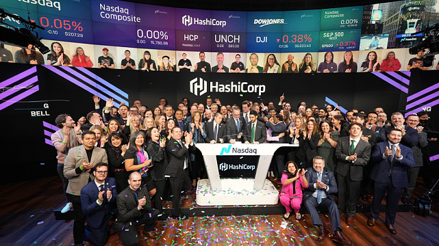
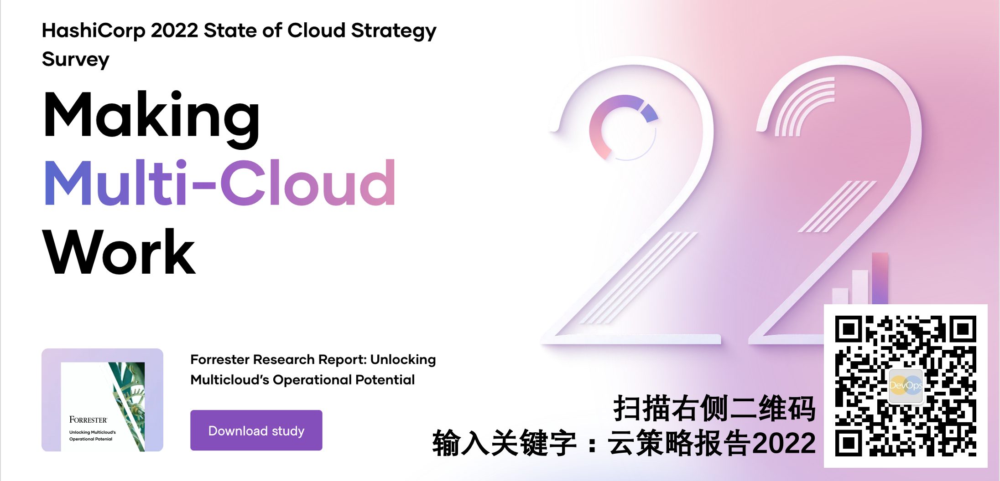
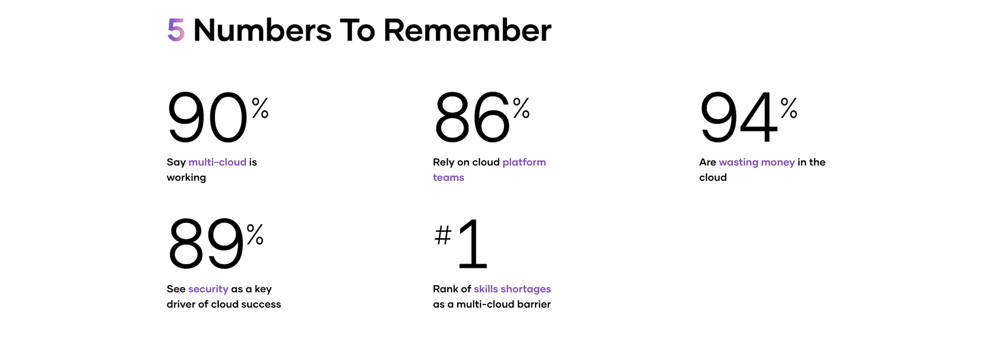

> 本文是译文，原文地址 https://www.hashicorp.com/blog/hashicorp-state-of-cloud-strategy-survey-2022-multi-cloud-is-working

# 有关 HashiCrop 

HashiCorp是由Mitchell Hashimoto和Armon Dadgar联合创办，总部位于美国旧金山，致力于为企业提供服务，通过数据中心管理技术研发，让开发者通过工具构建完整的开发环境，提高开发效率。HashiCorp提供了大量的DevOps 基础设施自动化工具，集开发、运营和安全性于一体，可以帮助开发者编写和部署应用程序，加速应用程序分发，助力企业提升开发效率，包括：Vagrant、Packer 、 Terraform 、Serf 、Consul , Vault 和 Nomad 等。

2016年9月，HashiCorp 获得2400万美元的 B 轮融资，由GGV Capital 领投，Mayfield 、 True Ventures 和新投资方 Redpoint 参投。截至目前2016，该公司共融资3400万美元。2021年12月9日，美国云开源软件公司HashiCorp登陆纳斯达克，市值153亿美元，是迄今为止今年全球市值最高的开源IPO。

> HashiCrop和Forrester通过调研得出的结论：90%的企业通过多云策略和专业的云平台团队取得成功；但安全、员工技能和费用管理仍然是非常大的挑战。-- 《2022企业云策略现状调研报告》

第二份《企业云策略现状调研报告》已经发布，非常清晰的显示了以下结论：

- 更多的企业正在采用多云策略
- 组建专业的云平台团队对于企业的云策略取得成功至关重要

这些结论延续了我们2021年的首次调研的结论，今年的调研结果更加清晰的显示了多云战略，云安全性以及缺少专业技能正在影响着企业利用云计算的能力。2022年报告中的新发现是，专业的云平台团队正在组织中扮演越来越重要的角色，以及很多组织正在云平台的使用上浪费大量金钱。

我们在2022年的调研报告中引入了Forrester咨询作为调研机构，我们调查了超过1000个千人以上的大型组织的决策者和关键角色，这些被调研对象覆盖了全球的不同行业的组织。今年的报告
全文可以通过以下网址获取：

- https://www.hashicorp.com/state-of-the-cloud

您也可以扫码关注DevOps公众号，并输入：云策略报告2022，即可获取PDF版本的报告全文。

以下数据展示了本次报告中的关键结论，5个关键数据

- 90%的受访者认为多云战略可行
- 86%的受访者依赖云平台团队执行多云战略
- 94%的受访者认云资源使用中存在浪费
- 89%的受访者认为安全是决定云战略成功的关键因素
- 员工的云技能缺失是企业执行多云战略的最重要的障碍

# 云平台团队对执行多云战略非常有帮助
报告显示，81%的受访者正在使用多个云平台，或者计划在未来一年中采用这种策略。但这并不是真正的中带你。更重要的是，在这些采用了多云策略的组织中，90%的受访者认为这种多云战略已经对他们实现商业目标有所帮助。虽然我们的调研方法有所变化，但是相比于2021年的结果仍然是一个巨大的跃升，因为在2021年这个比例仅为53%。

多云战略之所以能够取得成功，与专业化云团队的增加很有关系，一般来说这些团队被称为 云平台团队 或者 云技术中心。受访对象中10家中有9家都有类似的职能存在，而在那些没有设置类似
职能的组织中，仅有四分之一在使用云而且他们并不认可云的价值。

这背后的原因应该是由于云团队为组织提供了很多关键能力。云团队的主要职能就包括：让云服务变得标准化，构建和共享最佳实践以及实现云安全/合规的集中管理。超过四分之三的受访对象依赖云团队完成被调研的全部15项职能。这些职能包含了非常多的关键能力，比如：构建云管能力和运维策略，开发和推广云最佳实践，构建云解决方案以及云运维操作。

# 安全、技能和费用管理仍然是重要挑战
当然，多云策略仍然充满挑战。90%的受访对象对于云安全非常担忧，并将安全列为第一优先级，甚至超过了可用性指标。下面一项关注点是员工的云技能短板，41%的受访者认为这是阻碍他们实现多云战略的关键障碍。正是因为云技能人才的紧缺，才使得 云平台团队 变得更加重要，因为这样企业可以最大化具备云技能的工程师的作用。

另外一个同等重要的挑战就是费用，仅有6%的受访对象认为他们的费用管理已经没有可提升的空间。剩下94%的受访者都被各种浪费所困扰，包括66%来自资源空转/无人使用，59%来自超规格部署以及47%来自员工技能缺失。从乐观的角度来看，仅有24%的受访对象在云费用上超支，因此至少大多数组织在云资源预算控制上做的还不错。

# 来自Forrester的关键建议
2022年的调研报告是HashiCrop和Forrester一同完成的，调研范围扩展到了HashiCrop的客户之外，并且提供了更加中立的分析和建议。你可以通过我们的报告官网下载完整版报告，以下列出了Forrester给予企业的一些关键建议。

- **为你的业务量身定制多云战略** - 多云战略有多种形式，Forrester建议企业管理者根据自己企业的情况考量哪种战略更加适合，并想清楚选择原因。
- **引入自动化对于减少浪费和提升效率非常重要** - 来自Forrester的建议：“引入自动化工具对于企业提升云资源利用率以及优化ROI（投入如产出比）非常有效。自动化不仅仅能够有效减少浪费，还能从整体上降本增效。”
- **充分利用自动化的安全工具来支撑多云战略** - Forrester 建议组织 “充分利用自动化工具不仅仅可以节省运维团队的时间，还能帮助解决非常复杂的IT问题，优化云资源成本，监测并消除安全隐患。”
- **构建全功能的云平台团队** - Forrester认为 “云平台团队可以帮助组织更好的推动多云战略的安全、管控、规范和框架、内部培训、云技能认证在整个企业的落地实施。” 同时也要意识到企业文化对于构建一个成功的云平台团队非常重要。

# Meetup预告

> 本周二晚8点30分，SmartMeetup S01E05精彩继续，本期主题：搭建私有CloudIDE服务，扫码预约直播，千万别错过

现场还有抽奖

- 一等奖，价值3500元的JetBrains全系列激活码
- 二等奖，SmartIDE文化衫

