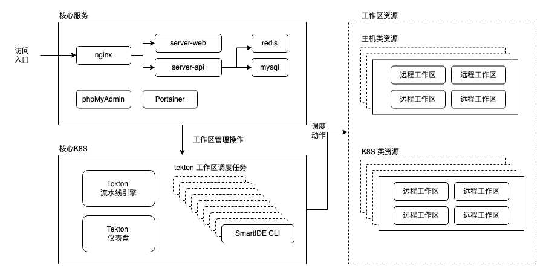
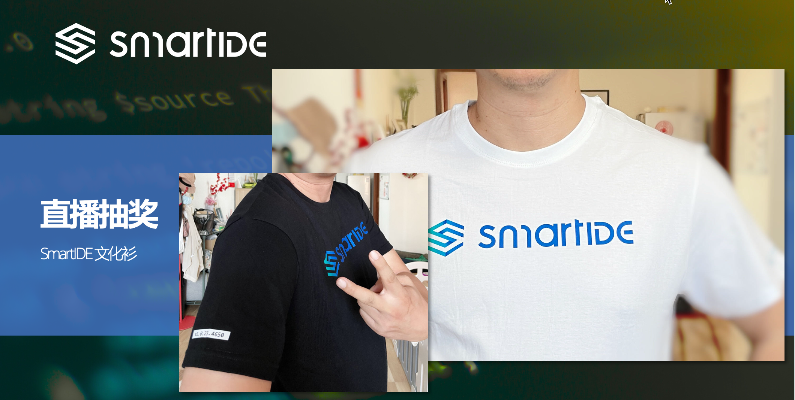

# S01E04 - CLI使用详解 回顾

> - Meetup 时间：2022.9.21 晚20:30 （临时调整在周三） 
> - 主持人：徐磊
> - 观察员：衣明志，烟台易云网络创始人/资深.NET开发者/前微软最有价值专家MVP

在上周的Meetup上，我们邀请到了来自烟台易云网络创始人衣明志作为观察员参与我们的活动。我们对SmartIDE的核心模块CLI进行完整的介绍，为大家展示了以下场景：
- SmartIDE CLI 安装和基本操作
- 使用 start 指令在本地，远程主机和k8s集群上启动远程工作区
- 使用 host 指令将Linux主机注册为开发环境
- 使用 list/start/stop/remove 指令管理远程工作区生命周期
- 使用 new 指令从预制的开发环境模板启动新开发环境
- 使用 init 指令对现有代码库进行初始化，自动完成 IDE配置文件 的生成和适配
- 第三方系统集成：在 gitlab-ci 中集成smartide cli实现云原生IDE调度能力
下面是S01E04的视频回放，大家可以关注我们的B站频道

# S01E05 - 搭建开源免费的私有CloudIDE环境

> - Meetup 时间：2022.9.27 周二晚20:30  
> - 主持人：徐磊
> - 观察员：周文洋，LEANSOFT研发总监/资深DevOps顾问/前微软最有价值专家MVP

本周二的 Meetup 我们邀请到来自 LEANSOFT的研发总监周文洋作为我们的观察员，周文洋曾经参与多家大型企业的DevOps实施咨询，也是《专业SCRUM - 基于Azure DevOps的敏捷实践》的主要译者，他的客户包括博时基金、浦发银行、华为等多家大型企业。

这次的 Meetup 我们将围绕 SmartIDE Server 这个产品组件展开，SmartIDE Server 是面向团队和企业的云原生容器化远程工作区管理平台，可以为开发团队提供统一的开发测试资源管理，基于浏览器的开发环境访问以及团队协作能力。SmartIDE Server 的 团队基础版 功能是开源而且免费的，任何人都可以按照本手册所提供的方式完成部署并免费使用，没有使用期限限制，没有用户数限制，也没有资源数量限制。

下图展示了 SmartIDE Server 的部署架构

下图展示了一个 SmartIDE Server 的云端工作区，同时支持使用多种方式进行连接

- VSCode WebIDE 浏览器接入
- JetBrains Gateway 远程接入
- 命令行终端直接接入

我们将现场完成以下场景的演示：
- 使用一台云端虚机完成 SmartIDE Server 的一键搭建过程
- 将Linux主机和Kubernetes集群注册到 SmartIDE Server
- 通过模版启动预置的开发环境
- 使用代码库URL启动项目开发
- 在Kubernetes工作区中嵌套运行 Docker 和 Kubernetes 进行云原生开发
- 在iPad上使用云端工作区

## 直播抽奖

一等奖：价值3500元的JetBrains全系列IDE激活码一个

二等奖：SmartIDE文化衫两件

立即扫码预约直播

