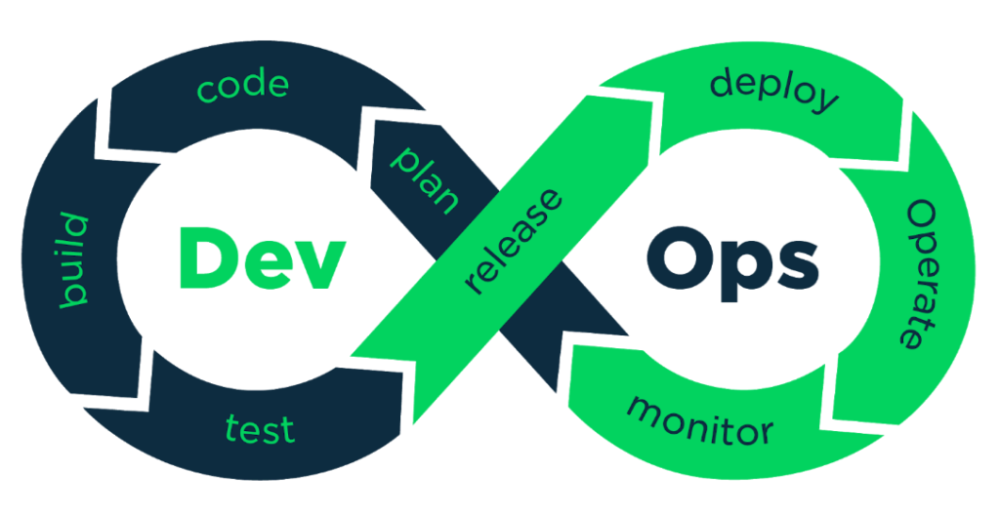
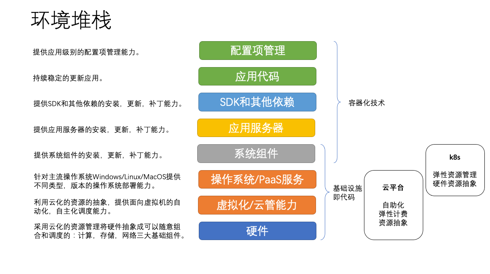
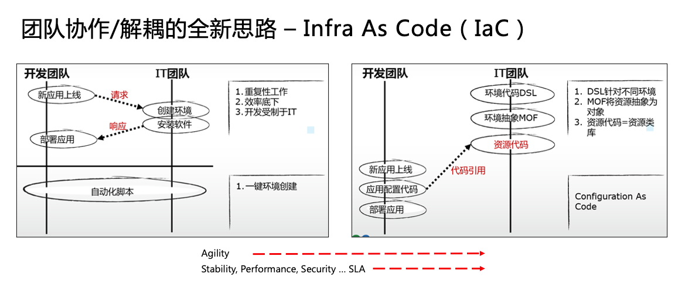
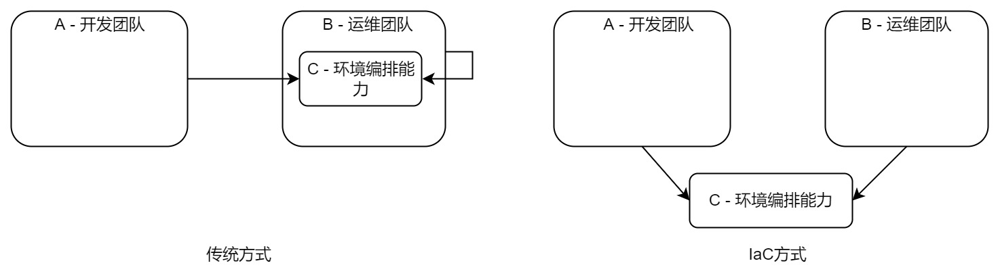

作为现代软件工程的基础实践，基础设施即代码（Infrastructure as Code, IaC）是云原生、容器、微服务以及DevOps背后的底层逻辑。应该说，以上所有这些技术或者实践都是以基础设施即代码为基本模式的一种或者多种方法的集合。基础设施即代码并不是一种特定的技术，而是一种解决问题的思路。本文将从基础设施即代码的含义，原则和落地方法三个层面来帮助你理解为什么没有使用IaC的DevOps系统都是耍流氓。

## 什么是IaC

基础设施即代码的目标是解决一个古老的问题：如何能够安全、稳定、快捷、高效得完成软件交付过程。注意这里的交付并不仅仅指将可部署的软件部署到最终的运行环境，而是更宽泛的概念上的交付，也就是将软件从一个看不见摸不到的想法或者创意，转变成用户可以操作并使用的一个系统。这个过程涉及软件创意的捕捉、设计、计划、开发、测试、部署和发布的全过程，也包括软件发布之后收集用户反馈重复启动以上过程的迭代。这个迭代在软件的整个生命周期里面会一直重复下去，直到这个软件不再有人使用，寿终正寝。

软件生命周期中的这个持续的迭代过程构成DevOps反馈环路的概念，在这个反馈环路的左右两端分别是Dev和Ops，而代码和基础设施正是Dev和Ops最重要的工件（Artifact），Dev维护代码，Ops维护基础设施。传统意义上，代码和基础设施是有明确的界限的，一般来说：代码特指应用代码，而基础设施则是除了应用以外（或者以下）的所有“基础”组件。

在云计算技术出现以前，硬件被普遍认为是一旦创建就无法改变的，就好像你购买一台电脑，如果希望更换其中的CPU，内部，磁盘以及网卡，那么都必须重新购买相应的组件并重新组装。云计算将计算资源（电脑）解偶成了可以随意组合的计算、存储和网络三种资源类型，允许用户根据需要自助的进行组合。其底层实现机制是将硬件软件化，比如：对象存储技术和软件定义网络（SDN）就是云计算的基础技术。硬件被软件化之后的结果就是我们可以通过配置来变更硬件的能力。这其实就是基础设施即代码的最基础的含义。

但是对于用户而言，其实并不关心所使用的软件到底运行在什么硬件，什么云上面。比如：对于用户的社交需求来说，微信就是社交需求的基础设施；对于需要编写文档的用户来说，WORD就是他的基础设施。相对于硬件，这其实是基础设施的另外一个极端含义，也就是：任何支撑用户完成某种操作的支撑能力，都可以成为用户这一类别操作的基础设施。

从这个极端含义的角度来说，以上环境堆栈中的任何一层都可能成为上层的基础设施。为了能够为上层提供类似云计算的自助化能力，都需要提供可配置性。为了满足这种可配置性的需要，IT行业里面就出现了容器化技术、Kubernetes、Terraform、Azure Resource Manager等等基础设施即代码的实现方式。其实这些技术解决的都是一个问题，也就是系统的可配置性问题。

## IaC的实现原则

实现可配置性能力的方法很多，传统运维的做法其实很简单，就是通过脚本来自动化这个配置过程，让原本繁琐的配置过程自动化起来。

自动化脚本的方式虽然能够在一定程度上解决可配置问题，但是当系统变更频繁程度到达一定量级的时候，维护自动化脚本的工作量将会抵消自动化脚本所带来的效率提升，这个时候运维团队会发现采用人工处理的方式甚至比编写和维护自动化脚本更加高效。因此，在当今软件迭代速度越来越快的背景下，自动化脚本逐渐无法满足团队应对快速变化的市场的需要。我们需要一种能够能够允许团队轻松适应快速变化的环境维护方式，基础设施即代码（Infrastructure as Code, IaC）就是在这样的背景下诞生的。实际上，说诞生并不准确，IaC其实是工程师们在遇到问题之后持续改进的结果。

当维护自动化脚本的方式无法适应快速变化的市场需要的时候，如何让开发和运维团队解偶就变成了解决这个问题的核心。在上图左侧的工作模式中，问题的核心是开发和运维团队之间基于“请求-响应”的工作模式，这种工作模式让开发和运维团队相互依赖，无法独立的按照自己的节奏工作。为了解决这个问题，IaC借用了大规模软件架构设计中的分层原则，让那些需要被共享的能力变成通用组件，并在开发和运维之间共享这些组件，从而让本来互相依赖的两个团队变成依赖另外一个第三方组件。如下图：

为了能够通过第三方组件协同工作，IaC方式需要遵循几项关键原则

- 声明式（Declarative）：为能够让所有编排能力独立于开发和运维团队，任何一个团队都不应该将能力的具体操作保留在自己的团队中，采用声明式配置可以确保这一点，因为配置中只有声明没有具体逻辑，就意味着原来的依赖双方都必须将公用能力贡献出去，否则上图中的C就无法生效。

- 幂等性（Idempotence）：进一步来说，声明式配置必须能够在任何时候确保环境编排的结果，也意味着通用组件C中对于环境的操作必须能够在任何状态下执行并且获得一致的最终结果。换句话说，无论目标环境处于初始状态，中间状态，最终状态还是错误的状态，当加载声明式配置以后，都会变成我们需要的理想状态（Desired State）。
## IaC的落地方法

从本质上来说，IaC是一种做事情的方法，实现IaC的方法和工具只要遵循以上原则，都可以帮助团队落地这种方法。在实际工作过程中，我们需要一些基本条件才能够实现IaC：

### 文化支撑

落地IaC将改变团队（特别是开发和运维团队）的工作模式和协作方式，双方的工作边界和职责都会发生变化。传统模式下，开发和运维团队通过流程进行协作，双方在需要对方配合的时候发起一个流程（发出请求），等待对方按照要求完成操作（给出响应）之后继续这个流程直到目标达成。而IaC则要求双方通过共享能力进行协作，双方需要持续发现协作中阻碍对方独立工作的问题点，一起将解决这些问题的能力贡献给另外一个双方共享的组件（一般是一个工具），在日常工作中不再依赖流程驱动对方，而是使用这个共享的组件（工具）完成工作。IaC的工作模式要求两个团队都接受不确定性思维方式，出现问题的时候要共同解决问题而不是界定和追究责任。如果团队中的文化不允许这种不确定思维方式的存在，IaC将无法落地。

### 共享工具

具备以上文化支撑的团队，需要共同构建一个双方都认可的工具，将双方都需要的环境编排能力全部封装到这个工具中。这个工具的核心目标有两个：

- 解偶：让双方在日常工作中不再依赖对方，可以按照自己的节奏和工作模式自由的使用，同时确保双方关注的标准，规则和策略都可以被正常落实并可以被监督。

- 可定制可演进：这个工具存在的目的就是为了能够适应不停变化市场需要，一个静态的工具是无法做到这一点的，只有那些具备了高度可定制性和扩展性的工具才有可能具备这样的能力。因此在设计和实现这个工具过程中做到功能粒度的控制就变得至关重要，如果所有的功能都按照日常业务流程设计，不考虑通用性，最终的结果就是任何的工作流程变更都会造成工具的变更，这样的工具也就失去了通用组件的存在价值。

## IaC无处不在

实际上，云原生，微服务，容器化和DevOps都是在从各个不同的层面践行IaC。云原生强调利用云的基本特性赋能团队，其实就是利用上述云计算的底层技术为团队提供实现IaC的基础条件。微服务则是通过组件化的思维让多个团队可以独立自主的工作，不再受到其他团队的影响从而最大化团队工作效率。容器是在云计算技术的基础上，为操作系统以及其上层的环境堆栈提供IaC能力，包括Docker和Kubernetes为代表的主要容器工具都是基于声明式配置和幂等性原则设计的。

DevOps在这里又是什么呢？DevOps是以上所有这些概念，方法和实践的综合，实际上DevOps的范畴比这个还要宽泛。开头的那张图上你应该可以看到，从广度上来说，围绕Dev和Ops构成的这个无限环其实涵盖了软件交付过程的所有环节，从深度上来说，DevOps又可以涵盖文化理念、管理方法、商业创新、敏捷和精益、项目管理、团队管理、技术管理和工具实现的全部层次。以至于越来越多的人将越来越多的内容放在DevOps这顶帽子下面，出现了诸如：AIOps, GitOps, TestOps, DevSecOps, BizDevOps等很多扩展概念。

其实，我们不必纠结这个概念本身，因为来自于社区自发总结的DevOps本来就没有一个集中的知识产权所有者，也就没有人能够给予它一个明确的释义。这本身其实也是一件好事，因为就如同以上对IaC的分析解释一样，DevOps的存在也是在帮助我们持续改进的，如果它本身变成一个静态的方法集或者工具包，又如何能够适应当前不断多变的商业环境和市场需要呢？从这个角度来说，所有那些希望将DevOps进行标准化的所谓认证，体系和方案其实都是一种带有误导性的行为。

> 很多的企业在引入容器技术，微服务，云原生以及DevOps的过程中仍然在延续原有部门结构和工作流程，并且试图将这些新技术新方法融入到现有的流程中，而不是探索新技术新方法带来的全新可能性。我在过去十多年帮助企业实施落地DevOps的过程中遇到了太多类似的组织，其中最明显的表征就是你会发现那些推动DevOps实施落地的部门不停的界定责任，造锅甩锅，那么他们一定是在用DevOps耍流氓。以上我所描述的IaC的工作思路对这些人来说从来都不重要，他们不在乎问题出现以后的根源分析和改进措施，相反如果根源分析的结果让锅到了自己头上，那么宁可不分析；如果改进措施的结果是需要自己将一部分职能贡献出去，那更加不能做。最后的结果就是那个“共享工具” 里面埋藏了各种补丁，硬编码流程以及技术债务，可想而知这样的工具又如何能够承载不确定性，如何能够帮助其他部门提高效率，更不要提为组织提升总体效能了。对了，这个埋藏了大量定时炸弹的工具就是你们热衷的那个“一体化研发平台/DevOps平台”。