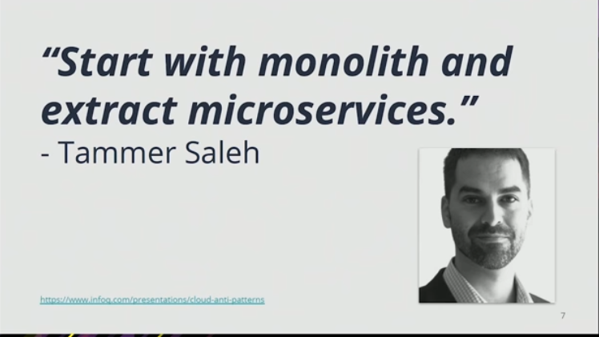
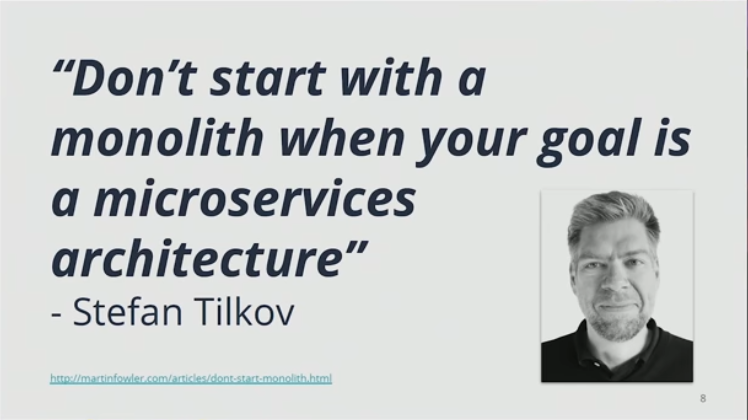
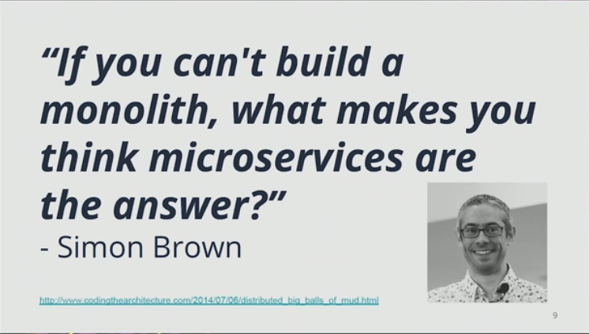

最近InfoQ上的一篇文章火了 [DevOps 已死，平台工程才是未来](https://mp.weixin.qq.com/s/c1p3PlLMeVAgjHMvUGja7g)，事实证明标题党确实对营销很有效，但这也确实只是一篇营销文章而已，文章内容其实和标题大相径庭。这个标题极具误导性，文中作者的核心观点：开发者不想跟基础设施打交道，企业在发展过程中又需要控制自己的基础设施。只有平台工程，能将这两个相互矛盾的命题统一起来。看上去非常有道理，但是在我仔细研究了原文之后发现其核心观点本身其实不攻自破，就连作者自己的文章之中也在不停的引用各种DevOps中已经存在的实践和方法，同时承认这些方法实践的有效性。

## 平台工程的来源和定义

作为IT行业研究的权威机构，Gatner在2022年8月发布的 Hype Cycle for Emerging Tech （技术趋势发展曲线）中提到了这个词汇：平台工程 Platform Engineering，从其所处的曲线位置大家可以判断这是一个将在2-5年内快速流行的技术。

平台工程社区的发起人 Luca Galante 在 [platformengineering.org](http://platformengineering.org/) 对平台工程的描述（定义）是这样的：

> 平台工程是一门设计和构建工具链与工作流的学科。这些工具链和工作流可以为云原生时代的软件工程组织提供自助服务功能。平台工程师提供集成化产品，通常称为“内部开发平台（Internal Developer Platform - IDP）”，可以涵盖应用程序整个生命周期的所有操作需求。

这里面的关键词有2个：自助服务和内部开发平台。平台工程的目标其实是为企业构建一个协助开发者完成软件交付过程中与核心业务逻辑开发无关的支撑类操作的平台。从这个角度来看，我相信大家一定感觉非常的不陌生。

实际上，在我从事软件工程 / 敏捷 / 精益 / DevOps 咨询服务将近20年的过程中，我所服务的所有开发团队都在构建这样一个平台。

## DevOps真的死了吗？

对于这个问题，一句中国的古诗可以描述得非常贴切：

> 春蚕到死丝方尽，蜡炬成灰泪始干

如果企业没有在软件工程上下真功夫，没有敏捷和精益的方法指导，没有实施DevOps实践的经验积累，平台工程也只能是空中楼阁。实际的情况是，很多企业在不停的寻找所谓“创新”而忽略了基本功的锤炼。真正企业需要的研发系统，一定不仅仅是DevOps工具就能覆盖的，但没有DevOps也一定是不能覆盖的。

我记得曾经在上海拜访过某国有大型银行的研发中心，交流的主题是高大上的企业研发效能平台，当时参与交流的几位关键领导之外还有1位负责项目发布上线的工程师，在领导们介绍了他们当前的各种实践之后的感觉这是一个相当成熟的DevOps团队，流水线仪表盘都做的很到位，度量数据丰富扎实，MTTR看上去走势良好 ...... 但是场面在这位工程师回答了我一个问题之后急转直下，我的问题是：你所负责的系统，如果你不来上班，其他人可以正常发布吗？答案是：不能。后来我觉得，跟领导交流还是要纯粹一点，让懂技术的人参与进来肯定会带歪主题。

这其实是大多数企业在落地DevOps研发效能时候的通病，光鲜亮丽的仪表盘背后其实是人力发电的空调系统。其实DevOps的各种所谓文化，理论，实践都基于一个最基本的逻辑，就是基础设施即代码IaC。对于IaC的理解我们不能仅仅停留在字面意义上，其真正推动的其实是一个共享，协作，抽取共性的工作模式。有关IaC的详细分析，可以参考我的另外一篇博客：没有使用IaC的DevOps系统都是耍流氓。

很多企业还没有做好最基本的配置管理，分支管理，开发环境管理就开始要搞什么灰度发布，微服务架构。其实一个DevOps系统完全可以简单到一个 shell 脚本，当然也可以复杂到需要200人的团队去维护。关键是要回到问题的本质，软件研发只是手段，不是目的，做出来的软件是给用户用的，不是拿来跑流水线做自动化测试出指标看度量数据的。如果一个工具平台，不能让开发者获得自由，反而增加了各个角色之间的耦合，那么这种平台还不如没有。在那些被PMO吹上了天的DevOps平台过级认证的背后，我看到的是这些企业内部开发人员的怨声载道，本来可以简简单单，清清爽爽的开发，测试上线，现在变成了一堆高大上的平台，系统里面繁琐得找不到 “下一步” 按钮的流程。

DevOps可以死，在它燃烧掉所有的价值能量之后，在企业真正吸收了这些知识和实践之后，这时候真正可以锤炼抽取出对开发者有用的这样一个平台的话，那么也是死得其所。

## 一定要警惕专家

埃隆马斯克曾经在一次采访中说过：对于任何的需求都要谨慎，特别是那些来自所谓专家的建议，因为你可能因为他们的身份而停止了自己大脑的运转。
看看下面这几位专家的建议，我只能说：你们长的这么帅，我只能相信你们了。

Tammer Saleh: 从单体开始，逐步抽取出你的微服务

Stefan Tilkov：如果你的目标是微服务架构，那么就不要从单体开始

Simon Brown: 如果你做不出一个单体应用，你觉得你能搞定微服务吗？

## 开发不想做运维

回到作者的核心观点：开发者不想做运维工作！谁说DevOps就是让开发做运维工作了？谁又说持续改进就要让用户使用不稳定产品了？DevOps底层所需要的IaC的本质就是要创建一种机制，让开发和运维一起构建一个工具或者系统，双方都把公用能力贡献出来，简化双方的工作，即不是运维为开发服务，也不是开发要学习运维。

到了具体个体案例的时候，企业在实施DevOps过程中会受到领导者和实施者自己组织现状的种种制约，才会出现各种变形。问题根源不在方法，在于人。这就好像给你一把手枪，你可以用来主持正义也可以用来杀人越货，难道这是手枪的问题？

最后还是我常说的那句话：没有不适合DevOps的组织，只有不想做出改变的人！

## 参考资料

- https://platformengineering.org/blog/what-is-platform-engineering
- https://www.liatrio.com/blog/what-is-platform-engineering-the-concept-behind-the-term
- https://www.gartner.com/en/articles/what-is-platform-engineering
- https://web.devopstopologies.com/
- https://teamtopologies.com/

