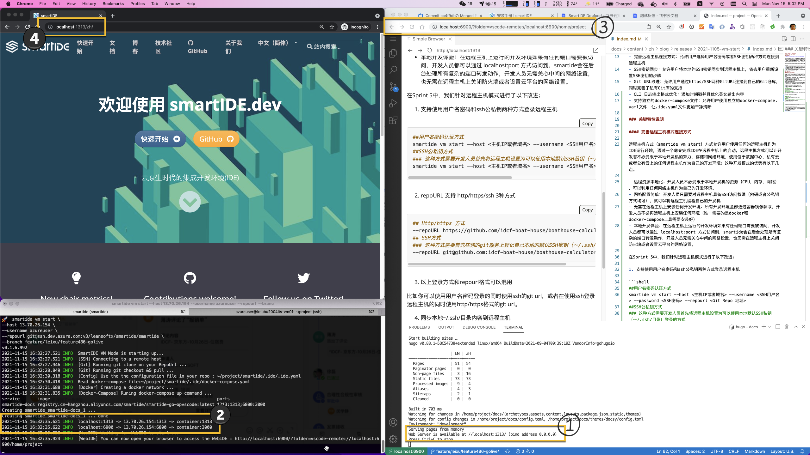

首先说明一下版本号的变更，你也需注意到了我们的版本号从v0.1.2直接跳到了v0.1.5，这是因为我们决定使用第三位版本号代表我们的迭代号，所以v0.1.5就代表这是sprint 5的交付版本。我们在sprint 4中完善了SmartIDE的分支策略和流水线工作模式，为了能够更加明确的跟踪我们的版本，因此在Sprint 5中我们决定采用第三位版本号来跟踪迭代号码，后续我也会专门提供一篇文档/博客来说明SmartIDE团队是如何管理自己的backlog, kanban，开发环境以及流水线的。

在刚刚结束的Sprint 5中，我们着重对SmartIDE的远程主机模式进行了一系列的改进，让远程主机模式进入可用状态，以下是Sprint 5所交付特性的列表：

- 完善远程主机连接方式：允许用户选择用户名密码或者SSH密钥两种方式连接到远程主机
- SSH密钥同步：允许用户将本地的SSH密钥同步到远程主机上，省去用户重新设置SSH密钥的步骤
- Git URL改进：允许用户通过https/SSH两种GitURL连接到自己的Git仓库，同时完善了私有Git库的支持
- CLI 日志输出格式优化：添加时间戳并且优化英文输出内容
- 支持独立的docker-compose文件：允许用户使用独立的docker-compose.yaml文件，让.ide.yaml文件更加干净清晰

### 关键特性说明

#### 完善远程主机模式使用场景

远程主机方式（smartide vm start）方式允许用户使用任何的远程主机作为IDE运行环境，通过一个命令完成IDE在远程主机上的启动。远程主机方式可以让开发者不必受限于本地开发机的算力，存储和网络环境，使用位于数据中心，私有云或者公有云上的任何远程主机作为自己的开发环境；这种开发模式的优势有以下几点。

- 远程资源本地化：开发人员不必受限于本地开发机的资源（CPU，内存，网络），可以利用任何网络主机作为自己的开发环境。
- 网络配置简单：开发人员只需要对远程主机具备SSH访问权限（密码或者公私钥方式均可），就可以将远程主机编程自己的开发机
- 无需在远程主机上安装任何开发环境：所有开发环境全部通过容器镜像获取，开发人员不必再远程主机上安装任何环境（唯一需要的是docker和docker-compose工具需要安装好）
- 本地开发体验：在远程主机上运行的开发环境如果有任何端口需要被访问，开发人员都可以通过 localhost:port 方式访问到，smartide会在后台处理所有复杂的端口转发动作，开发人员无需关心中间的网络设置，也无需在远程主机上关闭防火墙或者设置云平台的网络设置。

在Sprint 5中，我们针对远程主机模式进行了以下改进；

1. 支持使用用户名密码和ssh公私钥两种方式登录远程主机

```shell
##用户名密码认证方式
smartide vm start --host <主机IP或者域名> --username <SSH用户名> --password <SSH密码> --repourl <Git Repo 地址>
##SSH公私钥方式
### 这种方式需要开发人员首先将远程主机设置为可以使用本地默认SSH私钥（～/.ssh/目录）登录的方式
smartide vm start --host <主机IP或者域名> --username <SSH用户名> --repourl <Git Repo 地址>
```

2. repoURL 支持 http/https/ssh 3种方式

```shell
## Http/https 方式
--repoURL https://github.com/idcf-boat-house/boathouse-calculator.git
## SSH方式
### 这种方式需要首先在你的git服务上登记自己本地的默认SSH密钥（～/.ssh/目录）
--repoURL git@github.com:idcf-boat-house/boathouse-calculator.git
```

3. 以上登录方式和repourl格式可以混用

比如你可以使用用户名密码登录的同时使用ssh的git url，或者在使用ssh登录远程主机的同时使用http/https格式的git url。

4. 同步本地~/.ssh/目录内容到远程主机

为了方便开发者不必在远程主机上再次设置自己的ssh密钥，我们会在提示用户之后将本地~/.ssh/目录内容同步到远程主机的~/.ssh/目录，具体哪个用户要看你所使用登录用户而定。这样，开发者在使用远程主机的时候就不必再次生成SSH密钥并到git服务器上去进行登记。

5. 自动本地端口转发

下图所展示的是我正在使用SmartIDE编写本文档的现场截图，图中所标注的几个关键点解释如下：

- 1）在远程主机的开发环境中启动了 hugo server 并且运行在 1313 端口上
- 2）SmartIDE 本地驻守程序自动完成远程主机上的1313端口到本地1313端口的转发动作，同时转发的还有WebIDE所使用的3000端口，被转发到了本地的6800端口
- 3）通过 http://localhost:6800 就可以直接访问远程主机上的WebIDE
- 4）通过 http://localhost:1313 就可以直接访问远程主机上的hugo server



**说明**：[Hugo](https://gohugo.io/) 是一个用Go语言实现的静态站点生成器，你当前所浏览的 [smartide.dev](https://smartide.dev) 站点所使用的就是hugo。我在使用hugo进行 [smartide.dev](https://smartide.dev) 开发的过程中遇到了一个很麻烦的问题：git submodule恢复的问题，因为hugo使用了大量github资源，并且是通过git submodule的方式引入的，在我本地环境中获取这些资源非常的缓慢。通过SmartIDE的远程主机模式，我可以使用一台云平台中的主机，因为云平台所处网络环境大大优于本地开发机（你知道为什么！），因此我的git submodule获取时间可以从20-30分钟（本地模式）减少到2分钟（远程主机模式）。
<<<<<<< HEAD

以上就是Sprint5所发布版本的特性描述，我们2周后见。

徐磊
2021.11.05于北京
=======
>>>>>>> main

