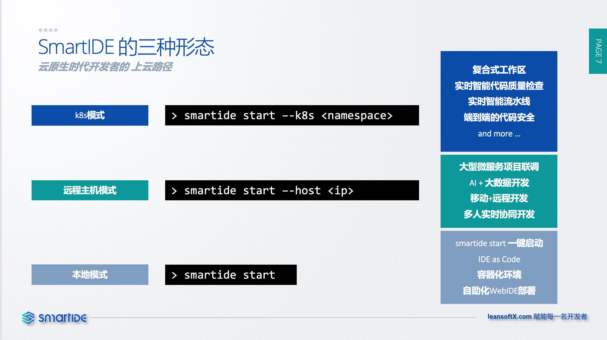
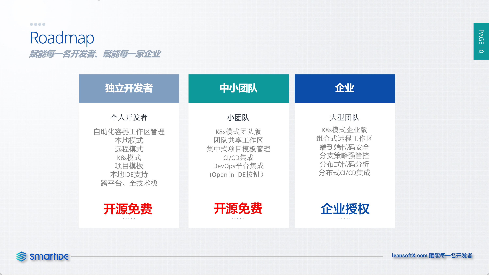

在经过了7个迭代以后，SmartIDE终于对外正式发布了，我们在2021年12月2日通过【冬哥有话说】栏目进行了一场产品发布会，正式对外公布了SmartIDE当前的功能、产品规划路线图以及后期推广计划。发布会本身非常成功，有超过2000人通过B站直播间直接参与了整个直播过程，同时有超过1500人坚持到了整个2个半小时的直播结束。同时，我们在发布会之前1周投放在B站上的产品介绍视频【SmartIDE - 开发从未如此简单】获得了超过1.4万的点击率并为我们的B站渠道收获了超过200名粉丝。

以下是这次发布会的视频录制



## SmartIDE的三种模式

在发布会上，我们公布了SmartIDE的三种主要形态，包括：本地模式，远程主机模式和k8s模式。



- 本地模式：本地模式通过一个简单的 smartide start 命令，根据嵌入在代码库中的环境说明文(.ide.yaml)完成环境的启动，让开发者可以无需搭建任何开发环境即可通过容器的方式开始编码调试以及基本的源代码管理(Git)操作。
- 远程主机模式：远程主机模式允许用户在 smartide start 命令中增加 --host 参数直接调度一台远程Linux完成开发环境的启动。相对于本地模式，远程主机模式更加能够体现SmartIDE的能力，开发者可以利用远程主机更为强大的算力，更庞大的存储以及更高速的网络获取更好的开发体验，还可以完成一些本地模式下无法完成的开发操作，比如：AI和大数据开发，大型微服务项目的开发等等。SmartIDE对于开发者使用的远程主机没有任何限制，只需要开发者可以通过SSH方式访问主机即可，远程主机可以位于任何位置，包括：公有云，私有云，企业数据中心甚至开发者自己家里。
- k8s模式：将远程主机模式命令中的 --host 替换成 --k8s，开发者即可将开发环境一键部署到 Kubernetes (k8s) 集群中。与远程主机模式一样，SmartIDE对于开发者所使用的k8s集群没有任何限制，无论是公有云托管式集群，还有自行部署的集群均可。只要开发者对于某个namespace具备部署权限，借款通过SmartIDE完成开发环境的一键部署。k8s模式将为使用SmartIDE的开发者开辟一个全新的天地，借助k8s所提供的高度灵活高效的环境调度能力，我们可以为开发者提供更加丰富的使用场景和更为强大的开发环境。

## 路线图

在发布会上，我们同时公布了SmartIDE未来发展的路线图，从当前我们所提供的 smartide-cli 应用将贯穿未来的整个路线图，作为开发者与开发工作区(Workspace)之间进行交互的主要桥梁，在此基础上我们也将为开发者提供更加易于使用的GUI工具，包括本地GUI工具和Web断管理能力，协助开发者完成更为复杂的环境调度和团队协作场景。SmartIDE针对独立开发者和中小团队的功能将采用开源免费的方式提供，而针对企业的版本则会提供企业授权和更为完善的产品技术支持。



## 社区推广计划

同时我们还公布了后续的2项社区推广计划：

- Smart Meetup: 我们将通过【冬哥有话说栏目】每周推介一款好用的开源代码库给到大家，整个推介过程控制在15分钟内，全程通过演示的方式使用SmartIDE来启动开源代码库的编码调试，让开发者在了解了开源项目本身的价值的同时了解SmartIDE带来的快速便捷开发体验。
- Smart早鸟计划: 我们将持续的在社区中招募希望提前体验SmartIDE的开发者，加入我们的微信群。作为一款由开发者为开发者打造的开发工具，我们希望听取真正使用者的意见，持续改进我们的产品，和开发者一起将这个产品做下去。

## v0.1.7发布说明

随本次发布会一起，我们同时release了v0.1.7版本的 smartide-cli 工具，其中包括了以下主要能力和功能改进：

### 状态管理能力

开发者的开发工作都不是连续的，我们经常需要在收到打扰之后快速恢复工作状态或者在多个项目中进行切换。为此，我们提供了以下命令为开发者提供快速恢复工作状态的能力。

```shell
# 获取所有启动过的环境列表
smartide list
# 使用以上列表中的工作区Id(WorkspaceId)一键恢复现有工作区状态
smartide start <WorkspaceId>
# 停止/删除/清理现有工作区
smartide stop|remove <WorksapceId>
```

### smartide new模板库

为了方便开发者从零开始SmartIDE进行项目，我们提供了以下命令帮助开发者一键启动空白项目或者已经初始化好的项目模板

```shell
# 获取当前所有可用的项目模板
smartide new
v0.1.7.1456
SmartIDE工作区模板
TemplateType TypeName
node         _default
node         express
node         base
java         _default
golang       _default
php          _default

选项：
  -d, --debug         是否开启Debug模式，在该模式下将显示更多的日志信息
  -h, --help          help for new
  -t, --type string   类型

# 示例，一键创建 node express 项目
smartide new node -t express
```

SmartIDE所使用的项目模板全部采用开源方式公布在GitHub上，同时为了方便开发者使用，我们还提供了gitee的镜像。

- https://github.com/SmartIDE/smartide-templates
- https://gitee.com/smartide/smartide-templates

更加详细的smartide new模板操作方式请参考：[node.js快速启动手册](/zh/docs/quickstart/new-node/)

### Linux的Docker一件安装脚本

为了方便开发者快速初始化自己的远程linux主机为SmartIDE使用，我们提供了安装脚本可以一键完成 docker 和 docker-compose 的安装配置，确保开发者可以顺利使用SmartIDE调度这台Linux主机，具体内容请参考：[Docker & Docker-Compose 安装手册 (Linux服务器)](/zh/docs/install/docker-install-linux/)

以上就是v0.1.7的主要功能，我们下个版本见。