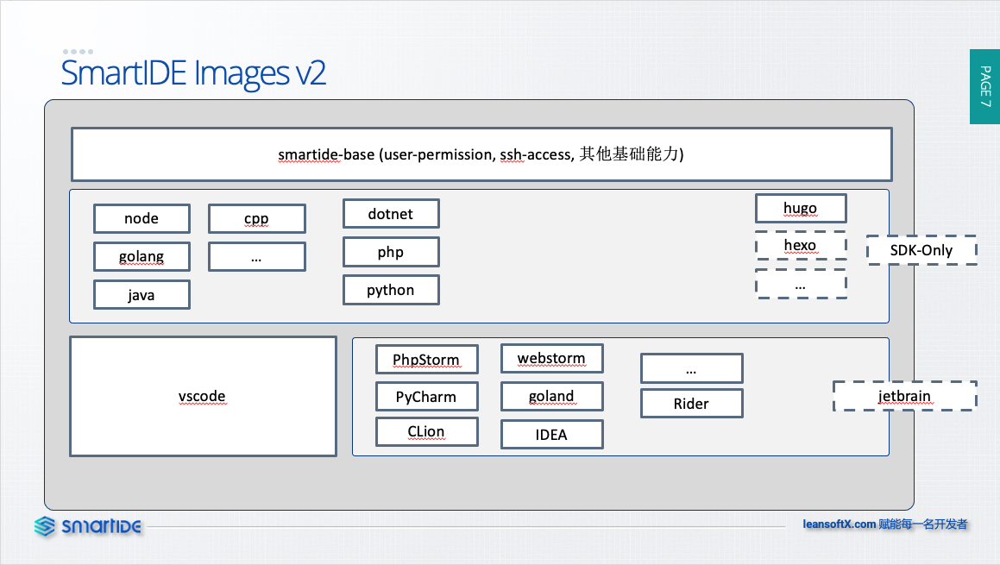

在过去的Sprint 8 和 Spring 9 中，我们进一步加强了当前的SmartIDE CLI组件的稳定性和易用性，同时启动了k8s环境部署能力的开发和SmartIDE Server的总体架构设计以及调度引擎的核心能力开发。另外，我们也在本次迭代中发布了对JetBrain全家桶系列中的IntelliJ IDEA, Rider和Goland三种c

## 关键特性说明

### 稳定性和体验增强

- 环境变量注入逻辑优化
  - #622 修复环境变量注入过程中互相覆盖的问题，确保所有环境变量均可以正常注入
- Vol映射逻辑优化：
  - #644 动态监测本地路径并替换成绝对路径，避免某些情况下因为相对路经造成的vol映射失败问题
  - #647 Windows远程模式下因为路径拼接问题启动失败
- 状态管理优化：
  - #641 改进了在用户手工删除工作区目录后再执行remove/reset操作无法删除记录的问题(Github Issue #18)
  - #636 reset -ya 命令中文字提示问题
- 体验增强
  - #649 提供短小命令集 ls | rm | v 
  - #645 启动指令简化， 提供 smartide start <url> 一键启动方式，自动完成git clone动作然后自动执行 smartide start

### k8s start

- k8s start 个人开发者版
  - #616 允许用户使用 smartide start --k8s 的方式完成 dev-container 在所指定的K8s集群中的部署，代码拉取和端口转发动作；开发者仍然可以通过类似 http://localhost:6800 的方式访问部署在k8s pod中的WebIDE

### SmartIDE Images 体系

- JetBrain Projector 可用镜像
  - #612 制作 JetBrain IDEA, Rider 和 Goland 镜像
- Image V2 体系开发
  - #567 Image V2 镜像体系开发，完成V2镜像体系规划，采用三层镜像体系：base-sdk-IDE；本迭代完成了 smartide-base-v2, smartide-node-v2, smartide-node-v2-vscode 的镜像交付

### Smart IDE Server 架构设计和基础能力开发

  - #618 使用tekton流水线任务封装smartide-cli，为Server核心调度引擎提供基础

## SmartIDE Image V2

SmartIDE的核心能力是容器化开发环境，因此对容器镜像的优化是我们一直努力的方向。虽然Docker技术从2013年就开始在全球普及，Docker Hub上也有数亿的镜像可供大家使用，但是绝大多数镜像都没有为开发调试环境进行优化，当然这和容器化技术在之前主要被用于运维领域有很大关系，换句话说，容器化技术对于开发者的潜能其实并没有被充分挖掘。SmartIDE Image 的设计就是为了让容器化技术为开发者服务，解决我们在开发调试过程中的各种痛点和难题。

因此，SmartIDE Image 的设计目标是：通过合理利用容器化技术，为开发者提供统一、标准化、满足开发调试测试需求的镜像，在这个目标之下，我们将镜像分成3个层次

- L0 - Base镜像提供基础能力，比如：认证，权限，SSH；使用Ubuntu满足日常开发基础组件的需求
- L1 - SDK镜像提供开发语言环境支持能力，同时提供SDK Only的使用方式，允许本地IDE将SDK镜像作为开发环境直接使用，不嵌入WebIDE
- L2 - WebIDE镜像，在SDK镜像的基础上嵌入常用的IDE，主要支持3大体系
    - VSCode
    - JetBrain Projector
    - Eclipse Theia

这些容器镜像不仅SmartIDE可以使用，开发者如果对Docker的操作比较熟悉，也可以直接使用Docker和Docker-Compose工具来直接使用这些镜像，榆次你我们未来会在GitHub/Gitee上开源这些镜像，支持开发者在不使用SmartIDE的情况下直接使用镜像作为自己的开发环境。

## SmartIDE Server 设计目标

SmartIDE产品的核心理念就是让开发者具备云原生的超能力，同时又不必学习复杂的云原生知识。”把复杂留给自己，把简单给到开发者“ 就是这个理念最好的总结，也因此我们的口号就是 【Be a Smart Developer 开发从未如此简单】。未来我们即将发布的SmartIDE Server也将延续这个理念，确保以下设计目标得一体现：

- 基本能力
    - 允许开发者自行注册资源作为SmartIDE的调度目标，包括：主机和k8s集群
- 独立开发者/团队版
    - 允许开发者自行一键部署：smartide server install 指令集
    - 支持单机、VM集群、k8s集群三种部署模式；最大化降低开发者自行部署SmartIDE Server的难度，做到任何人都能部署（无需专业运维人员，无需专业运维知识也能部署）
- 企业版
    - 认证体系集成
    - 支持多团队，多集群管理
    - 私有模板库
    - 私有镜像仓库，企业定制版SmartIDE Images

我们相信，具备了这些能力的SmartIDE一定可以助力开发者最大化利用云的价值，成为具备超能力的开发者，一个人搞定以往需要一队人才能搞定的工作。

2021.1.4 徐磊于北京

