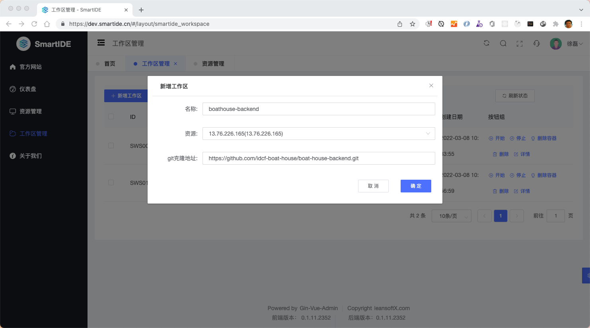
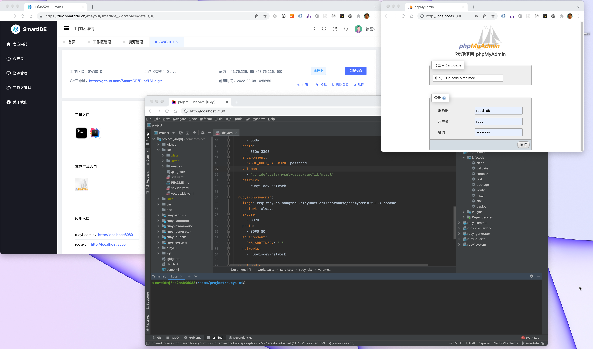
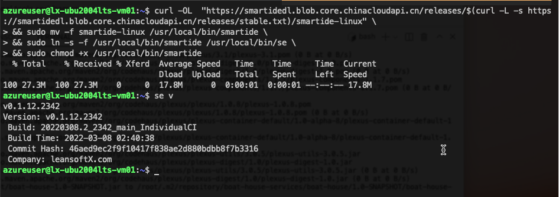

在过去的3个迭代中，SmartIDE开发团队完成了Server内测版本的开发，当前的Server版已经可以支持开发者自助添加Linux主机并使用这些主机资源作为自己的开发环境进行应用开发调试，所有的环境通过开发者镜像提供并全部采用容器的方式运行。为了配合以上场景的实现，我们这次终于发布了Linux版本的cli工具，因为Server版的主机调度就是通过这个linux版本的cli进行的，因此我们可以确保这个cli是经过测试并且可以在常见场景下可靠运行。同时，我们还完成了全部 [SmartIDE开发者镜像](/zh/docs/templates/) 的构建工作，当前已经发布了 node/javascript/前端、java、python、dotNet、golang、php、c/c++ 这7个主流技术栈的相关镜像的构建和发布，而且每一种技术栈都提供了SDK-Only、VSCode WebIDE 和 JetBrains WebIDE 3类不同用途的镜像方便开发者选择使用。

## Server内测

2021年12月3日，SmartIDE 发布了第一个社区可用的版本，那个时候的SmartIDE是以一款命令行工具（cli）的形式出现的。我们之所以先以命令行工具的方式提供SmartIDE的功能，是因为cli本身承载了SmartIDE的核心功能：工作区调度。cli的发布让开发者可以在不了解容器技术，无需学习docker指令以及k8s的工作机制的前提下，一键完成 [SmartIDE工作区](/zh/docs/overview/workspace/) 的部署，而且在工作区中可以内嵌自己喜欢的WebIDE（VSCode或者JetBrains全家桶）。cli的发布给开发者提供了极大的便利，使得以前必须要专业运维人员才能完成的复杂环境搭建工作都可以非常方便地自助完成。

当然，cli也有它的缺点，就是用户体验不好，操作门槛高。用户必须充分了解cli的各种指令和参数才能顺利地完成工作区的创建和管理；因此我们在cli的功能相对稳定之后便开始着手进行Server版的开发。

SmartIDE Server 作为 SmartIDE 企业版功能的基座，为用户提供简单直观的操作界面，进一步降低SmartIDE/云原生开发的门槛。

> 下图：使用Server一键创建工作区



> 下图：工作区启动后的详情页以及正在使用中的JetBrains IntelliJ IDEA WebIDE (Projector)，同时打开的还有集成在工作区中的 phpMyAdmin 工具。



### 内测邀请方式

如果您对 SmartIDE Server 有兴趣，可以扫描以下二维码，添加“小S”微信，加入SmartIDE早鸟计划后即可获得内测机会。


## Linux 版 SmartIDE CLI 工具

从SmartIDE发布以来，一直都有小伙伴希望直接在Linux主机上运行我们的 cli 工具，在这次的发布中我们已经将 Linux 版本的安装脚本更新在了官网上，大家可以通过 [安装文档](/zh/docs/install/) 获取安装脚本

> 请注意：在获取安装脚本的时候注意选择 Linux 标签页，Linux版本同样提供稳定版和每日构建版两个通道。

Linux版本安装和运行效果如下



## 开发者镜像和模版库开源

为了能够让大多数开发者都可以享受到SmartIDE带来的便捷，SmartIDE 提供了 `主流开发语言的SDK` 的容器镜像，包括 node/javascript、java、golang、python、dotnet/C#、php、C/C++，并且集成了VSCode和JetBrains两大主流IDE体系。开发者可以直接使用这些镜像作为自己的通用开发环境，或者以这些镜像为基础来构建自己专属的开发镜像。

SmartIDE所提供的开发者容器镜像中已经针对开发调试和测试场景进行了一系列的优化，使用SmartIDE的开发者镜像会有一系列的好处，比如：`非root用户运行` 和 `内置SSH服务支持`。

为了同时兼顾国内和国外开发者使用，所有SmartIDE的镜像同时托管至阿里云和Docker Hub，方便开发者根据自己的地理位置选择最快速的拉取地址：

- 国内阿里云地址：`registry.cn-hangzhou.aliyuncs.com/smartide/<镜像名称:TAG>`
- 国外 Docker Hub 地址：`registry.hub.docker.com/smartide/<镜像名称:TAG>`

我们在 SmartIDE CLI 中内置了IDE模版功能，开发者可以使用 `smartide new` 指令获取所有可用的模版，这些模版与以上的开发者镜像一一对应，可以用来一键创建标准化的开发环境。

SmartIDE模版库本身是开源的，地址为

- 国内Gitee: https://gitee.com/smartide/smartide-templates
- 国外GitHub: https://github.com/smartide/smartide-templates

使用模版库开发者可以一键创建自己需要的IDE开发环境，比如：


```shell
#########################################
# Node/JavaScript 前端技术栈
#########################################

## 创建带有node全版本sdk的开发容器，无IDE，可通过VSCode SSH Remote或者JetBrains Gateway接入
smartide new node
## 创建带有node全版本sdk的开发容器，使用VSCode WebIDE
smartide new node -t vscode
## 创建带有node全版本sdk的开发容器，使用JetBrains WebStorm WebIDE
smartide new node -t webstorm
```

我们这次发布了覆盖7个主流技术栈的SDK-Only, VSCode 和 JetBrains IDE开发者镜像一共22个，您可以通过 [镜像和模版](/zh/docs/templates/) 文档获取详细列表，包括其对应的 docker pull指令和smartide new指令。


