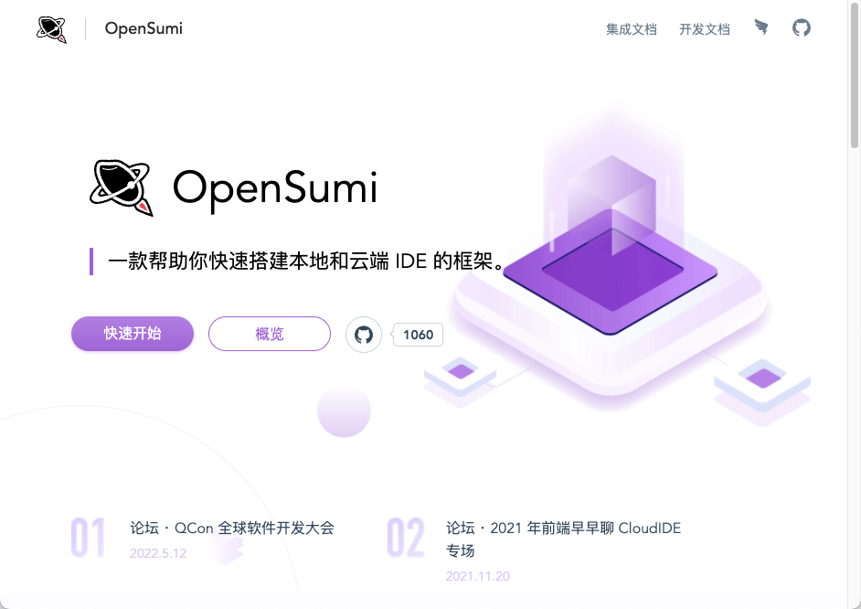
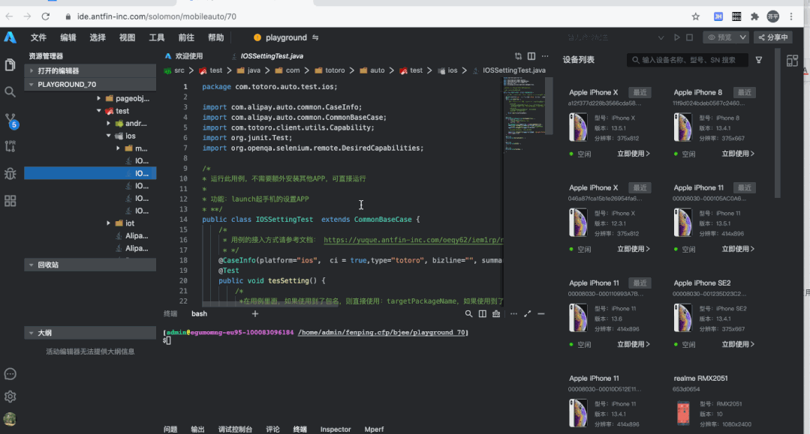
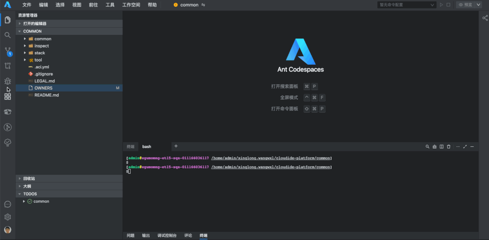
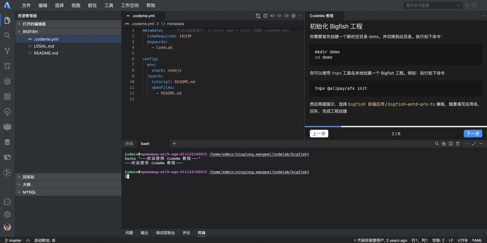
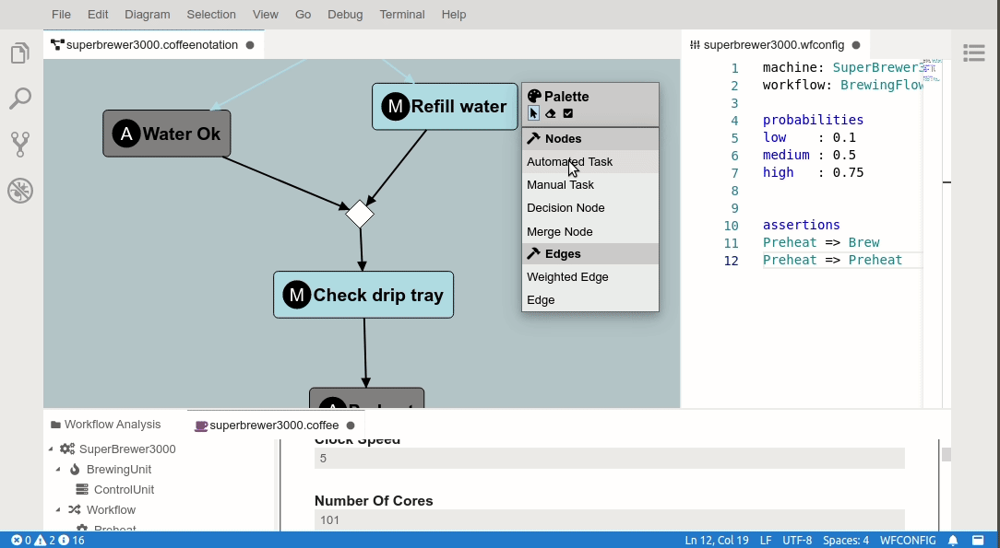
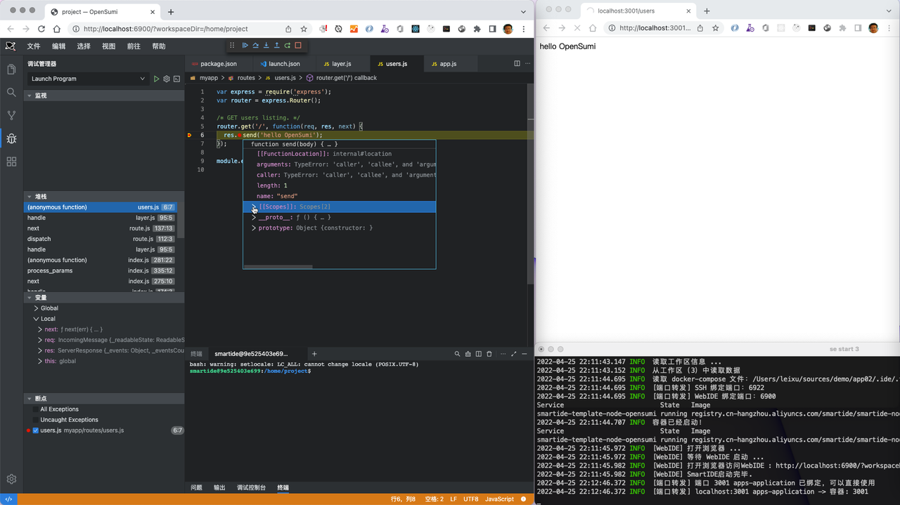

[SmartIDE v0.1.16 (Build 3137)](/zh/docs/install/) 已经在**2022年4月19日**发布到稳定版通道，我们在这个版本中增加了阿里和蚂蚁发布的国产IDE OpenSumi的支持，以及其他一些改进。SmartIDE 从 Sprint 11 (v0.1.11) 开始已经将重心转向 [Server版](/zh/docs/quickstart/server/) 的开发，并且已经针对社区开放了server的内测。但是对于 [CLI](/zh/docs/quickstart/cli/) 的改进和增强一直没有停止，因为 CLI 是 SmartIDE 的核心，实际上我们的 Server 版对于 [工作区](/zh/docs/overview/remote-workspace/) 的管理也是通过云原生开源流水线框架 Tekton 调度 CLI 实现的。

我们将在近期发布更加完善的 Server 版安装部署手册和文档，同时 Server 版 和 CLI 核心代码也将在近期开源。SmartIDE 的核心代码将采用GPL协议开源，允许任何组织和个人免费使用我们的代码搭建自己的云原生IDE环境。

## OpenSumi 简介



严格来说，阿里的 [OpenSumi](https://opensumi.com/) 并不是一个IDE产品，而是一个IDE二次开发框架。这个定位与 [Eclipse Cheia](https://theia-ide.org/) 的定位相同。SmartIDE 的早期版本也支持 Eclipse Theia，但是由于其操作体验与VSCode还是存在一定的差距，后续我们将重心转向类VSCode的IDE支持，比如对 [OpenVSCode Server](https://github.com/gitpod-io/openvscode-server) 的支持，以及 [JetBrains](https://www.jetbrains.com/) 系列IDE全家桶的支持。阿里&蚂蚁的开发团队在2022年3月3日发布了OpenSumi以后，SmartIDE团队对这款IDE进行了研究，认为可以替代Eclipse Theia 作为未来提供 “定制化IDE” 解决方案的基座，因此将重心转向了对 OpenSumi的支持，按照阿里&蚂蚁相关文章的说明：

> *“OpenSumi 是一款面向垂直领域，低门槛、高性能、高定制性的双端（Web 及 Electron）IDE 研发框架，基于 TypeScript+React 进行编码，实现了包含资源管理器、编辑器、调试、Git 面板、搜索⾯板等核新功能模块。开发者只要基于起步项目进行简单配置，就可以快速搭建属于自己的本地或云端 IDE 产品。”*  -- [原文链接](https://mp.weixin.qq.com/s/wVXCOO8WloKs-LWERA2_vA)

OpenSumi 当前已经在阿里内部广泛应用在很多场景，具这篇 [云原生架构下蚂蚁 Cloud IDE 的应用实践](https://mp.weixin.qq.com/s?__biz=Mzg2OTYyODU0NQ==&mid=2247485177&idx=1&sn=90b4ccca12fe250d9ac4e86660ccd95f&scene=21#wechat_redirect) 的文章显示，阿里内部的的很多研发相关的方案都有在IDE中的落地场景，比如：

云测平台集成在IDE中的手机测试环境



代码平台中直接在IDE中提交PR进行代码评审



新人培训和入职测试场景



## 定制化IDE解决方案

随着软件在我们日常生活中的广泛应用，软件开发不再会是一个特定的职业而会变成一种生存技能。就如同驾驶汽车的技能一样，在汽车刚刚出现的时候，驾驶汽车一度都是一项专业技能，司机也是一个专门的职业，而随着汽车逐步演变成了我们的生活交通的普遍手段，司机也从一个职业变成一种特定的生活技能。

对于软件开发工具而言，它也会从一个只有专业人员才能掌握的工具变成每个人都需要的日常工具。但是软件和汽车还有一个本质区别，就是汽车仅仅是一种交通工具、是单一行业；而软件则是各行各业都需要的基本组成部分，这个特性必将推进软件开发工具（IDE）向着专业化定制化的方向发展，需要根据不同行业的特点提供针对性的快速开发特性，以便降低软件提供者的门槛，提高交付效率和质量。这一点上，在很多的大型软件开发团队中早已有所体现，比如很多大型银行都在Eclipse的基础上定制开发了自己的开发框架和工具集，并在企业内部作为开发规范进行推广，因为这样可以帮助他们的开发人员提高工作效率，减少重复劳动，规范交付过程；再比如微软内部的DevDiv，就是专门定位于帮助微软的软件开发团队（比如：Windows, Office, XBox等）提供开发工具的专业化团队，其产品Visual Studio, Visual Studio Code 和 Azure DevOps 都是专业化IDE的业界天花板。这些案例都说明，专业的软件开发团队需要定制化的专业工具才能保证交付效率。

IDE 产品的研发一直以来都是一件门槛高、费时费力的事情，OpenSumi 通过开源 OpenSumi 帮助对 IDE 有兴趣的开发者更好地了解并掌握 IDE 研发这项技术，让更多的开发者可以以一种低门槛的方式去研发自己的 IDE 产品。OpenSumi 也从几个方面提供了很好发展路线图，比如：高度可定制的UI，完全开放的插件体系，对VSCode API适配的完整计划以及兼容VSCode Extension的特性。这些都将为定制化IDE解决方案提供必要的支撑，比如可以开发出类似下图这样的可视化开发场景。

SmartIDE专注于云原生容器化工作区的管理和调度，我们的目标就是支持各类开发者使用的IDE，OpenSumi符合SmartIDE的IDE生态定位。相信随着SmartIDE和OpenSumi的进一步成熟，会为开发者，特别是中国开发者带来更高效的云原生开发新体验！



## 使用 SmartIDE 启动 OpenSumi WebIDE 

OpenSumi的定位非常符合SmartIDE对IDE定制化解决方案的需求，因此我们针对OpenSumi进行了适配和集成，开发者可以使用一个非常简单的指令即可在浏览器中启动一个基于OpenSumi WebIDE 的 node.js 开发环境，具体请参考 [Node快速启动](/zh/docs/quickstart/node/#opensumi) 文档。SmartIDE支持7种主流技术栈，包括：JavaScript/Node.js，Java ，DotNet，Python ，PHP，Go语言和C/C++，并且支持在Windows/MacOS/Linux上跨平台使用，此次扩展了IDE支持后，将我们所支持的IDE也扩展到3大体系，分别是：VSCode，JetBrains和OpenSumi。

快速启动OpenSumi的Node.js开发环境指令如下 

```shell
## 使用OpenSumi WebIDE开启Node开发环境
smartide new node -t opensumi
```

以下是处于单步调试状态的 OpenSumi WebIDE



或者也可以通过我们的 计算器 示例应用体验使用OpenSumi开发调试Node.js应用的过程：

```shell
## 使用OpenSumi调试计算器示例
smartide start https://gitee.com/idcf-boat-house/boathouse-calculator.git --filepath .ide/opensumi.ide.yaml
```
以下是正在单步调试 计算器示例应用 的OpenSumi WebIDE，[B站视频](https://www.bilibili.com/video/bv14Y4y187hC)



相关链接：

- [兼容 VS Code 插件！阿里&蚂蚁联合开源国内首个强定制 IDE 研发框架 OpenSumi](https://mp.weixin.qq.com/s/wVXCOO8WloKs-LWERA2_vA)
- [云原生架构下蚂蚁 Cloud IDE 的应用实践](https://mp.weixin.qq.com/s?__biz=Mzg2OTYyODU0NQ==&mid=2247485177&idx=1&sn=90b4ccca12fe250d9ac4e86660ccd95f&scene=21#wechat_redirect)
- [OpenSumi 官网](https://opensumi.com/) 
- [文档 - 镜像与模版](/zh/docs/templates/)
- [文档 - SmartIDE Server 版快速开始](/zh/docs/quickstart/server/)
- [文档 - SmartIDE CLI 快速开始](/zh/docs/quickstart/cli/)
- [文档 - Node.JS 快速开始](/zh/docs/quickstart/node/#opensumi)

## 社区早鸟计划

如果你对云原生开发环境感兴趣，请扫描一下二维码加入我们的 **SmartIDE社区早鸟计划**


谢谢您对SmartIDE的关注，让我们一起成为云原生时代的 *Smart开发者*, 享受 *开发从未如此简单* 的快乐。

2022年4月19日