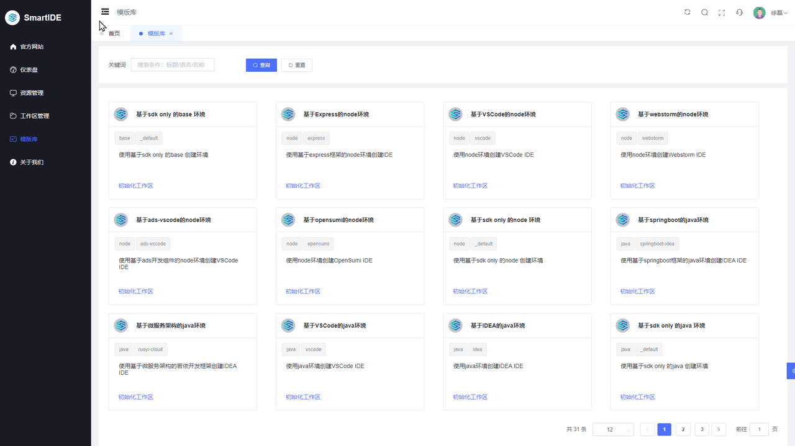
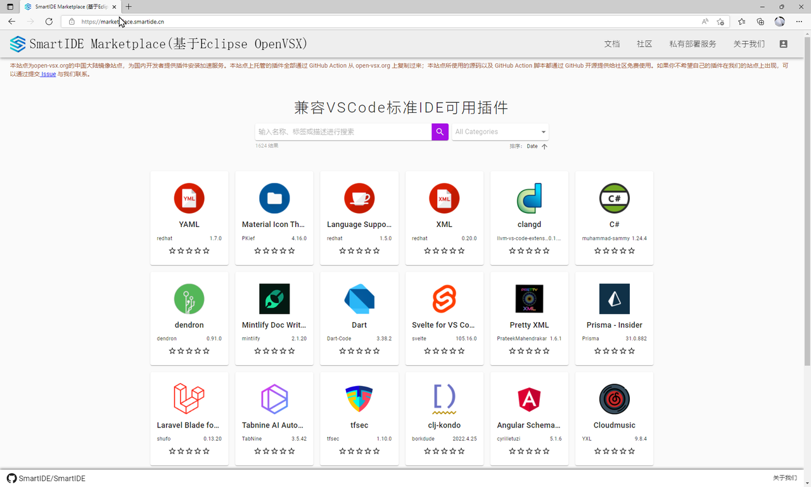

SmartIDE v0.1.17 已经发布，本次同步更新了CLI (Build 3332) 的稳定版通道和Server (Build 3333) 生产环境（内测中）。请参考对应的 [安装说明](/zh/docs/install/) 获取最新版。在刚刚完成的Sprint 17中，我们主要完成以下特性。

- **模板库**：对cli现有的 `smartide new` 指令进行了增强，支持针对远程主机使用 `new` 指令，用户只需要在 `new` 指令中增加`host` 参数即可在远程主机上使用模板库创建工作区。同时，我们已经将模版库集成到server中，用户可以使用网页的方式选择模版并创建工作区。

- **插件市场**：针对开源项目Eclipse OpenVSX进行了中文汉化和中国本地部署，用户可以通过 https://marketplace.smartide.cn/ 访问位于北京数据中心的插件市场。这个插件市场支持VSCode, VSCodium, Code-Server, OpenVSCode Server, OpenSumi以及Eclipse Theia 使用。SmartIDE插件市场可以大幅提升以上IDE的插件安装速度（根据你自己的网络情况，提高2-5X），并且支持企业内网本地部署，为研发企业内部针对类VSCode的IDE提供安全可控的插件管理机制提供可能。

## 模板库

SmartIDE CLI 原有的模板库功能允许用户通过一个简单的指令 `smartide new` 就可以一键创建基于7种技术栈和4种IDE的容器化 [工作区](/zh/docs/overview/workspace/)，这个功能原来只能在开发者本机使用，无法支持远程服务器。在Sprint 17 中我们针对这个功能进行了增强。允许用户直接在指定的远程服务器上新建工作区，同时将这个功能集成到了 Server 中，允许用户通过网页完成基于模版的工作区创建。

### 在Server中使用模版库

SmartIDE Server 是一款开源的容器化工作区管理工具，你可以在任何可以运行Docker和Kubernetes的环境中自行部署。在Sprint 17中，我们将模板库功能引入到Server中，允许用户通过网页选择模版并一键完成部署。



以下是使用Server版模板库功能创建 [若依微服务版本](/zh/docs/examples/ruoyi/) 快速开发框架的演示视频，若依微服务版的模版包含 `vue.js` 的前端应用，一系列 `Java Springboot` 后端服务，`Nacos` 服务注册中心，`redis` 缓存和 `mysql` 数据库（配置`phpMyAdmin` 管理工具）以及 `SonaQube` 代码检查工具；这是一个相对复杂的工作区，使用server版的模板库开发者可以一键创建以上所有环境，无需关心这些组件之间的配置，所有这些配置都已经预先设置好并保存在 `IDE配置文件` 中了。



### 使用new指令创建远程工作区

使用远程new指令创建工作区的操作如下

```shell
## 首先使用 smartide host 指令添加主机
smartide host add <主机IP或者域名> --username <用户名> --password <密码> [--port <SSH端口号，默认22>]
## 使用 smartide new 指令在指定的主机上创建工作区
smartide new --host <HostId> <模版名称> --type <子类型名称> --workspacename <工作名称>
## 如果在本地的当前目录中创建工作，则可以省略host和workspaceName参数
## type参数也可以省略，则可以使用当前默认模版
smartide new <模版名称> --type <子类型名称>
```

以下是使用new指令在远程服务器上创建工作区的演示视频：

当前支持的模版列表如下，列表中的所有组合都可以通过以上指令用于在远程主机上创建工作区

| Template      | type | 说明      |
| ----------- | ----------- | ----------- | 
| node        | 默认 | 不带有任何WebIDE的node/JavaScript前段开发环境,内置nvm，可以切换node 12，14，16 | 
|             | vscode | 使用vscode WebIDE | 
|             | webstorm | 使用JetBrains WebStorm WebIDE (Projector） | 
|             | opensumi | 使用阿里的OpenSumi WebIDE | 
| Java        | 默认 | 不带有任何WebIDE的Java开发环境 + Node/JavaScript前段开发环境，内置OpenJDK 11 | 
|             | vscode | 使用vscode WebIDE | 
|             | idea | 使用JetBrains IntelliJ IDEA WebIDE (社区版，免授权，Projector） | 
| python      | 默认 | 不带有任何WebIDE的python开发环境 + Node/JavaScript前段开发环境, 内置 Python 2 和 Python 3| 
|             | vscode | 使用vscode WebIDE  | 
|             | pycharm | 使用JetBrains PyCharm WebIDE (Projector） | 
| dotnet      | 默认 | 不带有任何WebIDE的.NET 6开发环境 + Node/JavaScript前段开发环境 | 
|             | vscode | 使用vscode WebIDE （自动安装.net调试插件) | 
|             | rider | 使用JetBrains Rider WebIDE (Projector) | 
| golang      | 默认 | 不带有任何WebIDE的 go语言 开发环境 + Node/JavaScript前段开发环境，内置 1.17.5 和 1.16.12 | 
|             | vscode | 使用vscode WebIDE  | 
|             | goland | 使用JetBrains GoLand WebIDE (Projector) | 
| php         | 默认 | 不带有任何WebIDE的 php 开发环境 + Node/JavaScript前段开发环境，内置 php7.4 和 apache2 | 
|             | vscode | 使用vscode WebIDE  | 
|             | phpstorm | 使用JetBrains PHPStorm WebIDE (Projector)  | 
| cpp         | 默认 | 不带有任何WebIDE的 C/C++ 开发环境 + Node/JavaScript前段开发环境，内置 clang 和 cmake  | 
|             | vscode | 使用vscode WebIDE  | 
|             | clion | 使用JetBrains CLion WebIDE (Projector)  | 

以上所有模版以及模版所使用的开发者镜像(Dockerfile和相关代码、脚本)均开源提供给社区，具体可以参考以下链接
- [官网文档 镜像和模版](/zh/docs/templates/)
- 开源地址
  - https://gitee.com/smartide 
  - https://github.com/smartide


## 插件市场

VSCode以及类VSCode IDE（包括：VSCodium, Code-Server, OpenSumi 和 Eclipse Theia）都使用国外的插件市场 [open-vsx.org](https://open-vsx.org) 作为数据来源。对于国内的开发者来说，因为网络原因造成插件安装缓慢或者安装失败的情况经常出现。同时，在很多企业内部，开发者也在大量使用VSCode作为自己的主力开发工具，由于安全管控的原因，企业内部的开发者往往无法访问外部互联网，开发者为了绕过企业的安全性管控会自行下载、复制和导入未经企业审核的VSCode插件进入企业受管控网络使用，这些做法会对企业的信息安全造成很大威胁。

为了解决以上这些痛点问题，SmartIDE针对 [open-vsx.org](https://open-vsx.org) 进行了汉化并进行了中国本地化部署。现在开始，开发者可以访问位于国内数据中心的 **SmartIDE插件市场** ，并按我们官网文档中的方式修改自己 VSCode 中的 `product.js` 配置文件，即可使用 **SmartIDE插件市场** 安装插件，根据我们的测试，通过我们提供的插件市场安装插件可以获取至少2-5X的速度提升。

**SmartIDE 插件市场地址 https://marketplace.smartide.cn/**



`product.js` 文件配置如下，具体请见 [SmartIDE 插件市场文档](/zh/docs/manual/marketplace/config/)

```json
"extensionsGallery": {
    "serviceUrl": "https://marketplace.smartide.cn/vscode/gallery",
    "itemUrl": "https://marketplace.smartide.cn/vscode/item"
}

"linkProtectionTrustedDomains": [
    "https://marketplace.smartide.cn"
]

```

以下视频是使用VSCodium分别从 Open-VSX.org 和 SmartIDE插件市场下载插件的速度比较，根据网络状况不同，可以提速2-5倍。



基于Eclipse OpenVSX的SmartIDE插件市场的代码以及部署文档开源免费提供给社区，并且我们为其企业提供私有部署技术支持服务。相关文档如下：

- [SmartIDE插件市场概述](/zh/docs/overview/marketplace/)
- 开源地址
  - https://github.com/SmartIDE/eclipse-openvsx 
  - https://gitee.com/SmartIDE/eclipse-openvsx 
- [如何更新Visual Studio Code以及兼容IDE的配置文件连接到SmartIDE 插件市场，包括：VSCode, Codium, Code Server, OpenVSCode Server和OpenSumi](/zh/docs/manual/marketplace/config/)
- [部署手册](/zh/docs/install/marketplace/)

> 说明：[Eclipse OpenVSX](https://open-vsx.org/) 是Eclipse基金会旗下的一款采用EPL-2.0开源授权的开源软件，按照 [Github官网](https://github.com/eclipse/openvsx) 上的说法：OpenVSX提供了一个 [Visual Studio Marketplace](https://marketplace.visualstudio.com/) 的替代品，包括可用于管理VSCode插件的数据库以及对用的Web应用，同时提供了一个cli工具用户后台管理。Eclipse OpenVSX出现的原因是微软并不允许类VSCode IDE (VSCode的Fork) 使用官方的插件市场，因此社区需要一个类似的基础设施服务，具体可以参考这个 [Issue](https://github.com/microsoft/vscode/issues/31168) 。

SmartIDE插件市场是OpenVSX的一个fork，我们在OpenVSX的基础上进行一些修改以便适合中国开发者使用，包括：界面的中文汉化，通过GitHub Action自动将 open-vsx.org 上的插件自动同步到国内，针对国内部署进行验证，测试以及服务托管。因此，SmartIDE插件市场是 open-vsx.org 的一个代理服务，目的是方便国内的开发者安装和管理VSCode的插件。当然，我们也欢迎国内的开发者直接将自己的插件发布到我们所运行的 SmartIDE插件市场，如果你有类似的需求，请和我们联系。

## 社区早鸟计划

如果你对云原生开发环境感兴趣，请扫描以下二维码加入我们的 **SmartIDE社区早鸟计划**


谢谢您对SmartIDE的关注，让我们一起成为云原生时代的 *Smart开发者*, 享受 *开发从未如此简单* 的快乐。

2022年5月7日


