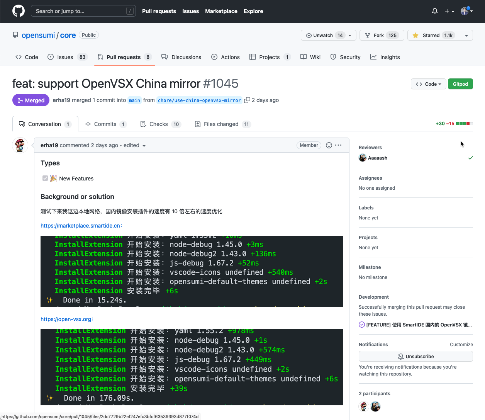
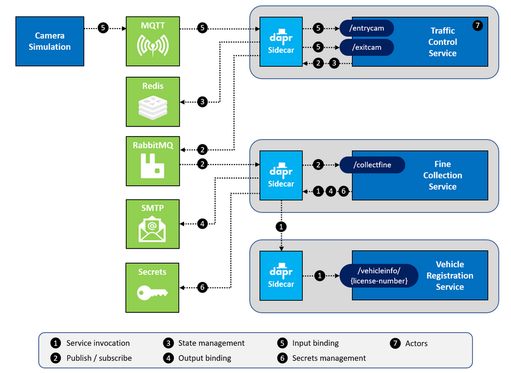
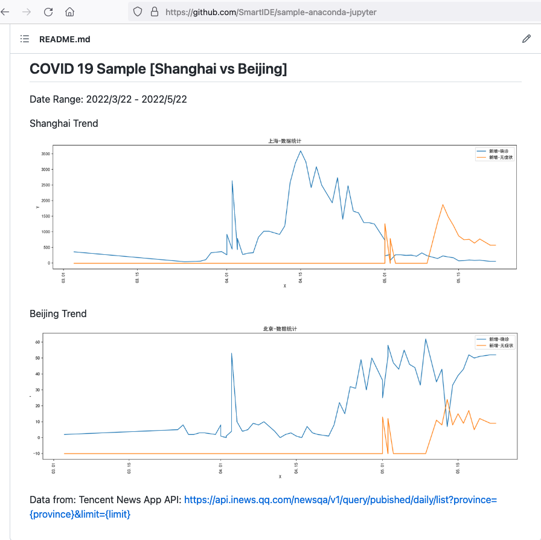
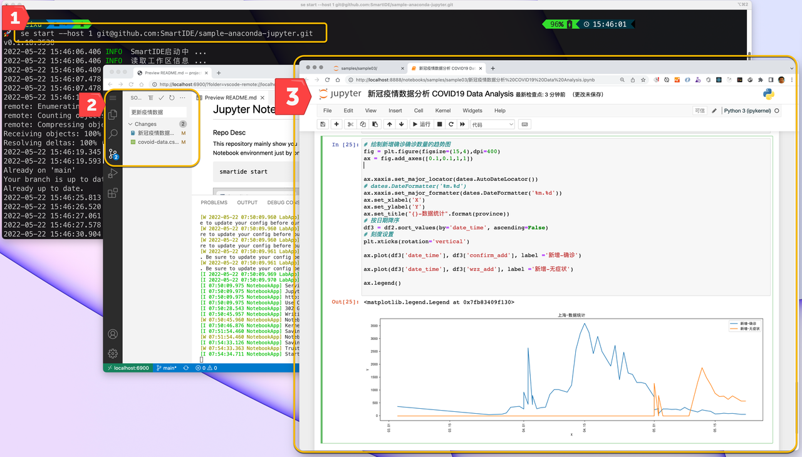

## 阿里蚂蚁OpenSumi采用SmartIDE插件市场提速10倍

在 Sprint 16中，我们开始支持阿里蚂蚁开源的国产IDE开发框架 OpenSumi，并且在 Sprint 17 发布了 基于 [Eclipse OpenVSX Registry](https://open-vsx.org/) 的 [SmartIDE插件市场](/zh/docs/overview/marketplace/)。OpenSumi的开发团队在测试了 SmartIDE插件市场之后发现速度提升可以达到10倍以上，并将其设置为OpenSumi内默认的插件市场来源。

下图来自：[https://github.com/opensumi/core/pull/1045](https://github.com/opensumi/core/pull/1045) ，是 OpenSumi 团队的测试结果。



[SmartIDE插件市场](https://marketplace.smartide.cn/) 是我们针对国内使用类 VSCode IDE 的开发者提供的开源插件市场镜像服务，我们将 [open-vsx.org](https://open-vsx.org/) 的国外站点通过 Github Action 自动同步到了部署在国内的站点中，经我们自己测试速度提升2-5倍。此次经阿里蚂蚁OpenSumi团队的测试结果提升10倍的原因可能是因为他们采用了批量插件安装的方式。这个结果对于国内使用类 VSCode IDE 的团队来说是一个好消息，说明我们提供的 [SmartIDE插件市场](https://marketplace.smartide.cn) 开始发挥它应有的作用了。

在 Sprint 18 中，我们还对插件同步机制进行了改进，增加了按周期自动同步和历史版本同步机制，这样就可以确保国内的小伙伴及时获取到最新的VSCode插件。

相关修改可以参考 https://github.com/SmartIDE/eclipse-openvsx/issues/2 

以上PR已经在2022年5月18日合并进入OpenSumi的主分支，安装 OpenSumi 的最新版就已经可以体验插件极速安装的快感了。

- OpenSumi 官网地址 https://opensumi.com 
- SmartIDE 插件市场地址 https://marketplace.smartide.cn/ 
- 类VSCode IDE更新插件市场教程 https://smartide.cn/zh/docs/manual/marketplace/config/ 

## Dapr 微服务开发环境支持 VM-Like-Container验证通过

[Dapr](https://dapr.io/) 是微软主导的云原生开源项目，2019年10月首次发布，到正式发布 V1.0 版本的不到一年的时间内，github star 数达到了 1.2万（现在已经超过1.7万星），超过同期的 kubernetes、istio、knative 等，发展势头迅猛，业界关注度非常高。

Dapr 这个词是是 「Distributed Application runtime」的首字母缩写，非常精炼的解释了 dapr 是什么：**dapr 是一个为应用提供分布式能力的运行时**。

Dapr官网 https://dapr.io


SmartIDE 团队 [Sprint14](/zh/blog/2022-0309-sprint14/) 开源了包括 `.net6` 环境在内的开发者镜像相关代码，在那个时间点对于 `.net6` 技术栈的支持已经完整。这个迭代中，我们针对 `.net6` 的开发者镜像进行了改进，增加了 `VM-Like-Container` 的能力，以便可以完美支持 dapr 环境的搭建和调试。

所谓 `VM-Like-Container`，其实就是将容器当成虚拟机来使用。大家可能会觉得有点奇怪，既然我们都容器化了，为什么还要开倒车，回到VM呢？这个其实和开发者的需求有关，一般的容器都是为了运维环境优化，并没有考虑开发者的诉求，或者说这两者的诉求的相互冲突的，运维要的是稳定，因此极尽所能剥夺一切容器内不必要组件，而开发者需要灵活，需要能够在容器内按需构建自己的所需要的各种组件。比较典型的场景就是在容器中运行docker，也即是大家所说的 `DIND (Docker in Docker)` 的场景。对于开发者来说，确保应用可以用容器发布的最好方式就是在自己的开发环境中可以直接执行 `docker build` 和 `docker run`，这样才能确保自己所交付的代码是经过容器化环境测试的，不至于等到流水线打包并部署完成以后才发现自己的代码其实在容器中无法正确运行。

对于开发环境而言，提供内置的Docker环境意味这开发者有更加灵活的能力构建自己专属的定制化环境，比如运行各种类型的中间件、同时运行和调试应用的多个版本，临时组网进行测试等等。对于Dapr而言，dapr的开发工具需要使用docker环境来模拟微服务边车 (sidecar) 的很多能力，比如最常见的服务发现和消息队列，都需要dapr运行一些中间件来提供相关的服务。以下就是在 SmartIDE 的 `.net6(vscode)` 开发环境中，运行一个机遇dapr的示例应用的截图：

示例代码库地址：[https://github.com/SmartIDE/sample-dapr-traffic-control](https://github.com/SmartIDE/sample-dapr-traffic-control)


在这个示例中，我们使用了 `dapr init` 来初始化 dapr 开发环境，运行 dapr 的基础服务，然后启动 `Mosquitto` 作为 `MQTT broker`，`RabbitMQ` 作为消息队列以及其他的基础服务。应用本身需要至少4个微服务组件才能正常工作：

- `TrafficControlService` 是交通控制服务，也是主服务，其业务逻辑是根据公路上的2个固定位置摄像头反馈的数据，计算车辆通过摄像头的车速，以便判断是否存在超速行为。
- `FineCollectionService` 是罚单处理服务，根据 `TrafficControlService` 发送过来的车牌数据，查询车辆注册数据库（`VehicleRegistrationService`）获取联系人信息，并发送邮件
- `VehicleRegistrationService` 是车辆注册数据库，提供车辆信息查询，可以通过车牌号码获取车主信息，比如邮件地址。
- `Simulation/VisualSimuation` 是一个模拟器应用，用于模拟车辆行为，以便可以测试以上服务的工作情况，在上图中展示的是 `VisualSimulation` 的画面。



下面这个视频完整演示了如何使用 SmartIDE开发调试 经典的Dapr示例 `dapr-traffice-control`，相关的启动命令如下

```shell
smartide start https://github.com/SmartIDE/sample-dapr-traffic-control
```



## Jupyter Notebook 环境支持

[远程工作区](/zh/docs/overview/remote-workspace/) 的一个重要优势就是可以帮助开发者更好的利用远程主机的强大算力和数据处理能力，在这个领域中 `Jupyter Notebook` 无疑是非常典型的应用类型。我们在 Sprint 18 中增加了对 `Jupyter Notebook` 的远程工作区支持，现在开发者可以使用一个简单的指令就可以启动预装 `Jupyter Notebook` 的远程工作区，并且通过 `--host` 参数将这个 **工作区漫游** 到任意主机或者k8s环境中。相关指令如下：

```shell
## 启动使用 Jupyter Notebook 的数据科学处理开发者容器
smartide new anaconda -t jupyter 
## 在远程主机上启动
### 首先将自己的主机添加到 SmartIDE工具中，并获取hostId
smartide host add <Ip-Address> --username <user> --password <pwd>
### 使用 --host 参数再次启动
smartide new --host <hostId> anaconda -t jupyter 
```

使用以上方式启动的 `Jupyter Notebook` 环境还会内置一个 VSCode WebIDE，这样可以利用内置的Git管理工具将制作好的 Notebook 提交到Git代码仓库中进行版本管理。 其他开发者就可以使用 `smartide start <代码库地址>` 指令一键将同样的环境漫游到自己的本地开发机，主机或者k8s上。

为了让大家更容易体验，我们为大家提供了一个预置了示例 Notebook 的代码库，这个示例中内置了一个新冠疫情数据分析Notebook。

示例地址 https://github.com/SmartIDE/sample-anaconda-jupyter

使用这个 Notebook 对上海和北京最近的疫情数据的分析结果如下：



> 备注：以上数据分析仅为展示SmartIDE的产品特性，数据处理的非常粗糙。欢迎对 `Juypter Notebook` 开发有兴趣的小伙伴提交PR改进我们的分析算法。

大家可以使用以下指令一键启动上面这个示例

```shell
## 在本地开发机上启动
smartide start https://github.com/SmartIDE/sample-anaconda-jupyter.git
## 在远程主机上启动
smartide start --host <hostId> https://github.com/SmartIDE/sample-anaconda-jupyter.git
```

启动以后的效果如下，图中：

1. SmartIDE简化指令方式 `se = smartide`
2. 内置在远程工作区中的 VSCode WebIDE，这个远程工作区中还预置了 Python 环境，开发者可以直接在VSCode中使用Python语言进行编程。
3. 内置在工作区中的 `Jupyter Notebook`，加载了 “新冠疫情分析” 示例数据，这个 Notebook 通过读取微信疫情小程序的API接口获取实时数据，并利用图表展示了上海过去60天疫情变化趋势



在适配 `Jupyter Notebook` 的过程中，SmartIDE没有修改一行产品代码，完全利用我们所提供的 [IDE配置文件](/zh/blog/2022-0510-readme-exe/) 和 [开发者镜像模版库](/zh/docs/templates/) 的能力完成。SmartIDE作为一款面向企业的B端产品，对于可扩展性能力的要求是根植于产品的设计核心。利用这种能力，企业在部署了SmartIDE之后无需进行二次开发就可以自助适配各种开发语言，工具和环境，大幅降低企业采纳远程工作区的技术门槛和实施成本。

下面的视频展示了在 SmartIDE 中使用 Jupyter Notebook 分析上海和北京疫情数据的过程：



## CLI k8s 模式支持（特性预览）

SmartIDE CLI中已经增加了k8s相关指令，用户现在可以使用 `smartide start --k8s` 来完成在k8s集群中启动 [远程工作区](/zh/docs/overview/remote-workspace/) 的操作，基于 [计算器示例应用](https://github.com/idcf-boat-house/boathouse-calculator) 的启动命令如下：

```shell
smartide start --k8s SmartIDEAKS --namespace default --repourl https://github.com/idcf-boat-house/boathouse-calculator.git --filepath .ide/k8s.ide.yaml
```

使用这个指令之前用户需要完成2个准备工作：

1. 在k8s集群上安装 `smartide-file-storageclass`，这个配置的目的是为了能够让 SmartIDE 可以支持各种类型的k8s服务。Storage Class （存储类定义）是k8s上适配不同提供商的底层存储driver而提供了一层隔离机制，在远程工作区场景下，我们需要允许工作区中的多个开发容器共享的访问同一份代码/配置/环境变量/工具等资源，因此需要使用具备 ReadWriteMany 能力的存储 driver。
2. 在本地的 `.kube` 目录中导入你的k8s集群的 `kube-config` 文件，这个步骤是为了允许 SmartIDE CLI 可以连接k8s进行操作的权限。

以下是导入 storageclass 的相关指令，当前只提供Azure微软云的配置文件，使用其他云平台或者自建k8s平台的小伙伴可以自行查找适合自己平台的StorageClass配置文件，后续我们也会统一提供。

```shell
kubectl apply -f https://smartidedl.blob.core.chinacloudapi.cn/kubectl/resources/smartide-file-storageclass.yaml
```

另外，如果使用 `azure-cli`，可以直接使用以下指令快速创建k8s集群（测试用途）并获取集群的 `kube-config` 配置

```shell
az login
az account set -s <订阅ID>
az group create --name <资源组名称> --location southeastasia
az aks create -g <资源组名称> -n <集群名称> --location southeastasia --node-vm-size Standard_DS2_v2 --node-count 1 --disable-rbac --generate-ssh-keys
az aks get-credentials -g <资源组名称> -n <集群名称>
```

CLI k8s 模式现在已经支持一键启动工作区和清除工作区操作，我们正在将这个cli能力集成到server中；在后续的迭代中大家会陆续获得 server k8s 模式的更新。

## 社区早鸟计划

如果你对云原生开发环境感兴趣，请扫描以下二维码加入我们的 **SmartIDE社区早鸟计划**


谢谢您对SmartIDE的关注，让我们一起成为云原生时代的 *Smart开发者*, 享受 *开发从未如此简单* 的快乐。

2022年5月19日


