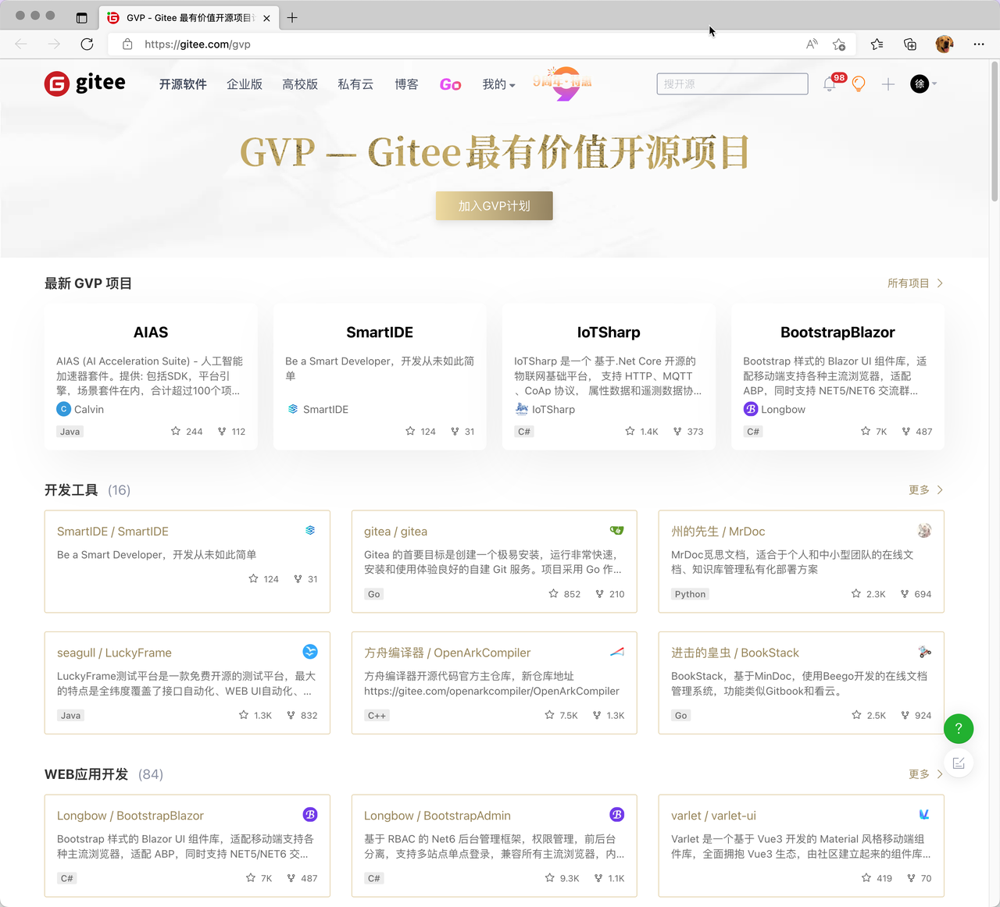
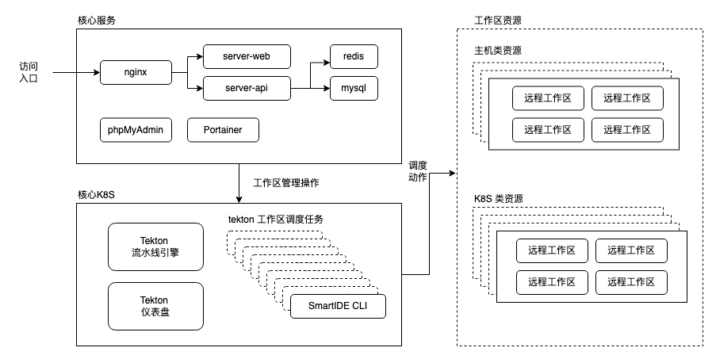
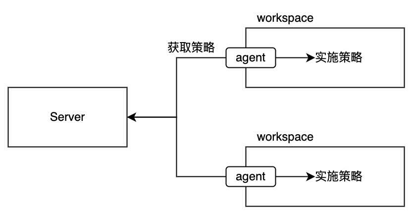
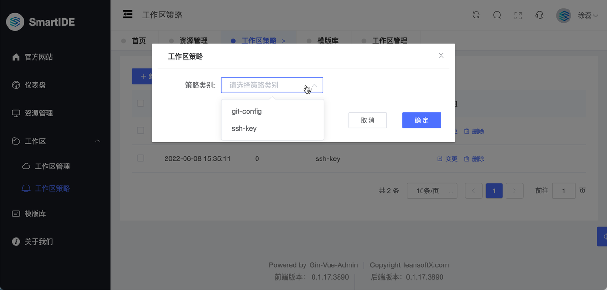

## 码云（Gitee.com）最有价值开源项目奖项

SmartIDE在上周获得了[码云（Gitee.com）](https://gitee.com) 的最有价值开源项目奖项。码云（Gitee.com）是国内最大的开源代码托管平台，当前有800万开发者用户。GVP - Gitee最有价值开源项目奖项需要开源项目采用OSI认可的License (SmartIDE采用GPL3.0协议），通过Gitee专家组的认可，开发活跃度（SmartIDE至今已经完成了488次代码提交），积极响应用户反馈，提供完整的文档以及用户评价（当前Gitee Star 125, Github Star 229）。

SmartIDE非常荣幸获得码云的认可，我们将继续为开发者提供最好的开发工具和技术支持。

## Server 私有部署手册

SmartIDE Server 是面向团队和企业的云原生容器化远程工作区管理平台，可以为开发团队提供统一的开发测试资源管理，基于浏览器的开发环境访问以及团队协作能力。**SmartIDE Server 的 团队基础版 功能是开源而且免费的，任何人都可以按照本手册所提供的方式完成部署并免费使用，没有使用期限限制，没有用户数限制，也没有资源数量限制。** 

下图是Server版的部署架构图：

图中可见，SmartIDE Server 采用了非常灵活并且可扩展的分布式架构，每个服务组件都可以进行独立的横向扩展以便确保可以应对不同规模的部署模式需求。既可以在单台Linux主机上完成完整的部署，也可以在k8s集群上支持高可用，高性能的可横向扩展部署，对于不同规模的团队都可以提供支持。

我们已经完成了 SmartIDE Server 私有化部署的文档验证，包括公网部署和隔离网络部署均已经可以投入使用。希望尝试自行部署的小伙伴现在就可以参考以下完成完成部署和功能验证：

- [Server 部署手册](/zh/docs/install/server/)
- [SmartIDE Server 快速开始](/zh/docs/quickstart/server/)

## 类虚拟机容器 VMLC

在2022年6月11日刚刚结束的 **开源云原生开发者日** 大会上，我进行了名为 [【寻找云原生时代的开发者效能原力 - 使用AKS实现云原生IDE开发调试环境】的主题演讲](/zh/blog/2022-0615-vmlc/)，并在演讲中首次展示了 SmartIDE 对 VMLC 的支持。

**类虚拟机容器 VMLC 是 VM Like Container 的缩写，其设计目标是为开发者在容器中提供类似虚拟机的环境**，包括：systemd服务管理能力，sshd远程登录能力，docker/k8s嵌套能力等。容器化技术出现以后，绝大多数的使用场景都是生产环境，因此对容器的优化目标都是围绕精简，单一进程，不可变状态的目标来实现的；对于开发人员来说，按这种目标设计的容器并不适合作为开发环境来使用。相对于生产环境中已经预先确定的配置，开发环境的配置需要由开发人员根据当前应用的不同需求进行持续的调整，并且持续的进行内迭代过程（Inner Cycle），这个过程包含了编码，编译打包，部署，测试，修复的过程。只有为开发人员提供完整的内迭代能力才能最大限度确保开发人员提交的代码质量，降低后续环节（包括生产环境）中出现问题和缺陷的几率。

为了达到以上目标，SmartIDE产品团队在过程的Sprint 18-19两个迭代中完成了VMLC容器标准的设计，验证和实现，并且已经通过 dapr-traffic-control 示例应用展示了 VMLC 的完整能力，包括：

- 在Linux主机和k8s集群中部署 VMLC 远程工作区容器的能力
- 使用 smartide start指令或者 smartide new 指令启动基于 VMLC 的远程工作区的能力
- 使用 SmartIDE Server 管理基于 VMLC的远程工作区的能力
- 在VMLC容器中运行docker能力
- 在VMLC容器中运行多节点k8s的能力，包括使用LoadBalancer, Ingress提供外部访问的能力
- 使用SSH链接VMLC容器，并使用终端进行操作的能力
- 使用VSCode远程开发插件 / JetBrains Gateways 链接 VMLC 容器进行 Hybird 模式开发的能力
当前，我们已经提供了以下基于 VMLC 的开发者镜像，其他类型的开发者镜像会在后续的 Sprint 中完成适配

| **开发语言** | **镜像类型** | **tag**| **Pull命令**| **new指令**| **备注**|
|----------|----------|---------------------------------------------------|-----------------------------------------------------------------------------------------------------------------------|----------------------------|-------------------------------------------------------------|
| base     | SDK      | latest                           | `docker pull registry.cn-hangzhou.aliyuncs.com/smartide/smartide-base-v2-vmlc:latest`                                        | `se new base -t vmlc`              | 支持VMLC的基础镜像，使用ubuntu:20.04作为基础 **VMLC容器只支持linux操作系统**  |
| base     | WebIDE      | latest                           | `docker pull registry.cn-hangzhou.aliyuncs.com/smartide/smartide-base-v2-vscode-vmlc:latest`                                        | `se new base -t vscode-vmlc`              | 支持VMLC的基础镜像，使用ubuntu:20.04作为基础, 增加VSCode WebIDE **VMLC容器只支持linux操作系统**  |
| dotnet     | WebIDE      | latest                           | `docker pull registry.cn-hangzhou.aliyuncs.com/smartide/smartide-dotnet-v2-vmlc:latest`                                        | `se new dotnet -t vmlc`              | 支持VMLC的基础镜像，使用ubuntu:20.04作为基础, .net 6.0 sdk 增加VSCode WebIDE **VMLC容器只支持linux操作系统**  |

有关基于 VMLC 的 SmartIDE 远程工作区详情，请参考以下博客

- [【开源云原生大会】现场演示：k8s套娃开发调试dapr应用](/zh/blog/2022-0615-vmlc/)

## 工作区策略

工作区策略是为远程工作区提供配置管理能力的一个通用特性，通过运行于远程工作区中的代理程序，SmartIDE可以针对特定工作区内部的环境进行所需要的各种配置。其架构如下

如上图，工作区策略的实现通过agent来实现，agent和server之间是单向通信(pull)的模式，因此工作区并不需要为sever开放网路服务端口，agent会按照一定的周期从server获取为当前工作区所准备的策略，并按照策略的需要在工作区内部完成实施。当前SmartIDE已经实现了3个基础策略：

- **心跳策略**：这是agent的默认策略，所有工作区都会实施这个策略，其功能非常简单，就是为server提供当前工作区的健康状态检查。工作区健康状态会显示在工作区详情页的右上角，如下图

- **git-config策略**：远程工作区需要与当前用户的身份进行绑定，在使用Git作为源代码管理工具的过程中，我们需要将用户的git配置注入到属于用户的工作区中，这样用户就可以在server上统一配置自己的git-config内容，确保自己所使用的所有的工作区均使用统一的git-config配置项。

- **ssh-key策略**：ssh-key作为一种通用的身份认证机制，广泛用于各种git服务或者服务器之间的认证。通过ssh-key策略，我们可以确保用户的工作区均使用统一管理的密钥进行服务间的授权，包括：SSH-GitUrl，SSH 远程登录等场景。本次ssh-key策略上线之后，SmartIDE也可以开始支持Git 私有仓库的常见操作。

工作区策略可以通过server管理界面进行配置，如下图

## 社区早鸟计划

如果你对云原生开发环境感兴趣，请扫描以下二维码加入我们的 **SmartIDE社区早鸟计划**

谢谢您对SmartIDE的关注，让我们一起成为云原生时代的 *Smart开发者*, 享受 *开发从未如此简单* 的快乐。

让我们一起成为 Smart开发者，享受开发如此简单的乐趣。
