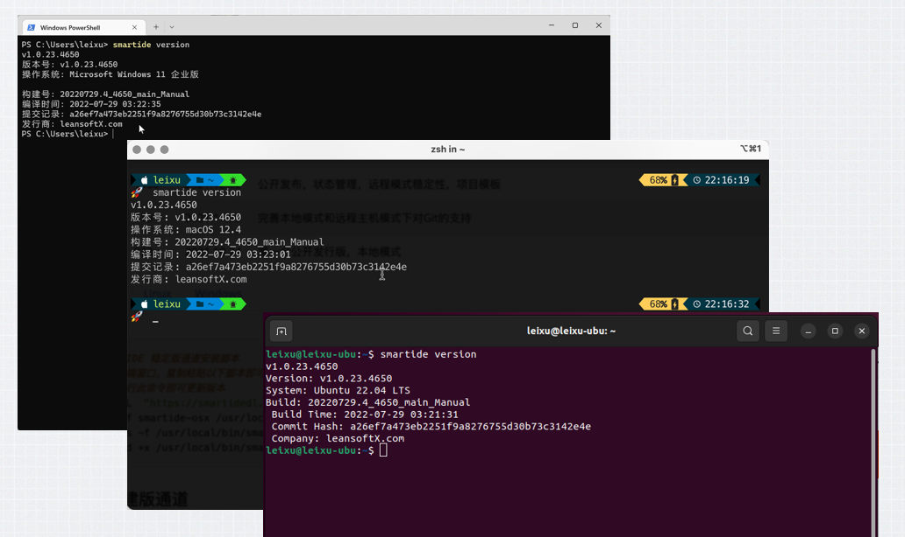
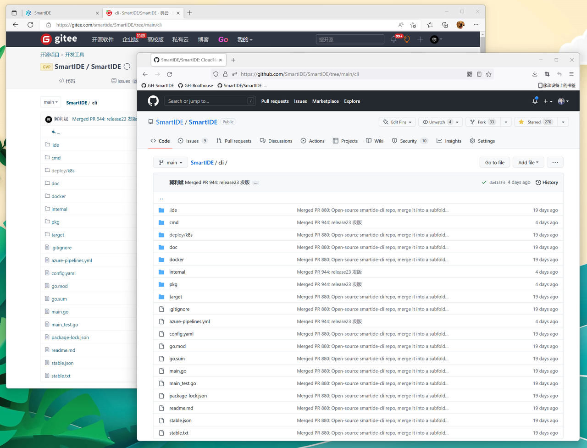
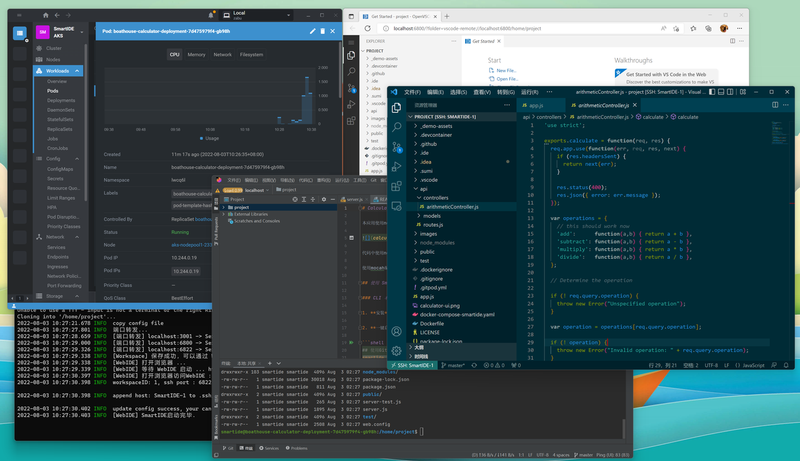
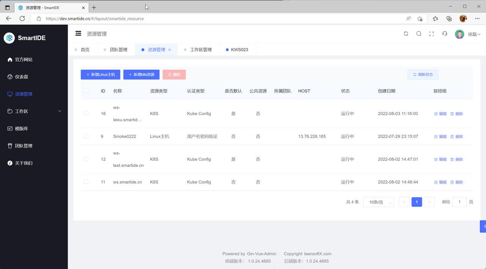
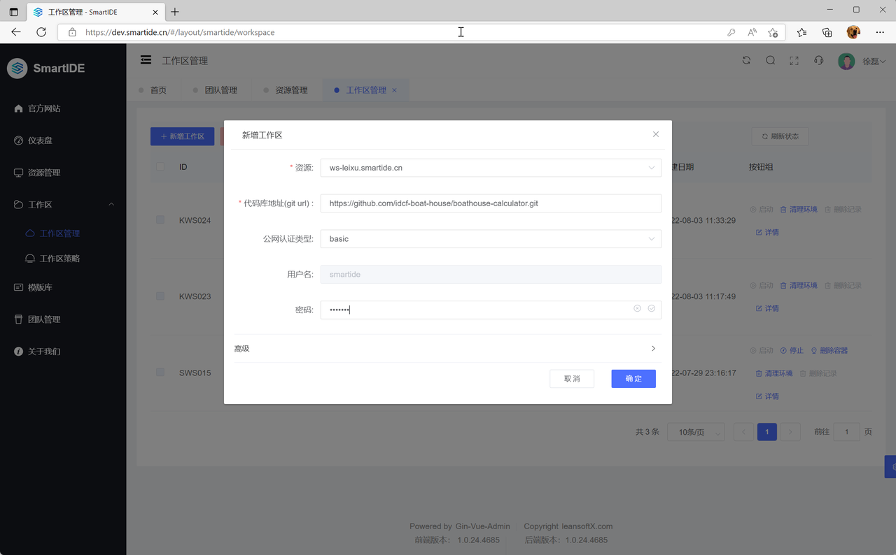
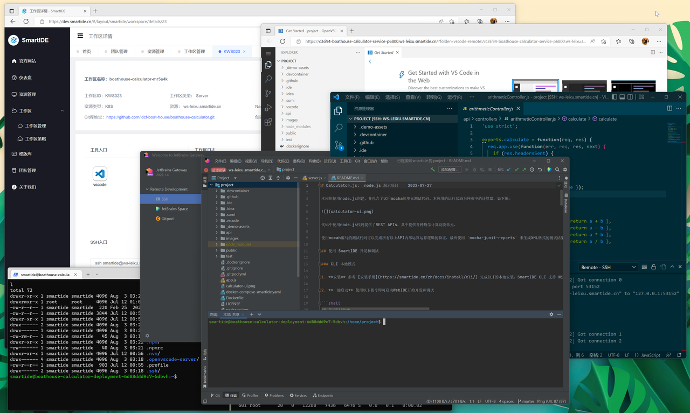
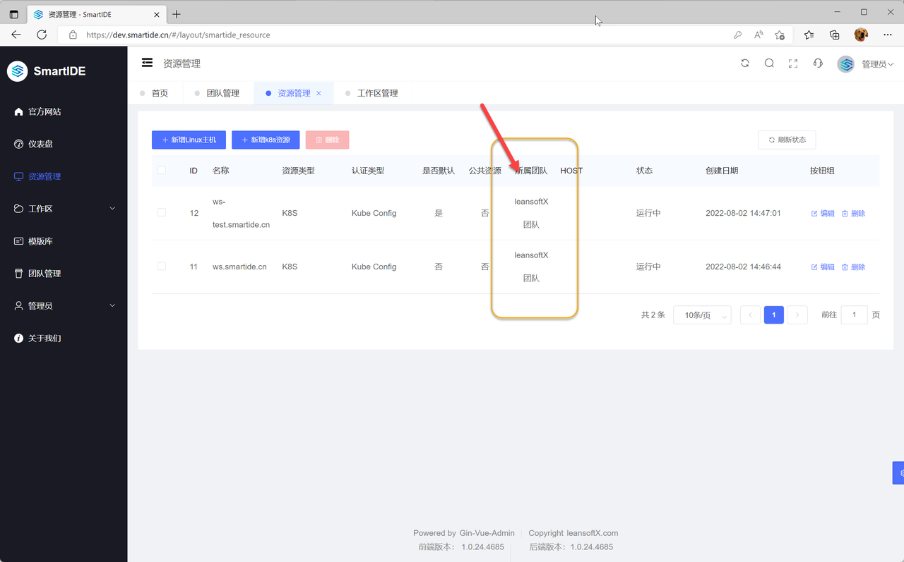
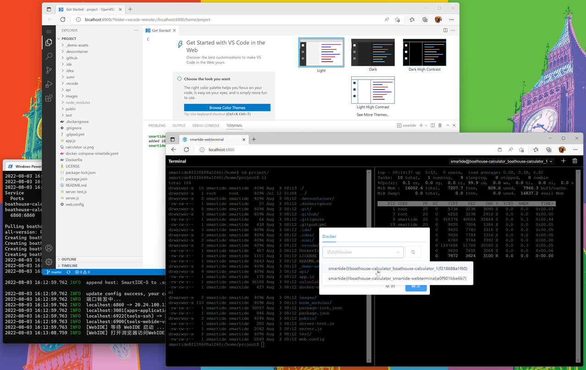
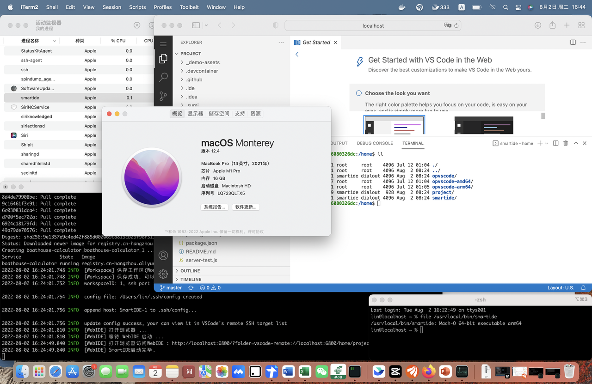

本次Sprint 23包括的特性有：完整的k8s模式支持，团队管理能力，简化使用本地IDE（VSCode/JetBrains Gateway）连接SmartIDE工作区的Hybrid模式，工作区扩展组件Web Terminal，ARM处理器支持以及Gitlab CI/CD流水线支持。另外，我们也扩展了VMLC的支持范围，对 node 和 java 两种技术栈提供了对应的 VMLC 开发者镜像。

## CLI代码正式开源

我们已经完成 CLI 代码的开源，相关代码已经推送到我们在GitHub和Gitee上面的代码仓库，包括全套CLI代码（Golang语言编写，采用GPLv3开源协议）。这套代码从2021年10月24日开始迭代，至今已经完成了700多次提交并发布了超过4000个版本，希望我们开源以后能够有更多社区小伙伴参与进来。



开源地址：
- https://github.com/SmartIDE/SmartIDE/tree/main/cli
- https://gitee.com/smartide/SmartIDE/tree/main/cli

## 完整k8s模式

我们已经发了完整的k8s模式支持，独立开发者可以使用CLI将SmartIDE工作区一键部署到k8s集群中，团队管理员则可以通过SmartIDE Server将k8s集群共享给团队中的开发者共享使用。当使用SmartIDE Server创建k8s工作区的时候，会同时创建指向工作区的动态二级域名URL以及ssh连接地址，开发者可以直接通过这个动态二级域名访问自己的工作区。这意味着开发者可以通过任何设备访问运行在k8s中的SmartIDE工作区，包括传统PC，平板电脑/iPad以及手机。

### CLI 启动k8s

这种方式适合个人开发者使用自己私有的k8s集群作为开发调试环境使用，开发者只需要在本地配置了k8s访问密钥（默认位置 ~/.kube/config），即可通过以下指令将SmartIDE云端工作区部署到k8s集群中。一旦启动完毕，cli会通过k8s的kubectl指令自动完成工作区内容器端口到localhost端口的映射，开发者即可通过 localhost 上的端口访问这个运行在k8s中的工作区。

使用CLI直接部署k8s工作区示例脚本如下

```bash
## cli 一键部署k8s工作区指令
smartide start --k8s <当前集群> \
  --repourl https://github.com/idcf-boat-house/boathouse-calculator.git \
  --filepath .ide/k8s.ide.yaml
## cli 获取工作区列表指令，可以用来获取 工作区Id 并查看工作区运行状态
smartide list
## cli 删除工作区
smartide remove <工作区Id>
```

*下图：使用cli启动完成k8s工作区效果如下，同时使用VSCode WebIDE，VSCode桌面版和JetBrains Webstorm远程模式连接k8s工作区。*



### Server启动k8s工作区

SmartIDE Server支持一键私有部署，你只需要一台Linux主机即可完成部署，并不依赖k8s集群。在完成Server的部署之后，管理员可以将一个或者多个k8s集群绑定在Server上，并将这些k8s集群分配给不同的团队使用。

*下图：同时绑定了3个k8s集群和一台linux主机的SmartIDE Server环境*



使用Server部署k8s工作区非常简单，只要在 工作区 | 工作区管理 | 新增工作区 的时候选择对应的k8s资源即可。

*下图：使用k8s资源新增工作区*



通过k8s工作区对外暴露的ssh连接地址，开发者可以直接使用本地终端程序连接到SmartIDE工作区并通过terminal完成各种操作。同时，开发者也可以使用VSCode以及JetBrains Gateway的ssh远程连接能力将本地的VSCode或者JetBrains系列的IDE（包括：IntelliJ IDEA, PyCharm, GoLand, WebStorm等等）连接到SmartIDE的远程工作，这样开发者可以同时兼顾本地IDE的快速操作体验以及远程工作区带来的各种好处。

*下图：使用Server启动的k8s工作区，同时通过VSCode WebIDE, VSCode桌面端和IDEA IntelliJ远程模式连接工作*



SmartIDE工作区提供VMLC支持，你可以在自己的k8s集群上激活VMLC能力，然后就可以在运行在k8s集群中的SmartIDE工作区内部嵌套运行docker或者k8s集群。开发者可以使用VMLC能力非常方便的创建和销毁属于自己的k8s集群，并使用这个个人k8s集群完成云原生应用的完整开发测试和部署迭代，这将简化开发者开发云原生应用的复杂度，并有效减少在正式集群上部署出错的机率，大幅提升云原生应用的开发效率。

相关文档参考：

- [Server私有部署操作手册](/zh/docs/install/server/)
- [为SmartIDE Server初始化k8s集群](/zh/docs/install/k8s/)
- [【开源云原生大会】现场演示：k8s套娃开发调试dapr应用](/zh/blog/2022-0615-vmlc/)
- [为什么Dapr是比SpringCloud和Istio更优雅的微服务框架？](/zh/blog/2022-0601-dapr/)
- [SmartIDE Server 快速启动教程](/zh/docs/quickstart/server/)

## 团队管理

SmartIDE Server中新增了团队管理能力，开发者可以根据需要创建团队并将其他用户加入团队。团队的创建者会成为当前团队的管理员，作为管理员可以将主机或者k8s集群绑定到团队并允许其他团队成员使用这些资源来创建工作区。

*下图：团队资源会显示所属团队*



## Hybrid混动模式 - VSCode SSH Remote 和 JetBrains Gateway 支持

我们简化了VSCode SSH Remote连接SmartIDE工作区的操作步骤，当开发者使用CLI启动工作区的时候，CLI会自动在 .ssh/config 文件中添加远程连接，这时开发者只需要打开VSCode的远程连接插件，即可看到已经配置好的远程连接，直接点击即可完成连接。在这个过程中，SmartIDE还会自动更新远程工作区容器中的 ~/.ssh/authorizedkeys 文件，将本地的ssh公钥添加进去，这样开发者在连接远程工作区的时候就不再需要输入密码，可以实现一键连接。

对于更喜欢使用JetBrains系列IDE的开发者来说，你仍然需要手工在JetBrains Gateway中创建远程连接才能使用Hybrid模式，不过以上的authorizedkey设置对JetBrains Gateway同样有效，因此连接过程也会更加简单。我们后续也会继续优化对JetBrains远程工作模式的支持，实现一键连接能力。

## WebTerminal 支持

为了方便开发者使用terminal访问SmartIDE工作区，我们提供了一个工作区扩展（Workspace AddOn），开发者可以在创建工作区的时候添加 --addon webterminal 即可在工作区中添加基于浏览器的终端窗口。虽然在VSCode以及JetBrains的WebIDE中都提供了terminal功能，但是提供一个独立的终端窗口仍然会大幅方便开发者对工作区进行管理，比如当你需要运行一个驻守进程，需要访问工作区中的其他容器或者希望使用类似Vim编辑器时。

通过添加 --addon webterminal 参数到本地/主机模式的cli启动命令中即可在环境中增加WebTerminal功能，示例指令如下

```Bash
## 添加 --addon webterminal 启动工作区
 smartide start --host 1 --addon webterminal https://github.com/idcf-boat-house/boathouse-calculator.git
 ```

*下图：通过WebTerminal可以访问当前工作区中的所有容器，并支持对terminal进行分屏，方便并行操作。*



SmartIDE WebTerminal是我们基于开源项目 [ysk2014/webshell](https://github.com/ysk2014/webshell) 改造完成的，因此采用和原项目同样的MIT开源协议。WebTerminal也是我们提供的第一个工作区扩展(Workspace Addon)，后续我们会逐步提供更多的扩展，加强开发者对远程工作区的操作能力。

SmartIDE WebTerminal 的开源地址：
- https://github.com/SmartIDE/smartide-web-terminal
- https://gitee.com/smartide/smartide-web-terminal

## ARM支持

本次迭代我们提供了对ARM处理器的支持，当前ARM处理器已经在很多领域得到了大规模的应用，包括：PC机（苹果的M系列电脑），移动设备，边缘计算及IoT以及服务器。SmartIDE与其他CloudIDE不同的是，我们将云端/远程工作区的调度能力封装成了一个独立的cli程序（已开源），并利用go语言的跨平台特性支持在多种操作系统上运行cli，这为SmartIDE提供了其他任何CloudIDE都不具备的跨平台跨设备运行能力。这次我们针对ARM处理器进行的支持进一步将我们的跨端能力进行了大幅的扩展，未来我们将探索将CloudIDE嵌入到移动设备，边缘计算和IoT领域，为开发者提供无所不在的开发环境管理能力。

我们同时优化了安装脚本，提供了ARM版本对应的安装通道，包括MacOS和Linux两种操作系统。

**Mac稳定版安装** 

```Bash
# MacOS

# Intel芯片
curl -OL  "https://smartidedl.blob.core.chinacloudapi.cn/releases/$(curl -L -s https://smartidedl.blob.core.chinacloudapi.cn/releases/stable.txt)/smartide-osx" \
&& mv -f smartide-osx /usr/local/bin/smartide \
&& ln -s -f /usr/local/bin/smartide /usr/local/bin/se \
&& chmod +x /usr/local/bin/smartide

# Apple芯片（比如M1/M2系列）
curl -OL  "https://smartidedl.blob.core.chinacloudapi.cn/releases/$(curl -L -s https://smartidedl.blob.core.chinacloudapi.cn/releases/stable.txt)/smartide-osx-arm64" \
&& mv -f smartide-osx-arm64 /usr/local/bin/smartide \
&& ln -s -f /usr/local/bin/smartide /usr/local/bin/se \
```

**Linux稳定版安装**

```Bash
# Linux 
# x86 架构处理器
curl -OL  "https://smartidedl.blob.core.chinacloudapi.cn/releases/$(curl -L -s https://smartidedl.blob.core.chinacloudapi.cn/releases/stable.txt)/smartide-linux-amd64" \
&& sudo mv -f smartide-linux-amd64 /usr/local/bin/smartide \
&& sudo ln -s -f /usr/local/bin/smartide /usr/local/bin/se \
&& sudo chmod +x /usr/local/bin/smartide

# arm 架构处理器
curl -OL  "https://smartidedl.blob.core.chinacloudapi.cn/releases/$(curl -L -s https://smartidedl.blob.core.chinacloudapi.cn/releases/stable.txt)/smartide-linux-arm64" \
&& sudo mv -f smartide-linux-arm64 /usr/local/bin/smartide \
&& sudo ln -s -f /usr/local/bin/smartide /usr/local/bin/se \
&& sudo chmod +x /usr/local/bin/smartide
```


*下图：在一台 Apple MacPro M1 上使用ARM原生版本的SmartIDE CLI运行容器化工作区*



本次我们对ARM处理器所提供的支持包括

- Linux和MacOS操作系统版本的cli提供amd64和arm64两种build，并已经发布至每日构建和稳定版通道
- SmartIDE Server相关镜像（smartide-web和smartide-api）的arm版镜像以及相关依赖镜像（包括tekton流水线相关的基础组件镜像），已经推送至阿里云镜像仓库和DockerHub
- 包含 smartide-cli arm64版本的 tekton-task 镜像，已经推送至阿里云镜像仓库和DockerHub
- 开发者镜像的arm版本，已经推送到阿里云镜像仓库和DockerHub
- Server一键部署脚本提供了内置的arm支持，可以自动识别当前部署环境，自动使用arm相关资源，具体请参考 [Server私有部署操作手册](/zh/docs/install/server/)

具体资源内容和链接可以参考

- https://github.com/SmartIDE/SmartIDE/issues/29 

## GitLab CI 流水线支持

我们将SmartIDE的核心功能设计成CLI的一个主要考虑就是允许开发者以最低的成本，最简单的方式将 云原生IDE 的能力集成到自己的系统中。在本次迭代中，我们开始进一步践行这个使命，在 CLI中提供了一个 mode=pipeline 的运行模式，这个模式允许用户在自己的流水线中使用 SmartIDE CLI 去创建工作区，本次只开放了远程主机模式，未来也会开放k8s模式。

使用场景：

- 扩展现有的企业流水线系统变成一个CloudIDE管理系统
- 部署带有对应版本代码的测试环境，这将方便开发者对测试环境中的问题进行定位并直接在测试环境中进行调试
- 针对某一个特定的历史版本创建开发调测环境，当我们收到用户的缺陷报告时往往发现自己开发环境中的代码版本已经大大超前于用户使用的版本了。这种情况开发者可以使用SmartIDE创建一个临时的环境，并直接定位于一个特定的历史版本（直接使用commitId），这样可以避免污染开发者本地，也可以避免开发者在修复问题之后将新版本（未经测试）的代码通过HOTFIX夹带上线。

使用方法非常简单，将下面 .gitlab-ci.yml 放置在自己的gitlab代码库中即可扩展 gitlab-ci 流水线具备管理 云原生IDE 的能力。

```YAML
variables:

  #remote host information which you can deploy your dev workspace and open it in WebIDE
  SMARTIDE_REMOTE_HOST: <remote dev/test env>
  SMARTIDE_REMOTE_HOST_USERNAME: <host username>
  SMARTIDE_REMOTE_HOST_PASSWORD: <host password>
  #git repo you want to develop in smartide,  you can use predefined variable  $CI_REPOSITORY_URL 
  #for the URL to clone the current Git repository (the URL already contain token, so you dont need to 
  #consider Authentication problem, for custom git repo url, you need resolve authentication yourself with token or ssh..)
  SMARTIDE_GIT_REPO_ADDRESS: $CI_REPOSITORY_URL
  #callback api address which you want to receive workspace information and trigger other custom events
  SMARTIDE_CALLBACK_API_ADDRESS: <callback api address>

stages:
    - setup_dev_env

smartide:
    stage: setup_dev_env
    image: 
        name: registry.cn-hangzhou.aliyuncs.com/smartide/smartide-cli:4475
        entrypoint: [""]
    script:
        - smartide version
        - smartide start --mode pipeline --isInsightDisabled false --host $SMARTIDE_REMOTE_HOST --username $SMARTIDE_REMOTE_HOST_USERNAME --password $SMARTIDE_REMOTE_HOST_PASSWORD --callback-api-address $SMARTIDE_CALLBACK_API_ADDRESS $SMARTIDE_GIT_REPO_ADDRESS
```

以上gitlab-ci流水线脚本将会使用当前的代码库创建云端工作区，开发者可以通过定制 .ide.yaml 配置文件在这个云端工作区中嵌入自己所需要的IDE，中间件或者其他环境，具体做法请参考 项目适配 和 镜像和模版。

本次迭代中我们针对 SmartIDE CLI 的现有功能进行了简单扩展，在现有的 client | server 两种运行模式之上提供了 pipeline 的运行模式。这种模式其实是一种headless模式，cli不会试图打开浏览器，也不会调用 smartide server 的 api，而是允许用户自行指定一个 callback 地址 $SMARTIDE_CALLBACK_API_ADDRESS。当CLI完成工作区创建工作后，会按照既定json格式将工作区详情回调通知给这个地址。使用这种方式，开发者可以非常简单的将 CloudIDE能力 集成到现有的企业级DevOps平台中，需要的仅仅是一个流水线调度工具（gitlab-ci, jenkins, azure pipeline或者其他任何支持命令行调用的工具）和一个接收回调json格式的接口。

本次提供的gitlab-ci集成示例只是一个开始，当前SmartIDE CLI的特性已经形成闭环，我们在后续迭代中会开始探索提供更多的集成方式，让开发者可以以最简单的方式享受到云端开发的好处。

> 使用云原生技术赋能开发者，是我们一贯的使命。


