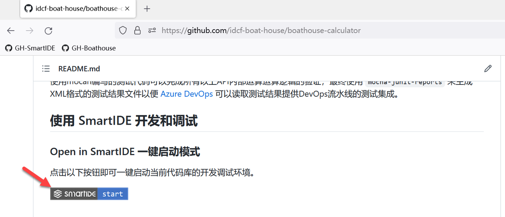
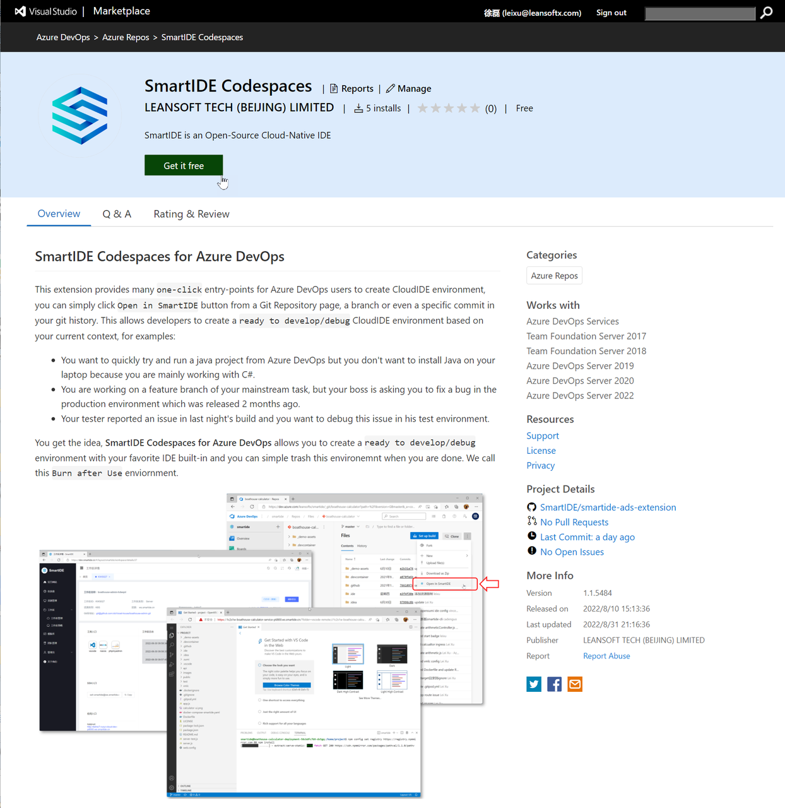
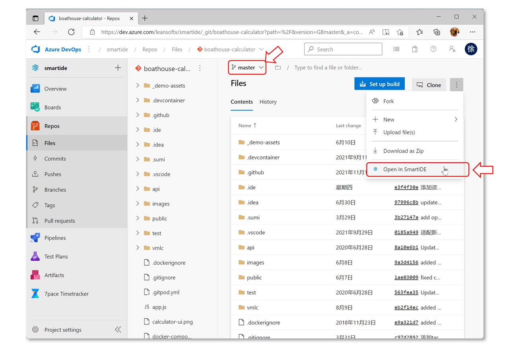
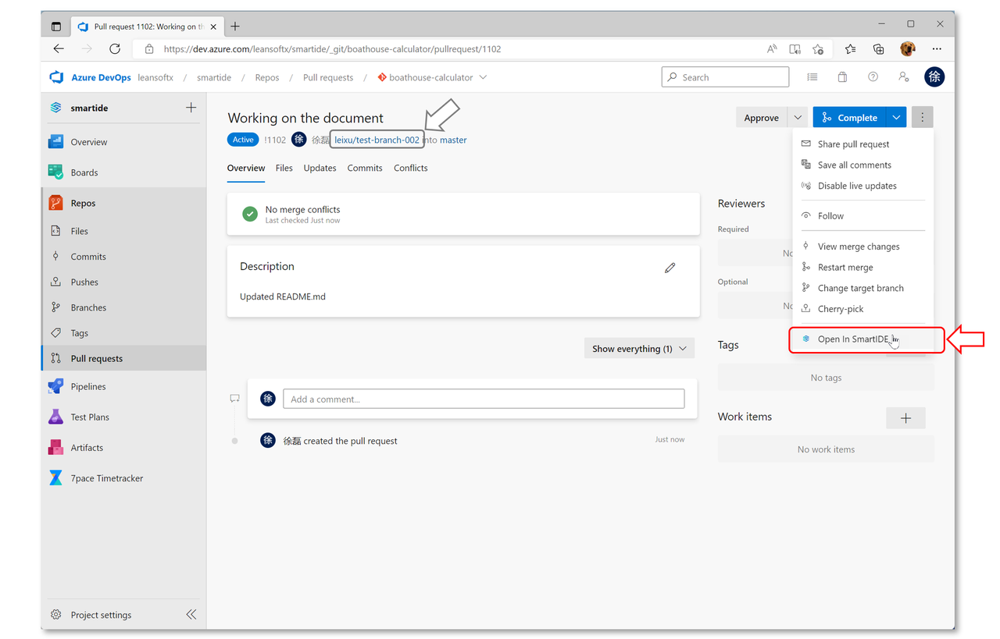
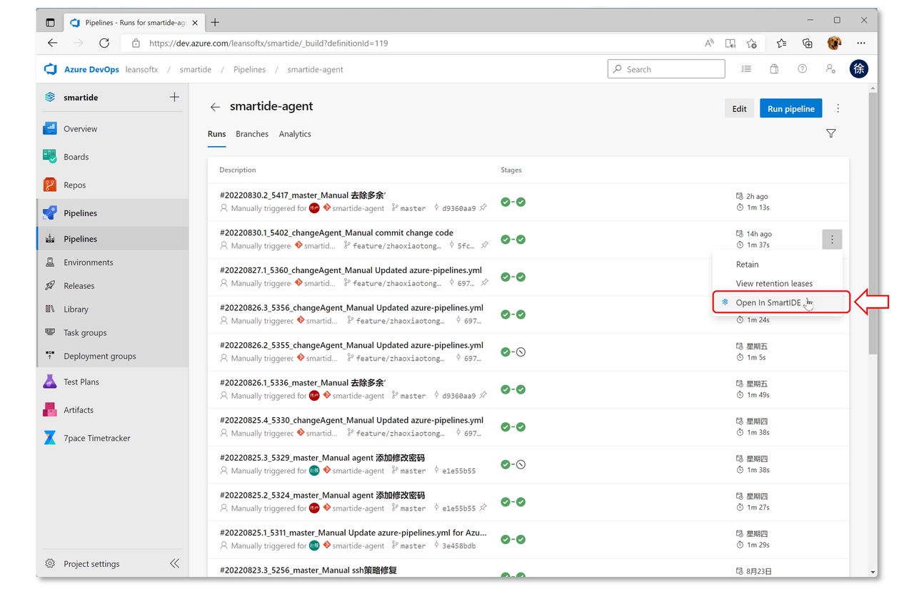
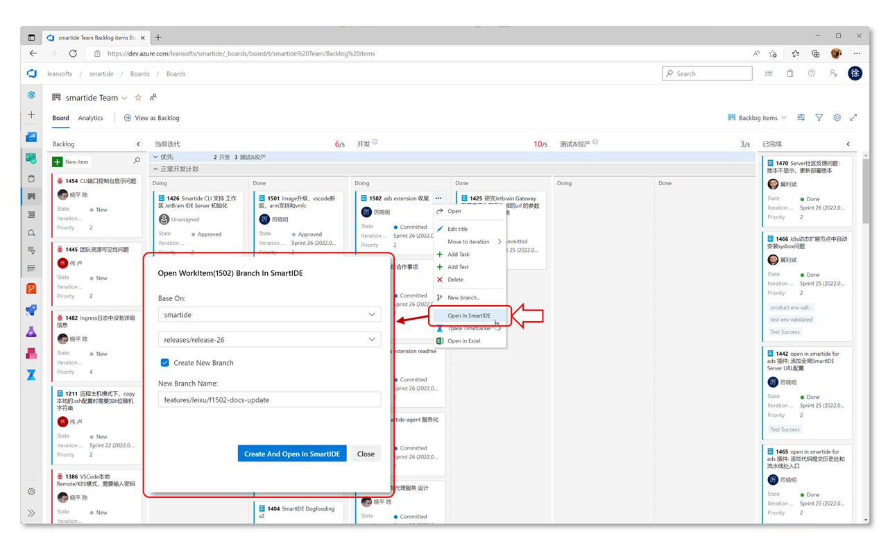
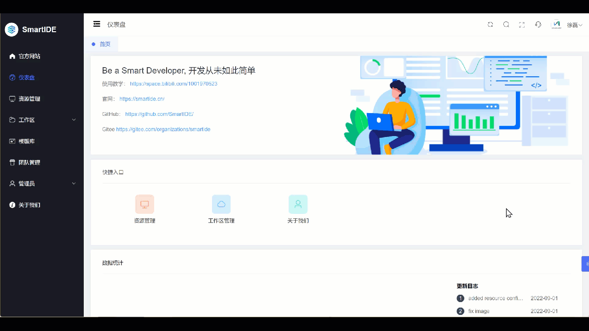
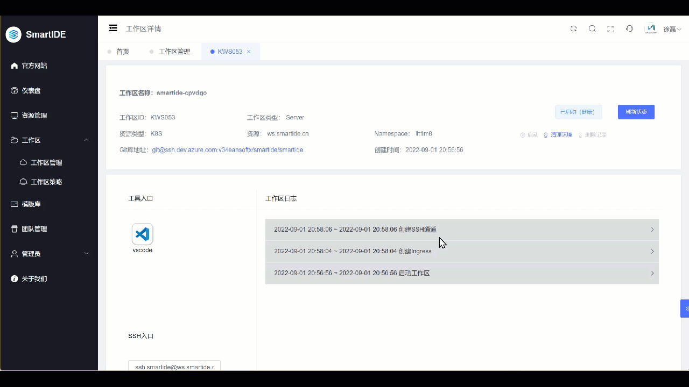

SmartIDE v1.0.25 (CLI build 5383, Server Build 5503) 已经发布，这个版本中我们针对一些关键特性进行了重要重构，比如 统一配置文件 和 工作区策略；同时我们还发布了一键启动链接和 SmartIDE Codespaces for Azure DevOps 插件，允许开发者在Azure DevOps上直接启动SmartIDE工作区；具体列表如下：

- 统一配置文件：开发者可以使用一个.ide.yaml 文件同时支持本地/远程/k8s三种模式的工作区配置
- 一键启动链接：允许开发者将这个链接放置在README文件，博客或者任何网页上，直接点击即可启动工作区
- Azure DevOps插件：允许开发者在Azure DevOps的代码库，流水线和工作项上一键启动SmartIDE工作区
- 工作区策略改进：增加了credential策略，方便开发者为k8s工作区设置密码，同时允许开发者使用这个密码通过SSH登录工作区

## 统一配置文件

这个版本中我们开始允许使用一个 `.ide.yaml` 同时支持本地，远程和k8s三种工作区模式的配置。由于我们使用了 `docker-compose` 和 `k8s manifest` 两种环境编排，在之前的版本中用户需要针对2种编排模式提供至少2个不同的 .ide.yaml 文件，并且需要在启动的时候特意指定不同的配置文件，才能在不同类型的资源上启动工作区。现在开始，我们支持使用一个统一的.ide.yaml作为多种环境资源的入口，比如以下配置文件：

```YAML
version: smartide/v0.3
orchestrator:
  type: allinone
  version: 3
workspace:
  dev-container:
    service-name: boathouse-calculator-dev
    webide-port: 6800
    ports: 
      tools-webide-vscode: 6800
      tools-ssh: 6822
      apps-application: 3001
    ide-type: vscode  
    volumes: 
      git-config: true
      ssh-key: true
    command:
      - npm config set registry https://registry.npmmirror.com
      - npm install
  kube-deploy-files: "k8s-deployment.yaml" 
  docker-compose-file: "docker-compose.yaml"
```

几个关键点：

- Line 3 - orchestrator 的类型指定为 allinone，之前的选项是 docker-compose 或者 k8s
- Line 20 - 指定k8s环境的编排文件
- Line 21 - 指定本地和主机环境的编排文件

使用统一配置文件之后，开发者可以使用统一的指令格式在三种不同资源上启动工作区，比如以下指令

```SHELL
## 本地启动 (windows/mac/linux)
smartide start https://github.com/idcf-boat-house/boathouse-calculator.git
## 远程主机启动
smartide start --host <hostId> https://github.com/idcf-boat-house/boathouse-calculator.git
## k8s启动
smartide start --k8s <context> https://github.com/idcf-boat-house/boathouse-calculator.git
```

可以看到，以上启动指令中只是增加了 `--host` 或者 `--k8s` 参数，其他部分完全一致。
另外，使用了统一配置文件之后，开发者也可以直接使用现有的 `docker-compose` 文件 或者 `k8s` 配置文件，不再需要复制这些文件的内容放入到我们的 .ide.yaml 中，这将简化开发者使用SmartIDE的准备工作。

## 网页链接一键启动

开发者现在可以使用类似以下的链接格式直接触发工作区的创建

```SHELL
https://dev.smartide.cn/#<Git代码库URL>
```

比如，以下就是一个可以直接触发工作区创建的链接，点击这个链接将会自动为boathouse-calculator库创建工作区

- https://dev.smartide.cn/#https://github.com/idcf-boat-house/boathouse-calculator 

你也可以在自己的README.md上放置一个 smartide start 的徽章，并在徽章上使用这个链接



以下视频展示了使用 **网页链接一键启动** Github代码库的场景



## SmartIDE Codespaces for Azure DevOps 插件

基于以上 **一键启动链接** 能力 ，我们为 Azure DevOps 平台提供了一个插件，允许用户在不同的位置按照当前的上下文启动工作区，自动获取代码库地址，分支名称等参数，简化开发者创建开发环境的准备工作。这些自动化操作可以简化开发者从日常任务中进入编码环境的操作，并实现全线上化操作。

以下视频是在早鸟用户姚圣伟访谈过程中对这个插件的演示过程：



这个插件和已经发布到了 Azure DevOps 的插件市场，链接如下

- [SmartIDE Codespaces for Azure DevOps 插件](https://marketplace.visualstudio.com/items?itemName=leansoftx.open-code-in-smartIDE)



这个插件提供了4类入口，分别是

**1. 代码库：** 用户可以在任何分支或者提交记录上启动工作区，插件会自动识别当前代码库地址和分支名称，并使用这些参数启动一个与当前代码版本一致的开发环境。



**2. 拉取请求：** 使用拉取请求（PR）进行代码评审是非常普遍的开发实践，但是评审者往往会因为无法看到软件的运行情况而无法对当前正在评审的内容进行有效和完整的判断。此时，评审者就可以直接点击 **Open in SmartIDE** 按钮，即可获取一个和当前被评审代码完全一致的，可运行的环境来辅助进行代码评审，这会让评审工作变得更加简单和高效。评审者在整个过程中也无需安装任何开发工具，SDK和中间件环境，所有的环境都通过SmartIDE自动创建完成。评审结束后这个环境就可以直接销毁。



**3. 流水线：** 一次流水线执行代表一个软件版本，测试人员一般是需要围绕这样的版本来进行测试的。传统模式下，测试人员需要准备几套测试环境来轮流测试不同的版本，如果出现多个版本并行的情况就很难管理这些测试环境。使用了SmartIDE之后，测试人员可以随时在任何版本（流水线运行记录）上点击 **Open in SmartIDE** 按钮，即可获取一个和当前流水线运行版本一致的环境进行测试；并且，这个环境中还包含了可供开发人员直接进行调试的IDE工具。测试过程中如果发现问题，测试人员可以将这个环境直接共享给开发者进行问题定位和调试。这种随用随起的测试环境将极大简化测试人员获取可用测试环境，以及在测试环境中定位问题的复杂度，提高开发测试迭代速度。



**4. 看板工作项：** 使用特性分支对应到具体工作任务是大型软件开发团队中常用的分支策略，也是一种高效团队协作模式。以往开发者需要手工创建分支，并在本地开发环境拉取代码并手工切换到这个分支上才能开发工作。如果遇到同时在2个特性上工作的情况，繁琐的分支操作很容易造成操作失误。现在，开发者可以在工作任务上直接点击 **Open in SmartIDE** 按钮并根据需要创建或者使用已有分支，SmartIDE会自动使用指定分支创建开发环境。对于多特性并行情况，开发者只需要打开2个不同的浏览器窗口即可同时在2个分支上互不影响的进行工作。



**SmartIDE Codespaces for Azure DevOps** 插件只是我们计划提供的各种插件的一个示例，未来我们还将为常用的DevOps工具提供类似的入口，比如：Jira, Confluence, GitLab, Jenkins等等。这些扩展将帮助现有的DevOps工具与开发环境及编码过程实现更加紧密的集成，为开发人员提供一体化的工作体验。

## 工作区策略改进

工作区策略是SmartIDE中针对工作区进行各种控制的通用能力，之前我们已经提供了 Git Config 和 SSH Key 两种策略分别用来控制工作区中的git配置和ssh密钥。这个版本中我们增加了统一设定工作区访问密码的credential策略，一旦设定，开发者就可以使用一个统一的密码来控制对自己工作区的访问，包括SSH访问。

对于原有的SSH Key策略，我们进一步完善了密钥的推送过程，帮助开发者在使用SSH远程连接的时候实现免密登录。

*下图：开发者获取SSH登陆指令并直接进入工作控制台终端。*



开发者也可以使用这个指令将本地VSCode或者JetBrains IDE连接到工作区，整个过程无需输入密码。

*下图：使用VSCode远程模式免密进入SmartIDE云端工作区*



感谢你对SmartIDE的关注，欢迎从SmartIDE官网下载体验我们的产品，获取加入我们的早鸟群，及时了解SmartIDE的开发进展。


