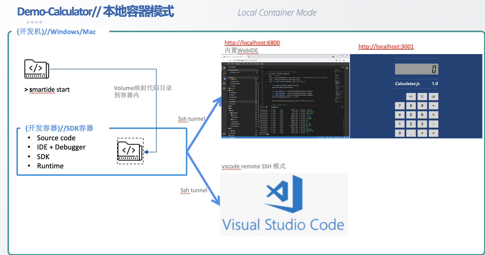
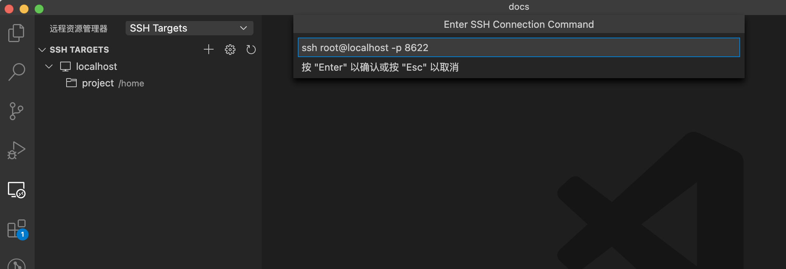
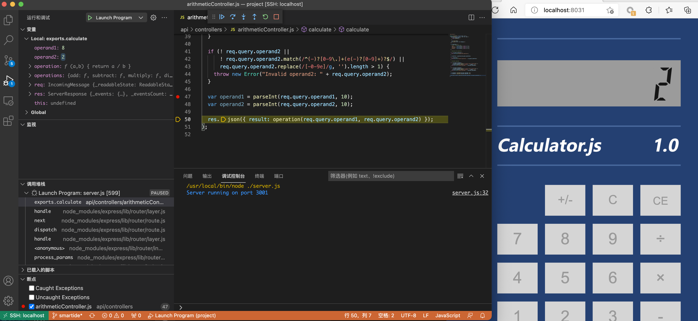

## 场景

- SmartIDE本地运行，使用WebIDE方式调试
- 使用本地VScode链接smartIDE开发容器调试

## 整体说明



机制说明：

## 先决条件

安装SmartIDE，参考链接: https://smartide.dev/zh/docs/getting-started/install/

Demo源码获取地址，链接: https://github.com/CadenGjy/boathouse-calculator.git

##  场景1.SmartIDE本地运行，使用WebIDE方式调试

1.clone代码库

```shell
git clone https://github.com/CadenGjy/boathouse-calculator.git
cd boathouse-calculator
```

2.快速创建并启动SmartIDE开发环境

```shell
smartide start 
```


在打开的WebIDE 中打开 terminal，并启动项目

```shell
npm install 
npm start 
```


可以看到应用已在容器3001端口启动，这时通过隧道转发机制，我们可以直接通过 http://localhost:3001/ 打开应用

3.添加断点调试程序

在终端中，使用‘Ctrl+z’终止进程


添加断点 **/api/controllers/arithmeticController.js**  的line47


输入 **F5** 启动调试，打开 http://localhost:3001/ 即可通过使用计算器进入调试步骤


##  场景2.使用本地VScode链接smartIDE开发容器调试

1.VScode安装插件 **Remote Development**


2.新建SSH连接并保存到配置文件




3.打开SSH连接，中间需要多次输入密码


4.打开远程容器目录


5.npm i安装依赖包，运行和调试


