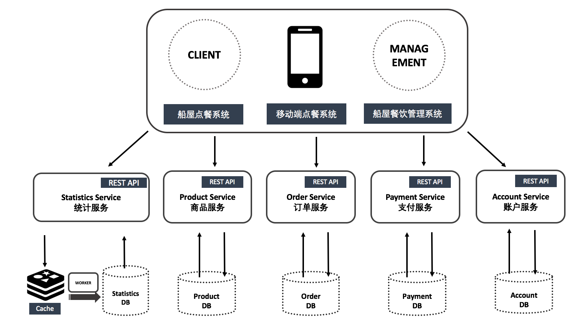

Boathouse开源共创项目是由IDCF社区于2020年2月发起的一个开源项目，它的目的在于为希望在企业中实施落地DevOps各类实践的团队提供一套可以借鉴的源代码，最佳实践，工具链集成方案和相关的文档。

Boathouse的全部产品创意，功能设计，开发计划，代码，DevOps工具链搭建，流水线配置以及全部环境全部向社区开放。

Boathouse开源共创项目由 Boathouse前端应用 和 Boathouse后端系统 构成，分别采用了 Vue.js 和 Java Springboot 作为开发框架以及 MySQL 作为数据库；同时提供了基于 Jenkins 的持续交付流水线配置。

- Boathosue前端应用：包含使用 Vue.js 实现的2个web应用，分别提供Boathouse船屋餐厅对客提供的点餐系统和餐厅工作人员所使用的后台管理系统，具备餐厅管理的业务属性。
- Boathouse后端系统：包含使用 Java Springboot 实现的一些列微服务，为行业应用提供通用的API，比如：商品服务、订单服务、支付服务和用户管理服务；后端系统本身不带有业务属性，可以根据不同行业特性进行适配，Boathouse的餐厅管理前端应用就是基于这套API实现出来的餐饮行业应用示例，开发者可以根据自己的需要对后端系统进行扩展，实现对不同行业应用的支持。

