## 使用SmartIDE开发调试若依项目(前端分离版)

SmartIDE是下一代的云原生IDE，可以帮助你一键启动项目的集成开发环境，直接进入编码调试，免除安装SDK、IDE和其他相关工具的麻烦。

我们已经对Ruoyi-Vue进行了SmartIDE适配，可以一键启动包含以下工具的 **标准化全栈开发环境(SFDE - Standard Fullstack Development Environment)**：

- 完整支持Vue的Node.js开发工具语言包（SDK）
- 完整支持Java语言Spring框架的开发工具语言包（SDK）
- 用户可以选择2种WebIDE来加载项目进行前后端联调，VSCode WebIDE，JetBrains IDE 社区版 WebIDE
- 配置好的中间件，包括：MySQL和Redis服务器环境
- 数据管理工具PHPMyAdmin用于管理MySQL数据库


<br>
下面将对如何使用SmartIDE进行RuoYi项目的前后端联调进行描述：

## 1. 完整操作视频

为了便于大家更直观的了解使用SmartIDE开发调试RuoYi的过程，我们在B站提上提供了视频供大家参考，视频地址如下：


## 2. 本地模式启动项目

使用SmartIDE启动RuoYi的开发调试非常简单，仅需要两个步骤

1. 按照 [安装手册](https://smartide.cn/zh/docs/install/) 完成 SmartIDE 本地命令行工具的安装
2. 使用以下命令一键启动SFDE

```shell
## SmartIDE是一款跨平台开发工具，您可以在Windows或者MacOS上执行同样的指令
smartide start https://gitee.com/SmartIDE/RuoYi-Vue.git
```

> 注意：第一次启动因为下载容器镜像，需要较长时间，大概需要十分钟。SmartIDE所使用的容器镜像全部托管于阿里云在国内的镜像仓库上，因此一般不会出现无法拉取镜像的情况。如果你的网络过于不稳定，多尝试几次即可。

以上命令会在当前目录自动完成代码克隆，拉取开发环境镜像，启动容器，自动开启WebIDE的动作。

以上动作完成后，即可看到类似如下的WebIDE窗口，默认情况下将使用JetBrains Projector模式的 **IntelliJ IDEA 社区版**

> WebIDE的地址是 https://localhost:6800

JetBrains Projector是一款基于JetBrains产品的WebIDE，提供通过浏览器操作并与桌面IDE保持一致的操作体验，第一次打开 JetBrains Projector 的时候需要进行简单的初始化操作如下：

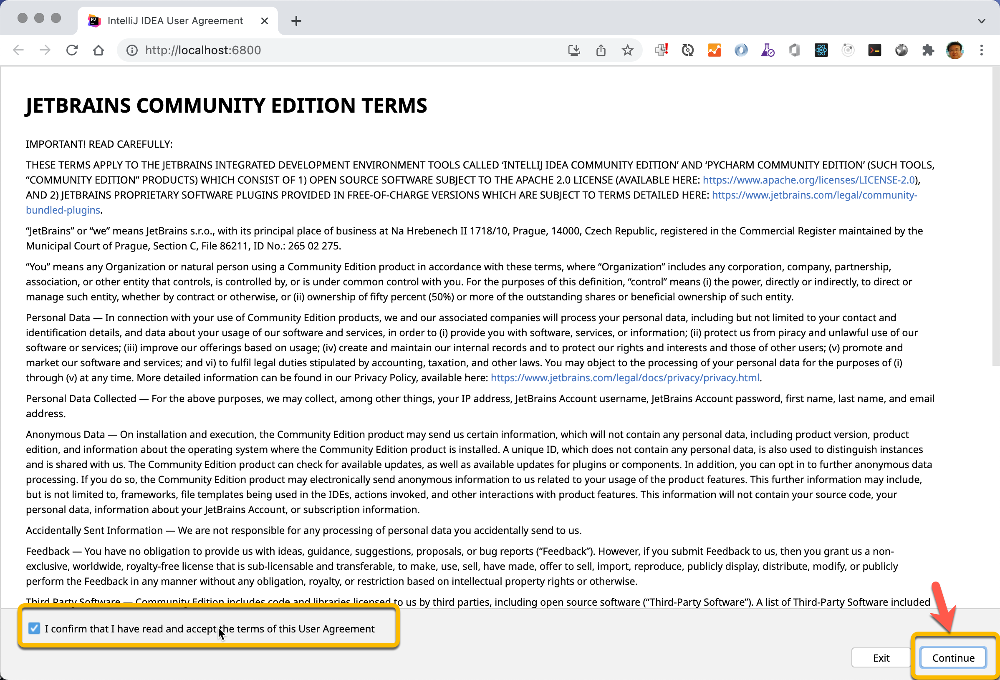

在 **Welcome to IntelliJ IDEA** 页面中，点击 **Open** 然后选择 **/home/project** 目录，然后点击 **OK** 

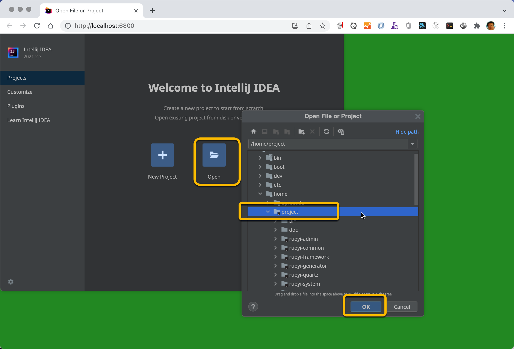

在以下对话框中选择 **Trust Project** 

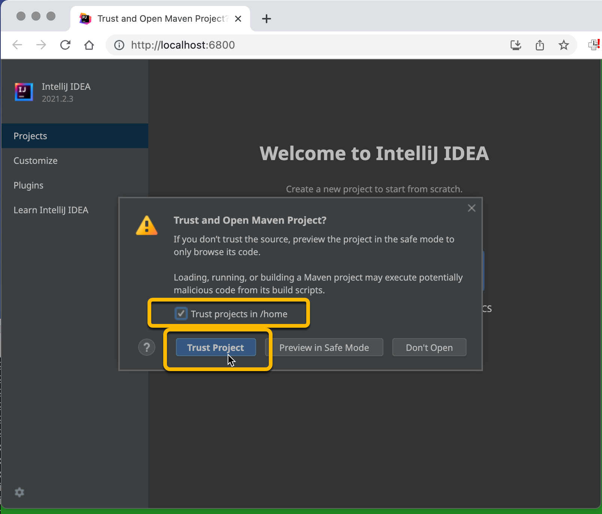

加载完毕的Web版IntelliJ IDEA如下

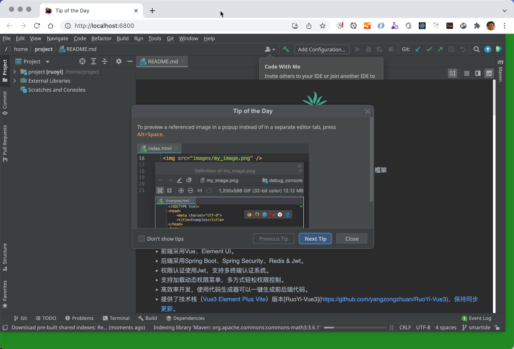

## 3. 远程主机模式启动项目

远程主机模式允许你将SmartIDE的开发环境一键部署到一台安装了Docker环境的远程主机上，并远程连接到这台主机进行开发，对于比较复杂的项目来说这样做可以让你扩展本地开发机的能力，实现云端开发体验。

使用远程模式也仅需要两个步骤

> 注意：远程主机模式下你不必在本地安装Docker环境，只需要安装好SmartIDE的命令行工具即可

1. 按照 [Docker & Docker-Compose 安装手册 (Linux服务器)](https://smartide.cn/zh/docs/install/docker-install-linux/) 准备好一台远程主机，建议使用Ubuntu 18.04 LTS以上版本的Linux环境。
2. 按照以下指令启动项目

```shell
# 将远程主机添加到SmartIDE中
smartide host add <IpAddress> --username <SSH-UserName> --password <SSH-Password> --port <SSH-Port默认为22>

# 获取主机ID
smartide host list

# 使用远程主机启动项目
smartide start --host <主机ID> https://gitee.com/SmartIDE/RuoYi-Vue.git
```

## 4. 启动前后端开发调试

使用SmartIDE启动环境后，我们即可启动前后端联调操作，为了避免SmartIDE的配置影响RuoYi的默认配置，我们扩展了application.yml中的配置，为SmartIDE提供了单独的日志、MySQL和Redis配置。

1. 切换spring配置使用SmartIDE环境

如果要使用SmartIDE进行联调，请先打开 **/ruoyi-admin/src/main/resources/application.yml**，将 **spring.profiles.active** 的值设置为 smartide

```yaml
# Spring配置
spring:
  profiles:
    active: smartide
```

2. 创建ry-vue数据库

> 说明：使用SmartIDE运行开发环境的一个好处就是一键启动所有相关环境，我们已经在你的环境中内置了专门用于RuoYi项目开发的MySQL数据库，并且为了方便你的操作，也提供了PhpMyAdmin这个工具方便你进行数据管理操作。

打开SmartIDE内置的PHPMyAdmin工具，地址是：http://localhost:8090 

- 服务器：ruoyi-db
- 用户名：root
- 密码：password

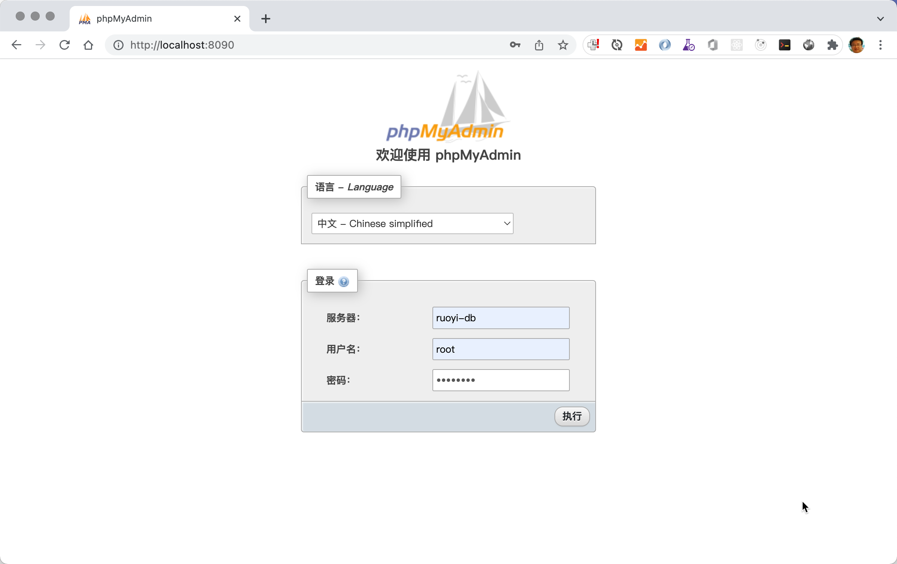

点击 **新建** 并输入 **ry-vue** 作为数据库名称，点击 **创建**  按钮

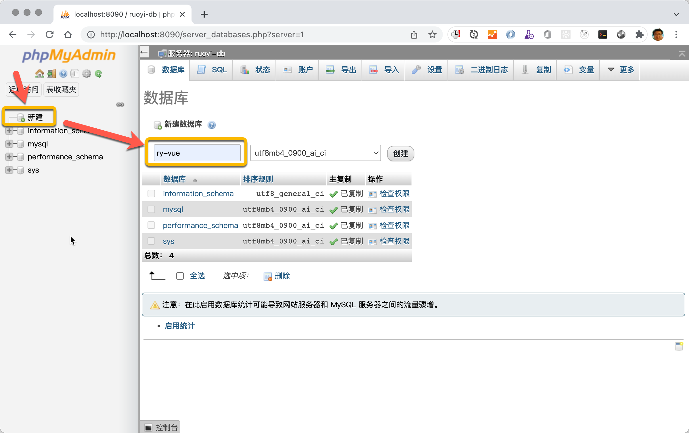

然后在这个数据库中依次执行以下两个脚本：

- sql/ry_20210908.sql
- sql/quartz.sql

执行完毕之后的状态如下：

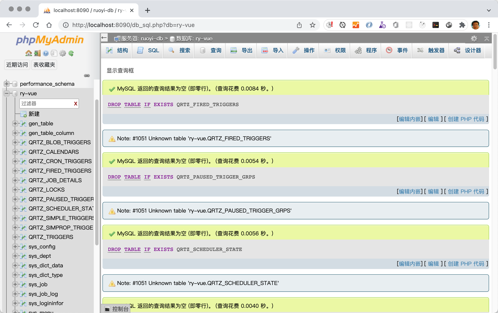

3. 编译并安装所有RuoYi后端组件，并启动后端调试

然后，我们需要打开IDEA内置的terminal，并执行以下指令以确保RuoYi所有模块都已经编译并放入共享组件库中

```shell
## 请在RuoYi项目根目录执行
mvn package
mvn install
```

点击 **File | Project Structure**  设置当前项目的JDK版本，环境中已经内置了OpenJDK-11这个版本，如果希望使用其他JDK版本也可以选择 **Add JDK** 自行下载。

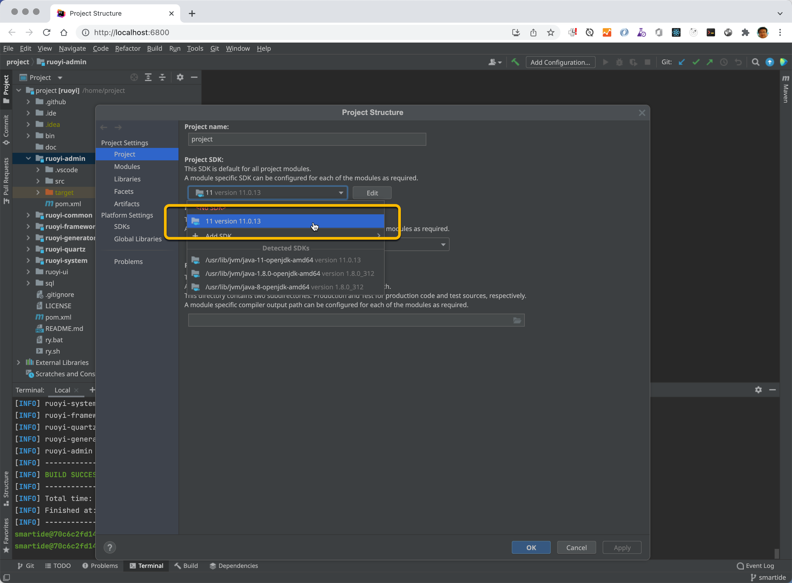

右键点击 **ruoyi-admin/src/main/java/com.ruoyi/RuoYiApplication.java** 文件，并启动 **Debug** 模式

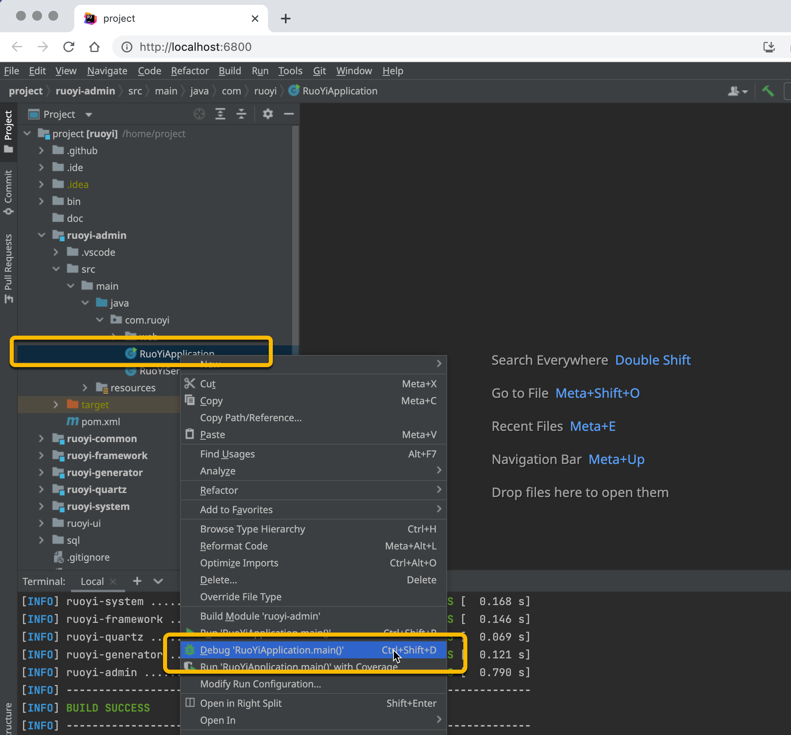

注意 Console 中出现 **若依启动成功** 的字样，表示后端应用启动成功。

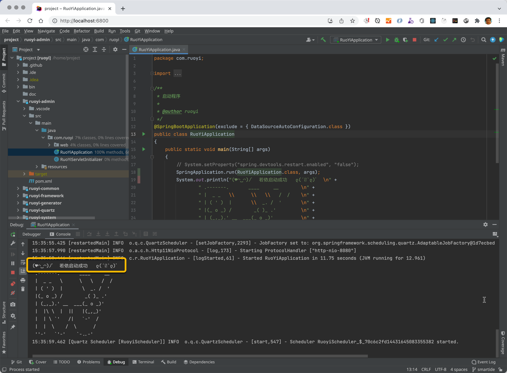

4. 编译并启动前端项目

现在我们可以进入 **ruoyi-ui** 项目，启动前端项目

后端启动后，我们可以通过命令启动前端，使用内置的 terminal 运行以下命令以便进入 ruoyi-ui 项目并启动前端服务

```shell
cd ruoyi-ui
npm install
npm run dev
```

执行完毕后，检查 terminal 中出现了 App running at 的字样就表示前端项目启动成功了

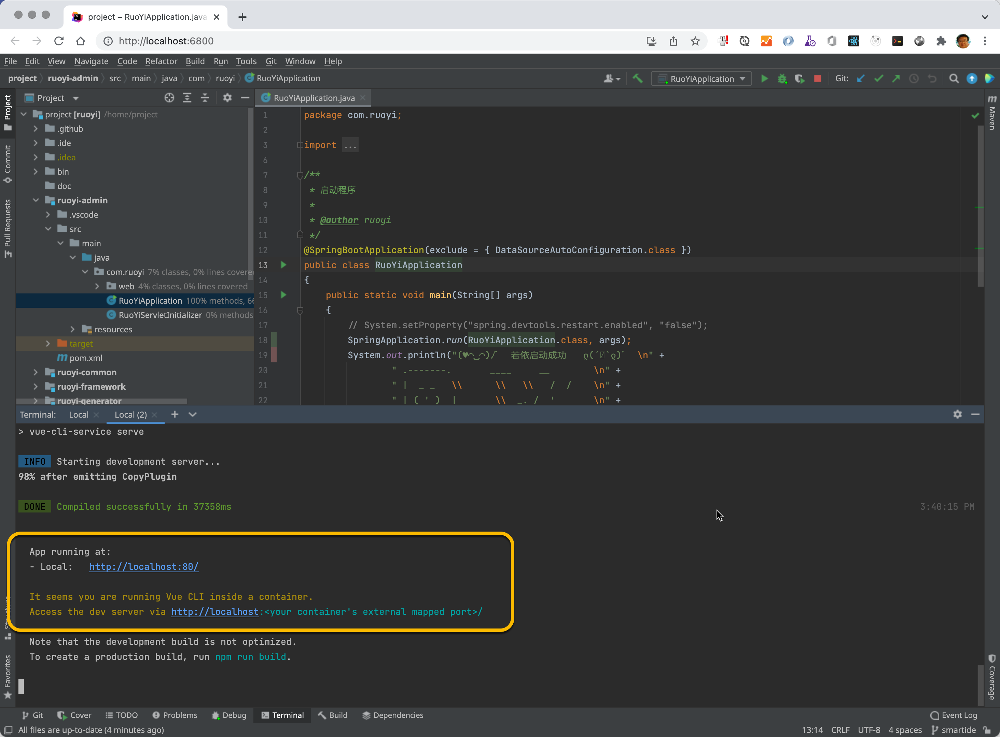

> 注意：我们的环境运行在容器中，我们将容器内的80端口映射到了你本地的8000端口。

现在打开 http://localhost:8000 即可访问若依项目了


5. 设置断点，进入交互式单步调试状态

如果你按照刚才的操作方式用 **Debug** 模式启动了后端项目，那么现在可以在任何位置创建断点，并进入断点调试模式

比如，你可以在 **/ruoyi-admin/src/main/java/com.ruoyi/web/controllers/system/SysUserController.java** 的 **第59行** 设置断点，然后进入 **若依管理系统 ｜ 系统管理 ｜ 用户管理** 菜单，即可触发此断点，注意下图中的IDEA已经中断在代码行59.

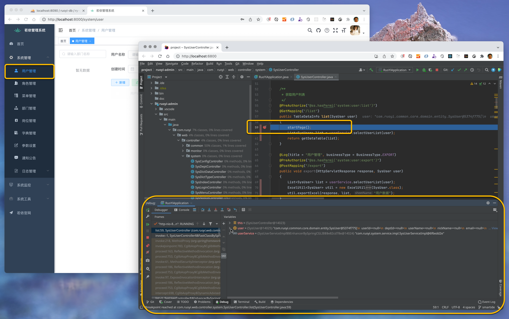

其他调试相关的入口如下：

- 容器内项目目录 /home/project
- WebIDE入口 http://localhost:6800
- 数据库管理PHPMyAdmin http://localhost:8090
- 前端应用入口 http://localhost:8000

> 注意：如果你本地的以上端口有被占用的情况，SmartIDE会自动在当前端口上增加100，具体转发情况请参考SmartIDE命令的日志输出。

## 5. 停止和恢复环境

如果需要停止和恢复环境，可以使用SmartIDE的状态管理指令如下

```shell
## 获取已经创建好的开发环境列表
smartide list
## 停止一个开发环境
smartide stop <ID>
## 启动一个开发环境
smartide start <ID>
## 清理一个开发环境
## 参数说明：-f 强制删除 -y 跳过确认 -p 删除磁盘上的代码库 -i 删除容器镜像
smartide remove <ID> -fypi
```

## 6. 相关链接

- 若依项目SmartIDE仓库地址：https://gitee.com/SmartIDE/RuoYi-Vue.git
- 若依项目（前后端分离版）：https://gitee.com/y_project/RuoYi-Vue
- 若依项目SmartIDE PR：https://gitee.com/y_project/RuoYi-Vue/pulls/432

---
**感谢对SmartIDE的支持：Be a Smart Developer，开发从未如此简单。**


