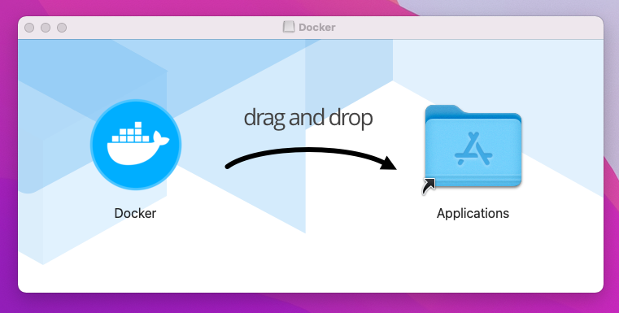
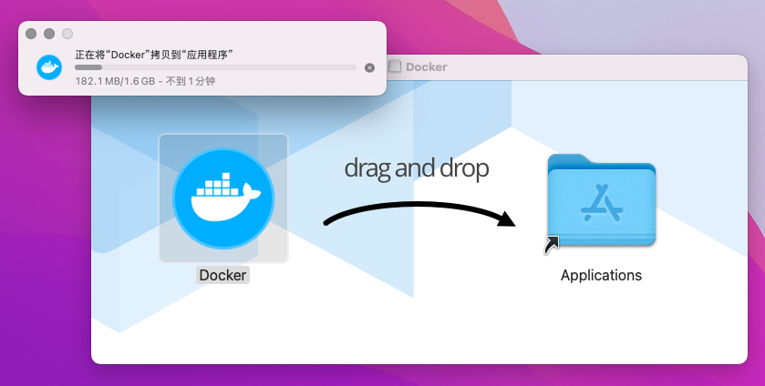
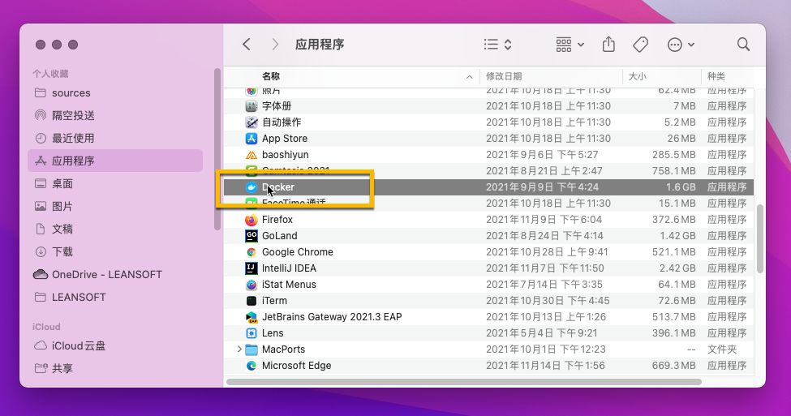
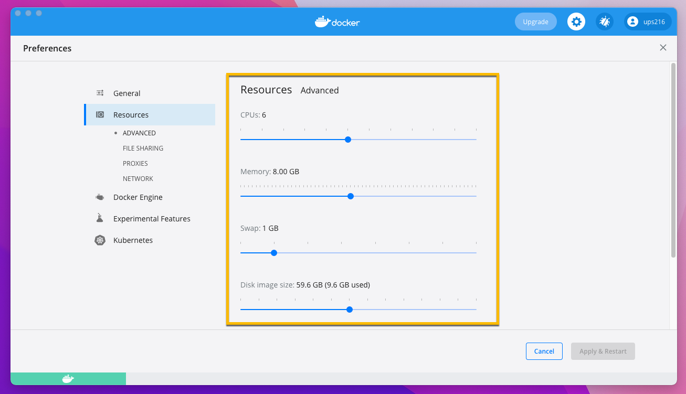

Docker 桌面版（Docker Desktop）可以在桌面操作系统上管理容器化环境，SmartIDE本地模式需要调用Docker桌面版以便管理容器环境。安装这个工具其实非常简单，但是安装之后最好对工具的一些默认设置进行一些调整，以便让SmartIDE运行得更加高效。

## 硬件和操作系统要求

硬件要求：
- 2016款以后的MacBook, MacBook Pro或者Air都可以
- 最少4核8G，建议8核16G以上配置
- 最好使用SSD硬盘，并有100G以上空余存储空间

操作系统要求：
- 高于 OS 10.12
- 建议更新到最新版操作系统

## 下载安装包

Docker桌面是一款免费工具，大家可以从以下两个渠道下载：

- 官网下载地址 https://www.docker.com
- SmartIDE所提供的国内镜像
  - [Intel芯片版下载地址](https://smartidedl.blob.core.chinacloudapi.cn/docker/20210926/Docker-osx-intel.dmg)
  - [Apple M1芯片版下载地址](https://smartidedl.blob.core.chinacloudapi.cn/docker/20210926/Docker-osx-apple.dmg)


## 运行安装程序

双击下载的安装包文件，启动安装程序



按照图中提示，将左侧的Docker图标拖放到右侧的Application（应用程序）文件夹中，等待复制过程完成



打开 **访达 ｜ 应用程序** 并双击 Docker 图标



这时系统会有安全提示，选择 **打开** 即可


Docker启动需要一段时间，等待启动完毕，就可以使用了

> 启动中状态


> 启动完成状态


## 配置Docker桌面版

默认情况下Docker桌面版会对其所使用的资源比例采取比较保守的策略，因为我们需要在容器中运行开发环境，你可以根据自己本地开发机的配置适当调高以下设置以便获得更好的体验。

> 建议：至少给Docker分配4个以上的CPU Core和8G以上内存。



## 验证 Docker桌面版 可以正常工作

打开命令行窗口运行以下命令：

```shell
docker run hello-world
```

如果你看到了类似如下的输出，则表示你的Docker桌面版已经正常工作，你现在就可以继续按照 [快速启动](/zh/docs/quickstart/) 继续体验SmartIDE的功能了。


