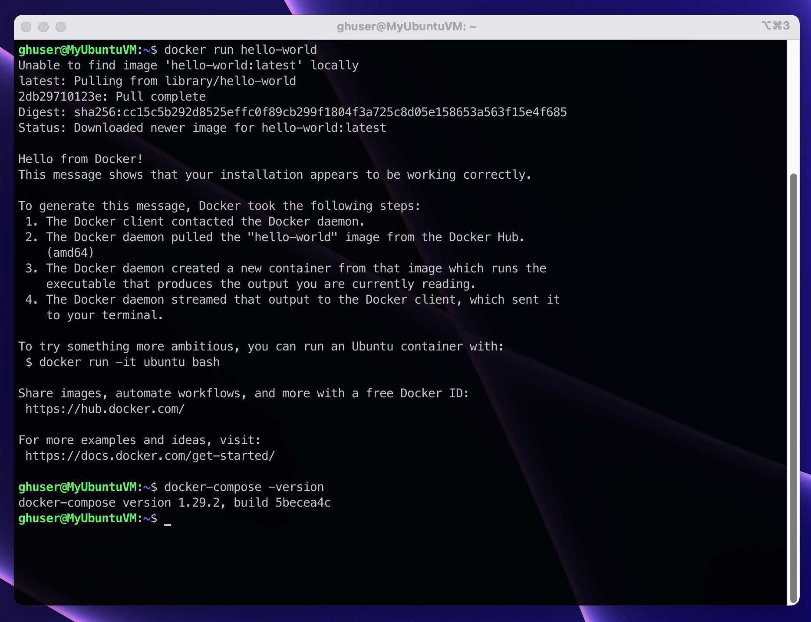
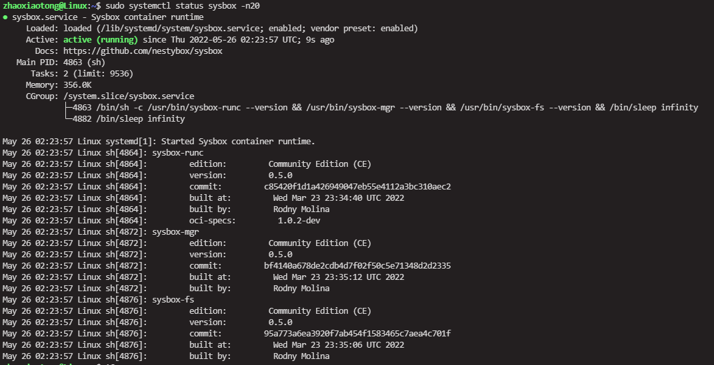

SmartIDE可以使用任意安装了docker和docker-compose工具的linux主机作为开发环境远程主机，你的主机可以运行在公有云、私有云、企业数据中心甚至你自己家里，只要这台机器可以和互联网连通，就可以作为SmartIDE的远程主机。本文档描述正确安装docker和docker-compose工具以便确保SmartIDE可以正常管理这台远程主机。

## 环境要求列表

使用SmartIDE的远程主机需要满足以下要求

- 操作系统：
  - Ubuntu 20.04LTS, 18.04LTS, 16.04LTS
  - CentOS 7.2 以上
- 软件需求：
  - Git
  - Docker
  - Docker-Compose

> 特别说明：你无需在linux主机上安装SmartIDE CLI命令行工具，因为所有的操作都可以在本地开发机（Windows/MacOS）上完成，SmartIDE本身内置使用SSH远程操作linux主机。

## 配置非root用户登陆服务器

使用SmartIDE远程控制的linux主机需要使用非root用户登陆，这是为了确保更加安全的开发环境以及主机和容器内文件系统权限的适配。请按照以下操作创建用户并赋予免密码sudo权限。

**备注：以下操作需要使用root账号或者sudo方式运行。**

以下脚本将创建一个叫做 smartide 的用户并赋予面密码的sudo权限。

```shell
## 创建用户及用户文件系统
useradd -m smartide
## 为用户设置密码，请在命令执行后输入你需要设置的密码，确保你将这个密码记录下来
passwd smartide
## 为用户添加sudo权限
usermod -aG sudo smartide
## 编辑 /etc/sudoers
vim /etc/sudoers
```

**如果使用vim编辑器，按 "i" 进入插入编辑模式，编辑完成后按ESC退出编辑模式，输入 ":wq!" 保存退出。**

在 /etc/sudoers 文件中添加如下内容

```shell
smartide   ALL=(ALL) NOPASSWD: ALL
```

同时修改开头为 %sudo 的行为以下内容

```shell
%sudo   ALL=(ALL) NOPASSWD: ALL
```


## 一键安装docker和docker-compose工具

> 使用以上创建的smartide用户或者其他符合要求的非root用户登陆服务器。

使用以下命令在Linux主机上安装docker和docker-compose工具，**运行完成之后请从当前终端登出并从新登入以便脚本完成生效**。

```bash
# 通过ssh连接到你的Linux主机，复制并粘贴此命令到终端
# 注意不要使用sudo方式运行此脚本
curl -o- https://smartidedl.blob.core.chinacloudapi.cn/docker/linux/docker-install.sh | bash
# 退出当前登录
exit
```

完成以上操作后，请运行以下命令测试 docker 和 docker-compose 正常安装。

```shell
docker run hello-world
docker-compose -version
```

如何可以出现类似以下结果，则表示docker和docker-compose均已经正常安装。



完成以上2项设置之后，你就可以继续按照 [快速启动](/zh/docs/quickstart/) 中 **远程模式** 部分的说明继续体验SmartIDE的功能了。

## 配置Sysbox
> 如果你想通过Smartide来配置含有dapr的dotnet开发环境，由于dapr本身与在初始化会构建多个容器，想要在容器中使用dapr，就必须需要在容器中运行容器，而想要实现这种方式最好的办法就是在你服务器中配置Sysbox

我在这里安装的是社区版，通过执行以下命令下载Sysbox的安装包

```shell
wget https://downloads.nestybox.com/sysbox/releases/v0.5.0/sysbox-ce_0.5.0-0.linux_amd64.deb
```

安装前需要通过执行以下命令移除当前正在运行的容器

```shell
docker rm $(docker ps -a -q) -f
```

执行以下命令来安装Sysbox 社区版的安装包

```shell
sudo apt-get install ./sysbox-ce_0.5.0-0.linux_amd64.deb
```

安装成功后通过执行以下命令来验证Sysbox是否安装成功并已启动服务

```shell
sudo systemctl status sysbox -n20
```
输出的信息如下图：


详细的安装过程可以参考：<https://github.com/nestybox/sysbox/blob/master/docs/user-guide/install-package.md>