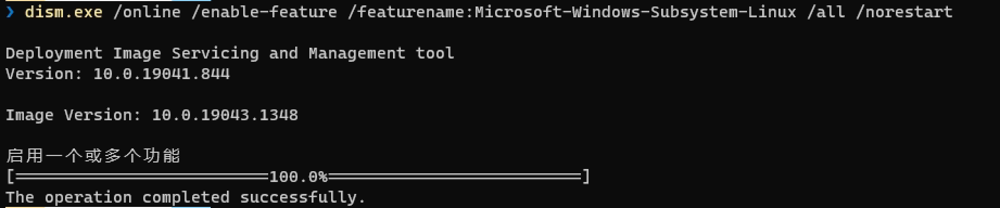
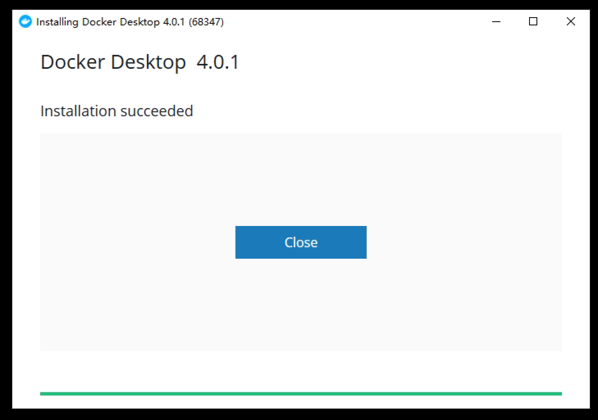
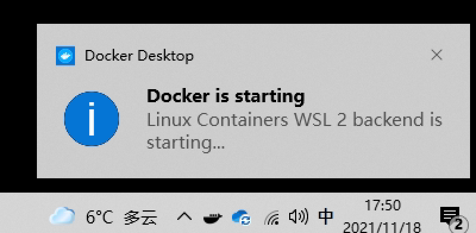

Docker 桌面版（Docker Desktop）可以在桌面操作系统上管理容器化环境，SmartIDE本地模式需要调用Docker桌面版以便管理容器环境。安装这个工具其实非常简单，但是安装之后最好对工具的一些默认设置进行一些调整，以便让SmartIDE运行得更加高效。

### 硬件和操作系统要求

硬件要求：
- 最低i5，推荐i7处理器
- 最少4核8G，建议8核16G以上配置
- 最好使用SSD硬盘，并有100G以上空余存储空间

操作系统要求：
- Windows 10 2004 (Build 19041或者更高版本)
- Windows 11 

老版本的Windows不支持WSL2，必须要使用HyperV或者VirtualBox虚拟机才能运行Docker，这样对系统资源占用很大，不建议使用。

### 下载安装包

Docker桌面是一款免费工具，大家可以从以下两个渠道下载：

- 官网下载地址 <a href="https://www.docker.com/products/docker-desktop" target="_blank">Docker Desktop</a> 
- 国内镜像
  - [Windows安装包下载地址](https://smartidedl.blob.core.chinacloudapi.cn/docker/20210926/Docker-win.exe)

## 启用WSL2

WSL2 是 Windows Subsystem for Linux 二代的简称，WSL2允许用户在Windows上运行受支持的Linux发行版。当前的Docker桌面版可以使用WSL2作为其Linux后台运行。因此我们需要首先在Windows操作系统上激活WSL2功能才能使用Docker做面板。

> 说明：Windows版本的Docker桌面其实也支持Windows容器，但是默认情况下我们更多的使用Linux容器作为我们的开发环境，因此在本文档中不会涉及对于Windows容器的配置。SmartIDE当前也不支持使用Windows容器作为开发环境。

### 步骤1 - 启动PowerShell

点击 **开始按钮 ｜ 输入 PowerShell**，选择 **以管理员身份运行**


### 步骤2 - 启用WSL2功能

在 PowerShell终端 窗口中输入以下命令以便激活 WSL功能 

```powershell
# 复制并粘贴本段脚本到PowerShell终端窗口中执行
dism.exe /online /enable-feature /featurename:Microsoft-Windows-Subsystem-Linux /all /norestart
```
执行过程输出如下


### 步骤3 - 启用虚拟化平台功能

在 PowerShell终端 窗口中输入以下命令以便激活 虚拟化平台 功能

```powershell
dism.exe /online /enable-feature /featurename:VirtualMachinePlatform /all /norestart
```
执行过程输出如下


### 步骤4 - 下载并安装Linux内核更新包

点击一下链接下载并安装

- [适用于x64计算机的WSL2 Linux内核更新包](https://wslstorestorage.blob.core.windows.net/wslblob/wsl_update_x64.msi)

### 步骤5 - 将WSL2设置为默认版本

打开 PowerShell，然后在安装新的 Linux 发行版时运行以下命令，将 WSL 2 设置为默认版本：

```powershell
wsl --set-default-version 2
```

### 步骤6 - 从Windows Store安装所需要的Linux分发版

打开 Microsoft Store，并选择你偏好的 Linux 分发版，推荐使用Ubuntu 20.04这个版本


安装完成后，点击 **开始按钮 ｜ 输入 Ubuntu** 并选择 **打开** 


第一运行需要先对这个环境设置你自己的用户名和密码


至此，你的Windows为安装Docker桌面版做好了准备

## 运行安装程序

双击打开下载的安装包，确保选中以下选项，并点击 OK

- Install required Windows componenets for WSL2


安装程序需要从网络下载一些资源，请确保安装过程网络畅通


安装完成后，点击 Close，关闭安装程序



点击 **开始按钮 ｜ 输入 Docker | 点击打开** 


点击 Accept 接受用户协议


等待 Docker 启动完毕



出现以下界面表示 Docker 已经正常启动，可以使用了。


## 配置Docker桌面版

默认情况下Docker桌面版会对其所使用的资源比例采取比较保守的策略，因为我们需要在容器中运行开发环境，你可以根据自己本地开发机的配置适当调高以下设置以便获得更好的体验。

因为我们指定Docker使用WSL2作为后台，因此我们无法通过Docker桌面版的配置工具直接修改资源占用情况。如果你打开 Docker 配置工具 会看到如下提示，提示用户要通过wslconfig配置文件来控制WSL的资源使用，以便控制Docker的资源占用。


你可以在 ～/.wslconfig 位置创建如下内容的文件，然后从新启动 Docker桌面版 即可。

```plaintext
[wsl2]
memory=8GB # Limits VM memory
processors=4 # Makes the WSL 2 VM use two virtual processors
```
> 有关wslconfig的详细配置请参考 [配置 Linux 分发版 官方文档](https://docs.microsoft.com/zh-cn/windows/wsl/wsl-config#configure-global-options-with-wslconfig)

建议给予WSL2至少8G内存和4以上的CPU Core以便获得比较好的使用体验。

## 验证 Docker桌面版 可以正常使用

打开命令行窗口运行以下命令：

```PowerShell
docker run hello-world
```

如果你看到了类似如下的输出，则表示你的Docker桌面版已经正常工作，你现在就可以继续按照 [快速启动](/zh/docs/quickstart/) 继续体验SmartIDE的功能了。


