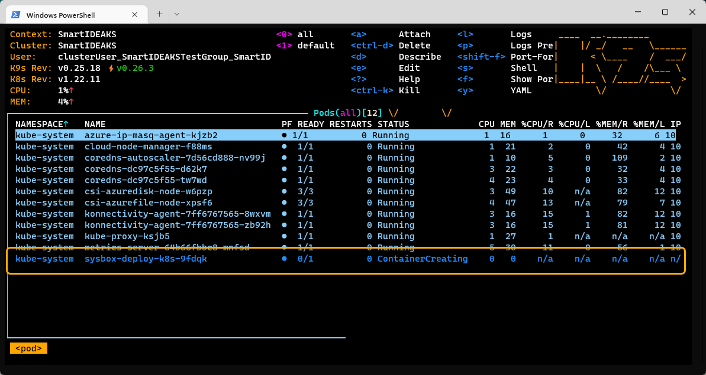
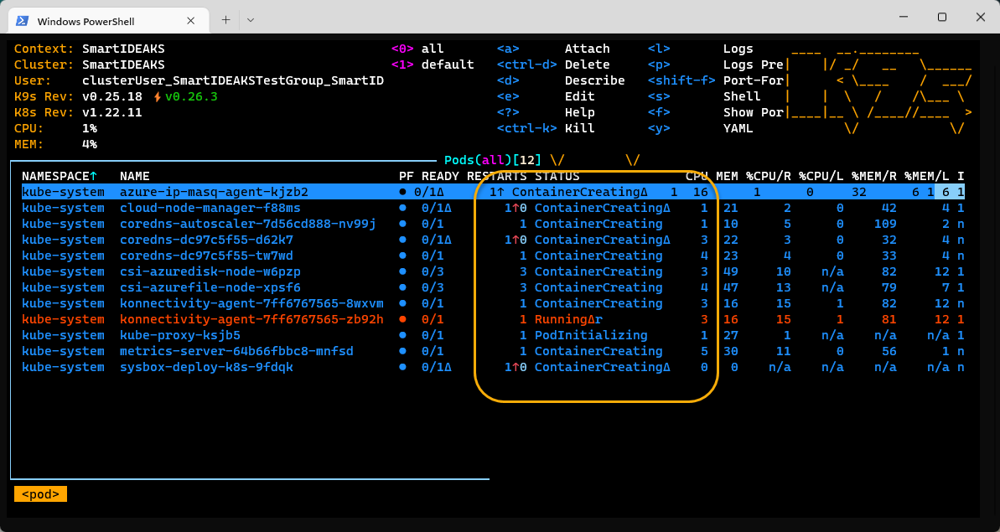
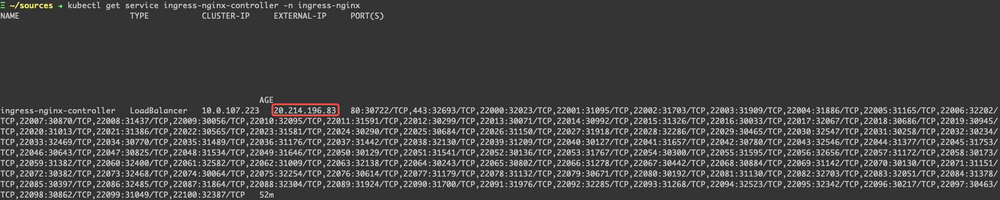
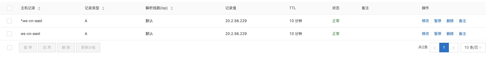
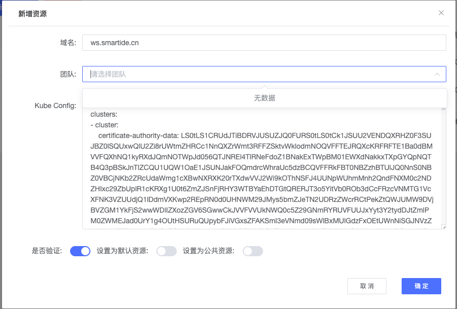

## 所需资源
配置一个K8S类型的工作区资源，那么就需要具备2个基本条件：
- 1.一个K8S集群，作为开发资源。这里可以是私有的K8S集群，也可以是云平台的K8S集群服务。
- 2.一个域名，将域名指向K8S集群对外暴露的访问地址，这样就可以通过不同的域名地址访问到集群不同的工作区命名空间。这里可以是私有部署的DNS域名解析服务，或者共有云的域名解析。

## 启用VMLC
如果需要在k8s集群中使用VMLC环境，需要首先运行以下脚本对集群进行初始化。

> 注意：此操作当前只支持Ubuntu节点，并且需要k8s版本在1.21-1.23范围内，具体请参考 [sysbox官方文档](https://github.com/nestybox/sysbox/blob/master/docs/user-guide/install-k8s.md)

运行以下操作会造成节点上当前运行的所有pod重新启动，建议仅在新节点或者新集群上运行。

```bash
## 获取节点名称
kubectl get nodes
## 在节点上添加 sysbox-install=yes 的 label
kubectl label nodes <节点名称> sysbox-install=yes
## 安装 sysbox container runtime
### 国内安装地址
kubectl apply -f https://gitee.com/smartide/SmartIDE/raw/main/deployment/k8s/sysbox-install-cn.yaml
### 国际安装地址
kubectl apply -f https://raw.githubusercontent.com/SmartIDE/SmartIDE/main/deployment/k8s/sysbox-install.yaml
```

运行以上指令后需要观察 sysbox-deploy pod进入运行状态，并且其他运行在节点上的pod重启完毕后，如果没有报错，代表安装成功。

*下图：sysbox-deploy pod创建中*



*下图：同节点上的其他pod重新启动中*



***注意：弹性扩展节点配置***

若使用资源为弹性缩扩容节点时，为了保证新节点可以启用VMLC特性，那么需要自动/手动配置。

如在Azure K8S中，可通过如下命令通过对节点池的设置，使弹性扩展时，新节点自动打入sysbox-install安装标记，完成VMLC特性的安装。
```shell
az aks nodepool update \
    --resource-group smartide-k8s-test \
    --cluster-name smartide-k8s-test \
    --name nodepool1 \
    --labels sysbox-install=yes \
    --no-wait
```
其中：
- resource-group : 资源组名称
- cluster-name : 集群名称
- name : 节点池名称

## 资源初始化
准备好所需资源后，就可以通过一键配置脚本，进行资源的初始化操作。在配置好K8S上下文的命令行中执行以下步骤：

***第一步，K8S集群初始化配置。***

通过一键初始化指令，部署集群Ingress、证书以及StorageClass。

- Linux/MacOS一键初始化指令：
  ```shell
  curl -o- https://gitee.com/smartide/SmartIDE/raw/main/deployment/k8s/smartide-k8s-init.sh | bash
  ```

- Windows一键初始化指令
  ```shell
  Invoke-WebRequest -Uri https://gitee.com/smartide/SmartIDE/raw/main/deployment/k8s/smartide-k8s-init.ps1  -OutFile "smartide-k8s-init.ps1";powershell -File "smartide-k8s-init.ps1"
  ```
  *注意：服务部署中，若出现以下错误提示，重复执行脚本即可：*
  ```shell
  Error from server (InternalError): error when creating "https://gitee.com/smartide/SmartIDE/raw/main/deployment/k8s/cert-manager/cluster-issuer.yaml": Internal error occurred: failed calling webhook "webhook.cert-manager.io": failed to call webhook: Post "https://cert-manager-webhook.cert-manager.svc:443/mutate?timeout=10s": EOF
  ```
***第二步，域名、泛域名配置。***

通过域名配置，将域名指向K8S集群的访问IP地址，这样我们就可以通过域名访问到不同的工作区服务了。

- 首先，通过命令获取集群ingress-controller的外部IP地址：
  ```shell
  kubectl get service ingress-nginx-controller -n ingress-nginx
  ```
  

- 其次，在域名解析服务器上设置K8S对外服务域名解析，添加两条指向集群外部IP访问地址的A记录。这里，可以参考如下的阿里云域名设置，这里添加了ws、*.ws两条解析记录：
  

## 资源使用配置
完成资源初始化配置后，就可以在SmartIDE Server中使用这个资源了。

在SmartIDE Server资源管理中，选择【新建K8S】创建资源。
- 域名：如ws.smartide.cn。
- Kube Config：K8S配置信息，内容默认文件路径:~/.kube/config

  

SmartIDE Server使用方法，详见：[SmartIDE Server 快速开始](../../quickstart/server/)

## 技术支持
如果您在以上安装过程或者日常使用过程中遇到问题，请通过提交 Issue 的方式与我们取得联系。

也可以加入我们的 SmartIDE 早鸟群获取第一手的产品资料和技术支持。
