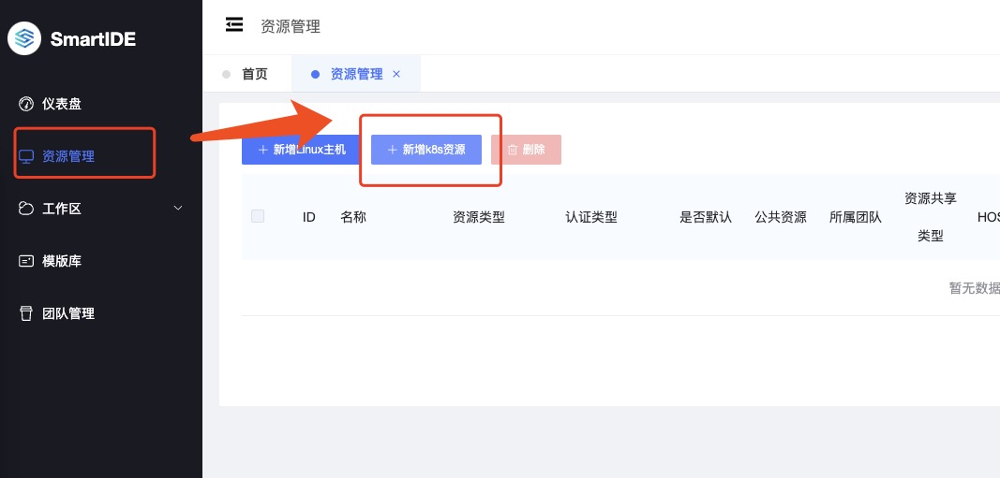
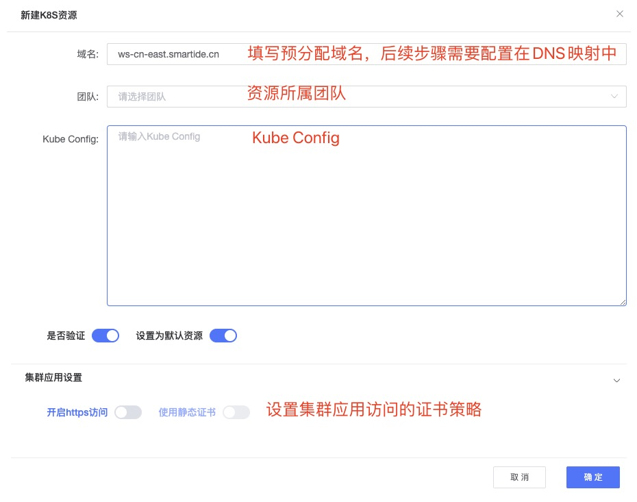
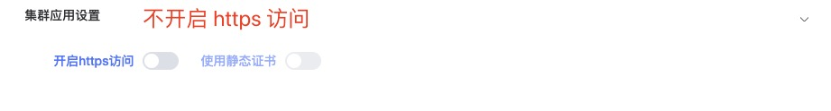
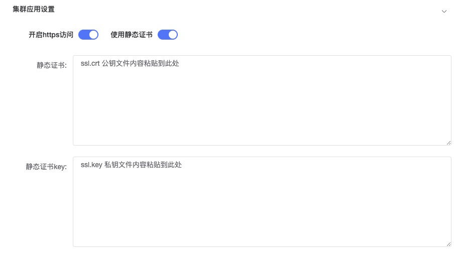
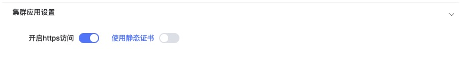
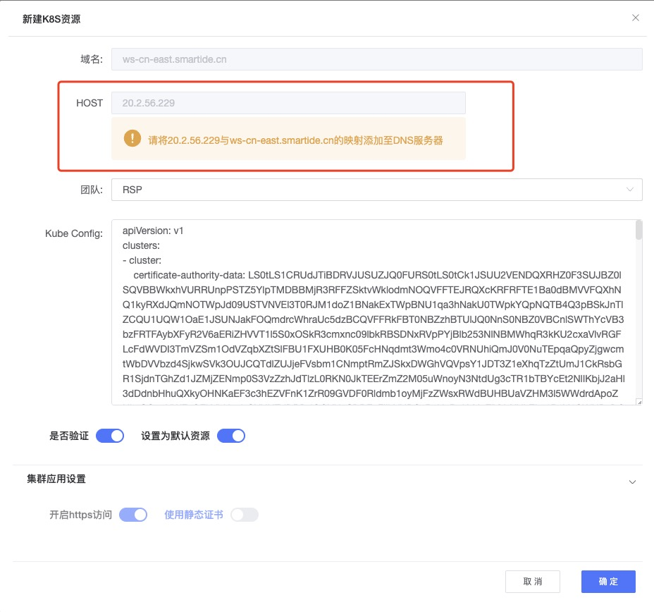

## 所需资源
配置一个K8S类型的工作区资源，那么就需要具备2-3个基本条件：
- 1. 一个K8S集群，作为开发资源。这里可以是私有的K8S集群，也可以是云平台的K8S集群服务。
- 2. 一个域名，将域名指向K8S集群对外暴露的访问地址，这样就可以通过不同的域名地址访问到集群不同的工作区命名空间。这里可以是私有部署的DNS域名解析服务，或者共有云的域名解析。
- 3. 一对证书公私钥（可选），若要启用 https 访问工作区环境并使用静态证书保护访问请求，请预先准备一对证书的公私钥文件，如：ssl.crt 和 ssl.key。
如需创建自签名证书，请参考如下链接的 Part 1 内容：[申请OpenSSL自签名证书](https://smartide.cn/zh/docs/manual/marketplace/self-signed-certificate/)

## 启用VMLC
如果需要在k8s集群中使用VMLC环境，需要首先运行以下脚本对集群进行初始化。

> 注意：此操作当前只支持Ubuntu节点，并且需要k8s版本在1.21-1.23范围内，具体请参考 [sysbox官方文档](https://github.com/nestybox/sysbox/blob/master/docs/user-guide/install-k8s.md)

运行以下操作会造成节点上当前运行的所有pod重新启动，建议仅在新节点或者新集群上运行。

```bash
## 获取节点名称
kubectl get nodes
## 在节点上添加 sysbox-install=yes 的 label
kubectl label nodes <节点名称> sysbox-install=yes
## 安装 sysbox container runtime
### 国内安装地址
kubectl apply -f https://gitee.com/smartide/SmartIDE/raw/main/deployment/k8s/sysbox-install-cn.yaml
### 国际安装地址
kubectl apply -f https://raw.githubusercontent.com/SmartIDE/SmartIDE/main/deployment/k8s/sysbox-install.yaml
```

运行以上指令后需要观察 sysbox-deploy pod进入运行状态，并且其他运行在节点上的pod重启完毕后，如果没有报错，代表安装成功。

*下图：sysbox-deploy pod创建中*


*下图：同节点上的其他pod重新启动中*


***注意：弹性扩展节点配置***

若使用资源为弹性缩扩容节点时，为保证新节点可以自动启用VMLC特性，那么需要进行相应配置。

例如：在Azure K8S中，可通过如下命令对节点池进行设置，那么弹性扩展时，新节点将会自动打上sysbox-install安装标记，并自动完成VMLC特性的安装。
```shell
az aks nodepool update \
    --resource-group smartide-k8s-test \
    --cluster-name smartide-k8s-test \
    --name nodepool1 \
    --labels sysbox-install=yes \
    --no-wait
```
其中：
- resource-group : 资源组名称
- cluster-name : 集群名称
- name : 节点池名称

## 资源初始化
准备好所需资源后，就可以使用 SmartIDE Server 添加K8S资源功能自动初始化集群：

***第一步，SmartIDE Server 添加 K8S 集群资源***

在SmartIDE Server资源管理中，选择【新建K8S】创建资源：


填写对应K8S集群信息：

- 域名：预分配给当前集群的访问域名，如 ws-cn-east.smartide.cn
- 团队：当前资源所属的团队，团队成员可共享使用
- Kube Config：K8S配置信息，内容默认文件路径:~/.kube/config
- 集群应用设置支持三种证书策略：
  1. 仅http，不开启https：
  用户选择不开启https验证，则集群的所有应用统一使用http的方式启动，如果用户不关心是否使用https访问IDE/应用地址，则可以选择使用此种方式。
  
  1. 静态 https：
  用户可以使用自维护的静态证书来配置集群工作区的IDE/应用访问链接，这种策略要求用户提前准备一对证书的公私钥，并在创建集群时复制公私钥的内容粘贴到资源的信息中。
  用户使用此证书策略配置集群之后，后续所有工作区的访问链接将默认使用用户提供的证书来加密。此策略适合在内网环境下开启https访问的场景。
  
  1. 动态 https：
  SmartIDE Server 同时也提供了系统自申请https证书的功能，用户可以在外网环境下选择使用动态 https证书策略，系统将会为每个工作区的每个应用地址自动化申请https证书。
  此场景需要Server能够连通外网环境的支撑。
  

点击保存后，资源创建完毕，系统开始自动初始化集群：
- 创建 Ingress Controller 服务
- 根据证书策略，创建静态证书秘钥或安装动态证书所需的Cert-Manager服务
- 安装 Storage Class

初始化集群过程会持续几分钟，初始化完毕后，系统将会自动获取到 Ingress Controller 服务的 External IP 显示到资源详情界面上：

此IP是集群对外统一提供服务的地址，接下来需要将此IP地址和集群的预分配域名进行DNS绑定。

***第二步，域名、泛域名配置。***

通过DNS域名配置，将域名指向K8S集群的Ingress Controller Nginx服务，这样我们就可以通过域名访问到不同的工作区服务了。

在域名解析服务器上设置K8S对外服务域名解析，添加两条指向 External IP 的A记录。这里，可以参考如下的阿里云域名设置，这里添加了 ws-cn-east、*.ws-cn-east 两条解析记录：
  

域名配置完成后，就可以在SmartIDE Server中使用这个资源了！

SmartIDE Server使用方法，详见：[SmartIDE Server 快速开始](../../quickstart/server/)

## 技术支持
如果您在以上安装过程或者日常使用过程中遇到问题，请通过提交 Issue 的方式与我们取得联系。

也可以加入我们的 SmartIDE 早鸟群获取第一手的产品资料和技术支持。
