[SmartIDE Marketplace](https://marketplace.smartide.cn) 是基于Eclipse OpenVSX 开源项目搭建的类VSCode插件市场，详细内容请参考 [应用插件市场 Overview](../../overview/marketplace/index.md)。
此文档旨在描述 SmartIDE Marketplace 的详细部署过程，内容分为简要介绍、组件介绍、部署细节三部分。

## 1. 简要介绍 
SmartIDE Marketplace服务部署均使用容器化方式进行，Dock-Compose文件见[docker-compose.yaml](https://github.com/SmartIDE/eclipse-openvsx/blob/smartide-marketplace/deployment/openvsx/docker-compose.yaml)，部署的各模块整体架构如下图所示：

- 主体为OpenVSX-Server，spring boot框架的java服务，我们在部署时需要自行添加 application.yml 配置文件，并将其放置对应位置，以便Server启动后加载。
- 后台数据库使用PostgreSql，并使用Pgadmin进行数据库的管理和查询等操作，数据库的创建和表结构的初始化过程Server进程启动时会自动执行。
- 前端界面为NodeJS架构的Web UI，我们在部署时会将前端代码库构建的静态网站结果放入Server服务的对应文件夹，使其二者变为一个进程即Server进程加入前端界面。这也是Sprint Boot框架的灵活性功能，使用者可以基于Web UI代码库自定制前端界面，并将自定制的前端页面嵌入Server服务。
- 用户登陆验证，目前只支持OAuth Provider，官方文档中声明目前只支持Github AuthApp和 Eclipse OAuth，我们在部署时使用Github AuthApp。
- 插件存储可以使用数据库（默认）、Google Storage或 Azure Blob Storage三种模式，推荐添加Google Storage或 Azure Blob Storage以避免数据库过大的情况出现。
- 插件搜索服务支持数据库搜索和附加Elastic Search服务两种模式，推荐有条件的情况下添加Elastic Search搜索服务提高搜索效率，降低数据库压力。
- 除以上架构图中展现内容外，Marketplace网站需要配置HTTPS证书，这样才服务器的扩展才能够正确被IDE加载，我们使用Nginx进行服务器的部署端口转发。

## 2. 组件介绍
本章节将对架构中的各个组件进行逐一介绍。
### 2.1 OpenVSX Server
#### 代码库：
- [github SmartIDE/eclipse-openvsx/server](https://github.com/SmartIDE/eclipse-openvsx/tree/smartide-marketplace/server)
#### 镜像：
- DockerHub: smartide/smartide-openvsx:4a5546b
- Aliyun: registry.cn-hangzhou.aliyuncs.com/smartide/smartide-openvsx:4a5546b
- [DockerFile](https://github.com/SmartIDE/eclipse-openvsx/blob/smartide-marketplace/deployment/smartide-image/Dockerfile)

#### Docker-Compose部分：
    server:
      image: smartide/smartide-openvsx:4a5546b
    ports:
      - "8080:8080"
    volumes:
      - ./configurations:/home/openvsx/server/config
    links:
      - "db:pgsql-server"`

### 2.2 OpenVSX WebUI
#### 代码库：
- [github SmartIDE/eclipse-openvsx/webui](https://github.com/SmartIDE/eclipse-openvsx/tree/smartide-marketplace/webui)

#### 镜像：
- DockerHub: smartide/smartide-openvsx:4a5546b
- Aliyun: registry.cn-hangzhou.aliyuncs.com/smartide/smartide-openvsx:4a5546b
- [DockerFile](https://github.com/SmartIDE/eclipse-openvsx/blob/smartide-marketplace/deployment/smartide-image/Dockerfile)
#### Docker-Compose部分：
    server:
      image: smartide/smartide-openvsx:4a5546b
    ports:
      - "8080:8080"
    volumes:
      - ./configurations:/home/openvsx/server/config
    links:
      - "db:pgsql-server"`

### 2.3 Postgresql + PgAdmin
#### Docker-Compose部分：
    db:
      image: postgres:12.2
      restart: always
      environment:
        POSTGRES_DB: #{DATABASE}#
        POSTGRES_USER: #{DATABASE_USERNAME}#
        POSTGRES_PASSWORD: #{DATABASE_PASSWORD}#
        PGDATA: /var/lib/postgresql/data
      volumes:
         - ~/openvsx/postgresqldata:/var/lib/postgresql/data
      ports:
        - "5432:5432"
    pgadmin:
      image: dpage/pgadmin4:4.18
      restart: always
      environment:
        PGADMIN_DEFAULT_EMAIL: #{PGADMIN_USERNAME}#
        PGADMIN_DEFAULT_PASSWORD: #{PGADMIN_PASSWORD}#
        PGADMIN_LISTEN_PORT: 80
      ports:
        - "8090:80"
      volumes:
        - ~/openvsx/pgadmin-data:/var/lib/pgadmin
      links:
        - "db:pgsql-server"

### 2.4 Application.yml
OpenVSX Server 进程启动时加载的配置文件，需要放到与docker-compose.yaml同级目录的Configurations文件夹下（在volumn中定义），内容见：[Application.yml](https://github.com/SmartIDE/eclipse-openvsx/blob/smartide-marketplace/deployment/openvsx/configurations/application.yml)

由如下重点几部分构成：
#### Server端口：
    server:
      port: 8080
#### Datasource(数据库链接):
    datasource:
      url: jdbc:postgresql://pgsql-server:5432/#{DATABASE}#
      username: #{DATABASE_USERNAME}#
      password: #{DATABASE_PASSWORD}#

#### Security(用户认证方式)
    security:
      oauth2:
        client:
          registration:
            github:
              client-id: #{OAUTH_CLIENT_ID}#
              client-secret: #{OAUTH_CLIENT_SECRET}#

#### Search方式：
    ovsx:
      databasesearch:
        enabled: true
      elasticsearch:
        enabled: false

#### WebUi（前端地址）：
    webui:
      url: https://marketplace.smartide.cn

#### Storage（插件存储）：
    storage:
      azure:
        service-endpoint: #{STORAGE_SERVICE_ENDPOINT}#
        sas-token: #{STORAGE_SAS_TOKEN}#

#### Github AuthApp
用户登陆 https://marketplace.smartide.cn 使用的验证方式：

    security:
      oauth2:
        client:
          registration:
            github:
              client-id: #{OAUTH_CLIENT_ID}#
              client-secret: #{OAUTH_CLIENT_SECRET}#

具体创建说明文档见：
[Creating an OAuth App - GitHub Docs](https://docs.github.com/en/developers/apps/building-oauth-apps/creating-an-oauth-app)
创建完毕后复制client-id和client-secret 加入到 Application.yml 中即可，注意权限要给足。

### 2.5 Azure Blob Storage
SmartIDE Marketplace 存储插件的文件存储，我们使用Azure Blob Storage作为存储介质，配置到Application.yml中来进行起作用：

    storage:
      azure:
        service-endpoint: #{STORAGE_SERVICE_ENDPOINT}#
        sas-token: #{STORAGE_SAS_TOKEN}#
具体创建说明文档见：
[openvsx azure-setup (github.com)](https://github.com/eclipse/openvsx#azure-setup)

### 2.6 ElasticSearch
暂无使用，可参考 [Deploying-Open-VSX/elasticsearch](https://github.com/eclipse/openvsx/wiki/Deploying-Open-VSX#elasticsearch ) 配置。

### 2.7 Nginx
SmartIDE Marketplace 需配置为https且certifacate为合规证书，方可被类vscode IDE使用，我们使用Nginx进行https设置：
- Docker-Compose：

        nginx:
          image: nginx:latest
          restart: unless-stopped
          volumes:
            - ~/openvsx/deployment/openvsx/nginx/nginx.conf:/etc/nginx/nginx.conf
            - ~/openvsx/deployment/openvsx/nginx/ssl:/ssl/
          ports:
            - 80:80
            - 443:443
          links:
            - "server:openvsx-server"
- [Nginx.Conf 内容见链接](https://github.com/SmartIDE/eclipse-openvsx/blob/smartide-marketplace/deployment/openvsx/nginx/nginx.conf)
注意:

      proxy_set_header Host $host;
      proxy_set_header X-Forwarded-Host $host;
      proxy_set_header X-Real-IP  $remote_addr;
      proxy_set_header X-Forwarded-Proto $scheme;
      
    四个http request header的设置能够确保 server 进程收到的请求头是正确无误的，这样Server进程才能够正确识别请求并进行正确的转发！

## 3. 部署详细步骤
本章节将以https://marketplace.smartide.cn 生产环境的部署为例，以Azure 虚拟机做为服务器、Azure Blob Storage 作为插件存储，使用 Github OAuth App 进行用户认证，来描述部署的细节。
### 3.1 资源准备
在执行具体步骤之前，需要准备如生产服务器、插件存储Storage、用户认证 Oauth App等资源。
#### 3.1.1 Azure Linux VM
准备一台Azure 虚拟机并做如下设置：
- 开通如下端口：22, 443, 80, 3000, 8080, 8090, 9000
- IP和DNS设置：IP设置为静态，设置独立唯一Azure DNS名称（此处可自由选择前缀，只需在之后和marketplace.smartide.cn域名绑定时对应即可）
- 登陆VM[安装 Docker和Docker-Compose](https://smartide.cn/zh/docs/install/docker-install-linux/)

#### 3.1.2 Azure Blob Storage
准备一个Azure存储账户, 参照 [链接](https://github.com/eclipse/openvsx#azure-setup) 设置Storage Account、创建Container等：
- 设置Storage Account的 blob公共访问为打开（默认是打开的，检查一下）
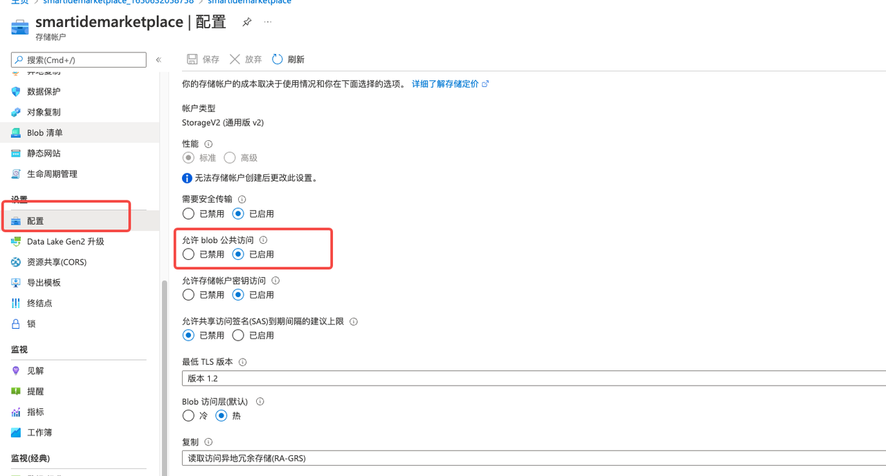

- 创建名称固定为 openvsx-resources 的 Container（名称对应Application.yml中的ovsx.storage.azure.blob-container属性，采用默认名称的话，可以不设置此属性）并设置访问级别为Blob级别
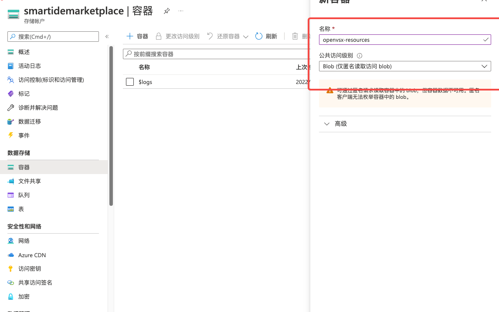

- 设置Storage Account的 CORS策略如下：
  origin ："*" 
  method "GET"
  allowed headers "x-market-client-id, x-market-user-id, x-client-name, x-client-version, x-machine-id, x-client-commit"
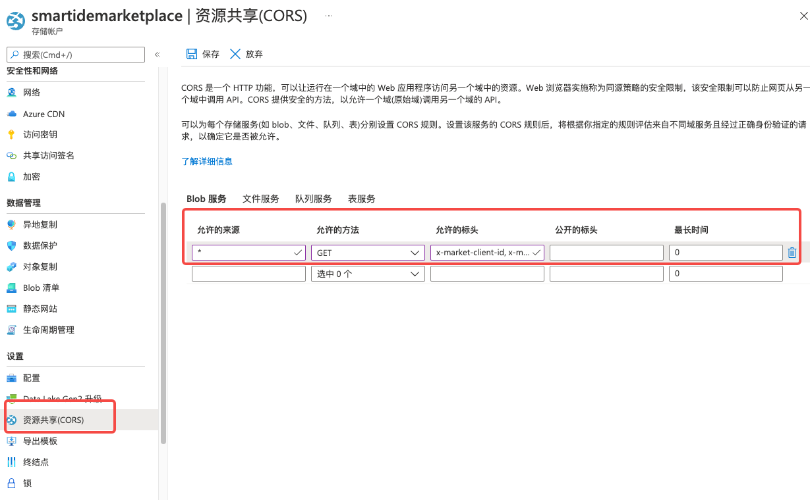

- 生成共享访问签名，并保存SAS_TOKEN （对应Application.yml中的ovsx.storage.azure.sas-token）
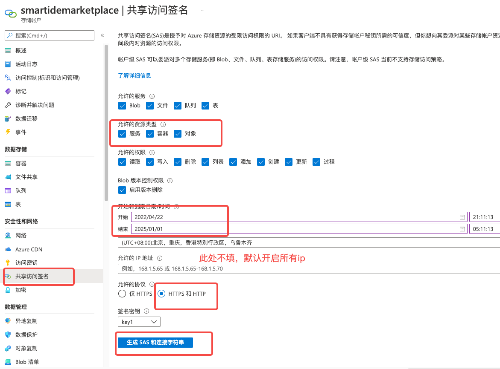

- 进入Service Endpoint模块，复制保存 Blob Service URL （对应Application.yml中的ovsx.storage.azure.service-endpoint）

#### 3.1.3 Github OAuth App
参照 [Creating an OAuth App - GitHub Docs](https://docs.github.com/en/developers/apps/building-oauth-apps/creating-an-oauth-app) 创建 Github OAuth App 提供用户验证机制。创建完毕后获取 Client ID 并生成 Client Secret，复制后存储供后续使用。

所有资源准备环境都已经就绪，接下来将会使用GitHub Action 进行生产环境的部署。

### 3.2 流水线配置 与 运行部署
#### 3.2.1 流水线介绍
SmartIDE Marketplace生产环境使用GitHub Action进行部署，流水线定义文件位置：
[eclipse-openvsx/smartide-openvsx-deployment.yml](https://github.com/SmartIDE/eclipse-openvsx/blob/smartide-marketplace/.github/workflows/smartide-openvsx-deployment.yml)
读者可以参考以上流水线定义的任务执行步骤进行部署准备和执行具体部署过程。

#### 3.2.2 运行前准备
SmartIDE Marketplace 生产环境部署操作执行之前，需要配置流水线中所使用的项目的secrets，以便让流水线运行时替换掉对应配置文件（docker-compose.yml & application.yml）中的通配符，包括 3.1 准备步骤中创建的资源和其余的一些默认如数据库设置等配置，以下图片和列表列出需要修改的Key及其含义：
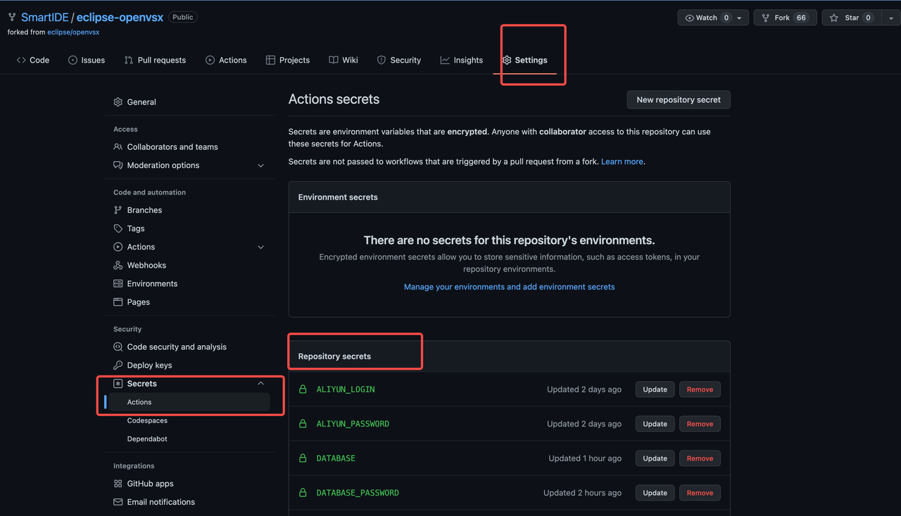
选中要修改的Secret，点击Update 更新
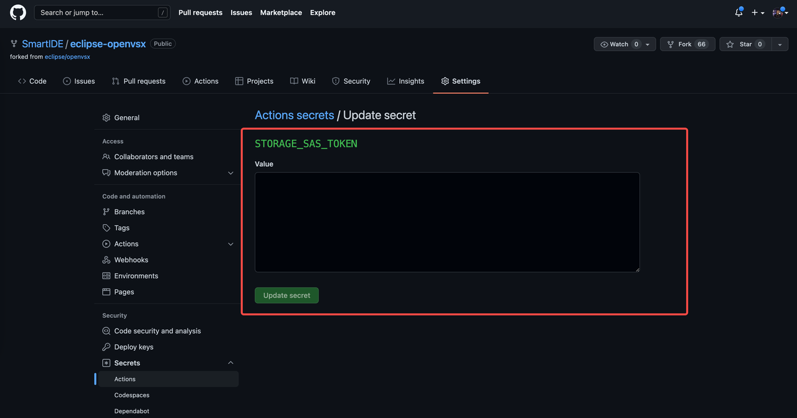

|属性|说明|
|:------|:------|
|DATABASE|Server 数据库名称|
|DATABASE_USERNAME|Server 数据库用户名|
|DATABASE_PASSWORD|Server 数据库密码|
|NGINX_SSL_CERT|https站点证书ssl_cert.crt 文件里面的值|
|NGINX_SSL_KEY|https站点证书私钥ssl_cert.crt 文件里面的值|
|OAUTH_CLIENT_ID|GitHub OAuth App 的 Client iD|
|OAUTH_CLIENT_SECRET|GitHub OAuth App 的 Client Secret|
|PGADMIN_USERNAME|PgAdmin数据库管理容器默认登录名 http://{ip}:9000 地址访问|
|PGADMIN_PASSWORD|PgAdmin数据库管理容器默认登陆密码 http://{ip}:9000 地址访问|
|SERVER_HOST|生产服务器 IP地址|
|SERVER_SSH_USER|生产服务器 SSH 用户名|
|SERVER_PASSWORD|生产服务器 SSH 密码|
|STORAGE_SERVICE_ENDPOINT|Blob Storage Service URL|
|STORAGE_SAS_TOKEN|Blob Storage SAS Token|
如果进行的是本地部署，不使用GitHub Action的情况下，自行修改 Deployment/Openvsx/Configurations/Application.yml 和 Deployment/Openvsx/Docker-Compose.yml 中的 #{ 变量名 }# 变量即可。

#### 3.2.3 运行流水线执行部署
- 流水线触发执行的条件是：

        on:
          push:
            branches:    
              - master
            paths: 
              - deployment/openvsx/**
              - .github/workflows/smartide-openvsx-deployment.yml
即修改 deployment/openvsx 文件夹下任何内容或修改流水线定义文件本身会自动触发，当我们对上述path内容任意做完一次提交后，将会Actions的自动化执行：
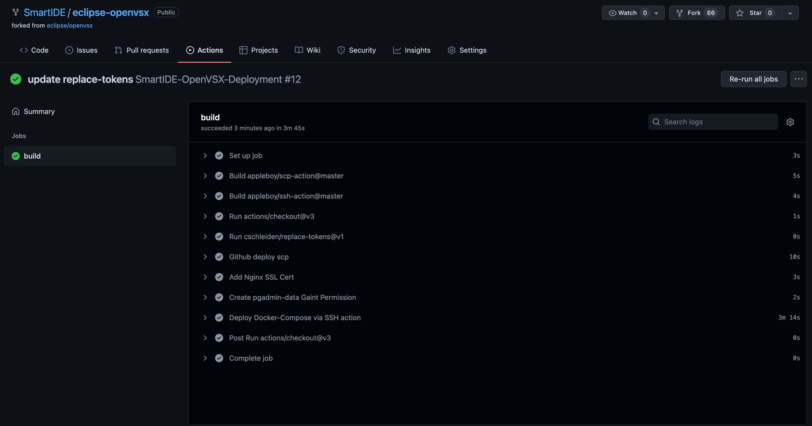
如果进行的是本地部署，不使用GitHub Action的情况下，需要在服务器上自行运行Docker-Compose 命令，Docker-Compose文件为  Deployment/Openvsx/Docker-Compose.yml

### 3.3 环境测试
- 流水线部署完毕后，即可登录 http://{server-host}:9000 端口网站使用 Portainer 查看 Server 容器运行情况
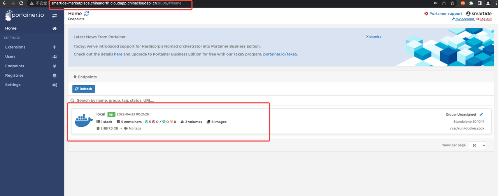
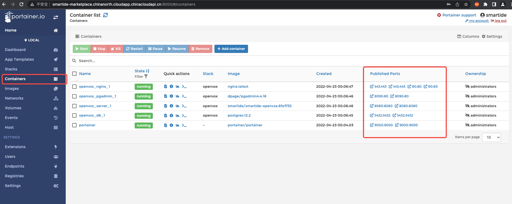
- 使用 http://{server-host}:8090 访问 pgadmin服务，查看数据库初始化情况
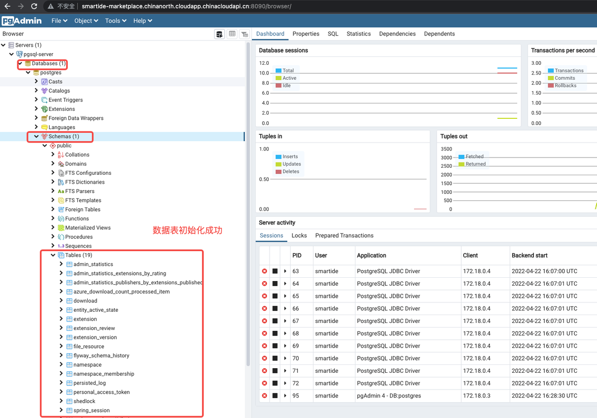
- 访问 https://marketplace.smartide.cn
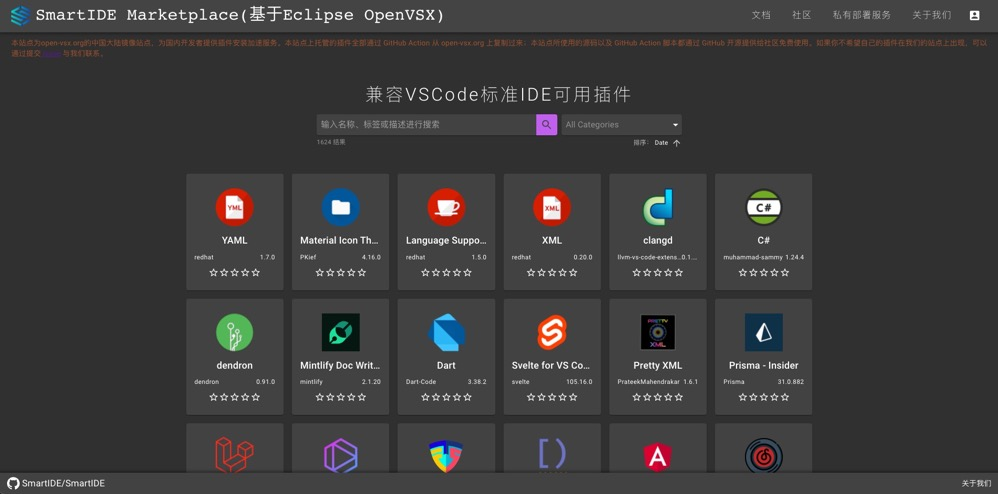

至此，Marketplace 部署过程全部结束。