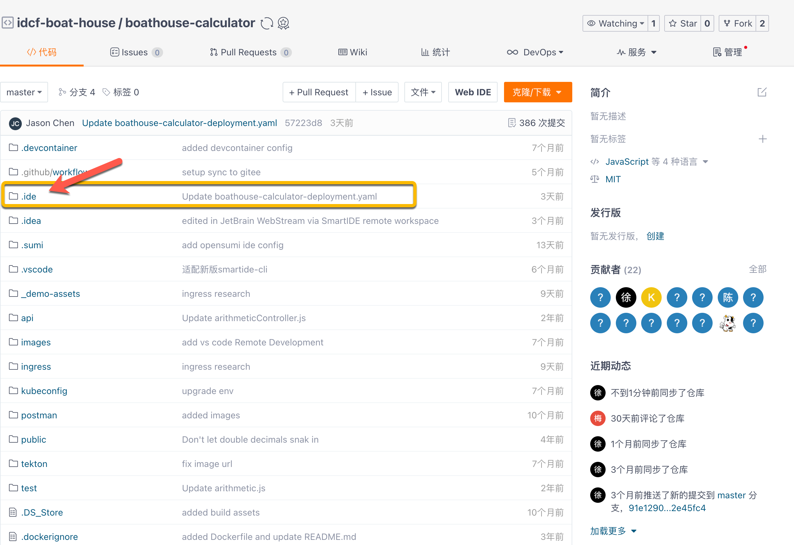
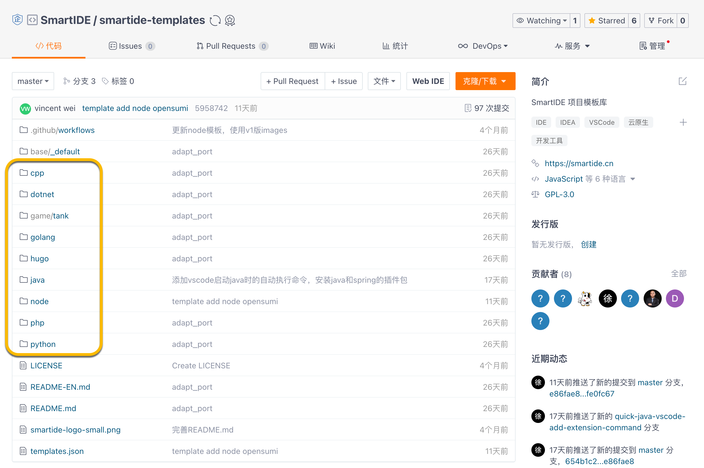
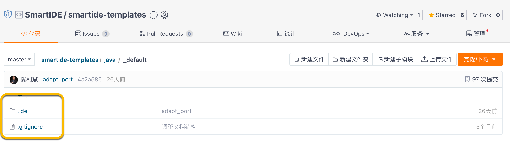

SmartIDE通过一个yaml格式的配置文件识别代码库的开发环境，实现对开发环境的编排，通常这个文件放置在代码库根目录下的`.ide`目录中，默认的文件名为 `.ide.yaml`。

### 1. 配置文件示例
你可以参考 Boathouse Calculator 的示例代码了解这个文件的详细内容，SmartIDE产品团队使用这个Boathouse Calculator 代码库作为我们的冒烟测试应用。

Boathouse Calcualtor 代码库地址 : <a href="https://gitee.com/idcf-boat-house/boathouse-calculator" target="_blank"> ` https://gitee.com/idcf-boat-house/boathouse-calculator `</a>

`.ide` 配置文件夹的位置如下：


典型的`.ide.yaml`文件内容如下，文件路径为：`/.ide/.ide.yaml`
``` yaml
version: smartide/v0.3
orchestrator:
  type: docker-compose
  version: 3
workspace:
  dev-container:
    service-name: boathouse-calculator
    
    ports: # 申明端口
      tools-webide-vscode: 6800
      tools-ssh: 6822
      apps-application: 3001
    
    ide-type: vscode  #vscode/theia
    volumes: 
      git-config: true
      ssh-key: true
    command:
      - npm config set registry https://registry.npmmirror.com
      - npm install
  services:
    boathouse-calculator:
      image: registry.cn-hangzhou.aliyuncs.com/smartide/smartide-node-v2-vscode:all-version
      restart: always
      environment:
        ROOT_PASSWORD: root123
        LOCAL_USER_PASSWORD: root123       
      volumes:
      - .:/home/project
      ports:
        - 3001:3001
        - 6822:22
        - 6800:3000
      networks:
        - smartide-network

  networks:
    smartide-network:
      external: true
```

以上文件关键配置说明：
- Workspace : 工作区相关配置
  - Dev-container: 工作区所使用的开发者容器配置
    - Service-name: 指定services中作为开发者容器的service名称
    - Ports:  对外暴露的端口列表，以及每个端口的说明，端口说明使用前缀方式标识端口的类型，当前支持以下前缀
      - Tools 工具类端口
      - Apps 应用类端口
    - Ide-type: 开发者容器内置的IDE类型，目标前有4个选项
      - Vscode - 内置基于OpenVSCode的WebIDE
      - Jb-projector - 内置基于JetBrians Projector的WebIDE，包括：IntelliJ IDEA, PyCharm, WebStorm, PHPStorm, CLion, GoLand等
      - Opensumi - 国内阿里开源的WebIDE
      - sdk-only - 无WebIDE，此类环境一般用于VSCode Remote或者JetBrains Gateway进行远程连接使用
    - Volumes: 向容器内注入的相关配置项
      - Git-cofnig - 注入当前用户的git config配置
      - Ssh-key - 注入当前用户的ssh密钥
    - Commands: 在开发者容器启动中自动执行的脚本，当前只支持vscode
  - services：这个配置节点以下的内容就是一个标准的docker-compose文件内容
    - Image: 当前开发者容器所使用的镜像，请参考 [镜像和模版](../../templates) 文档获取SmartIDE所支持的所有镜像地址

### 2. 适配已有项目
如果希望使用SmartIDE来开发调试已有项目，只需要将以上`.ide.yaml`配置放置在已有项目的根目录下的`.ide`目录中即可。

对于不同开发语言的环境，可以从 <a href="https://gitee.com/smartide/smartide-templates" target="_blank">smartide-template（模版库）</a> 中获取对应的默认配置文件。

下图列出了SmartIDE模版库的结构，可以看到以开发语言命名的目录名称。

在每个开发语言的目录中，都有一个 `_default` 的文件夹，这个文件的内容就是针对这个开发语言技术栈的默认SmartIDE配置文件，比如：下图列出了 `java/_default` 目录的内容。

将这些文件复制到你的java项目的根目录中即可完成对你的java项目的适配，如果你的目录中已经存在`.gitignore`文件，请将以上.`gitignore`文件的内容合并到现有的文件中。

完成以上操作之后，即可使用标准的 smartide start 指令启动项目，同样也可以在 SmartIDE Server 中使用你的项目了，详见：[快速开始 - SmartIDE Server](../../quickstart/server)。
