## 1. 原理
参考自[Using-Open-VSX-in-VS-Code](https://github.com/eclipse/openvsx/wiki/Using-Open-VSX-in-VS-Code)，通过修改IDE product.json 文件中 extensionsGallery.serviceUrl & extensionsGallery.itemUrl & linkProtectionTrustedDomains 节点的值，让IDE链接应用市场时改变API指向达到链接SmartIDE插件市场的目的。

    "extensionsGallery": {
        "serviceUrl": "https://marketplace.smartide.cn/vscode/gallery",
        "itemUrl": "https://marketplace.smartide.cn/vscode/item"
    }

    "linkProtectionTrustedDomains": [
        "https://marketplace.smartide.cn"
    ]

## 2. 配置
### VSCode
- 打开 VSCode 安装目录按照如下路径找到 product.json
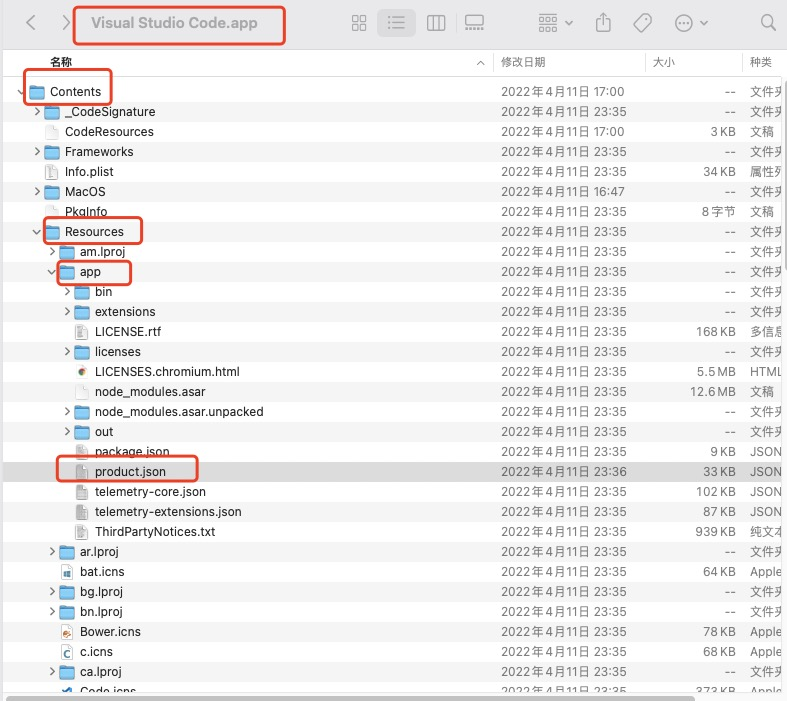
- 关闭VSCode 正在运行的进程，用其他编辑器打开 product.json，并参照第1章节修改对应内容
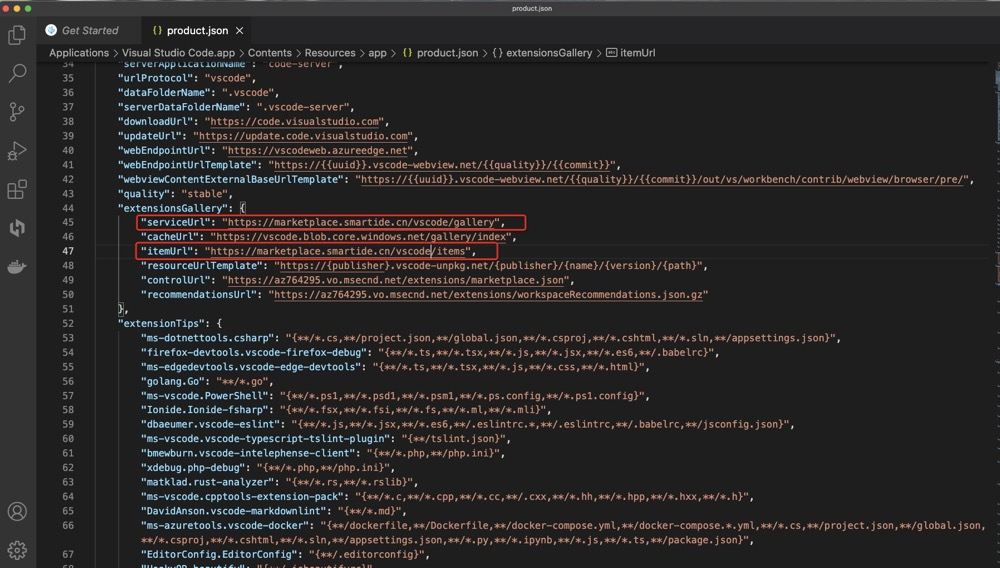
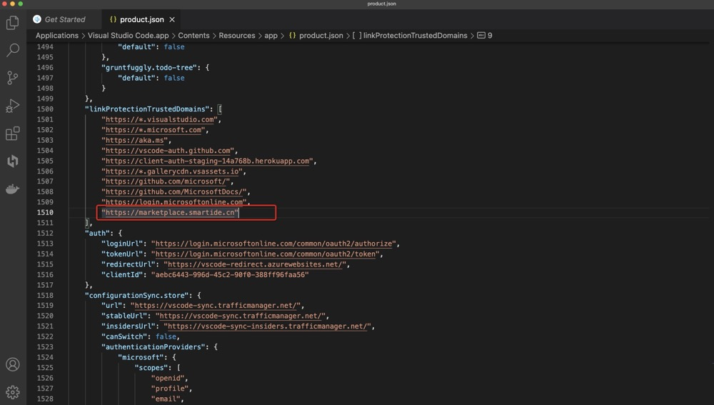
- 打开 VSCode 进入扩展页面查看插件市场

### VSCodium
- 打开 VSCodium 安装目录按照如下路径找到 product.json
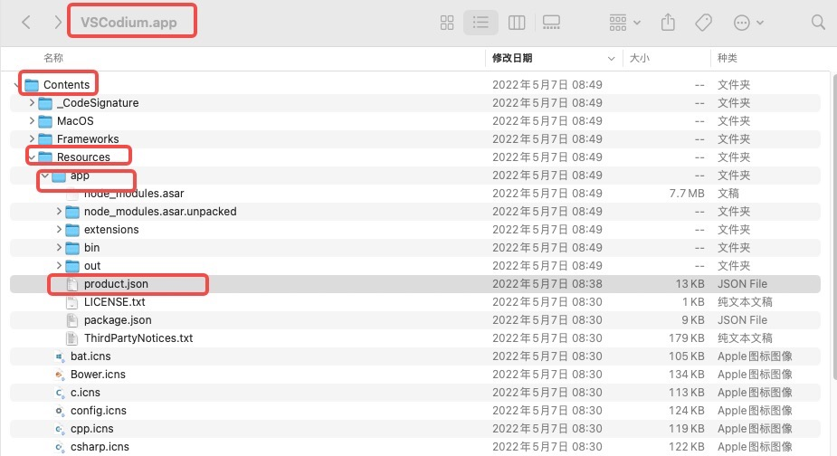
- 关闭 VSCodium 正在运行的进程，用其他编辑器打开 product.json，并参照第1章节修改对应内容
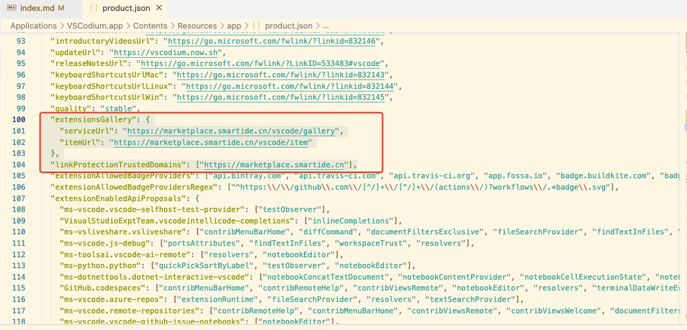
- 打开 VSCodium 进入扩展页面查看插件市场
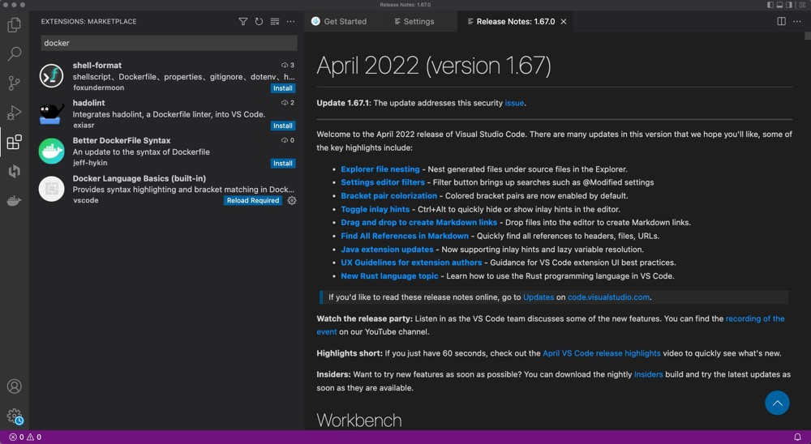

### Code Server
- 打开 Code Server 安装目录按照如下路径找到 product.json，如下图是 mac 系统通过 Brew 安装的 Code Server，则安装目录为 /usr/local/Cellar/code-server 
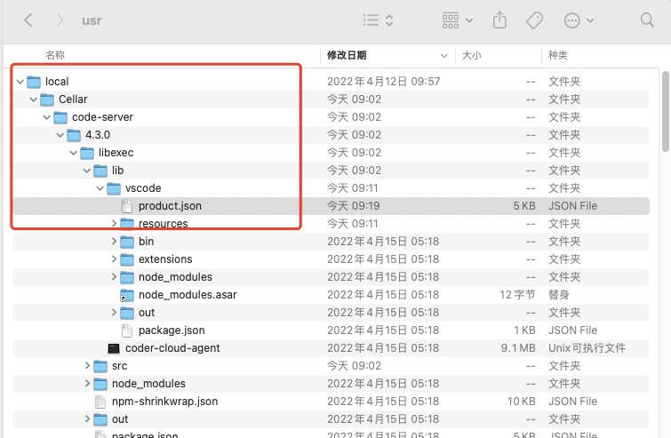
- 用其他编辑器打开 product.json，并参照第1章节修改对应内容
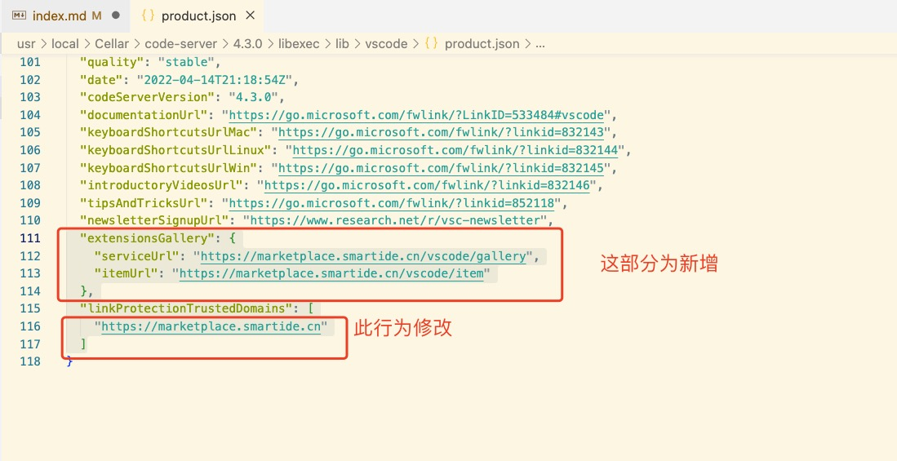
- 重新启动 Code Server 服务
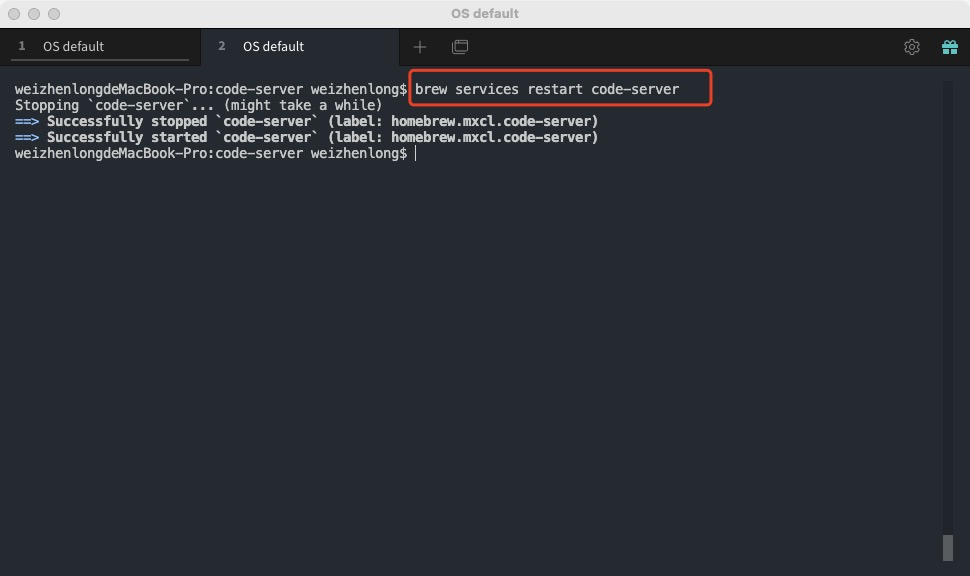
- 打开 Code Server 页面进入扩展页面查看插件市场
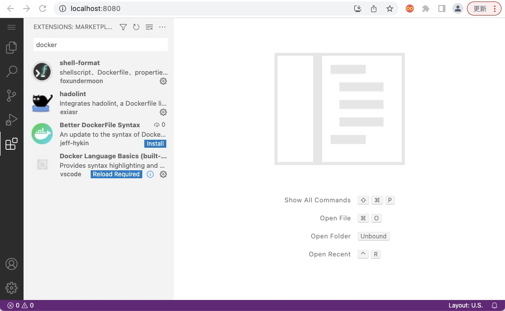
- 另外使用者也可以参考 [code-server](https://github.com/coder/code-server/blob/main/docs/FAQ.md#how-do-i-use-my-own-extensions-marketplace) 文档修改插件市场指向

### OpenVSCode Server
- 容器启动后，打开WebIDE(默认端口3000)，并使用open folder功能打开 OpenVSCode Server 程序目录：/home/.openvscode-server
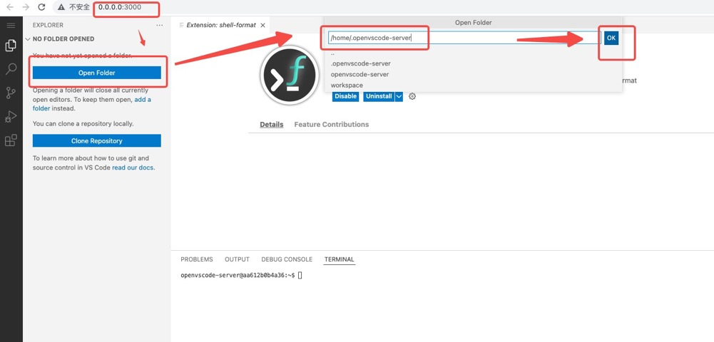
- 在左侧搜索窗口搜索关键字 open-vsx.org 全部替换为 marketplace.smartide.cn
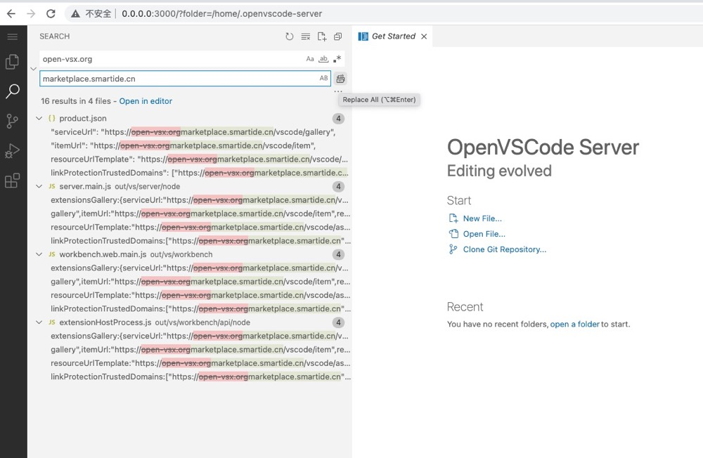
- 重新启动容器

- 再次打开服务进入扩展页面查看插件市场
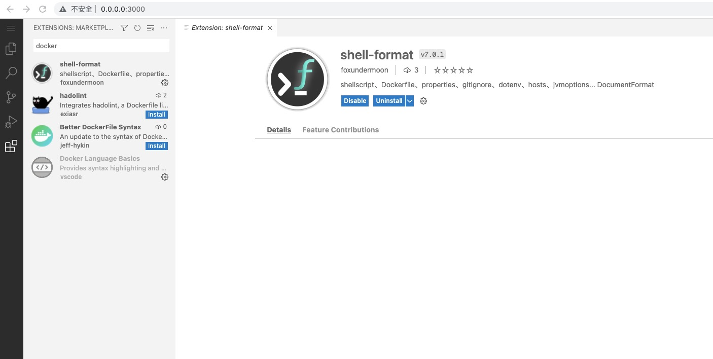
- 以上步骤仅展示修改原理，如果想彻底解决修改 product.json 问题，请自行基于此修改方式创建镜像。

### Opensumi
- 容器启动后，打开WebIDE(默认端口8080)，并修改URL指向 http://http://localhost:8080/?workspaceDir=/release，打开 Opensumi 程序目录：/release
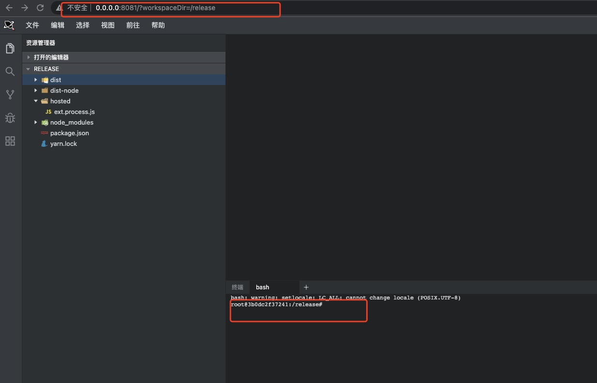
- 在左侧搜索窗口搜索关键字 open-vsx.org 全部替换为 marketplace.smartide.cn
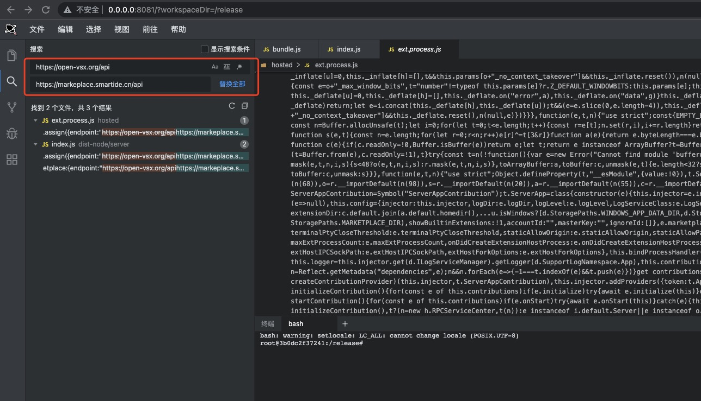
- 重新启动容器
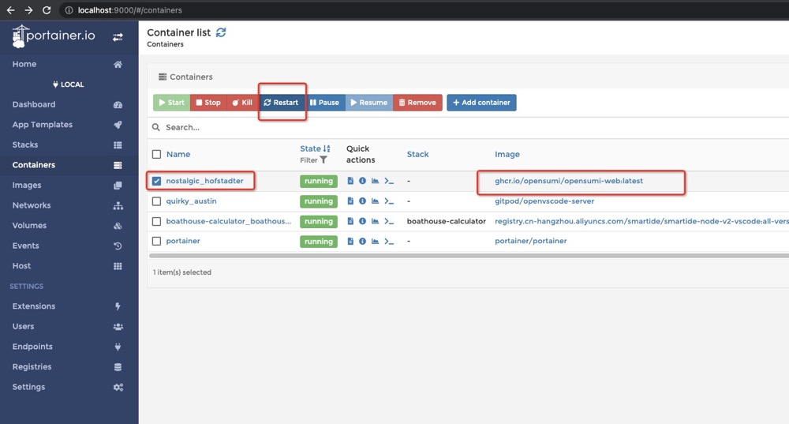
- 再次打开服务进入扩展页面查看插件市场
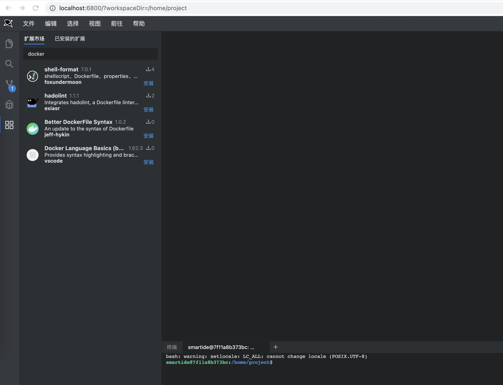
- 以上步骤仅展示修改原理，如果想彻底解决修改 product.json 问题，请自行基于此修改方式创建镜像。