## 1. 插件同步介绍
SmartIDE Marketplace 服务搭建初始化后，默认没有插件存在，需要基于 open-vsx.org 已经筛选好的插件列表将插件通过[API](https://open-vsx.org/api/-/search?offset=0&size=5000&sortBy=relevance&sortOrder=desc)下载和 ovsx 工具（[命令行](https://github.com/eclipse/openvsx/tree/master/cli)或[npm package](https://www.npmjs.com/package/ovsx)）上传的方式同步到 marketplace.smartide.cn 中。

为支持 SmartIDE Marketplace 的插件同步和私有化部署中企业内网的插件同步场景，我们创建了 [publish-extensions NodeJS 程序](https://github.com/SmartIDE/eclipse-openvsx/tree/smartide-marketplace/publish-extensions)（参考了[open-vsx/publish-extensions](https://github.com/open-vsx/publish-extensions)），并设计了下面2、3、4 三个章节描述的功能分别进行：2: 所有插件的下载， 3. 下载文件夹的所有插件上传，4: 插件边下载边上传 操作。 

使用者可以使用第4章节功能结合 [github action](https://github.com/SmartIDE/eclipse-openvsx/actions/workflows/smartide-openvsx-extensions-sync.yml) 进行外网插件发布；也可以搭配使用2 和 3 步骤 将下载和上传步骤分开在 外/内网中进行来初始化企业内外的服务器插件全集。

下面将分别介绍下载、发布、边下边发布 三个场景。

**注意：对原理不感兴趣或熟悉的请直接跳转第 5 章节内容**

## 2. 插件下载

代码库 [eclipse-openvsx/download-extensions.js](https://github.com/SmartIDE/eclipse-openvsx/blob/smartide-marketplace/publish-extensions/download-extensions.js) 中包含插件下载的所有逻辑，从 [open-vsx.org API](https://open-vsx.org/api/-/search?offset=0&size=5000&sortBy=relevance&sortOrder=desc)中获取 open-vsx.org 的所有插件列表，并使用多线程的方式，依次将插件的 vsix 文件（其中包含插件的所有内容）下载至指定文件夹中。

- open-vsx.org 为外网网站，国内访问速度可能会慢很多，插件全集 API 获取地址可以改为 https://marketplace.smartide.cn。（直接改地址即可，其余API等均无需更改）
- 代码库下载后，npn install 完毕后使用 npm run download 命令即可启动下载进程。

## 3. 插件发布

代码库 [eclipse-openvsx/publish-extensions.js](https://github.com/SmartIDE/eclipse-openvsx/blob/smartide-marketplace/publish-extensions/publish-extensions.js) 中包含插件发布的所有逻辑，从 [open-vsx.org API](https://open-vsx.org/api/-/search?offset=0&size=5000&sortBy=relevance&sortOrder=desc) 中获取 open-vsx.org 的所有插件列表，并使用多线程的方式，挨个将下载目录中已下载的插件 vsix文件（其中包含插件的所有内容) 发布至指定服务器。

- 发布逻辑包含插件比对算法，即在发布之前会先进行同命名空间同名称插件的版本比对，对比双方为本地vsix文件解析的信息和 要发布至的服务器的插件信息，本地vsix文件的解析使用了微软的vsce库，服务器上插件的获取调用了marketplace API。
- 发布至服务器的 Registry URL 和 Publisher Token（生成方式见[Marketplace 使用文档](../usage/index.md)） 均从环境变量传入，环境变量名称为：OVSX_REGISTRY_URL 和 OVSX_PAT。
**注意：使用适当的账号创建的 OVSX_PAT，因为所有插件的发布者将会变成此PAT的创建者。**
- 代码下载 npm install 完毕后 ，修改环境变了值，运行 npm run publish 即可开启发布进程。

## 4. 顺序同步

代码库 [eclipse-openvsx/sync-extensions.js](https://github.com/SmartIDE/eclipse-openvsx/blob/smartide-marketplace/publish-extensions/sync-extensions.js) 综合了dowload和publish的功能，将全部下载后全部上传的逻辑合并成为边下载边上传的方式进行，实现方式依旧使用多线程进行 [open-vsx.org API](https://open-vsx.org/api/-/search?offset=0&size=5000&sortBy=relevance&sortOrder=desc) 插件全集中每个插件的下载并上传功能，适用于纯外网情况下的插件同步（https://marketplace.smartide.cn 即使用此方式）。
- 用户在使用时同样需要设置环境变量 OVSX_REGISTRY_URL 和 OVSX_PAT 来进行发布过程，代码下载 并 npm install 完毕后 ，运行 npm run sync 即可开启同步进程。

## 5. SmartIDE Marketplace 同步插件
此章节内容描述如何使用 [publish-extensions](https://github.com/SmartIDE/eclipse-openvsx/tree/smartide-marketplace/publish-extensions) 程序和 [github action](https://github.com/SmartIDE/eclipse-openvsx/actions/workflows/smartide-openvsx-extensions-sync.yml) 进行 https://marketplace.smartide.cn 生产环境的插件同步工作。

### 5.1 准备工作：
#### 5.1.1 申请token
- 登陆 https://marketplace.smartide.cn
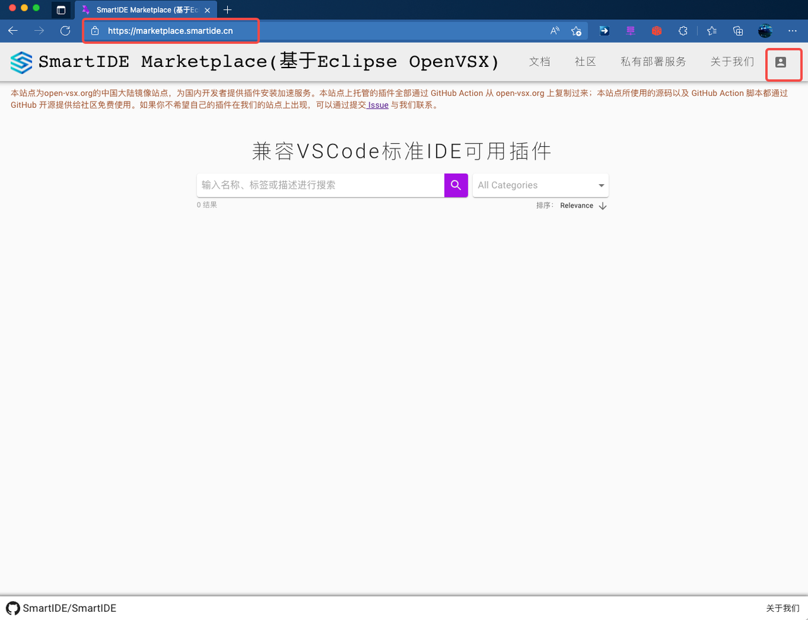
- 输入github登陆信息：

- 授权登陆：

- 登陆成功进入个人设置界面：
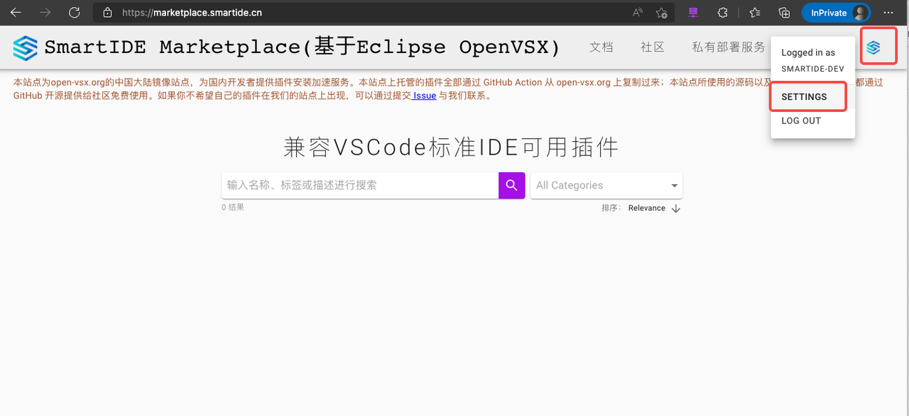
- Access Token页面生成Token：
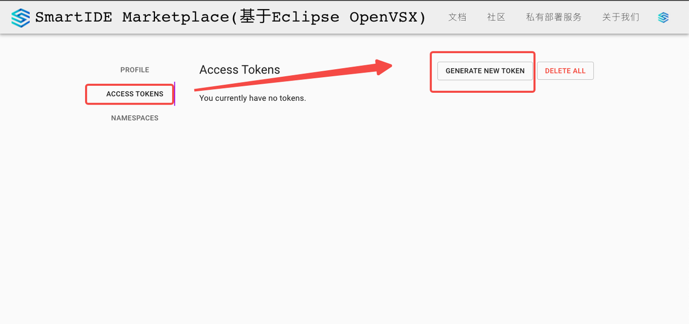

- 复制生成的Token：

#### 5.1.2. 流水线Secret 更改

- 更改 [SmartIDE/eclipse-openvsx](https://github.com/SmartIDE/eclipse-openvsx/settings/secrets/actions) 流水线 Secret: OVSX_REGISTRY_URL 和 OVSX_PAT   为正确的Server地址及Token值
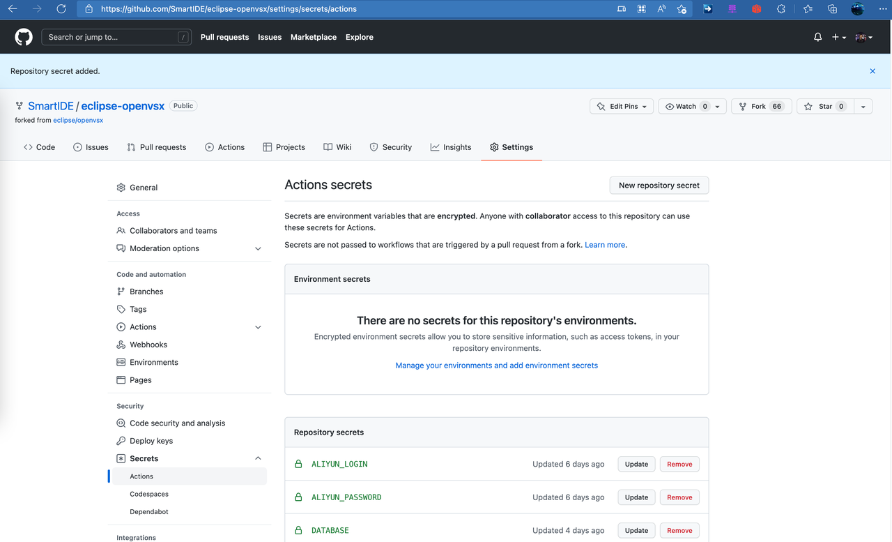
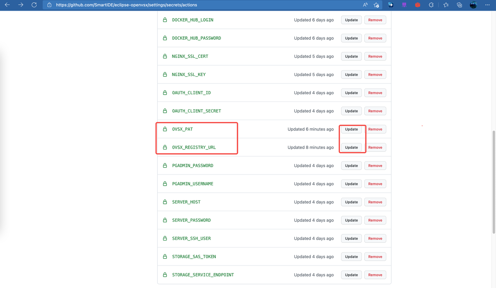
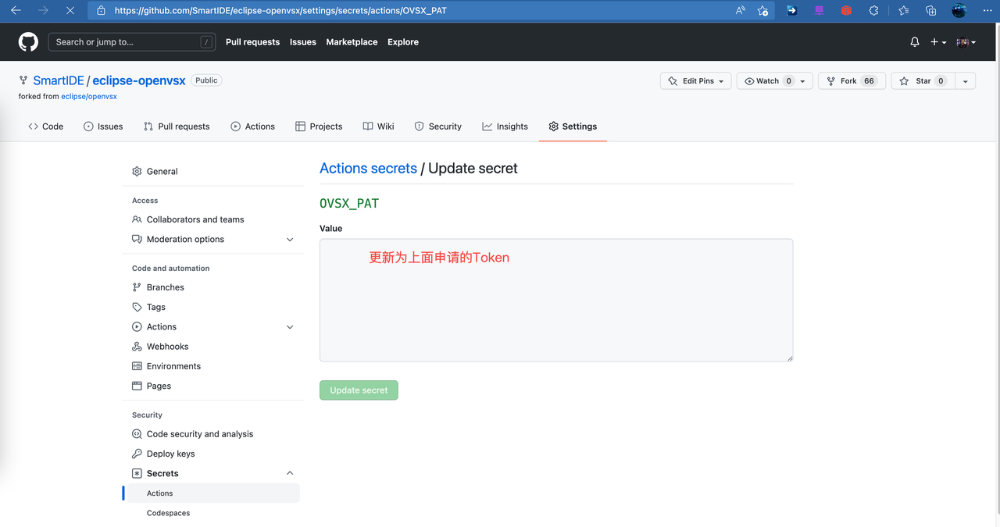
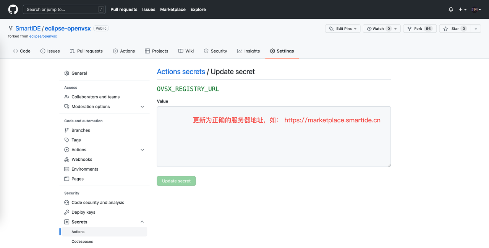

### 5.2 运行流水线
- 进行插件同步的GitHub Action流水线为：[Actions · SmartIDE/eclipse-openvsx (github.com)](https://github.com/SmartIDE/eclipse-openvsx/actions/workflows/smartide-openvsx-extensions-sync.yml)
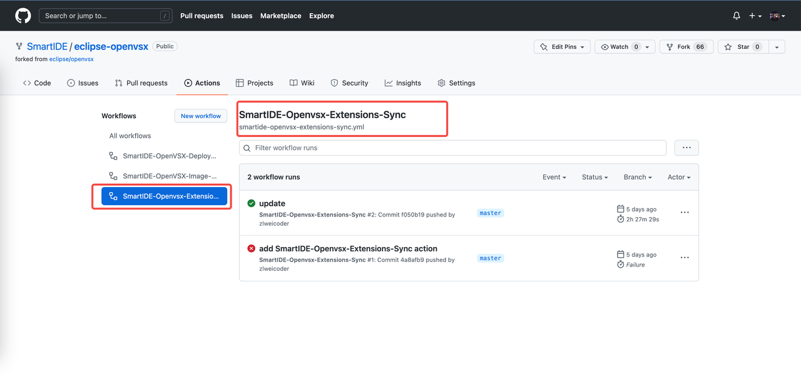
- 默认的触发条件为提交代码至 smartide-marketplace 分支，修改如下path文件
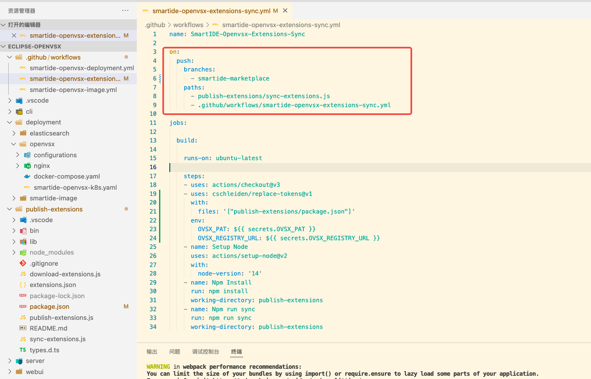
- 运行流水线过程中，会使用Action的代理机进行同步插件，流水线步骤如下：
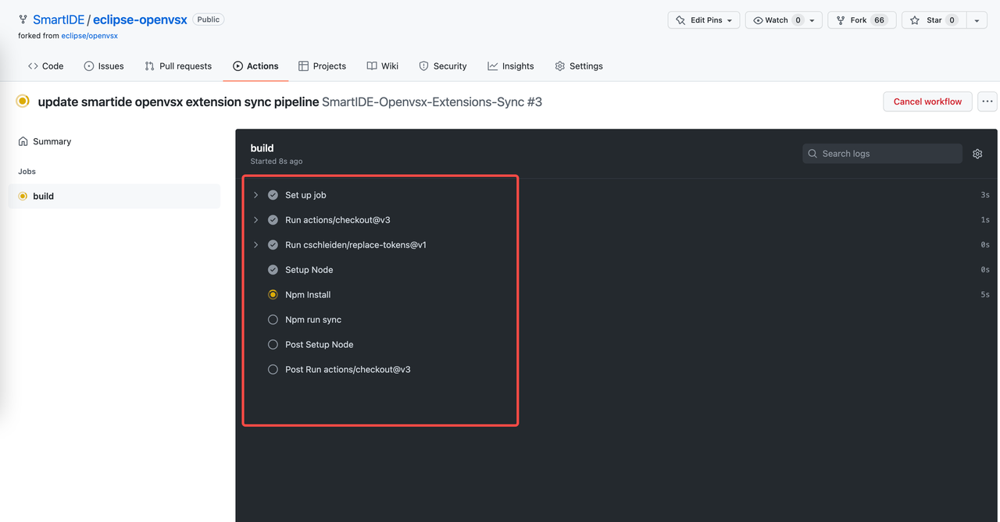
- 插件同步中：
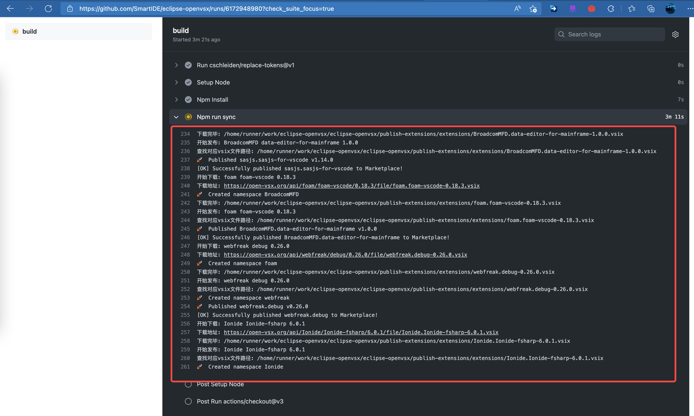

### 5.3 检查同步结果
- 流水线运行时长根据同步的插件数量决定，整个时长可能会超过2个小时，等待同步运行结束后，可以调用 https://marketplace.smartide.cn 的 [Swagger API](https://marketplace.smartide.cn/swagger-ui/) 获取插件总数：
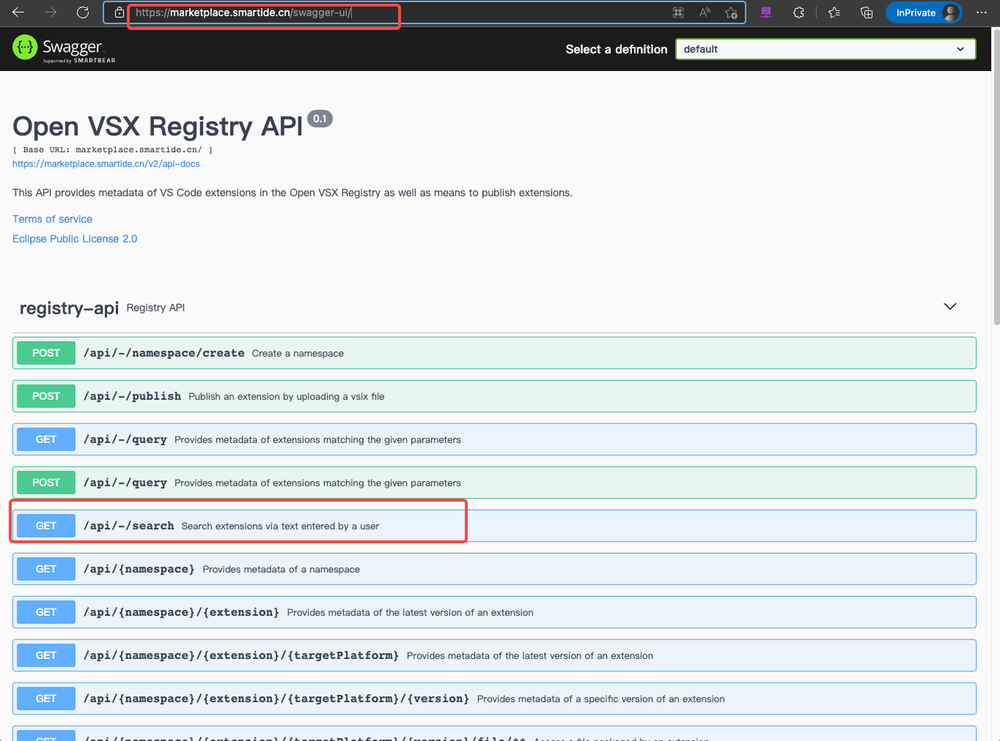
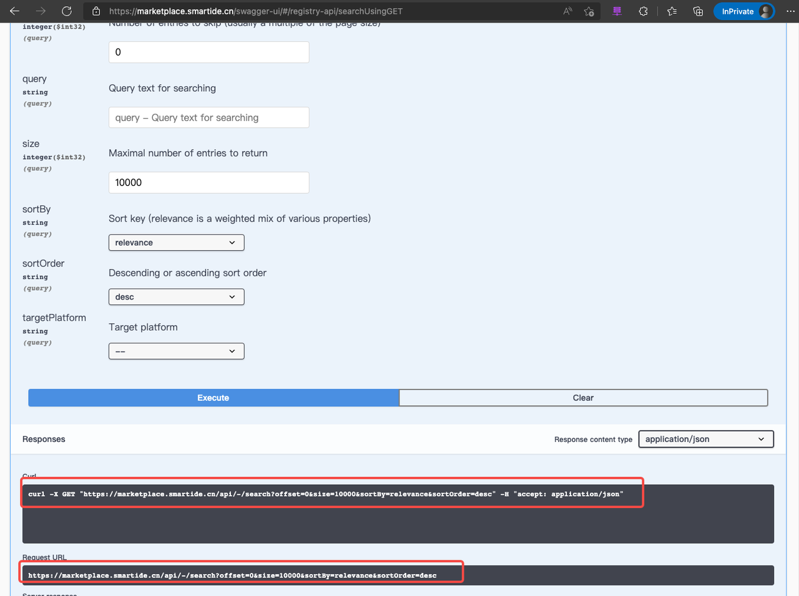
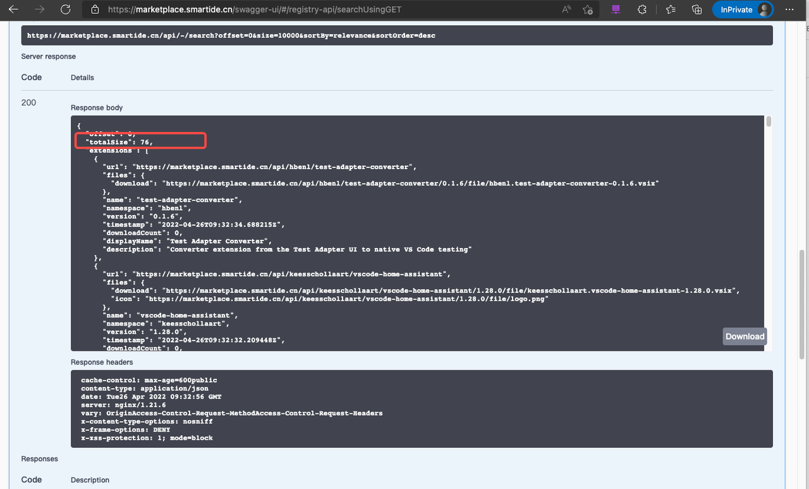
- 界面上可以根据分类或排序和关键字搜索对应插件：
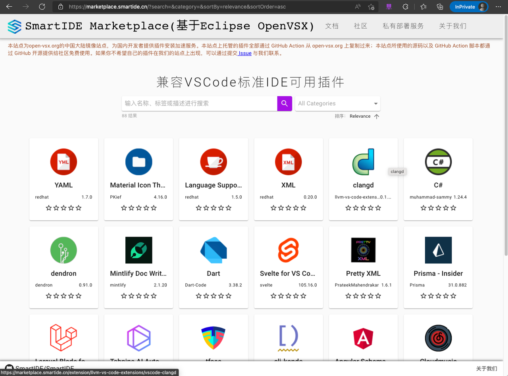