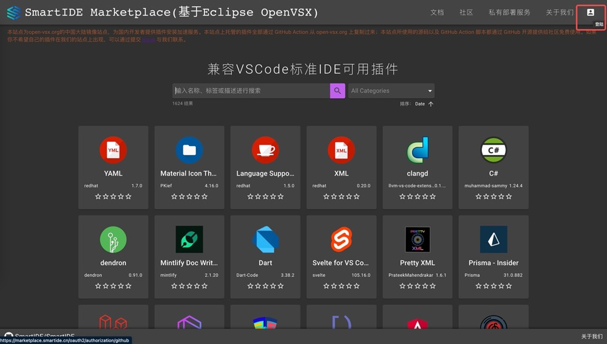
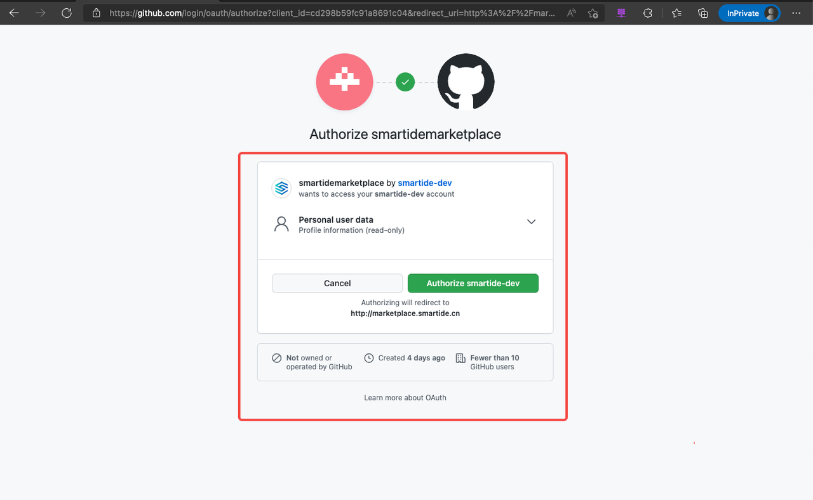
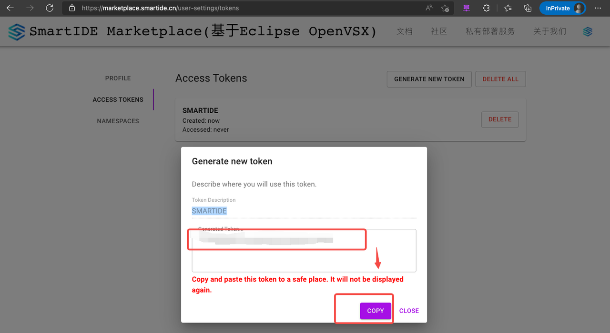

SmartIDE Marketplace 允许用户上传自定制插件并进行下载使用，在插件上传之前需要用户登陆生成个人Token，并基于此 Token 使用 [ovsx](https://www.npmjs.com/package/ovsx) 工具进行命名空间的创建和插件上传操作。
命名空间是插件的集合概念，插件不可脱离命名空间存在，因此需要先创建命名空间，或使用已有的命名空间再进行上传。

## 1. 登陆 SmartIDE Marketplace 生成 Token
- 打开 https://marketplace.smartide.cn 点击右上角头像使用github账号登陆：

- 输入github登陆信息：

- 授权登陆：

- 登陆成功进入个人设置界面：

- Access Token页面生成Token：

- 复制生成的Token：

## 2. 使用 ovsx 工具创建命名空间
- 参照 [Download and install node and npm](https://docs.npmjs.com/cli/v7/configuring-npm/install) 安装 node & npm 工具
- 安装 ovsx 工具

      npm install --global ovsx

- 运行命令创建命名空间

      ovsx create-namespace <name> -p <token> -r https://marketplace.smartide.cn
    命名空间创建完毕后，创建者会默认变为命名空间的“贡献者”角色，如若想要变为命名空间的所有者，请提交 [issue](https://github.com/SmartIDE/SmartIDE/issues) 进行申请。

## 3. 使用 ovsx 工具发布插件
- ovsx 发布功能支持直接发布.vsix 文件或基于插件开发目录打包并发布
- 对于已经有 .vsix 插件文件的使用者，运行如下命令进行发布插件 

       ovsx publish <file> -p <token> -r https://marketplace.smartide.cn
- 也可以进入插件开发根目录代码库中执行如下命令进行发布

       npm install | yarn
       ovsx publish -p <token> -r https://marketplace.smartide.cn
- ovsx 工具内部调用 [vsce](https://www.npmjs.com/package/vsce) 的功能工作，即运行定义于 packages.json中的 vscode:prepublish 脚本。如果插件代码使用 Yarn 运行脚本，可增加 --yarn 参数。

## 4. 验证发布效果
使用 ovsx 工具发布成功后，便可以在 https://marketplace.smartide.cn 站点中找到已发布的插件，也可以在 IDE 中 安装使用，安装使用请参考 [配置连接手册](../config/index.md)。