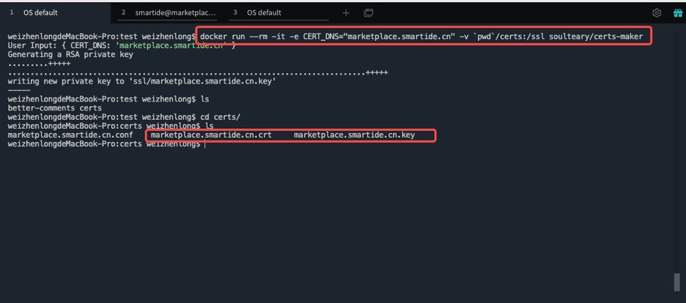
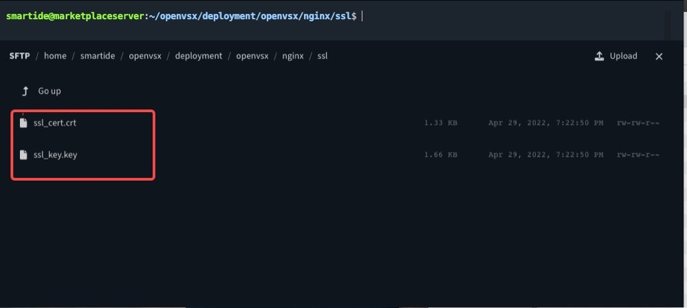
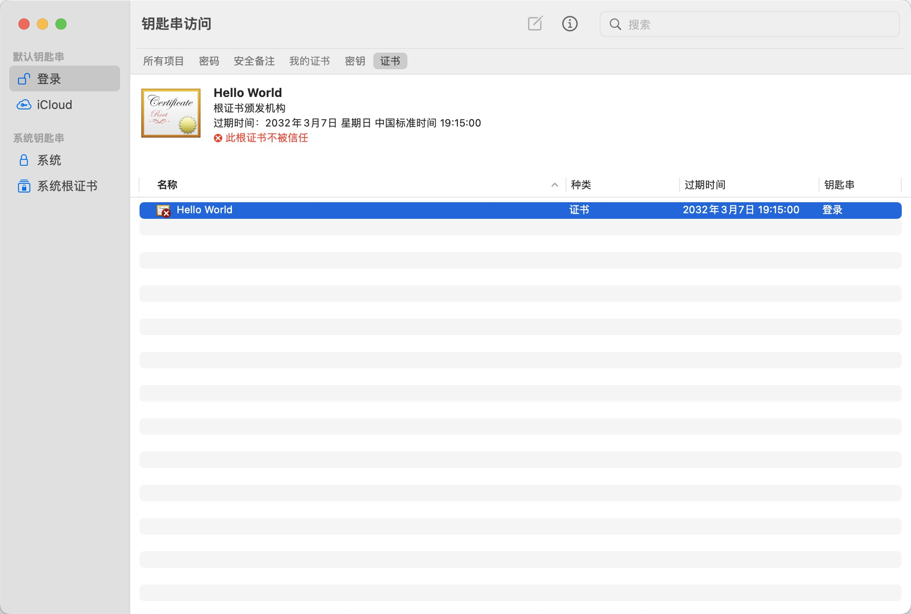
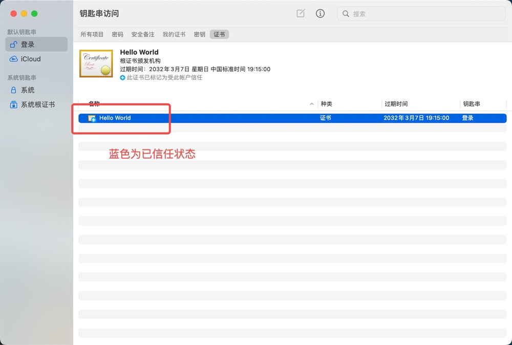
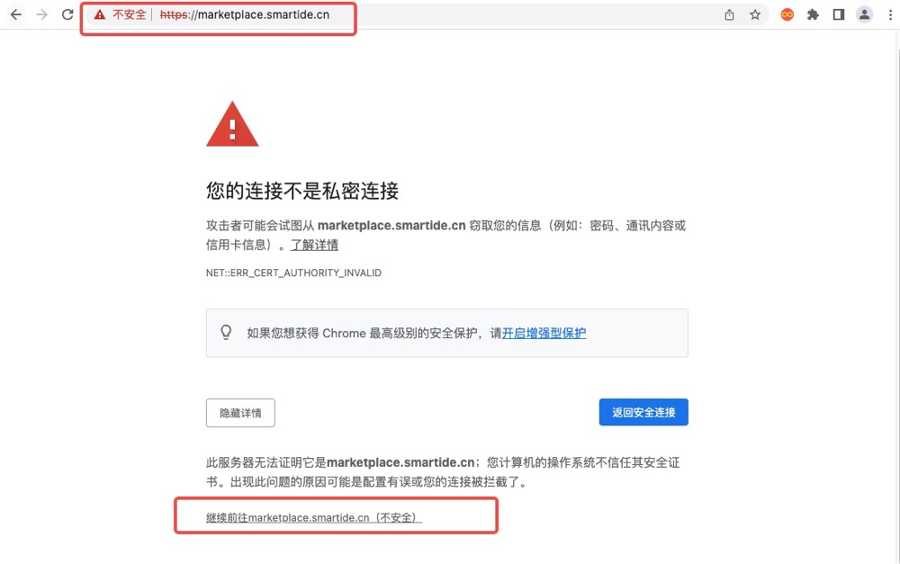
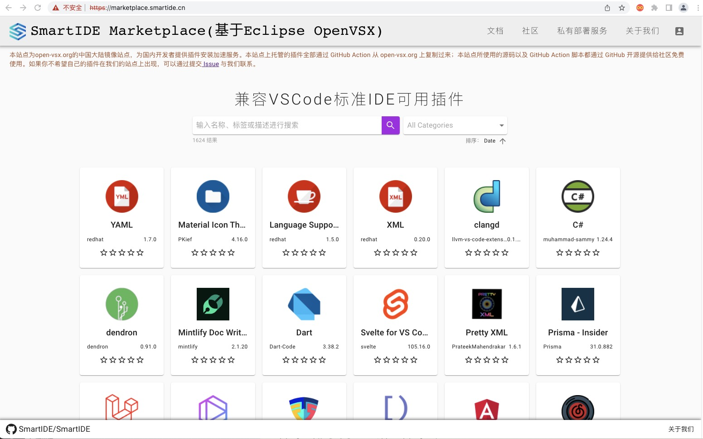
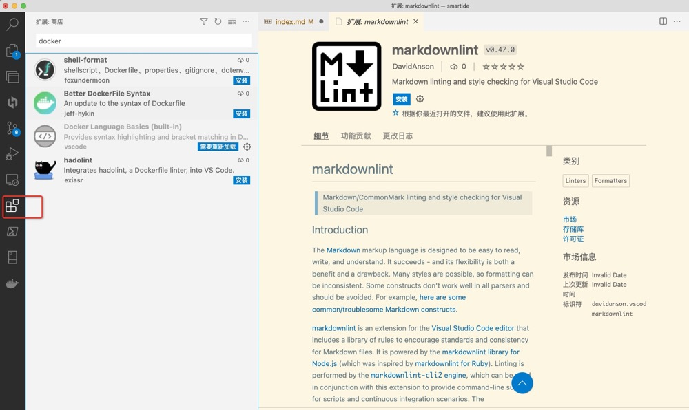

插件市场需要部署为HTTPS站点才能够被IDE顺利连通使用，在企业内外进行私有化部署的时候通常使用自签名证书来绑定HTTPS站点服务，本教程将对如何生成OpenSSL自签名证书和应用证书到插件市场站点进行详细描述。

## 1. 申请OpenSSL自签名证书

[certs-maker](https://github.com/SmartIDE/certs-maker) 使用容器化的方式封装了OpenSSL繁杂的自签名证书生成过程，让使用者仅需要一条Docker指令即可快速生成证书：

    docker run --rm -it -e CERT_DNS="domain.com" -v `pwd`/certs:/ssl soulteary/certs-maker

## 2. 将自签名证书配置到插件市场

参照 [SmartIDE插件市场安装说明](../../../install/marketplace) 部署完毕插件市场服务之后，使用SFTP的方式替换 deployment/openvsx/nginx/ssl 目录下的证书：

- 名称改为 nginx.conf 中指定的名称 ssl_cert.crt 和 ssl_key.key：

      ssl_certificate /ssl/ssl_cert.crt;
      ssl_certificate_key /ssl/ssl_key.key;
- 使用SFTP方式上传证书到对应服务器目录

- 重启 nginx服务

## 3. 本机导入自签名根证书并设置信任
以 mac OS系统为例导入自签名证书并设置为信任
- 打开 钥匙串 拖动 crt 证书放到默认钥匙串“登录”中

- 设置该证书信任状态

- 浏览Marketplace网站查看是否可以正常访问

## 4. VSCode及类IDE连通插件市场验证
- 参考 [配置连接手册](../config) 配置 VSCode 及类 IDE的插件市场链接地址
- 搜索插件

- 安装使用
