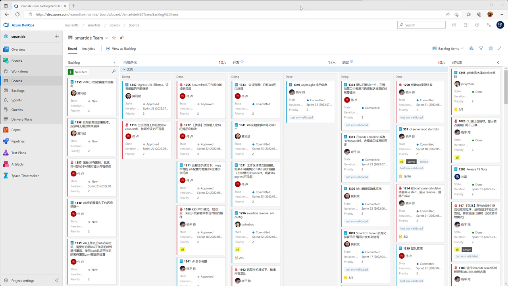
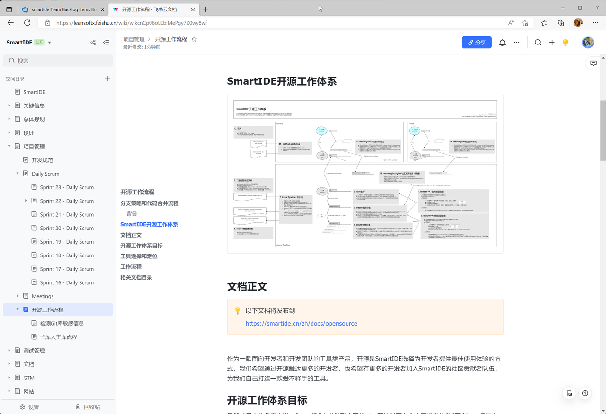
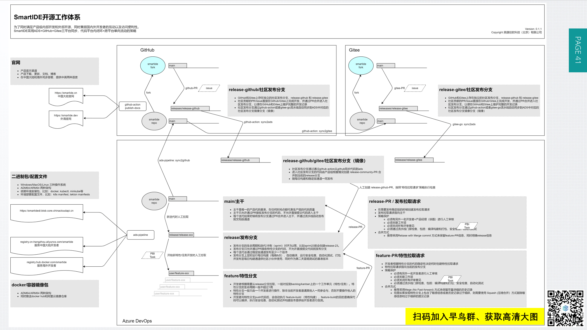

作为一款面向开发者和开发团队的工具类产品，开源是SmartIDE选择为开发者提供最佳使用体验的方式，我们希望通过开源触达更多的开发者，也希望有更多的开发者加入SmartIDE的社区贡献者队伍，为我们自己打造一款爱不释手的工具。

## 目标

虽然从用户的角度来说，SmartIDE力求做到小而美（主要针对面向个人开发者的CLI而言），但其实这个小巧的工具背后其实是一套庞大的系统；另外，SmartIDE作为一款同时面向企业级市场的商用产品，我们还需要在开源的基础上提供企业级的扩展能力。以下总结了SmartIDE开源工作体系的目标，供大家参考。

- 允许产品团队和社区贡献者并行工作，互不干扰的同时又可以流畅的实现代码合并；同时尽量保留足够多的
- 允许产品团队使用专业化的产品设计和项目管理工具（Scrum & Kanban）实现高效的开发迭代；允许社区贡献者采用相对轻量的项目管理工具（Issues）实现足够的过程跟踪和协作。
- 允许产品团队使用专业化的CI/CD流水线工具实现全流程的自动化支撑，开发人员无需关心编码和测试之外所有可以自动化的工作流程，比如：代码编译构建（跨平台和多架构，SmartIDE支持三种操作系统Windows/MacOS/Linux和2种CPU架构AMD和ARM），自动化测试执行和反馈，代码扫描（包括安全和敏感信息），二进制包打包和发布，容器镜像打包和推送（国内+海外），统一的版本标签嵌入以及中英文双语等等。

## 目标受众

谁应该阅读本文档，你可以从本文档获取的价值包括：

- 内部开发者：应该以本文档作为日常开发中需要遵照的流程范例，并随时根据情况提出对本文的改进意见。
- 外部开发者：了解这个流程对于社区开发者与我们互动过程中更加高效的协作会有所帮助。
- 其他：开源已经时当今构建软件一种主流方式，对于需要将开源集成到企业内部开发流程的团队来说，本文档可以作为范例使用。

工具选择和定位
为了达到以上3点目标，我们所选用的工具平台包括：

- Azure DevOps：作为已经持续迭代了17年的DevOps工具平台，微软的Azure DevOps是现在市场同类产品中最优秀的，LEANSOFT团队最为中国以及整个亚太地区最熟悉这个产品的DevOps顾问实施团队几乎包揽了微软中国在过去10年所有的Azure DevOps实施落地项目。因此选择Azure DevOps作为我们的产品组内部工具是毫无疑问的选择。在 SmartIDE 这个产品上，我们使用 Azure DevOps 内置的电子看板作为日常项目管理跟踪工具，所有的产品特性和任务全部通过电子看板统一管理，支撑Scrum&Kanban过程；同时，我们使用Azure DevOps内置的Git代码仓库作为SmartIDE的内部代码托管，并利用分支策略将Git仓库与Azure DevOps内置的流水线进行集成，实现在不同级别的分支进行代码归并的过程中的代码质量控制以及所有的自动化操作。

下图展示了我们当前的看板

下图展示我们我们某条流水线在过去14天的统计数据

- 飞书：作为国内最优秀的企业级协同工具，飞书为SmartIDE提供了丰富灵活的协作方式。SmartIDE的产品创意、特性设计、技术调研、详细设计以及产品文档（包括本文）都是在飞书文档上完成。我们同时还使用飞书的即时通讯和在线会议完成日常的沟通和协作，SmartIDE的所有团队成员全部采用远程工作模式，并且分布在北京，青岛，广州，长沙等多个城市，我们日常Scrum会议，沟通和问题定位全部都通过飞书会议远程完成。

下图展示我们在飞书中的SmartIDE知识库wiki：

- GitHub：作为全球最大的开源社区，通过GitHub触达并与全球的开发者协作是必然选择。我们同时使用GitHub Action完成部分自动化操作。
- Gitee：作为中国最大的开源社区，Gitee为中国开发者提供了非常友好的本土化功能，对于国内开发者而言。使用Gitee相对于GitHub要方便很多。因此，SmartIDE回同步将代码推送至GitHub和Gitee，以便于我们与国内开源社区的贡献者进行协作。

## 工作流程

下图展示了完整的SmartIDE开源工作体系，需要说明的是这里展示的是一个流程范例或者工作思路，并不代表所有SmartIDE的组件完全遵照此范例执行。

> 扫描图中二维码加入早鸟群可以获取高清流程图

以上图中出现的14个工作环节这里逐一说明：

1. 主库：SmartIDE主库同时存在于Azure DevOps (下简称ADS），GitHub和Gitee。并在三个主库副本的main分支上保持同步，具体的同步顺序是 ADS -> Github -> Gitee。SmartIDE的主库中包括CLI，Server，开发者容器三个核心部分的全部代码和脚本以及SmartIDE官网的所有内容（包括本文）。
2. main/主干：主干是SmartIDE唯一的代码基准，在任何时间点我们都保持主干上的代码质量满足产品级使用的需要，主干上的代码和我们文档版通道的最新版本相对应。
3. release/发布分支：我们使用Scrum组织日常开发过程，迭代周期为2周，我们会在每个迭代开始时拉取对应的release分支，比如release-23就代表第23个迭代的代码变更。release分支的代码与每日构建版通道的版本保持一致。
4. feature/特性分支：特性分支是SmartIDE内部开发人员执行日常开发任务的分支，一般对应ADS看板上的一个卡片（可以是特性或者任务，具体使用哪个粒度由开发者自己决定）。特性分支上会执行CI流水线并将安装包推送到我们内部的特性发布通道，这个通道只对内部开发者开放。
5. feature-PR/特性分支拉取请求：当内部开发者认为当前特性已经可以推送到release/发布分支并通过每日构建通道提供给外部用户，就可以创建这个feature-PR。feature-PR需要至少2名内部开发者的Code-Review以及流水线门禁的检查。这些条件全部满足后方可合并到release分支。这个过程中我们推荐采用普通的Merge方式以便保留完整的commit日志，但是如果在Code-Review过程中发现携带了敏感信息或者commit日志不够规范，我们会要求开发者使用Squash（压缩）方式合并PR，这将帮助我们剔除不必要的commit记录，但也会丢失一部分commit日志。
6. release-PR/发布拉取请求：在每个迭代过程中，我们会选择合适的时间点进行稳定版发布，这个时间点并不固定也并不限制在一个迭代只发布一次稳定版。只要我们认为当前release分支的代码质量达到了要求同时有必要进行稳定版发布，我们就会创建这个release-PR。这个PR同样需要满足Code-Review的要求以及一系列的流水线门禁检查。在Code-Review过程中，产品经理需要被引入以确保发布的内容足够明确。因为此时产品经理需要同步准备对应的产品文档，发布日志以，博客，市场宣传等内容。
7. Azure Pipeline/流水线：以上4/5/6三个环节中所涉及的流水线全部通过一个azure-pipeline.yml文件进行描述。流水线会负责将各种繁琐的检查验证全部执行并反馈问题，同时按照SmartIDE的发布策略，完成Windows/MacOS/Linux以及AMD/ARM平台的编译构建，代码签名等动作，最终允许内外部开发者/用户方便的获取对应的版本。
8. 云存储/二进制包/配置文件：我们使用Azure Blob提供二进制包和配置文件的存储和发布，在这里包含了2个主要目录，分别是: /builds 每日构建通道，/releases 稳定版通道
9. docker/容器镜像包：SmartIDE大量使用了docker容器镜像，包括SmartIDE CLI和Server本身，开发者镜像以及其他的依赖包。所有这些镜像我们会同时推送到DockerHub和阿里云镜像仓库，后者是为了国内开发者访问方便。
10. ads-pipeline: sync2github：这是一个Azure Pipeline的流水线任务，会在代码合并到ADS主库的main分支时自动将代码同步到GitHub主库的main分支上。
11. GitHub Actions: 以上同步完成后，会触发两个Actions，分别是docs-publish用于将/docs目录中的内容构建成静态站点（使用hugo框架）并同时发布到官网上。另外一个action会将Github主库的main分支同步到Gitee主库的main分支上。
12. 官网：为了方便国内的开发者以及海外的开发者都能顺畅的使用SmartIDE的工具和服务，我们分别在国内（Azure北京数据中心）和美国（Azure 美中数据中心）部署了产品官网。两个站点采用不同的域名 smartide.cn (国内官网）和 smartide.dev (海外官网），官网本身内容上随时保持一致，提供中英文两种语言的内容。
13. 社区库：在GitHub或者Gitee上的社区小伙伴可以fork我们的主库并提交PR给我们的主库。
14. release-github/社区发布分支：社区小伙伴提交的PR一旦接受会合并到release-github分支上或者release-gitee分支上。这个过程中，我们会使用GitHub和Gitee所提供的Issue和PR功能与社区贡献者进行互动，完成整个代码合并过程的闭环，尽量保留所有的commit记录。在完成PR时采用Merge或者Squash方式的策略与feature-PR一致，尽量使用Merge并在必要的时候使用Squash。
15. Github-action: sync2ads：这个GitHub Action负责将当前的社区发布分支同步回到ADS中，以便我们将社区贡献合并到产品主干。
16. 社区发布分支（镜像）：以上sync2ads任务会将GitHub和Gitee上的贡献同步回到ADS，内部开发者会再创建 release-community-PR 将这些社区贡献合并到当前的内部 release 分支上以便按照日常发布流程发布出去。在这个 release-community-PR 上我们采用和 feature-PR 一致的审核策略。简单来说，我们将社区发布分支当作一个内部的特性分支来看待。

## 不同PR合并方式的优缺点

在以上工作体系中，我们在不同的场景下会使用不同的PR合并方式。在大多数成熟的Git服务上都有至少三种PR合并方式：

- Merge (No Fast-forward)：普通合并，为当前的合并单独创建一条commit信息并保留分支上所有的commit。
- Rebase：变基合并，直接将分支上的commit在目标分支上重写，不会创建单独的合并commit信息。
- Squash：压缩合并，将分支上的所有commits压缩成一个commit，并将这条commit放入目标分支。

以上三种合并方式各有好处，以下从开源项目的角度做个简单比较以便大家在合并PR的时候做出正确的选择。

|       | Merge | Rebase   | Squash   |
| ----------- | ----------- | ----------- | ----------- |
| 保留原分支历史记录 | 保留 | 保留 | 无法保留 |
| 创建独立提交记录 | 创建 | 不创建 | 创建 |
| 剔除敏感信息 | 无法剔除 | 无法剔除 | 可以剔除 |
| 重写目标分支提交历史记录 | 不重写 | 重写 | 不重写 |
| 历史记录线性程度 | 低 | 高 | 高 |
| 历史记录条目数量 | 多 | 中等 | 少 |

三张图片可以更加直观的看到区别

图1 - 使用Merge方式合并PR以后，原分支的提交历史和单独的PR合并提交历史记录全部被保留

图2 - 使用Rebase方式合并PR以后，只有原分支提交历史记录被暴露，没有PR合并记录

图3 - 使用Squash方式合并PR后，只有独立的PR合并记录，原分支的提交历史被清理掉了（压缩）

从以上比较可以看出，这3中合并方式各有优缺点，并没有办法选出一种适合所有场景的方法，因此需要实际操作PR合并的开发者充分了解以上的特点并做出选择。这里是几点通用的建议：

- 从使用PR的目的而言，我们是希望能够通过PR对需要合并的内容进行一定的控制，一般来说我们是希望这个过程被完整记录的。从合格角度来说，Merge和Squash都会在合并的时候针对PR本身创建独立的提交记录，相比Rebase更有优势。
- 作为版本控制本身的特点，历史记录一旦产生就非常难以被彻底剔除掉，这种特点对于我们跟踪代码变更是有优势的。但是在一种情况就会变得比较麻烦，就是当开发者不小心提交了一些敏感信息在代码中，这个特点就会造成麻烦，因为就算在下一个提交中删除掉了敏感信息，历史记录仍然会存在。在这种情况下，Squash（压缩合并）的优势就体现出来了。但代价是将丢失掉这次PR原分支上的所有的历史记录。

基于以上2点总结，一般性建议是在PR合并的时候尽量选择Merge的方式，这样有助于保留历史记录；但是如果发现这次PR所涉及的原分支历史中存在敏感信息，那么就要采用Squash的方式压缩掉敏感信息，牺牲掉历史记录的完整性。

## 参考资料：
- Why I’m against merging pull requests in squash mode or rebase mode?
- What's the Difference Between the 3 Github Merge Methods?

