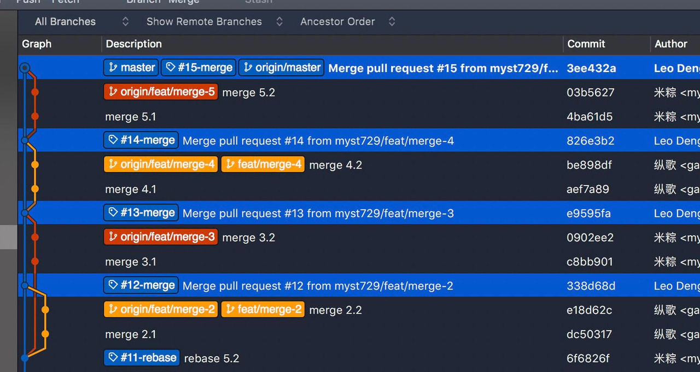
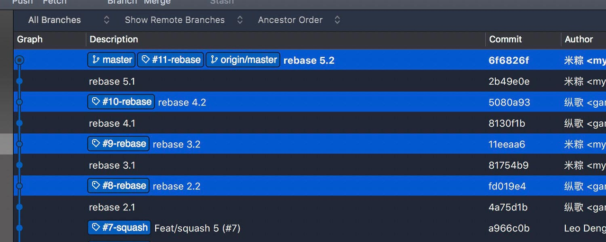
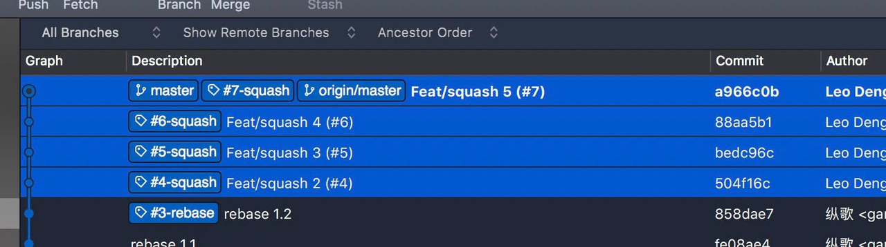

## 不同PR合并方式的优缺点

在工作体系中，我们在不同的场景下会使用不同的PR合并方式。在大多数成熟的Git服务上都有至少三种PR合并方式：

- Merge (No Fast-forward)：普通合并，为当前的合并单独创建一条commit信息并保留分支上所有的commit。
- Rebase：变基合并，直接将分支上的commit在目标分支上重写，不会创建单独的合并commit信息。
- Squash：压缩合并，将分支上的所有commits压缩成一个commit，并将这条commit放入目标分支。

以上三种合并方式各有好处，以下从不同的角度比较以便大家在合并PR的时候做出正确的选择。

|       | Merge | Rebase   | Squash   |
| ----------- | ----------- | ----------- | ----------- |
| 保留原分支历史记录 | 保留 | 保留 | 无法保留 |
| 创建独立提交记录 | 创建 | 不创建 | 创建 |
| 剔除敏感信息 | 无法剔除 | 无法剔除 | 可以剔除 |
| 重写目标分支提交历史记录 | 不重写 | 重写 | 不重写 |
| 历史记录线性程度 | 低 | 高 | 高 |
| 历史记录条目数量 | 多 | 中等 | 少 |

三张图片可以更加直观的看到区别

图1 - 使用Merge方式合并PR以后，原分支的提交历史和单独的PR合并提交历史记录全部被保留

图2 - 使用Rebase方式合并PR以后，只有原分支提交历史记录被暴露，没有PR合并记录

图3 - 使用Squash方式合并PR后，只有独立的PR合并记录，原分支的提交历史被清理掉了（压缩）

从以上比较可以看出，这3中合并方式各有优缺点，并没有办法选出一种适合所有场景的方法，因此需要实际操作PR合并的开发者充分了解以上的特点并做出选择。这里是几点通用的建议：

- 从使用PR的目的而言，我们是希望能够通过PR对需要合并的内容进行一定的控制，一般来说我们是希望这个过程被完整记录的。从合格角度来说，Merge和Squash都会在合并的时候针对PR本身创建独立的提交记录，相比Rebase更有优势。
- 作为版本控制本身的特点，历史记录一旦产生就非常难以被彻底剔除掉，这种特点对于我们跟踪代码变更是有优势的。但是在一种情况就会变得比较麻烦，就是当开发者不小心提交了一些敏感信息在代码中，这个特点就会造成麻烦，因为就算在下一个提交中删除掉了敏感信息，历史记录仍然会存在。在这种情况下，Squash（压缩合并）的优势就体现出来了。但代价是将丢失掉这次PR原分支上的所有的历史记录。

基于以上2点总结，一般性建议是在PR合并的时候尽量选择Merge的方式，这样有助于保留历史记录；但是如果发现这次PR所涉及的原分支历史中存在敏感信息，那么就要采用Squash的方式压缩掉敏感信息，牺牲掉历史记录的完整性。

## 参考资料：
- [Why I’m against merging pull requests in squash mode or rebase mode?](https://myst729.github.io/posts/2019/on-merging-pull-requests/)
- [What's the Difference Between the 3 Github Merge Methods?](https://rietta.com/blog/github-merge-types/)