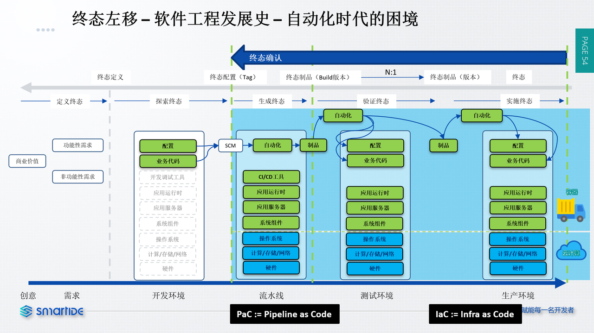
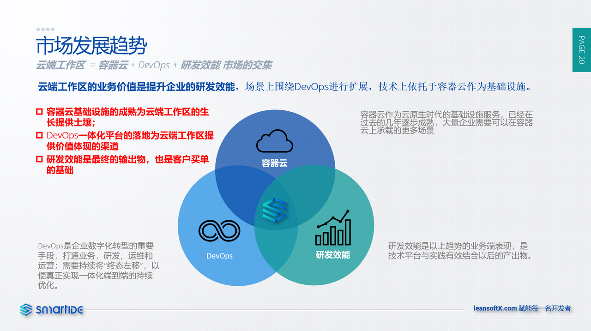
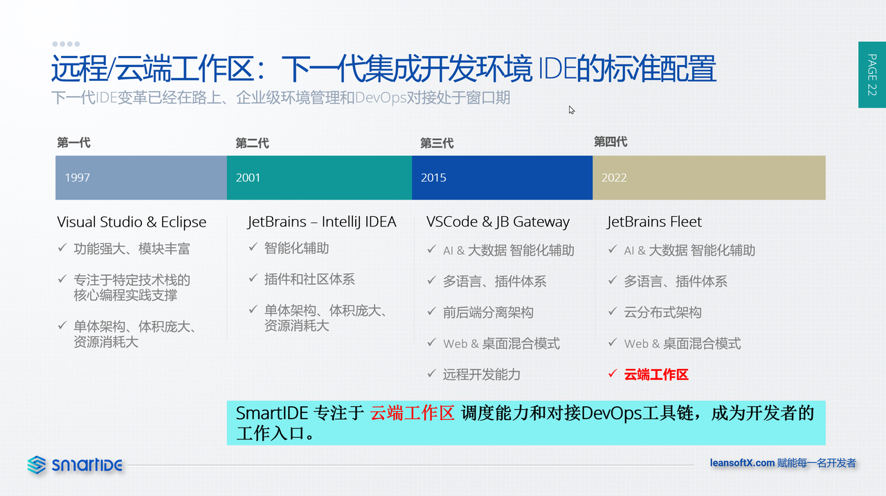
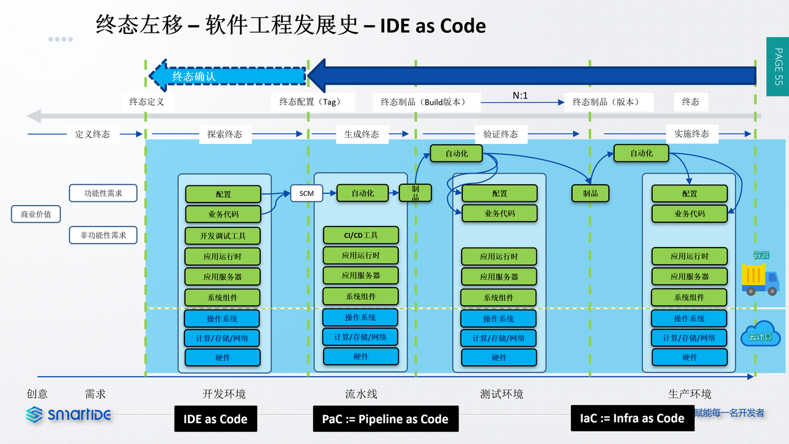

SmartIDE是一款 远程/云端工作区调度工具，其 核心价值是从根源上解决软件环境问题。当前，SmartIDE主要采用容器技术，比如：Docker和Docker-Compose；以及容器集群编排技术，比如：Kubernetes，来解决软件运行环境的一致性，标准化，快速获取，可扩张性和可维护性问题。

SmartIDE对IDE的边界重新进行了定义，我们认为任何当前应用所需要的代码编辑器，运行时，SDK，中间件，应用服务器，配置以及底层操作系统均属于我们所定义的IDE的一部分。与传统的IDE工具的不同之处主要在于E（Environment 环境）。开发者常用的Visual Studio, Visual Studio Code, JetBrains全系列以及Eclipse这些传统的IDE工具在 I (Integrated 集成性)和 D（Development）上面做的都非常出色，但是它们都没有为开发者彻底解决E的问题。这是因为在这些IDE产品出现的时候，软件本身的依赖环境还没有那么复杂，大多数的软件都是单体，微服务架构还未出现，通用中间件软件也不流行，大多数的开发者都可以在自己本地的开发机上完整整个应用（系统）的完整搭建，开发调试，测试以及打包发布过程。

当前的软件系统已经越来越复杂，越来越多的开发者在使用各种中间件来简化自己的软件开发过程，越来越多的团队在引入微服务架构来适应业务架构的敏捷性需求，云原生技术正在被更多团队接受，容器化和集群编排系统以及DevOps CI/CD流水线的引入也给软件工程引入了更多的复杂度。在这样的背景下，传统IDE产品的局限性日渐显现，开发者不得学习更多的技术，引入更多的工具，花费的更多的时间在软件环境的管理和维护上。在软件工程领域种，也出现了类似SRE这种专注于打通复杂软件工程系统协同的专业化工作角色/职责，软件环境在SRE的工作职责种占有非常高的比重（参考：[Google SRE](https://sre.google/)。即便如此，软件环境问题仍然是企业改进软件工程系统过程种最难解决的核心问题之一。 （参考：[8 Key Challenges in Adopting DevOps](https://www.devopsinstitute.com/8-key-challenges-in-adopting-devops-part-1/))。对于希望通过改进软件工程工艺来提升研发效能的团队来说，解决环境的可获取能力是实现端到端持续交付能力的主要障碍。

也因为以上原因，IT行业内开始涌现了Docker, Kubernetes, Hashicrop等专注于解决软件环境问题的基础工具类软件。从2013年Docker引领的容器化浪潮开始，软件交付方式已经有了翻天覆地的变化，而且这种变化在逐步从生产环境向开发测试环境推进。这个趋势的核心实践，Infrastructure as Code（IaC 基础设施即代码）的思路正在影响着越来越多的DevOps实践者和工具厂商。可以说，在容器化浪潮的背后其实是IaC实践广泛应用，也因为此IaC实践被大多数DevOps实践者作为判断一个组织的软件工程能力的重要评估标准。

如下图所示：IaC实践（工具）正在从生产环境逐步左移

 

IaC实践左移实际上是从问题的表象逐渐触达实质的过程。容器化/IaC实践首先被用于生产环境的原因很容易理解，因为这个环境最贴近用户，最贴近业务，也是企业最愿意投入资金的部分；但随着生产环境的容器化进程推进，组织会逐步认识到生产环境的问题的根源其实并不在生产环境，而在其左侧的测试，流水线以及开发环境。开发环境作为产生环境的源头，如果不能被容器化，会对其下游（右侧）环境构成连锁问题效应，破坏容器化本应产生的效益，比如：为管理容器编排文件而专门设置的权限、人员角色和流程，因为开发人员引入的环境变更而引起的后续环境的连锁变更；运维人员为了防止以上问题影响系统稳定性而采取的保守管理策略，以及受到损伤的业务敏捷性。

应该说，在容器化进程发展到今天的将近10年以后，开发环境的非标准化已经成为阻碍整个持续交付体系效能提升的关键性障碍。同时，随着企业中的容器化平台（包括：各种类型的k8s以及很多企业习惯称之为PaaS的私有云平台）以及DevOps工具链的普及，已经为IDE上云提供了必要条件。

从传统IDE工具的演进来看，以 [Visual Studio Code Remote](https://code.visualstudio.com/docs/remote/remote-overview) 以及 [JetBrains Gateway](https://www.jetbrains.com/remote-development/gateway/) 为代表的远程开发能力已经被越来越多的开发者接受并喜爱；同时也出现了类似 [Squash](https://github.com/solo-io/squash), [telepresence](https://www.telepresence.io/), [Nocalhost](https://nocalhost.dev/zh-CN/) ，Bridge to Kubernetes ([Visual Studio 插件](https://marketplace.visualstudio.com/items?itemName=ms-azuretools.mindaro) 和 [Visual Studio Code 插件](https://marketplace.visualstudio.com/items?itemName=mindaro.mindaro)) 这样专注于解决K8S环境下调试场景的特定工具（参考：[Debugging Microservices: The Ultimate Guide](https://lightrun.com/debugging/debugging-microservices-the-ultimate-guide/）。这些都代表着传统IDE工具的云化进程。

SmartIDE 定位于远程/云端工作区的调度，为传统IDE上云提供服务端的完整解决方案，依托于已经在大量企业普及的容器云和DevOps平台，为开发者提供更加安全，简单和高效的全新工作模式。最终实现在 探索阶段 就能确认软件的最终形态的目的，为后续的环节提供明确的状态基准。

