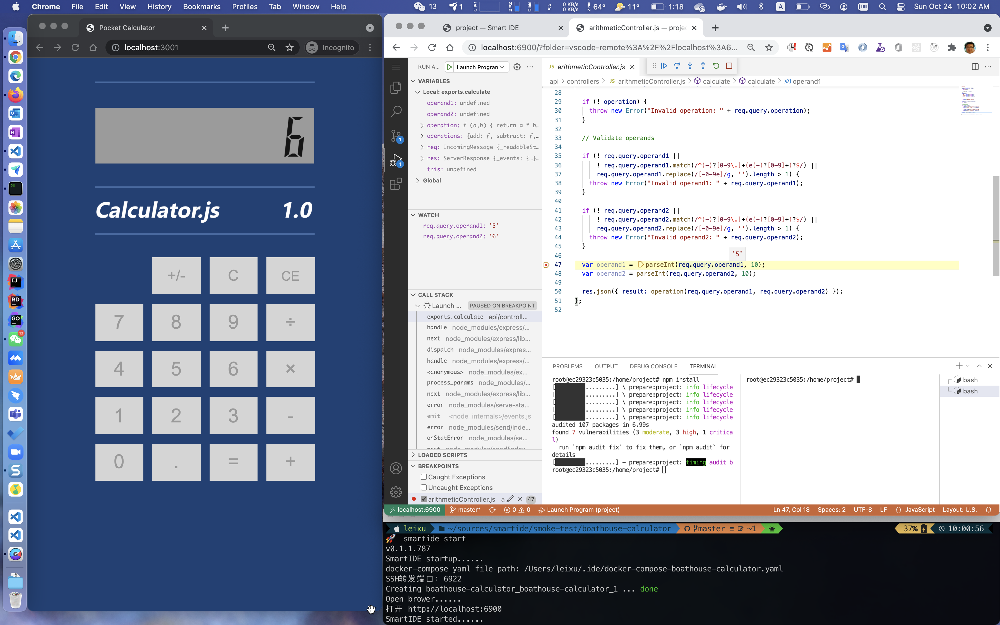

{}
内容更新中。
{}

## 我们为什么要开发SmartIDE？

> 在当今这个软件吞噬世界的时代，每一家公司都是一家软件公司 ... ...

如今，软件确实已经深入我们生活的方方面面，没有软件你甚至无法点餐，无法购物，无法交水电费；我们生活的每一个环节都已经被软件包裹。在这些软件的背后是云计算，大数据和人工智能等等各种高新科技；这些现代IT基础设施在过去的5年左右获得了非常显著的发展，我们每个人都是这些高科技成果的受益者 ... ... 但是，为你提供这些高科技成果的开发者们自己所使用的软件（开发工具）却仍然像 “刀耕火种” 一般落后。

你可能会觉得这是危言耸听，那么让我来举一个简单的例子：大家一定都通过微信给自己的朋友发送过图片，这个过程非常简单，拿出手机，拍照，打开微信点击发送图片，完成。收到图片的朋友直接打开就可以看到你拍摄的照片了。但是对于开发者来说，如果要将一份代码快照发送给另外一位开发者，那么对方可能要用上几天的时间才能看到这份代码运行的样子。作为普通人，你恐怕无法理解这是为什么，如果你是一名开发者，你一定知道我在说什么！当然，我们也不指望普通人能够理解我们，对么？


这样的场景是不是很熟悉？开发环境的搭建对于开发者来说理所当然的是要占用大量时间和精力的，但是对于 “产品经理/领导/老板/老婆/老妈/朋友” 来说，开始写代码就应该像打开Word写个文档一样简单，只有开发者自己知道这其实很不简单。

但是开发者已经有了非常好用的IDE了，Visual Studio Code, JetBrain 全家桶都已经非常成熟，并不需要另外一个IDE了。确实，SmartIDE也并不是另外一个IDE，我们不会重新造轮子，我们只是希望你的轮子可以转的更快、更高效、更简单。

如果我们可以

```shell
git clone https://github.com/idcf-boat-house/boathouse-calculator.git
cd boathouse-calculator
smartide start
```

然后就可以进行开发和调试，是不是很爽？



图中重点：

- 通过右下角的的终端，你可以看到仅用一个简单的命令（smartide start）就完成了开发环境的搭建
- 在右上角的浏览器中运行着一个大家熟悉的Visual Studio Code，并且已经进入了单步调试状态，可以通过鼠标悬停在变量上就获取变量当前的赋值，vscode左侧的调用堆栈，变量监视器等的都在实时跟踪应用运行状态
- 左侧的浏览器中是我们正在调试的程序，这是一个用node.js编写的计算器应用并处于调试终端状态
- 以上全部的操作都通过浏览器的方式运行，无需提前安装任何开发环境，SDK或者IDE。你所需要的只有代码库和SmartIDE。
- 以上环境可以运行在你本地电脑或者云端服务器，但开发者全部都可以通过localhost访问，无需在服务器上另外开启任何端口。

SmartIDE可以帮助你完成开发环境的一键搭建，你只需要学会一个命令 (smartide start) 就可以在自己所需要的环境中，使用自己喜欢的开发工具进行编码和开发调试了，不再需要安装任何工具，SDK，调试器，编译器，环境变量等繁琐的操作。如果我们把Vscode和JetBrain这些IDE称为传统IDE的话，这些传统IDE最大的问题是：他们虽然在 I (Integration) 和 D (Development) 上面都做的非常不错，但是都没有解决 E (Environment) 的问题。SmartIDE的重点就是要解决 E 的问题。