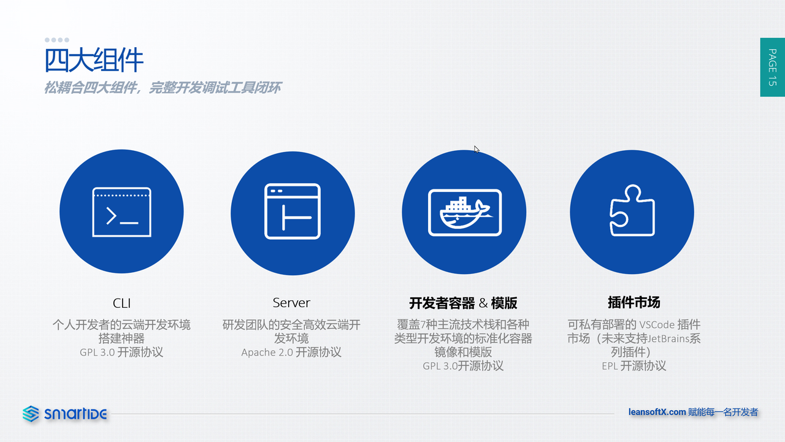

SmartIDE 由4个组件组成，分别是CLI, Server，开发者镜像和模板，插件市场。

## 组件说明

**CLI** 是所有组件的核心，SmartIDE的远程/云端工作区能力全部都封装在这个大小只有50M左右的命令行工具中。可以说，这个小小的命令行工具的能力等同于一个CloudIDE系统（比如：Github Codespaces, AWS Cloud 9, 腾讯Code Studio等等），任何人都可以安装这个CLI工具并在自己选择的硬件/虚拟机/k8s上自助部署属于自己的CloudIDE系统。CLI的功能非常单纯，它只负责一件事情，就是按照 IDE配置文件（.ide.yaml）文件 的描述，完成对远程/云端工作区的生命周期管理。

**Server** 是在CLI的基础上提供的WebUI访问方式，为用户提供更加友好的交互方式以及承载企业级特性的平台。Server本身不会直接维护远程/云端工作区的状态，所有针对工作区的操作全部通过CLI完成。

**开发者镜像 & 模板** 是交付标准化环境的载体，通过提供预制的Docker镜像和环境模板，SmartIDE可以在无需修改系统代码的前提下适配各种不同类型的环境，包括：IDE工具，开发语言和SDK，应用依赖的中中间件，应用服务器以及专属工具等等。开发者镜像和模板支持用户自定义，用户可以自由的使用自有的镜像以及模板库来支持高度定制化的场景。

**插件市场** 是为IDE工具（当前只支持类VSCode IDE，未来也会支持JetBrains系列）提供的插件集中管理能力。

## 私有部署优先

SmartIDE 的设计目标是企业用户，因此我们优先支持私有部署，以上所有组件均可以在公网或者私有隔离网络中进行部署，为企业用户提供完整闭环的云端IDE解决方案。

## CLI设计目标

### 全功能独立工作
CLI是SmartIDE产品架构中与其他类似产品最大的差异。大多数CloudIDE都会提供CLI工具，但是这些CLI都是作为辅助性工具存在的，也就是说用户使用CLI连接到CloudIDE服务来完成类似端口转发，如果脱离的CloudIDE服务，这些CLI本身是无法单独使用的。
SmartIDE的CLI则不同，用户可以使用CLI直接创建、停止，删除，清理远程/云端工作，这个过程无需CloudIDE服务（SmartIDE Server）的存在。
这样设计的目的是为了方便个人开发者可以非常轻量的管理自己的远程/云端工作区，无需预先部署Server。这样，个人开发者可以在需要的时候使用一个 smartide start 指令即可在任何资源上启动远程/云端工作。

### 快速迭代
从开发和调试的角度来说，CLI工具的迭代速度是带有WebUI或者API类型的应用无法比拟的。因为CLI极度简单的操作方式，我们无需处理界面的布局，美观，操作体验，各种边界条件等问题，可以专注于业务目标的实现。这种快速迭代能力让我们可以更早的触达用户，验证产品核心功能并及时调整产品方向。在过去的6个月，CLI的发布速度是平均每天3.8个版本。

### 可集成性
CLI封装了管理远程/云端工作区的所有能力，这让用户利用CLI来搭建自己的CloudIDE系统，实际上SmartIDE Sever 本身就是这样工作的，通过将 CLI 打包成 tekton流水线任务，SmartIDE Server 的所有工作区操作都不会直接调用虚拟机或者k8s集群，而是通过CLI来完成。借助CLI的快速迭代特性，我们的Sever开发人员可以更加专注于用户体验和企业级功能，而不用关心底层工作区调度问题。

对于希望构建企业内部CloudIDE平台的组织来说，利用CLI的这种可集成特性，可以非常快速底层本的完整平台的搭建，不用去关注与虚拟机以及k8s集群进行操作的细节问题。
我们当前已经提供了gitlab-ci的集成示例，未来我们会提供更多各种类型的DevOps系统场景。

- [Issue: gilab ci extension](https://github.com/SmartIDE/SmartIDE/issues/30)