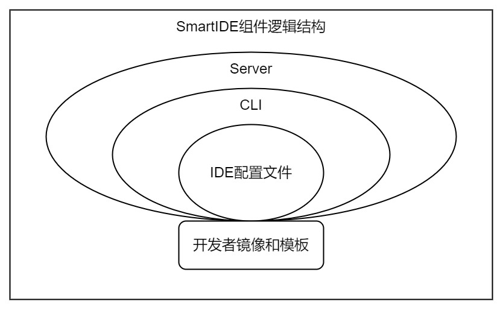

IDE配置文件是SmartIDE的真正内核，无论是CLI, Server，开发者镜像和模板都是围绕IDE配置文件的规范进行实现的。IDE配置文件的设计灵感来自：如何让README文件活起来（参考：博客README.exe）。作为开发者，拿到一个新的代码库的时候一般都会先去看README文件，通过这个文件可以知道这套代码所需要安装的环境，工具和操作方式。但是README只能由人来阅读理解只有手工操作，这就引入了大量的不确定性，造成了很多开发者在搭建环境上浪费了太多时间。在开发过程中我们也经常会对环境进行变更而忘记更新README，这就会造成其他开发者的困扰以及后续持续交付流程的不稳定。

为了解决这个问题，我们设计了一个 IDE配置文件 (默认文件名 .ide.yaml）文件格式。这个文件中完整描述了运行当前代码所需要的环境配置，包括 基础环境SDK，应用服务器，应用端口，配置文件，网络依赖以及所使用的IDE工具。有了这个文件，开发者就可以真正实现一键启动开发调试，而不会再听到：“在我这里工作呀，是你的环境问题！” 这种骇人听闻的抱怨。

以下是一个典型的IDE配置文件的示例：

示例来源：https://gitee.com/idcf-boat-house/boathouse-calculator/blob/master/.ide/.ide.yaml

```YAML
version: smartide/v0.3
orchestrator:
  type: allinone
  version: 3
workspace:
  dev-container:
    service-name: boathouse-calculator-dev
 
    ports: # 申明端口
      tools-webide-vscode: 6800
      tools-ssh: 6822
      apps-application: 3001
    
    ide-type: vscode  #vscode/jb-projector/theia/opensumi
    volumes: 
      git-config: true
      ssh-key: true
    command:
      - npm config set registry https://registry.npmmirror.com
      - npm install

  kube-deploy-files: "k8s-deployment.yaml" 
  docker-compose-file: "docker-compose.yaml"
```

这个文件内容非常通俗易懂，是个程序员应该都能看明白，不过我还是简单说明一下：

- orchestrator - 环境调度工具设置，用来制定调度容器环境的底层工具，我们当前支持3种调度方式
  - allinone：同时提供docker-compose和k8s mainfest，可以同时支持本地，远程主机和k8s模式
  - docker-compose: 仅使用Docker Compose进行调度，只适用于本地和远程主机模式
  - k8s: 仅使用k8s进行调度，只适用于k8s模式
- workspace - 工作区配置，工作区 是SmartIDE中最重要的概念，包含开发者用来进行开发调试的所有环境信息
  - dev-container - 开发者容器设置
    - service-name - 开发者容器所对应的 docker-compose 服务名称
    - ports - 开发者容器对外暴露的端口
    - ide-type - 开发者容器所所用的IDE类型，支持：vscode, sdk-only, jb-projector (Jetbrains系列全家桶）和 opensumi
    - volumes - 配置映射，支持将开发者的git-config和ssh密钥导入容器
    - commands - 开发环境启动脚本，对环境进行初始化；比如以上脚本中就完成了2个关键操作：1）设置npm国内镜像源 2）获取npm依赖。这部分脚本开发者可以根据自己代码库的情况设置，SmartIDE会在环境启动后自动运行这些脚本，让程序处于开发者所希望的状态上。
- kube-deploy-files：k8s模式所使用的k8s manifest文件路径，支持目录或者单一文件
- docker-compose-file: 本地和远程主机模式所使用的docker-compose文件路径

以上所使用的docker-compose和k8s manifest兼容业界标准的文件格式，开发者可以直接链接现有的编排文件。

## IDE as Code

这种做法称为 IDE as Code 也就是 “集成开发环境即代码”，将你的开发环境配置变成一个 IDE配置文件 的配置文件放置在代码库中，然后根据这个配置文件生成对应的自动化脚本，完成“集成开发环境” 的创建。

IDE as Code 的做法源自DevOps的核心实践 Infrastructure as Code ，也就是 “基础设施即代码” 简称 IaC。其核心思想是将环境配置代码化，常见的k8s的yaml文件其实就是典型的基础设施即代码实现。在运维领域常用的工具比如chef/puppet/ansible，还有 HashiCorp 的 Terraform 也都是 IaC 的经典实现。IaC 的主要价值和目标就是将环境搭建过程标准化，让任何人在任何环境中都可以获得 一致、稳定、可靠 的环境搭建体验。SmartIDE所创造的 IDE配置文件 延续IaC了的使用场景，并将其基本思路应用到了开发测试环境中，这其实就是 SmartIDE 的产品核心能力。

基于 IDE as Code 的实现，SmartIDE在产品实现过程中一直秉承一个原则：能够让用户通过配置文件实现的东西，就不要通过代码实现。这个核心原则给予了SmartIDE非常强的灵活性，比如以下这段视频中所演示的 若依管理系统 项目。

## 描述性配置

描述性配置是IaC的核心原则，用户只需要告诉IaC系统目标是什么，而不用关心如何实现。在现代软件系统环境越来越复杂的背景下，如果开发者为了完整应用的开发还需要去学习容器，网络，集群编排，存储，安全配置等等内容是不现实的。因此SmartIDE将这些复杂度全部封装在CLI中，将那些用户需要控制的变量通过IDE配置文件交给用户管理，这样就可以让开发者享受云原生技术带来的好处而不必关心背后的复杂度。

IDE配置文件的解析工作全部通过CLI完成，作为外围界面的Sever无需了解IDE配置文件的结构和工作方式。CLI为最终用户提供了使用IDE配置文件的能力，Sever本身也只是一种“用户”类型。

开发者镜像和模板需要符合IDE配置文件的约定，确保这些镜像和模板可以被CLI调度。

