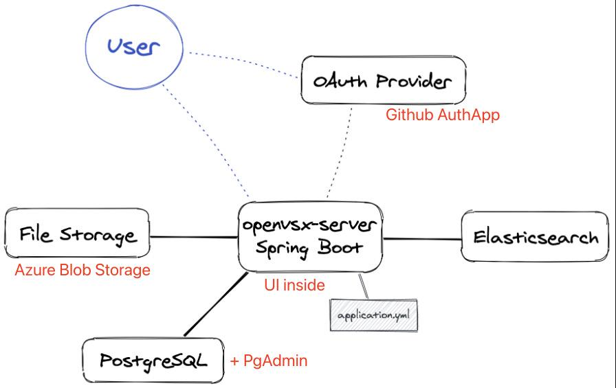

SmartIDE插件市场是基于 Eclipse OpenVSX server 开源项目的一个fork，我们针对中国开发者的使用习惯和网络状况对这个开源项目进行了本地化，包括：界面的中文翻译处理和将插件同步到中国大陆的地址上供开发者下载使用。同时，对于无法直接使用微软官方marketplace的类VSCode IDE来说，比如：Codium, Code Server 和 OpenVSCode Server这些VSCode fork，可以使用SmartIDE 插件市场作为自己的插件市场，方便这些工具的使用者获取与VSCode类似的插件安装体验。

现今非常多的企业开发者在使用VSCode作为自己的主力IDE工具，但是由于很多企业对开发者连接互联网有严格的限制，大多数企业开发者都在采用离线安装的方式来获取VSCode的插件，这样做不仅操作繁琐，而且没有办法及时获取插件的更新，同时也会对企业的研发管理带来直接的安全隐患。

SmartIDE 插件市场 的目标并不是替代微软的Marketplace或者 Eclipse 的 open-vsx.org 而是希望为国内的开发者以及企业内部的开发者提供一种安全可靠，而且高效的插件管理机制。

SmartIDE 插件市场 与 Eclipse OpenVSX 一样是开源项目，并且我们提供了国内Gitee的开源库地址与Github保持同步，开源库地址如下：

- [Github](https://github.com/SmartIDE/eclipse-openvsx)
- [Gitee](https://gitee.com/SmartIDE/eclipse-openvsx)

相关文档和常见问题如下：
- [部署手册](/zh/docs/install/marketplace/)
- [操作手册](/zh/docs/manual/marketplace/)
  - [配置连接](/zh/docs/manual/marketplace/config/) ：如何更新Visual Studio Code以及兼容IDE的配置文件连接到SmartIDE 插件市场，包括：VSCode, Codium, Code Server, OpenVSCode Server和OpenSumi 
  - [插件安装](/zh/docs/manual/marketplace/usage/)：如何使用SmartIDE 插件市场安装插件 
  - [插件同步](/zh/docs/manual/marketplace/extension-sync/)：SmartIDE 插件市场 插件初始化同步机制
  - [插件发布](/zh/docs/manual/marketplace/publish-extension/)：如何发布插件到 SmartIDE 插件市场
- [私有化部署](/zh/services/)

# 技术架构

SmartIDE插件市场各模块整体架构如下图所示

- 主体为OpenVSX-Server，spring boot框架的java服务，我们在部署时需要自行添加 application.yml 配置文件，并将其放置对应位置，以便Server启动后加载。
- 后台数据库使用PostgreSql，并使用Pgadmin进行数据库的管理和查询等操作，数据库的创建和表结构的初始化过程Server进程启动时会自动执行。
- 前端界面为NodeJS架构的Web UI，我们在部署时会将前端代码库构建的静态网站结果放入Server服务的对应文件夹，使其二者变为一个进程即Server进程加入前端界面。这也是Sprint Boot框架的灵活性功能，使用者可以基于Web UI代码库自定制前端界面，并将自定制的前端页面嵌入Server服务。
- 用户登陆验证，目前只支持OAuth Provider，官方文档中声明目前只支持Github AuthApp和 Eclipse OAuth，我们在部署时使用Github AuthApp。
- 插件存储可以使用数据库（默认）、Google Storage或 Azure Blob Storage三种模式，推荐添加Google Storage或 Azure Blob Storage以避免数据库过大的情况出现。
- 插件搜索服务支持数据库搜索和附加Elastic Search服务两种模式，推荐有条件的情况下添加Elastic Search搜索服务提高搜索效率，降低数据库压力。

