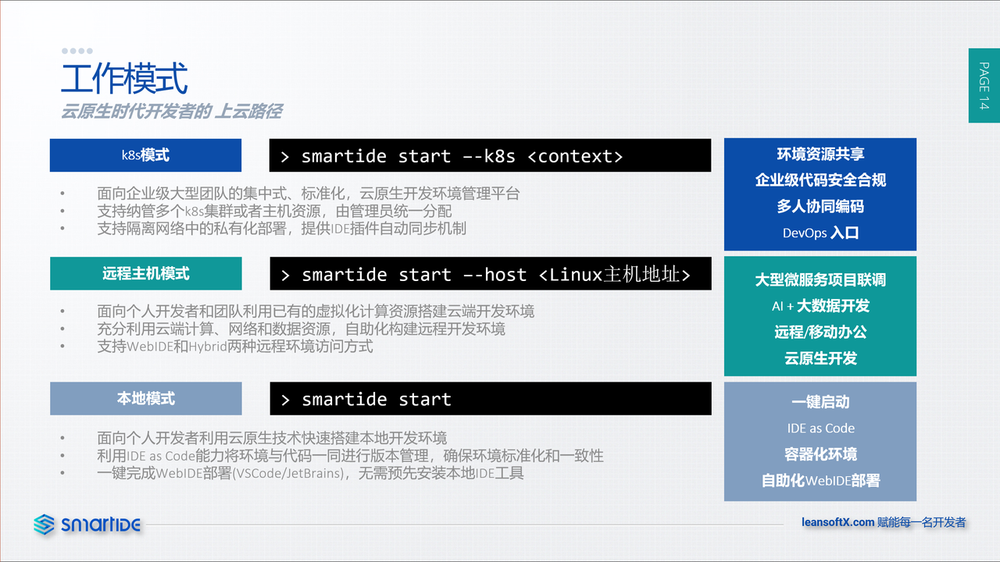

SmartIDE支持3种模式，分别为本地模式，远程模式和k8s模式。

**本地模式** 支持开发者在本地开发机上使用 smartide start 指令启动工作区，这种模式主要现象个人开发者独立使用。开发者无需关心所启动环境所需要的开发语言，SmartIDE将确保环境的标准化和一致性。

**远程主机模式** 支持开发者通过增加 --host 参数将工作区部署到任意远程主机上，无论这台主机在什么地点运行，开发者都可以一键完成开发环境的部署并将使用远程主机来完成代码编译，打包，运行和测试过程。

**k8s模式** 支持开发者增加 --k8s 参数将工作区部署到任意k8s集群中，利用k8s所提供的调度能力，可扩展性和弹性，可以提供支持更加复杂的开发环境调度场景。

## 使用场景

虽然SmartIDE理论上可以支持任何应用的开发场景，但对于以下这些类型的应用来说可以提供比传统开发模式更好的体验。

- **代码安全管控：** 对于非常关注代码安全性或者使用大量外包人员的组织来说，如何防止代码离开自己受控的服务器环境，同时又可以让开发者方便的完成代码开发一直都是一个矛盾。很多资金充裕的企业已经在使用的虚拟桌面（VDI）解决方案就是针对这种场景，但是VDI系统价格昂贵，资源占用量大而且无法动态调度资源，这也造成很多企业给开发者提供的虚拟桌面配置很低，开发效率非常低。SmartIDE所采用的容器化方案可以做到动态资源调度，根据项目本身的特性控制资源使用，同时开发者可以只需要浏览器即可访问这些资源。对于企业优化IT基础设置资源利用率，提升开发者体验和工作效率非常有帮助。

- **大数据和AI开发：** 这些开发场景因为需要更强的算力并处理大量的数据，因此通过远程开发方式可以让开发者更好的利用云端资源更加便捷高效的完成开发。

- **微服务架构开发：** 当系统中所设计的微服务数量到达一定量级之后，开发者无法在本地开发环境运行完整系统，利用SmartIDE所提供的远程工作区则可以利用云端的大量服务器资源轻松完成环境搭建。同时因为IDE工具与运行环境可以非常贴近，在开发调试过程中也可以避免因为网络延迟而造成的各种问题。

- **实验室/培训环境：** 教育/培训行业往往休要同时提供多种不同的开发语言，工具的环境以便适应不同类型的课程的需要，但是因为课程本身的时效性问题，这些环境并不需要一直运行，而只需要在学员需要的时候启动，课程结束之后即可销毁。采用SmartIDE工作区可以非常便捷的快速为新课程配置环境，随用随起，用完即焚。

- **工业软件/硬件开发：** 工业软件和硬件开发往往需要在特定硬件环境中才能进行调试和测试工作，传统模式下IDE是无法运行在这些硬件上的，开发者需要通过开发同步工具，命令行调试工具才能完成日常开发调试工作。这个过程往往非常繁琐，大幅降低了开发效率。SmartIDE所采用的集成了IDE工具的工作区可以很方便的部署到这些硬件环境中，让开发者直接在这些硬件上进行开发调试，大幅提升日常工作效率。