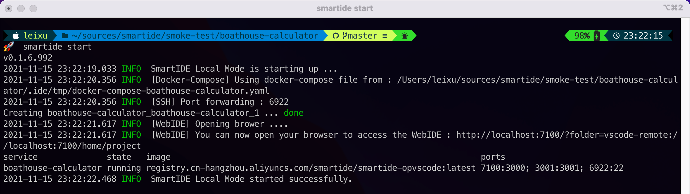
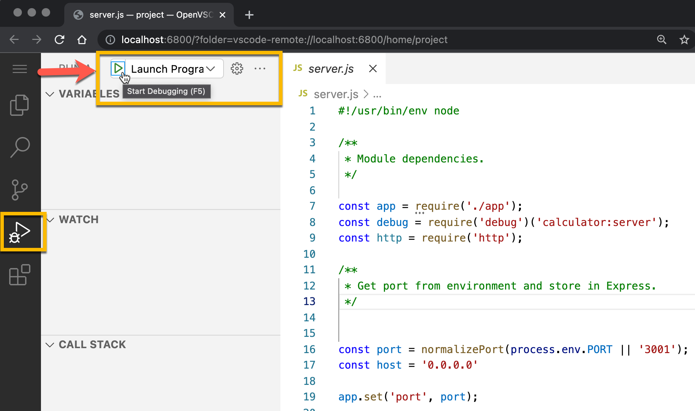

作为开发者，你无需了解什么是云，什么是容器，也无需学习复杂的docker命令，你所需要的就是学会一个简单的命令（smartide start），即可真正实现“一键启动”开发环境.

你也无需在本地安装IDE软件，只需要浏览器就够了。SmartIDE内置了Web版的vscode，你只需要打开浏览器就可以进行编码，使用智能提示，设置断点并且进行交互式单步调试，就如同使用一个全功能的IDE软件一样的体验。

{}
*为了让你快速体验SmartIDE的快速开发体验，我们准备了一个示例应用 [Boathouse计算器](/zh/docs/examples/sample-calculator/)，无论你是否熟悉这个应用的代码，或者它所使用的 Node.Js 技术栈，你都可以在5分钟之内完成这个应用的开发和调试。*
{}

## 准备工作

请参考 <a href="/zh/docs/install/" target="_blank">安装手册</a> 完成 SmartIDE 工具的安装。

## 1. 一键启动

```shell
git clone https://gitee.com/idcf-boat-house/boathouse-calculator.git
cd boathouse-calculator
smartide start
```
运行后的效果如下：


## 2. 编码调试

SmartIDE会自动启动内置的WebIDE，你会看到一个类似vscode的IDE窗口在你的默认浏览器中出现。

同时，SmartIDE会自动启动 npm install 脚本的运行，自动完成应用所需要的依赖包的获取和安装。

**说明**: npm是node.js的包管理器，npm install的作用是根据当前代码库的配置获取应用所需要的依赖包。一般来说，为了能够正确运行node.js应用，你首先需要安装node.js的sdk环境，但是SmartIDE已经为你完成了这个动作，作为开发者的你不再需要关心开发环境搭建的问题。


完成以上操作后，你可以直接点击WebIDE左侧的调试工具栏，启动调试。



你也可以像我一样在 **/api/controllers/arithmeticController.js** 文件的 **第47行** 设置一个端点，并启动另外一个浏览器打开 http://localhost:3001 即可进入交互式调试体验。


到这里，你已经完成了 [Boathouse计算器示例应用](/zh/docs/examples/sample-calculator/) 的开发调试过程，一切的操作就像在本地使用vscode一样的顺畅。

## 下一步

现在你已经完成了基本的SmartIDE操作，下一步你可以点击 **[安装手册](/zh/docs/install/)** 了解如何获取最新版的SmartIDE工具，以及如何进行更新。作为一款面向开发人员的工具，我们的更新速度非常快，基本上每天都会发布新版本。通过 **[安装手册](/zh/docs/install/)** 你可以详细了解我们的更新策略和不同更新通道的获取方式。

Boathouse计算器 是一个已经适配好 SmartIDE 开发环境的应用，如果你希望了解如何使用 SmartIDE 从头创建一个全新的项目，我们还为你准备了一系列针对不同开发技术栈的快速启动教程：

- [Node.Js 快速启动教程](/zh/docs/quickstart/new-node/)
- Golang 快速启动教程
- Java 快速启动教程
- .NetCore 快速启动教程
- Python 快速启动教程
- PHP 快速启动教程

## 更多真实项目开发场景

另外，我们还对很多常用的开发框架进行了SmartIDE适配，你可以通过 [示例应用](/zh/docs/examples/) 部分的文档获取更多示例应用的体验文档，示例部分所展示的全部都是真实项目的开发场景，包括 SmartIDE 本身其实都是使用 SmartIDE 开发环境进行开发的。


这些示例包括：

- IDCF黑客马拉松Boathouse应用前后端联调
- 使用SmartIDE开发smartide.dev网站
- 使用SmartIDE开发smartide-cli应用
- 使用SmartIDE开发smartide开发容器镜像
- Vue Element Admin
- Element UI
- iTop

*更多示例会持续更新* 
