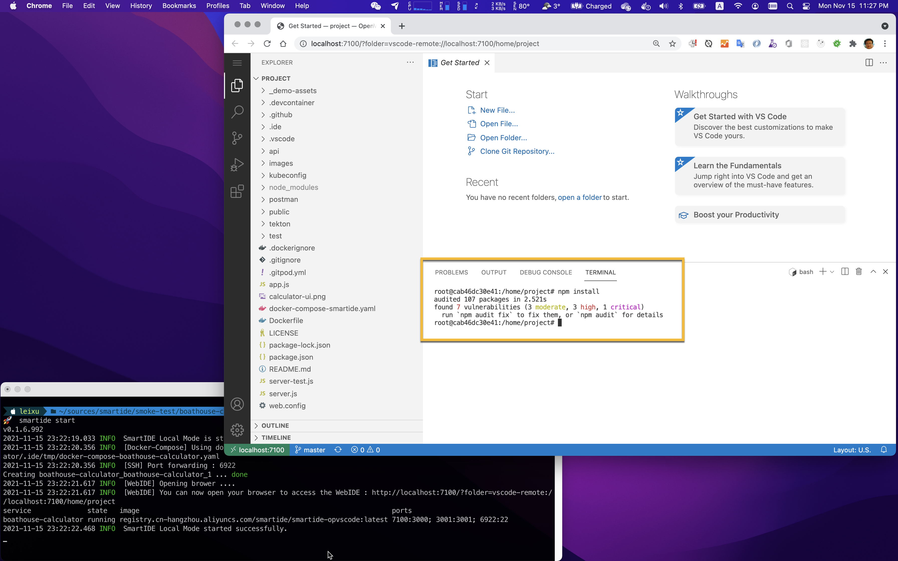

作为开发者，你无需了解什么是云，什么是容器，也无需学习复杂的docker命令，你所需要的就是学会一个简单的命令（smartide start），即可真正实现“一键启动”开发环境.

你也无需在本地安装IDE软件，只需要浏览器就够了。SmartIDE内置了Web版的vscode，你只需要打开浏览器就可以进行编码，使用智能提示，设置断点并且进行交互式单步调试，查看各种运行时变量，就如同使用一个全功能的IDE软件一样的体验。

{}
*为了让你快速体验SmartIDE的快速开发体验，我们为你准备了一个示例应用，无论你是否熟悉这个应用的代码，或者我们使用的技术栈（node.js），你都可以在5分钟之内完成这个应用的开发和调试。*
{}

> 第一步：安装smartide cli工具

详细安装说明请参考 [安装手册](/zh/docs/quickstart/install/)


{}
```bash
# SmartIDE 稳定版通道安装脚本
# 打开终端窗口，复制粘贴以下脚本即可安装稳定版SmartIDE CLI应用
# 再次执行此命令即可更新版本
curl -OL  "https://smartidedl.blob.core.chinacloudapi.cn/releases/$(curl -L -s https://smartidedl.blob.core.chinacloudapi.cn/releases/stable.txt)/smartide" \
&& mv -f smartide /usr/local/bin/smartide \
&& chmod +x /usr/local/bin/smartide
```
{}
{}
```powershell
# SmartIDE 稳定版通道安装脚本
# 打开PowerShell终端窗口，复制粘贴以下脚本即可自动下载稳定版SmartIDE MSI安装包，并启动安装程序
# 再次执行此命令即可更新版本
Invoke-WebRequest -Uri ("https://smartidedl.blob.core.chinacloudapi.cn/releases/"+(Invoke-RestMethod https://smartidedl.blob.core.chinacloudapi.cn/releases/stable.txt)+"/SetupSmartIDE.msi")  -OutFile "smartide.msi"
 .\smartIDE.msi
```
{}


> 第二步：克隆代码并运行 smartide start

```shell
git clone https://gitee.com/idcf-boat-house/boathouse-calculator.git
cd boathouse-calculator
smartide start
```
运行后的效果如下：


> 第三步：设置断点、启动调试

SmartIDE会自动启动内置的WebIDE，你会看到一个类似vscode的IDE窗口在你的默认浏览器中出现。

现在你可以在WebIDE内置的Terminal中运行以下命令完成依赖项的安装

**说明**: npm是node.js的包管理器，npm install的作用是根据当前代码库的配置从npm源中获取应用所需要的依赖包。一般来说，为了能够正确运行node.js应用，你首先需要安装node.js的sdk环境，但是SmartIDE已经为你自动完成了这个动作，作为开发者的你不再需要关心环境问题。

```shell
npm install
```


完成以上操作后，直接点击WebIDE左侧的调试工具栏，并点击启动调试。你也可以像我一样在 /api/controllers/arithmeticController.js 的第47行设置一个端点，并启动另外一个浏览器打开 http://localhost:3001 对这个计算器应用进行任意的计算操作，即可进入交互式调试体验。


到这里，你已经完成了[Boathouse计算器示例应用](/zh/docs/quickstart/sample-calculator/)的开发调试过程，你也可以尝试修改代码并体验内置在WebIDE中的Git源代码管理能力，一切的操作就像在本地使用vscode一样的顺畅。

以上是一个非常简单的体验性场景，如果你还希望体验更多复杂的场景，可以通过 [示例应用](zh/docs/examples/) 部分的文档获取更多示例应用的体验文档。

建议你在体验smartide其他部分的功能之前，先阅读以下 **安装手册** 和 **Boathouse计算器** 示例应用，对SmartIDE的一些基本功能进行更加深入的了解。


