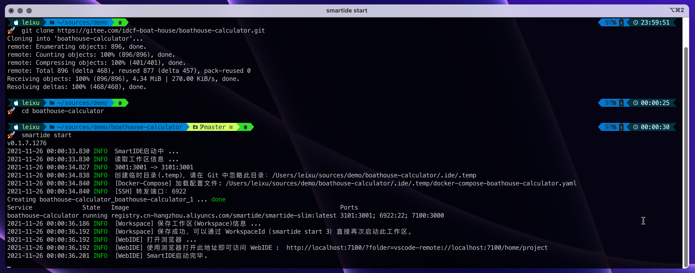
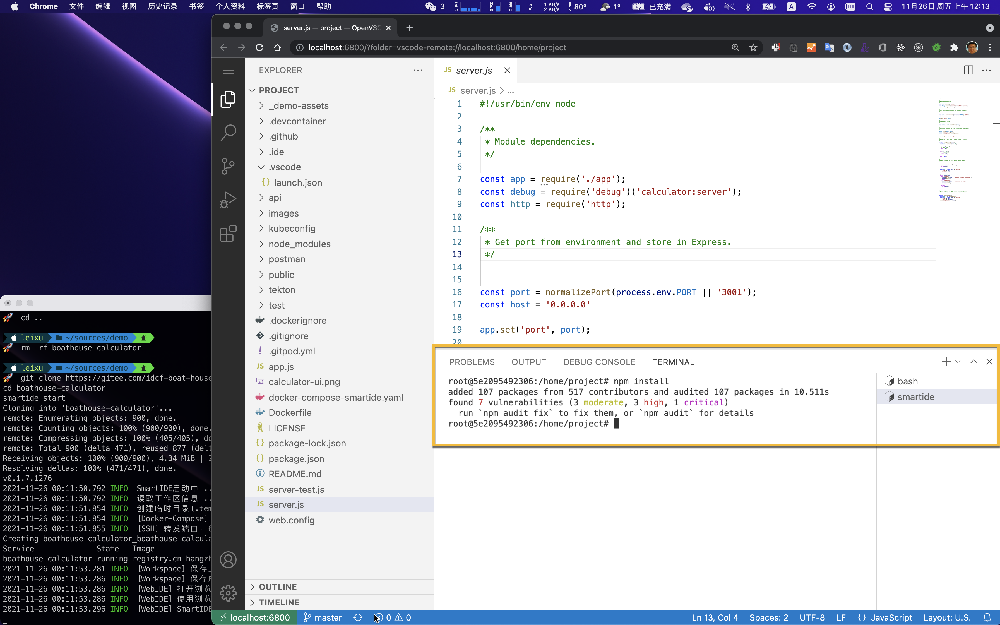

作为开发者，你无需了解什么是云，什么是容器，也无需学习复杂的docker命令，你所需要的就是学会一个简单的命令（smartide start），即可真正实现“一键启动”开发环境.

你也无需在本地安装IDE软件，只需要浏览器就够了。SmartIDE内置了Web版的vscode，你只需要打开浏览器就可以进行编码，使用智能提示，设置断点并且进行交互式单步调试，就如同使用一个全功能的IDE软件一样的体验。

{}
*为了让你快速体验SmartIDE的快速开发体验，我们准备了一个示例应用 [Boathouse计算器](/zh/docs/examples/boathouse-calculator/)，无论你是否熟悉这个应用的代码，或者它所使用的 Node.Js 技术栈，你都可以在5分钟之内完成这个应用的开发和调试。*
{}

以下为文档演示视频，视频长度4:40，无快进无剪辑。


## 准备工作

请参考 <a href="/zh/docs/install/" target="_blank">安装手册</a> 完成 SmartIDE 工具的安装。

## 本地模式

本地模式允许用户在已经安装了Docker Desktop的本地开发机上，运行并管理运行在容器中的开发调试环境。这种模式下SmartIDE会根据代码库中预置的配置文件（位于 .ide/.ide.yaml）完成拉取开发容器镜像，启动容器，代码目录映射以及WebIDE的启动。

### 1. 一键启动

运行以下脚本一键启动 **Boathouse计算器** 应用的 **集成开发环境(IDE)** 。


{}
```shell
# 在 MacOS 上打开 终端应用(Terminal) 并复制粘贴本段脚本
smartide start https://gitee.com/idcf-boat-house/boathouse-calculator.git 
```
{}
{}
```powershell
# 在 Windows 上打开 PowerShell 并复制粘贴本段脚本
smartide start https://gitee.com/idcf-boat-house/boathouse-calculator.git 
```
{}


运行后的效果如下：


### 2. 编码调试

SmartIDE会自动启动内置的WebIDE，你会看到一个类似vscode的IDE窗口在你的默认浏览器中出现。

同时，SmartIDE会自动启动 npm install 脚本的运行，自动完成依赖包的获取和安装。

**说明**: npm是node.js的包管理器，npm install 的作用是获取应用所需要的依赖包。一般来说，为了能够正确运行 node.js 应用，你首先需要安装 node.js 的 sdk 环境，但是 SmartIDE 已经为完成了这个动作，作为开发者的你不再需要关心开发环境搭建的问题。



完成以上操作后，你可以直接点击 WebIDE 左侧的调试工具栏，启动调试。


你也可以像我一样在 **/api/controllers/arithmeticController.js** 文件的 **第47行** 设置一个断点，并用另外一个浏览器打开 http://localhost:3001 即可进入交互式调试状态。现在，你可以尝试在计算机中进行一些加减乘除的操作，当你点击 = 按钮的时候，代码中的断点就会被触发，应用进入暂停状态，IDE会自动聚焦到断点所在的代码行，如下图所示：


到这里，你已经完成了 [Boathouse计算器示例应用](/zh/docs/examples/boathouse-calculator/) 的开发调试过程，一切的操作就像在本地使用vscode一样的顺畅。

## 远程模式

远程模式允许用户通过SSH调度远程linux主机，并在远程主机上根据预置在代码库中的配置文件（文件位置：.ide/.ide.yaml）完成拉取开发容器镜像，启动容器，代码映射和启动容器内的WebIDE的一系列动作；在开发容器启动成功后，SmartIDE CLI（命令行工具）会作为驻守程序监听远程容器中开发的端口并将这些端口通过SSH隧道的方式转发到本地开发机上，允许用户通过localhost访问，达到“远程开发，本地体验”的目录。

使用远程模式也非常简单，只需要2个步骤

### 1. 准备远程主机

按照 [Docker & Docker-Compose 安装手册 (Linux服务器)](/zh/docs/install/docker-install-linux) 准备远程linux主机

### 2. 启动环境

使用以下命令添加主机记录并启动SmartIDE环境


{}
```shell
# 在 MacOS 上打开 终端应用(Terminal) 并复制粘贴本段脚本
## 添加远程主机
smartide host add <ip地址> --username <用户名> --password <密码> --port 22
## 获取远程主机ID
smartide host list 
## 使用远程主机ID和git库地址启动SmartIDE远程开发环境
smartide start --host <远程主机ID> https://gitee.com/idcf-boat-house/boathouse-calculator.git 
```
{}
{}
```powershell
# 在 Windows 上打开 PowerShell 并复制粘贴本段脚本
## 添加远程主机
smartide host add <ip地址> --username <用户名> --password <密码> --port 22
## 获取远程主机ID
smartide host list 
## 使用远程主机ID和git库地址启动SmartIDE远程开发环境
smartide start --host <远程主机ID> https://gitee.com/idcf-boat-house/boathouse-calculator.git 
```
{}



远程模式启动后的使用体验与本地模式保持一致。

## 各类技术栈的操作入口

Boathouse计算器 是一个已经适配好 SmartIDE 开发环境的应用，如果你希望了解如何使用 SmartIDE 从头创建一个全新的项目，我们还为你准备了一系列针对不同开发技术栈的快速启动教程：

- [Node.JS](/zh/docs/quickstart/node/)
- Golang
- [Java](/zh/docs/quickstart/java/)
- .NetCore 
- Python 
- PHP 
- C/C++

## 开源项目项目SmartIDE适配

我们还对很多 *开源项目* 进行了SmartIDE适配，你可以通过 [示例应用](/zh/docs/examples/) 获取更多示例应用的体验文档，示例部分所展示的全部都是真实项目的开发场景，包括 SmartIDE 本身其实都是使用 SmartIDE 开发环境进行开发的。


这些示例包括：

- IDCF黑客马拉松Boathouse应用前后端联调
- 使用SmartIDE开发smartide.dev网站
- 使用SmartIDE开发smartide-cli应用
- 使用SmartIDE开发smartide开发容器镜像
- Vue Element Admin
- Element UI
- iTop

*更多示例会持续更新* 

## 已有私有项目SmartIDE适配

如果是自己或团队内的私有项目，也可以使用SmartIDE提供的开发容器进行开发。具体适配方式请参考 [项目适配](../adaption/) 文档


---
**感谢您对SmartIDE的支持：Be a Smart Developer，开发从未如此简单。**
