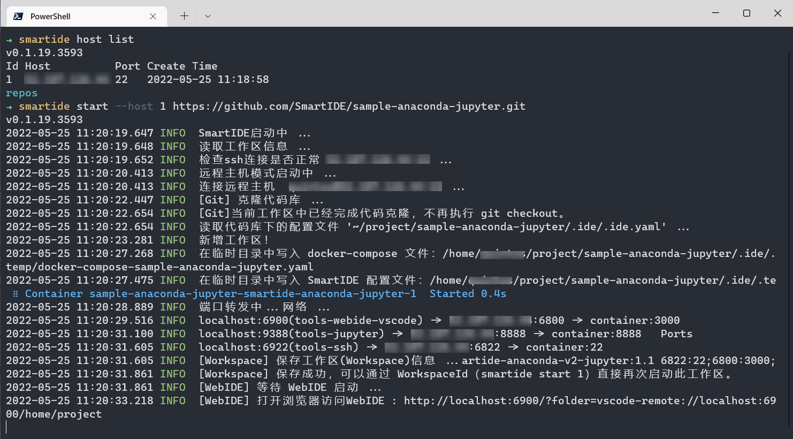
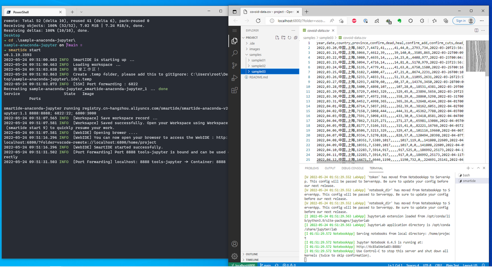
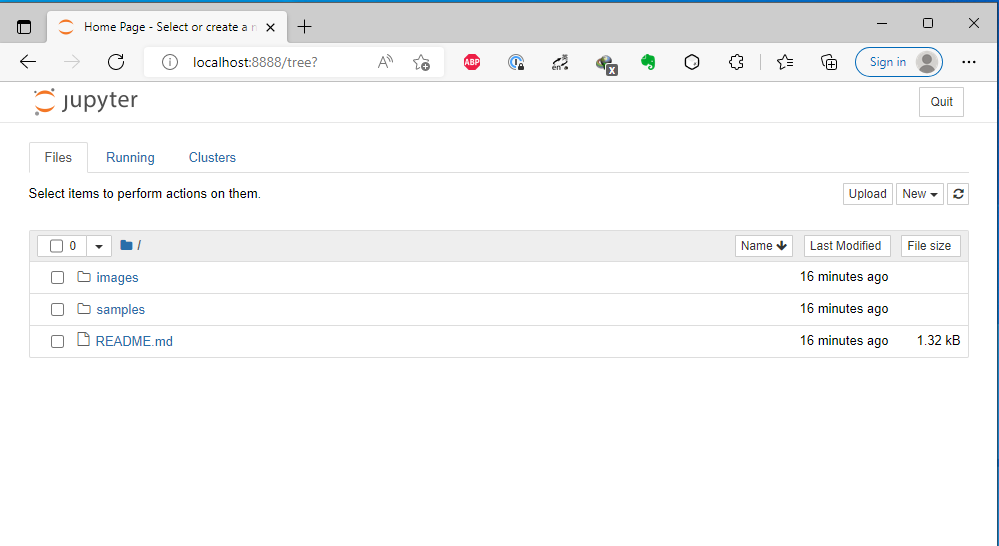
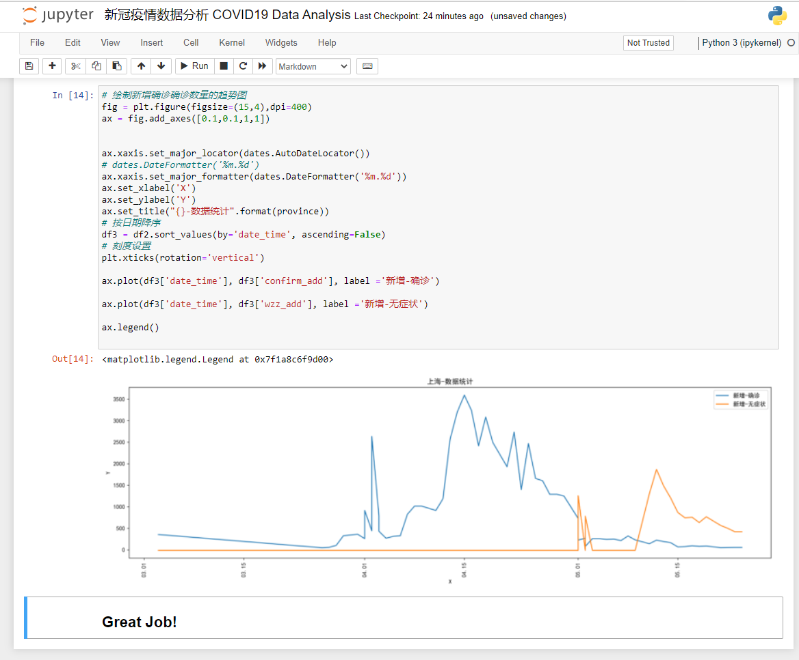
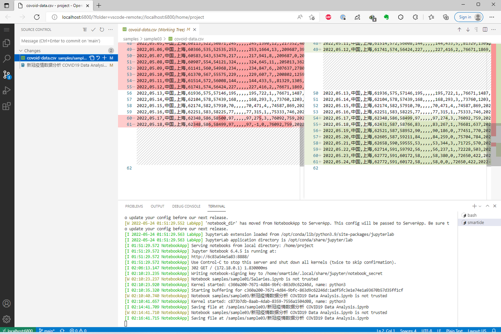
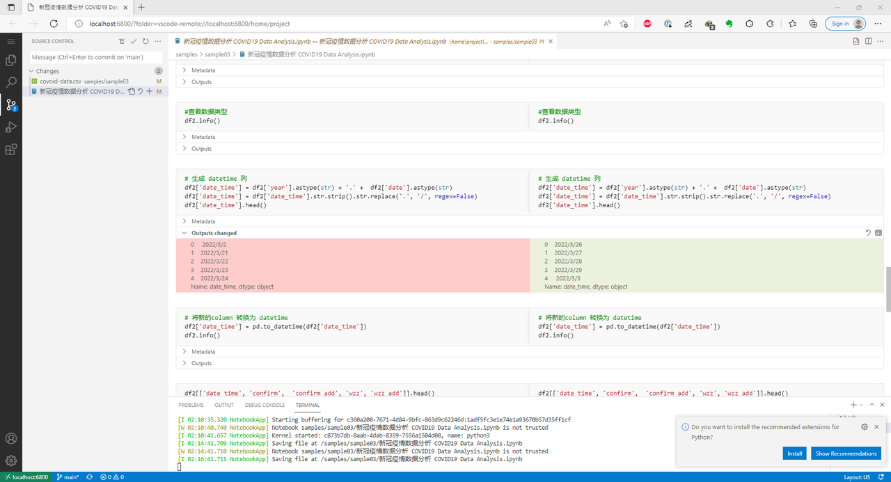
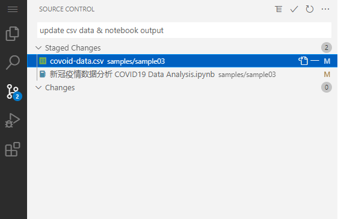

## 概述
远程工作区的一个重要优势就是可以帮助开发者更好的利用远程主机的强大算力和数据处理能力，在这个领域中 Jupyter Notebook 无疑是非常典型的应用类型。SmartIDE 提供了对 Jupyter Notebook 的远程工作区支持，开发者只需要一个简单的指令就可以启动一个预装了 Jupyter Notebook 的远程工作区，并通过 `--host` 参数将这个工作区漫游到任意主机或者 k8s 环境中。

在这个快速开始教程中，我们将一起使用 SmartIDE 创建一个基于 Jupyter Notebook 的开箱即用的环境，并利用 Jupyter 的数据分析能力针对新冠疫情数据进行简单的分析。这个示例的目的是帮助使用 Jupyter 的开发者了解 SmartIDE 的能力，并希望有更多的开发者加入 SmartIDE 开发者的行列。

### 完整操作视频
为了便于大家更直观地了解和使用 SmartIDE 创建 Jupyter Notebook 环境，并开始项目的开发，我们在B站提上提供了视频供大家参考，视频如下：

跳转到B站：[SmartIDE快速启动Jupyter Notebook - 5 分钟内完成上海北京新冠疫情数据比对_哔哩哔哩_bilibili](https://www.bilibili.com/video/BV1mZ4y1t7fj)

### 1. 开发环境设置
Jupyter Notebook 默认需要运行在 Python 环境下，并且需要引入 Numpy， Pandas，Matplotlib 等常用的组件， 为此 SmartIDE 参考社区镜像，制作了开箱即用的模板，并内置了中文字体。用户只需要简单的命令即可快速创建出一个 JupyterNotebook 的开发环境。

#### 1.1 使用SmartIDE模板创建开发环境
本地启动
```shell
# 在 MacOS/Windows 上打开 终端（Terminal）或者 PowerShell 应用，执行以下命令

# 创建空文件夹
mkdir sample

# 进入到目录下
cd sample

# 创建开发环境
smartide new anaconda -t jupyter
# done！
```

远程启动
```shell
# 添加远程主机到SmartIDE
smartide host add <IP-Address> --username <user> --password <pwd> --port <ssh port | 22>
# 获取新添加的hostId
smartide host list
# 创建开发环境
smartide new --host <hostId> anaconda -t jupyter -w <workspace-name>
# done！
```

#### 1.2 基于已有仓库创建开发环境
这里，我们以 SmartIDE 官方的 Jupyter Notebook 示例仓库为例， 运行以下命令创建开发环境：
```shell
# 在 MacOS/Windows 上打开 终端（Terminal）或者 PowerShell 应用，执行以下命令
# 克隆示例仓库
git clone https://github.com/SmartIDE/sample-anaconda-jupyter.git

# 进入到仓库目录下
cd sample-anaconda-jupyter

# 启动开发环境
smartide start
# done!
```
#### 1.3 (可选）远程主机模式创建开发环境
如果你是一个 SmartIDE 的高级用户，并且已经用 SmartIDE 关联了远程开发机器，可以直接用远程模式创建 Jupyter Notebook 开发环境
```shell
# 添加远程主机到SmartIDE
smartide host add <IP-Address> --username <user> --password <pwd> --port <ssh port | 22>
# 获取新添加的hostId
smartide host list
# 启动
smartide start --host <hostId> https://github.com/SmartIDE/sample-anaconda-jupyter.git
```


运行后的效果如下，你可以通过命令窗口中的日志详细了解 SmartIDE 的启动过程，当 SmartIDE 启动完毕之后，会自动打开浏览器窗口并导航到 WebIDE 界面。


### 2. 访问 Jupyter Notebook 页面，浏览目录下的文件
Jupyter Notebook 服务端会自动在开发环境环境启动后运行，默认会监听 8888 端口， 通过浏览器访问 http://localhost:8888/  可以进入 JupyterNotebook 主界面。
Jupyter Notebook 中展示的文件列表和当前所在的文件目录保持一致，我们可以访问到当前仓库中所有的示例 notebooks。



### 3. 运行 sample-03 Notebook
   进入 sample3 目录， 打开示例文件后，点击上方的 Run 按钮，运行 notebook 到最底部后，将绘制出疫情数据统计图形。 这个示例中综合利用了 Numpy， Pandas, 和 Matplotlib 等 Jupyter Notebook 中常用的lib，并在图表的组件中设置了中文字体。


### 4. 回到 Web IDE主界面，进入 Source Control 侧边栏， 进行 Git 常规操作
在上一步的运行过程中，我们在 notebook 中动态从 API 中获取了最新的数据，并把数据保存到了 csv 文件中。回到我们的 Web IDE 页面，点击 Source Control 侧边栏，可以查看变化的文件（如果没有显示文件，可以点击上面的刷新按钮）。
点击第一个变化的 csv 文件，查看文件差异，可以清楚的看到文件里增加了一些新的数据


点击 .ipynb 文件，也可以在右侧看到 notebook 中产生的差异信息

### 5. 提交修改
将发生变化的文件提交并同步到远程仓库。



### 6. Great Job!
通过上面的几个步骤，  我们初步实现了一个 Jupyter Notebook的 Dev Loop。通过 WebIDE 和 Jupyter Notebook 相互结合使用，给开发者带来了流畅的开发体验。
另，SmartIDE 在开发环境中内置了 Anaconda 和 常用的 packages， 方便开发者对环境和 package 进行管理。内置的 packages 可通过下面的命令查看：
```
conda list
```


---
**感谢您对SmartIDE的支持：Be a Smart Developer，开发从未如此简单。**
