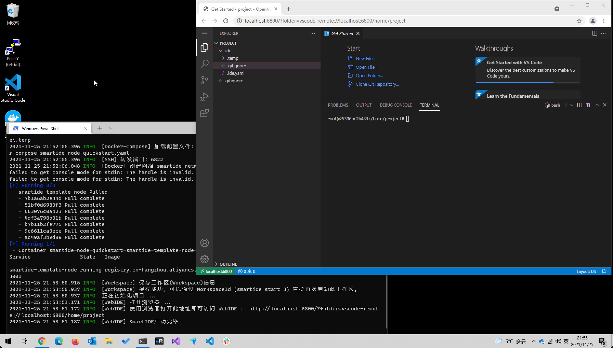
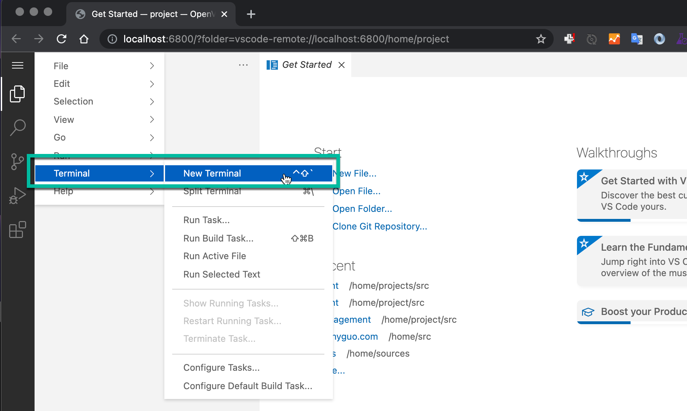
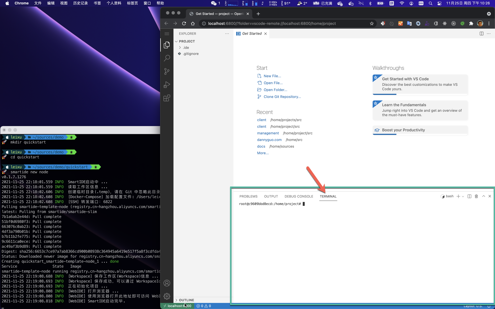
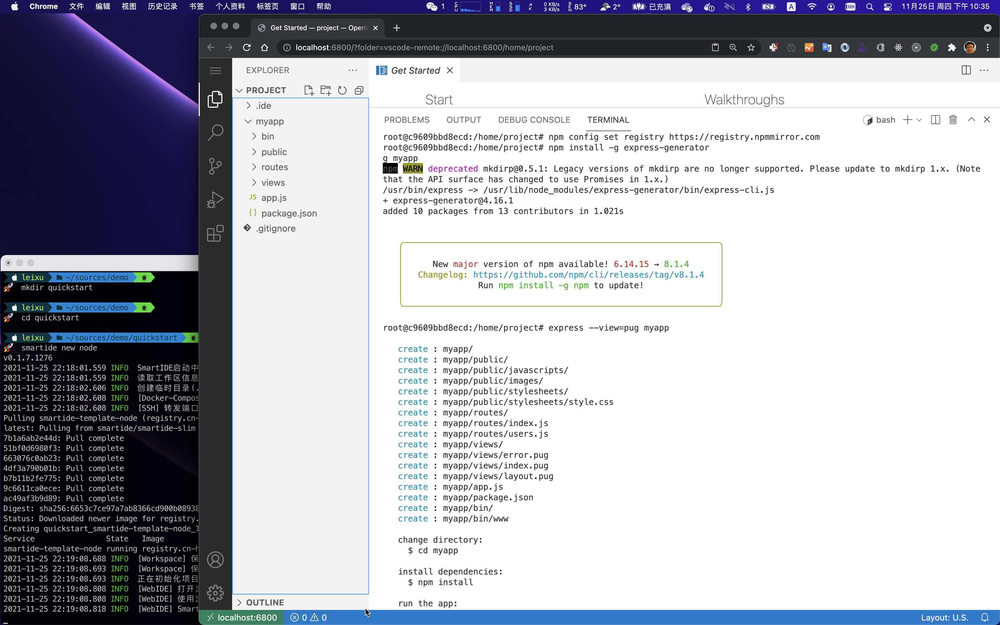
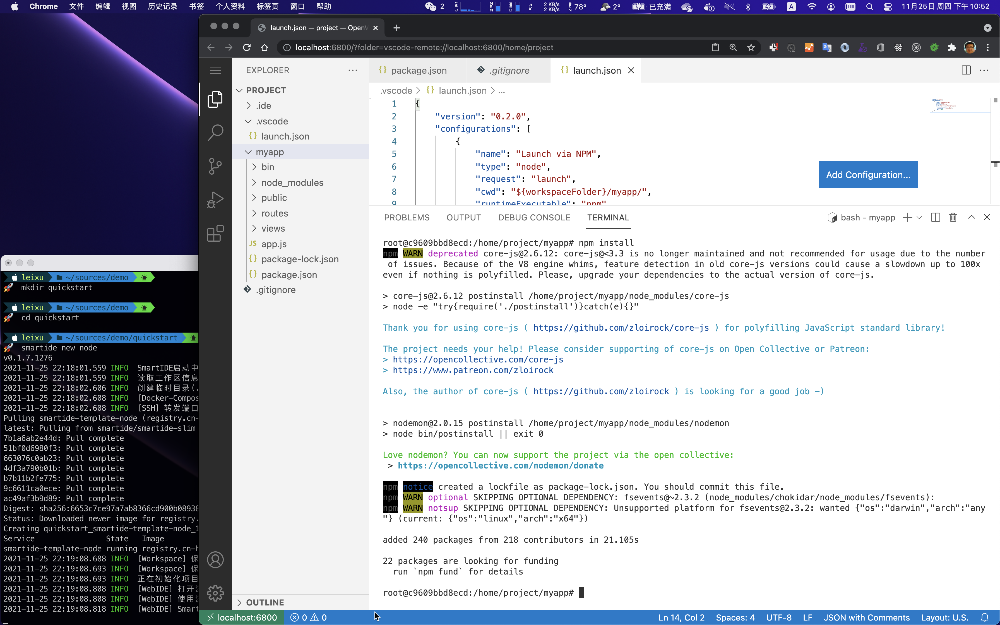
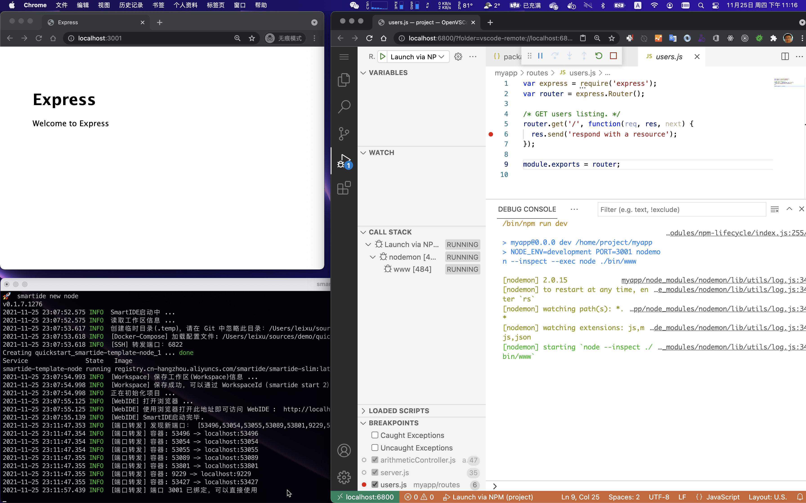
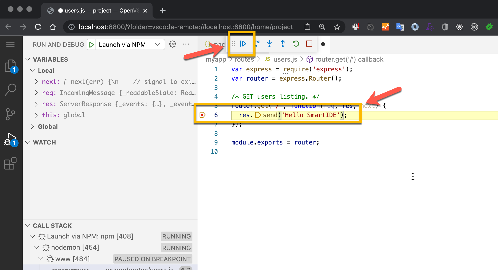
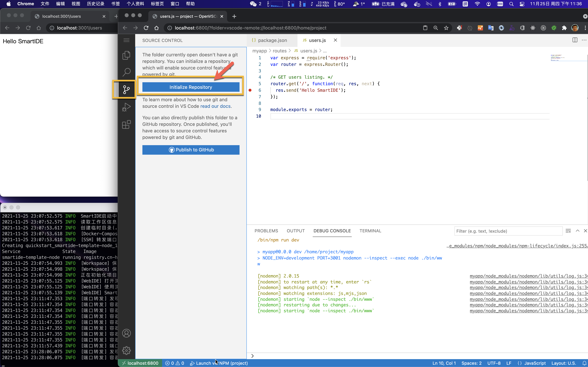

SmartIDE内置了node.js环境模版，你可以通过一个简单的指令创建内置了WebIDE的开发环境，并立即开始编码和调试。

如果你还没有完成SmartIDE安装，请参考以下文档安装SmartIDE命令行工具。

- [SmartIDE 安装手册](/zh/docs/install)

> 说明：SmartIDE的命令行工具可以在Windows和MacOS操作系统上运行，对大多数命令来说，操作是完全一致的。

## 1. 新建node开发环境

运行以下命令创建node开发环境：

```shell
mkdir smartide-node-quickstart
cd smartide-node-quickstart
smartide new node
```

运行后的效果如下，你可以通过命令行窗口中的日志详细了解SmartIDE的启动过程，当SmartIDE启动完毕之后，会自动打开浏览器窗口并导航到容器中运行的WebIDE界面。



**启动WebIDE内置的Terminal**

后续的操作我们通过WebIDE内置的Terminal来完成，默认情况下WebTerminal应该已经自动打开，如果没有的话，可以通过WebIDE内置菜单的 **Terminal | New Terminal** 打开新的Web Terminal窗口。



Web Terminal开启后如下图所示：



## 2. 创建项目结构

> 注意：如果没有特别提示，后续的命令都是在这个 Web Terminal 中运行的。

运行以下命令将 node 包管理器 npm 的源地址设置到国内淘宝所提供的镜像上，这样可以大大加块后续的各种操作。

```shell
npm config set registry https://registry.npmmirror.com
```

运行以下命令安装express脚手架工具并创建node express项目基础结构

```shell
npm install -g express-generator
express --view=pug myapp
```

执行完毕后的效果如下，可以按照左侧文件管理器里面已经出现了newapp文件夹，并在其中创建了node express应用的基础项目结构，右侧Terminal窗口中列出了创建过程的日志信息。



## 3. 配置项目

使用以下内容替换 /newapp/package.json 文件内容，这里我们设置了几个关键内容

- 设置了 npm start 启动脚本使用 production 环境变量和 3001 端口
- 设置了 npm run dev 启动脚本使用 development 环境变量和 3001 端口，并且使用 nodemon 工具提供更好的调试体验支持

```json
{
  "name": "myapp",
  "version": "0.0.0",
  "private": true,
  "scripts": {
    "start": "NODE_ENV=production PORT=3001 node ./bin/www",
    "dev": "NODE_ENV=development PORT=3001 nodemon --inspect --exec node ./bin/www"
  },
  "dependencies": {
    "cookie-parser": "~1.4.4",
    "debug": "~2.6.9",
    "express": "~4.16.1",
    "http-errors": "~1.6.3",
    "morgan": "~1.9.1",
    "pug": "2.0.0-beta11",
    "nodemon": "~2.0.15"
  }
}
```

创建 /.vscode/launch.json 文件，并写入如下内容：

- 此文件为 vscode 的调试器启动配置文件
- 配置了 debugger 启动时会自动调用以上 package.json 所定义的 npm run dev 脚本

```json
{
    "version": "0.2.0",
    "configurations": [
        {
            "name": "Launch via NPM",
            "type": "node",
            "request": "launch",
            "cwd": "${workspaceFolder}/myapp/",
            "runtimeExecutable": "npm",
            "runtimeArgs": ["run","dev"],
            "port": 9229 
        }
    ]
}
```

现在我们可以运行以下脚本完成 npm 依赖包的安装

```shell
cd myapp
npm install
```

运行后的效果如下：



## 4. 启动调试

完成以上配置之后，我们的项目已经完全准备好了，我们可以开始进行编码调试了。

在 **/myapp/routes/users.js** 文件的 **第6行** 代码处 **单击设置断点** 


点击 **左侧菜单栏 ｜ 调试按钮 ｜ 点击 启动按钮** 启动交互式调试


启动调试后，请注意 smartide 的日志输出，SmartIDE 会在后台持续监控容器内的进程情况，并将所有端口转发到 localhost 上


现在你可以开启一个新的浏览器，按照日志中所提示的 3001 端口，打开 http://localhost:3001，就可以访问这个应用了。进入交互式调试状态的 SmartIDE 开发环境如下图：



现在，让我们打开 http://localhost:3001/users 以便触发我们之前所设置的断点，注意下图中的几个关键点

1. 通过打开 http://localhost:3001/users 这个地址触发我们预设的断点
2. 将鼠标移动到特定的变量上以后，IDE会自动加载当前变量的结构体以及内部的赋值状态（实时），以便开发者观察程序状态
3. Variables (变量) 窗口实时显示当前运行时内的所有变量状态
4. Call Stack (调用堆栈) 窗口实时显示当前运行时堆栈状态


保持以上调试状态，让我们直接对代码进行修改，打开 /myapp/routes/users.js 文件并将 **第6行** 按下图进行修改，修改完成后保存文件，并按下 **调试控制拦** 上的 **继续按钮**



此时，你可以看到左侧应用运行窗口中已经按照你的修改自动加载了修改后的代码。


> 至此，我们已经使用 SmartIDE 完成了一个 Node Express 应用程序的创建，配置和编码调试过程。

## 5. 提交代码

SmartIDE 环境中已经内置了对 Git 的支持，你可以点击 **菜单栏左侧 ｜ 源代码管理 ｜ 点击 Initialize Repository 按钮** 将当前工作区初始化成一个 Git代码库。



在 **提交注视** 中填写 **使用SmartIDE创建**，然后点击 **提交按钮** 


点击 **Remote | Add Remote** 按钮，将代码推送到一个 **Git服务器** 上去，你可以选择任何你在使用的Git服务器。


> 为了方便大家查看本演示所创建的代码，我已经将这份代码推送到了Gitee上，代码库地址如下
> https://gitee.com/smartide/smartide-quickstart

至此，我们已经使用 SmartIDE 完整了一个 Node Express 应用从环境搭建，创建基础代码结构，配置调试环境，完成编码开发到提交代码的全过程。如果在最后一步中你所提交的代码仓库是开源的话，那么你也可以让其他的小伙伴通过以下指令一键启动你的应用的编码调试。

```shell
git clone https://gitee.com/smartide/smartide-quickstart
cd smartide-quickstart
smartide start
```

是不是很爽！


